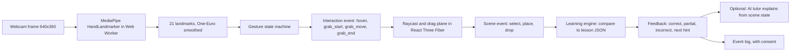

# Executive Summary

Grasp is a browser-based learning system in which a learner manipulates a 3D model with hand gestures seen by an ordinary webcam, and each manipulation is evaluated against a declared learning objective. The **MVP** is one twelve-minute lesson on the four chambers of the human heart, built by one developer on a hobby budget, instrumented so it doubles as a controlled gesture-versus-mouse study. This file names the three hardest technical problems and how each is solved, defines the smallest prototype that validates the idea, and gives a one-screen view of the **MVP → V1 → Future** split and a reading guide to the other nineteen files.

## What it is and what it is not

| It is | It is not |
|---|---|
| A learning engine that compares scene events (`select`, `place`, `drop`) to expectations in lesson JSON | A 3D model viewer with a webcam attached |
| Five gestures (`open_palm`, `point`, `pinch`, `pinch_drag`, `release`) mapped to interaction events | A general gesture-recognition platform |
| One GLB heart with ten named components and six sockets, one lesson, one domain | A multi-subject content library (that is **V1**) |
| An AI tutor that explains and hints from structured scene state | An AI grader; it never decides correctness and never sees video |
| A research apparatus with consent, event logs, and a mouse control condition | A product that assumes gesture input is better |
| Next.js, React Three Fiber, MediaPipe Tasks Vision, Postgres, all on free tiers | A Python inference service or a native app |

## The core loop

Each arrow is owned by one doc: A–E by [04](04-computer-vision.md), E–G by [05](05-3d-interaction.md), G–I by [06](06-learning-engine.md), J by [07](07-ai-tutor.md), K by [14](14-evaluation-methodology.md).

## The three hardest technical problems

All three are hard because the brief's natural reading of each (full 3D hand control, AI judges the learner, rich real-time graphics) is not achievable on the target hardware by one developer. The solutions below narrow each problem until it is.

### Problem 1: reliable, low-latency gesture to intent with no trustworthy depth from one webcam

| Aspect | Content |
|---|---|
| Why hard | MediaPipe returns a `z` per landmark that is relative, non-metric, and noisy. Hands jitter at rest, pinch thresholds vary with hand size and distance, and a pinch that flickers at the boundary drops objects mid-task. A learner cannot reliably move a component toward or away from the camera, which rules out the free 3D manipulation the brief imagines. |
| Approach | Treat depth as unreliable by design (locked position 4). Manipulation happens on a camera-facing drag plane at the grabbed object's depth; palm size provides only a low-gain z-hint. Features are normalised by hand size (wrist to middle MCP). Pinch uses hysteresis (enter 0.25, exit 0.40) and hold-frame debounce. A One-Euro filter smooths landmarks and a second one smooths the cursor. Tracking loss during a drag holds the grab for a 1 s grace period and then auto-releases off-socket, so loss can never produce a `place`. |
| What makes tasks completable anyway | Snap sockets with a radius, constrained motion, and tasks (`identify`, `place`, `remove`, `sequence`, `compare`) that need position on screen, not position in depth. True depth becomes a **V1** or **Future** question only if a task needs it. |
| What the prototype must show | p95 inference under 33 ms in the worker; pinch false-start rate under 10 percent; a learner can place three components in three sockets on the first try with a window behind them. |
| Residual risk | Backlighting and occluded fingers still break detection. Mitigated by a lighting overlay and by using only index and thumb for the MVP gestures. See the failure states in [02](02-learning-experience.md). |
| Owning docs | [04 Computer vision](04-computer-vision.md) for the pipeline and gesture specs; [05 3D interaction](05-3d-interaction.md) for the drag plane and sockets; [15](15-risks-security-scalability.md) for challenges 1–5 and 10–11. |

### Problem 2: making 3D interaction evaluable against learning objectives without AI grading

| Aspect | Content |
|---|---|
| Why hard | A viewer knows the learner rotated the heart; it does not know whether the learner can identify the left ventricle. Free manipulation produces continuous poses, not discrete answers. Asking an LLM to judge from a screenshot or a pose dump is non-deterministic, slow, costly, and unpublishable as a research instrument. |
| Approach | Learning evaluation is deterministic and declarative (locked position 5). The scene reports discrete events `{type, componentId, socketId}`. Lesson JSON declares, per task, the expected event. The engine compares, scores, and selects the next hint level. Five task types map Bloom levels to 3D actions: `identify` (remember), `compare` (understand), `place` and `remove` (apply), `sequence` (analyze). The AI tutor receives the attempt result and a compact scene-state JSON and may only explain or hint. |
| What this buys | New subjects are new JSON and new GLBs, not new code. Both study conditions run the identical lesson. Every attempt is reproducible from the event log. |
| What the prototype must show | A learner placing a component in a socket yields a correct or incorrect verdict with no code specific to the heart; swapping the manifest for a three-component mock still works. |
| Residual risk | Objectives that are not about parts and positions (procedure timing, hand shape, free explanation) have no task type. Stated as a scope limit; new task types are **V1** when a second subject needs them. |
| Owning docs | [06 Learning engine](06-learning-engine.md) for the evaluation rules; [10 3D content system](10-3d-content-system.md) for manifests and sockets; [07 AI tutor](07-ai-tutor.md) for the guardrails. |

### Problem 3: running MediaPipe, React Three Fiber, and React at 30 fps on an integrated GPU

| Aspect | Content |
|---|---|
| Why hard | Hand inference, WebGL rendering, and React reconciliation compete for one main thread and one weak GPU. The naive layout (inference on the main thread, cursor in React state, shadows and post-processing on) drops to single-digit frame rates on the target laptop. |
| Approach | Performance budget of 30 fps combined (locked position 6). Inference in a Web Worker at 640×360 with the GPU delegate where OffscreenCanvas allows, main-thread fallback at half rate otherwise. Per-frame data lives in refs or a transient store, never React state. GLBs Draco or meshopt compressed, under 5 MB and 150k triangles. Demand frameloop when idle; `dpr` capped at 1.5; no shadows or post-processing in MVP; inference skipped on alternate frames when render time exceeds 28 ms. |
| What the prototype must show | `perf_sample` logs with frame time p95 under 33 ms and inference p95 under 33 ms during a drag on an Intel Iris or AMD Vega integrated GPU. |
| Residual risk | Safari's partial OffscreenCanvas support forces the fallback path; mobile is out of scope. Both are recorded in [15](15-risks-security-scalability.md) challenges 6–9. |
| Owning docs | [05 3D interaction](05-3d-interaction.md) for the render budget; [04 Computer vision](04-computer-vision.md) for the worker layout; [17](17-first-prototype-plan.md) for the measurement milestone. |

## Smallest viable prototype

Locked position 10. The prototype answers one question: *can a learner pick up a heart part with a pinch and put it where it belongs, and does the system know whether they were right?* Everything not needed to answer that is excluded.

| In scope | Detail | Tier |
|---|---|---|
| One page | Next.js route, no navigation, no auth | **MVP** |
| One GLB | Heart with three separable components (`aorta`, `pulmonary_artery`, `left_ventricle`) and three sockets (`socket_aorta`, `socket_pulmonary_artery`, `socket_left_ventricle`); the remaining components are static scenery | **MVP** |
| Three gestures | `pinch` to grab, `pinch_drag` to move on the drag plane, `release` to drop. No `point` gesture or dwell select; a raycast tint under the neutral cursor is required because the gesture state machine only emits `grab_start` after a `hover_result` (see [17 M6](17-first-prototype-plan.md#m6-cursor-to-raycast-hover-and-highlight)) | **MVP** |
| One task type | `place`; the lesson JSON is three tasks, hints empty | **MVP** |
| Feedback | Snap on correct, settle on incorrect, text and colour verdict at the object | **MVP** |
| Mouse path | Click-drag does the same, so the control condition exists from day one | **MVP** |
| Perf readout | `r3f-perf` overlay and a console `perf_sample` every 5 s | **MVP** |

| Explicitly excluded from the prototype | Why | Arrives in |
|---|---|---|
| Accounts, database, persistence | Nothing to persist until the loop works | Phase 4 of [13](13-roadmap.md) |
| AI tutor | Hints and explanation are irrelevant until placement works | Phase 5 |
| Gamification, XP, badges | No learning to reward yet | **V1** |
| `open_palm` neutral state and `point` hover | Not needed to grab and drop; added first once placement works | Phase 3, after the stop/go gate |
| `identify`, `sequence`, `compare` tasks | `place` exercises the full gesture chain; the others are subsets of it | Phase 4 |
| Narration, explore, assessment activities | Lesson structure is content, not risk | Phase 4 |
| Consent screen and event export | Required before any participant, not before the developer | Phase 4 |

Success criteria for the prototype:

| Criterion | Target |
|---|---|
| Three placements, first try, by a person other than the developer | 3 of 3 correct within 2 minutes |
| Frame time p95 with hand in view | under 33 ms on an integrated GPU |
| Inference p95 | under 33 ms in the worker path |
| Pinch false starts | under 10 percent of closed grabs (a false start never moved; [14 §2.1](14-evaluation-methodology.md#21-computer-vision-metrics)) |
| Tracking-loss recovery | no `place` emitted during or after a `tracking_lost` |

If the prototype fails the first criterion with a window behind the learner, the gesture modality is at risk and the project should pivot to validating the learning engine with the mouse path before investing further in CV. The milestone sequence is in [17](17-first-prototype-plan.md).

## MVP → V1 → Future on one screen

| Area | **MVP** | **V1** | **Future** |
|---|---|---|---|
| Input | Hand tracking, one hand, 5 gestures; mouse and keyboard equivalents | `fist`, `swipe`, `wrist_rotate`, `two_hand_scale`; two hands | Pose tracking, voice, eye tracking, motion controllers |
| Depth | Camera-facing drag plane, low-gain z-hint | Optional ground plane per task | Multi-camera or depth sensor |
| Content | One model, one lesson (`anatomy.heart.chambers_v1`), ten components | Several lessons, two or three subjects fitting the five task types; authoring validation tool | Visual authoring; AI-generated lessons and assessments |
| Learning engine | Five task types, three hint levels, deterministic mastery | Adaptive difficulty, new task types if a subject needs them | Learner modelling across subjects |
| AI tutor | Template tutor in `packages/tutor`: hint ladder plus manifest-driven mistake explanations from the scene-state payload, behind a feature flag; no paid LLM API | Local open-weights model (Ollama on the lab laptop or WebLLM) behind the same `TutorService`, only after measurement; longer dialogue | Voice tutor |
| Gamification | Progress indicator derived from mastery | XP, streaks, badges tied to objectives | Leaderboards, if ever |
| Accounts and data | Anonymous `sessionId`, consent, export and delete | Accounts, teacher class view, parental consent for minors | Institutional SSO |
| Infrastructure | Vercel free tier, Neon or Supabase free Postgres, GLBs from the app's own `public/`, Docker Compose locally | Still zero-cost: GLBs on a free-tier object store behind a CDN; completed sessions archived to JSON and their rows deleted so Postgres stays under the free cap; if a free tier is outgrown, a self-hosted open-source alternative, never a paid plan | FastAPI only if custom model inference is needed; self-hosted on institution hardware |
| Research | Gesture vs mouse, pre/post/retention, SUS, NASA-TLX, event logs | Second lesson for replication; classroom deployment | Longitudinal studies |
| Platforms | Desktop Chrome and Edge; Safari with fallback | Tablet with mouse-equivalent touch | VR, AR, mobile camera |

## Reading guide

| If you want to | Read |
|---|---|
| Understand what the product is and who it is for | [01 Product definition](01-product-definition.md) |
| See the learner's path and what happens when things go wrong | [02 Learning experience](02-learning-experience.md) |
| See how the pieces fit, browser versus server | [03 System architecture](03-system-architecture.md), then [19 Tech stack and final diagram](19-tech-stack-and-final-diagram.md) |
| Build the gesture pipeline | [04 Computer vision](04-computer-vision.md) |
| Build the 3D manipulation | [05 3D interaction](05-3d-interaction.md), [10 3D content system](10-3d-content-system.md) |
| Build the evaluation and hints | [06 Learning engine](06-learning-engine.md), [08 Gamification](08-gamification.md) |
| Build the tutor | [07 AI tutor](07-ai-tutor.md) |
| Design the database | [09 Database](09-database.md) |
| Design screens | [11 UI/UX](11-ui-ux.md) |
| Know exactly what to build first and what to refuse | [12 MVP definition](12-mvp-definition.md), [17 First prototype plan](17-first-prototype-plan.md), [13 Roadmap](13-roadmap.md) |
| Run the study | [14 Evaluation methodology](14-evaluation-methodology.md) |
| Assess risk, privacy, and scale | [15 Risks, security, scalability](15-risks-security-scalability.md) |
| Set up the repository | [16 Folder structure](16-folder-structure.md) |
| See what is deliberately deferred | [18 Future expansion](18-future-expansion.md) |

## Decisions already locked

Ten technical positions were decided with the user on 2026-10-04 and are listed in the `project-conventions` skill: Next.js route handlers rather than FastAPI; hand tracking only, in-browser; five MVP gestures; unreliable depth handled by drag plane and sockets; deterministic evaluation; 30 fps budget; a template-based tutor with no paid LLM API (a locally run open-weights model is **V1**, after measurement); between-subjects gesture-vs-mouse study; free no-card-tier infrastructure and open-source software only; the smallest prototype above. Each doc argues for its position with alternatives compared but does not reverse one without the user's agreement.

## Open questions

1. Which integrated-GPU laptop is the reference device for the 30 fps budget? The budget is only meaningful against a named machine.
2. Should the prototype's three components be the three listed above (two vessels plus one chamber, which exercise both socket shapes) or three chambers (closer to the lesson's challenge activity)? The former is assumed.

## Related

- [01 Product definition](01-product-definition.md)
- [12 MVP definition](12-mvp-definition.md)
- [17 First prototype plan](17-first-prototype-plan.md)
- `project-conventions` skill, sections 4 and 7, for the tier legend and locked positions.
