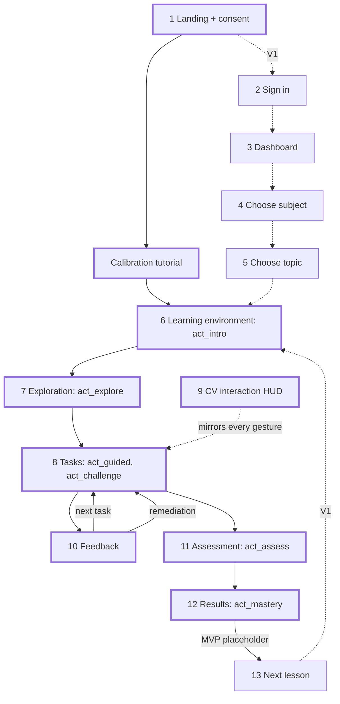

# Core Learning Experience

This file walks one learner through the thirteen journey stages named in the brief, from landing to next lesson, and then specifies how the product behaves in the seven failure states. For every stage it names the screen in [11 UI/UX](11-ui-ux.md), the engine or scene behaviour in [06 Learning engine](06-learning-engine.md) and [05 3D interaction](05-3d-interaction.md), the `LogEvent` types from [14 Evaluation methodology](14-evaluation-methodology.md#61-schema), the tier, and the mouse-condition difference. It mostly concerns **MVP**; sign in, dashboard, subject and topic choosers, and the lesson map are **V1**.

## Assumptions in the brief this file does not accept as written

| Assumption | Position | Consequence |
|---|---|---|
| Thirteen stages means thirteen screens | No. "3D Exploration", "Interactive Tasks", and "Computer Vision Interaction" are modes of one learning environment, as [11](11-ui-ux.md#major-screens) also concludes. Making them separate screens would break the scene state between activities. | Stages 7–9 below describe modes of stage 6, not navigations. |
| Sign in comes before learning | For the research pilot and the first learners it is friction and a privacy cost with no learning benefit. | **MVP** has no account. The landing page carries consent and starts the lesson directly; sign in is **V1** and always offers "Continue as guest". |
| "Feedback" is a stage after "Interactive Tasks" | Feedback is inside every task, within 200 ms of the action. A separate feedback step would be a quiz-results page, which is what the guiding principle rejects. | Stage 10 describes the feedback loop that runs inside stages 8 and 11. |

## Learner journey

Overview first; detail per stage follows. The learner in every example is the first-year nursing student from the [example session in 01](01-product-definition.md#example-learning-session), on lesson `anatomy.heart.chambers_v1`.

| # | Stage | Screen in 11 | Tier | Exists in mouse condition |
|---|---|---|---|---|
| 1 | Landing | Landing | **MVP** (minimal, with consent) | Yes; "Use mouse instead" is the entry |
| 2 | Sign in | Sign in | **V1** | Yes |
| 3 | Dashboard | Dashboard | **V1** | Yes |
| 4 | Choose Subject | Choose subject | **V1** | Yes |
| 5 | Choose Topic | Choose topic (lesson map) | **V1** | Yes |
| 6 | Learning Environment | Learning environment | **MVP** | Yes; preview hidden, controls strip shows mouse glyphs |
| 7 | 3D Exploration | Learning environment, `explore` mode | **MVP** | Yes |
| 8 | Interactive Tasks | Learning environment, `guided` and `challenge` modes | **MVP** | Yes |
| 9 | Computer Vision Interaction | Hand-state HUD | **MVP** | No; mouse adapter replaces it |
| 10 | Feedback | Feedback (banner inside the environment) | **MVP** | Yes, identical |
| 11 | Assessment | Assessment | **MVP** | Yes, identical |
| 12 | Score / Progress | Results | **MVP** | Yes, identical |
| 13 | Next Lesson | Next lesson | **V1**; **MVP** shows a placeholder | Yes |

### 1. Landing

| Aspect | Detail |
|---|---|
| Purpose | Start the heart lesson in one click and set honest expectations about the webcam before `getUserMedia` is called |
| Learner sees and does | Landing screen: headline, idle-rotating `heart_v1` on the demand frameloop, the consent card built from the `research-protocol` consent skeleton (camera used for hand tracking only, processed on this device, never recorded; what is logged; how to delete), "Start the heart lesson", "Use mouse instead". In study mode the researcher enters the pre-assigned `sessionId`, which fixes `condition` |
| System does | Records consent version to `consent_records`; generates `sessionId`; requests camera; shows `cv_status: "initialising"` while the Hand Landmarker loads (1–3 s cold). Camera denied routes to mouse mode outside study sessions |
| Data produced | `device_info` once; `consent_records` row (not a `LogEvent`); first `perf_sample` |
| Tier | **MVP**. Limitation: no lesson choice, so the page is the heart lesson's front door and nothing else |
| Mouse difference | No camera prompt; consent still shown because interaction logs are still collected |

### 2. Sign in

| Aspect | Detail |
|---|---|
| Purpose | Let a returning learner keep mastery across devices; let a study participant be linked to a session only through the offline consent key |
| Learner sees and does | Sign in screen: email magic link, "Continue as guest" always visible, study consent checkbox |
| System does | Creates or resumes `users`; attaches later `research_sessions.user_id` only if the learner opts in ([14 §6.3](14-evaluation-methodology.md#63-what-the-database-must-store)) |
| Data produced | None in the research log; `users` row in [09](09-database.md) |
| Tier | **V1**. Limitation: magic links need an email provider, which is a paid or rate-limited service |
| Mouse difference | None |

### 3. Dashboard

| Aspect | Detail |
|---|---|
| Purpose | Show where the learner is, per objective, and resume in one action |
| Learner sees and does | Dashboard screen: lesson map (not a course table), mastery bars per objective, "Resume" to the exact activity and task |
| System does | Recomputes mastery from `lesson_attempts` on load (06 persistence table); restores the activity cursor |
| Data produced | None; reads `progress` |
| Tier | **V1**. In **MVP** resumption is `localStorage` keyed by `sessionId` and there is no screen for it |
| Mouse difference | None |

### 4. Choose Subject

| Aspect | Detail |
|---|---|
| Purpose | Pick a domain whose knowledge fits the five task types |
| Learner sees and does | Choose subject screen: large cards with the subject's hero model rotating, lesson count, estimated time |
| System does | Lists subjects from the content API; one card (anatomy) in **V1** |
| Data produced | None |
| Tier | **V1**. Limitation: a chooser with one option is worse than no chooser, so it ships only with a second subject |
| Mouse difference | None |

### 5. Choose Topic

| Aspect | Detail |
|---|---|
| Purpose | Pick a lesson and understand why a locked one is locked |
| Learner sees and does | Lesson map filtered to the subject; nodes are lessons, edges are `lesson.prerequisites`; a locked node names the prerequisite objective below threshold |
| System does | Evaluates `unlock(lesson)` from 06: every objective of every prerequisite lesson mastered |
| Data produced | None until the lesson starts |
| Tier | **V1** |
| Mouse difference | None |

### 6. Learning Environment

| Aspect | Detail |
|---|---|
| Purpose | Put the learner in front of the model with a working input channel before any graded action |
| Learner sees and does | Learning environment screen, full-bleed canvas, instruction line, progress chip, hand-state chip, camera preview with landmark dots, controls strip. First the 5-minute calibration tutorial: `open_palm` inside a silhouette, `point`, then `pinch` a practice cube into a ring, 20 scripted prompts. Then `act_intro`: three narration cards; the learner orbits the assembled heart with `pinch_drag` on empty space |
| System does | Calibration computes `calibHandSize` and `openPinch`, checks lighting and distance *before* the lesson ([04 calibration](04-computer-vision.md)), and gates on accuracy ≥ 0.80 or one re-run. Engine emits `activity_start` for `act_intro`; completion rule time ≥ 20 s; scene command `setPose("assembled")` |
| Data produced | `calibration_prompt` ×20, `gesture_emit` on transitions, `hand_count`, `perf_sample` every 5 s, `activity_start`, `grab_start` with `componentId: null` for orbit |
| Tier | **MVP**. Limitation: the tutorial costs 5 minutes of a 45-minute study session; it is kept because it burns novelty and gives the tracking-failure covariate a clean baseline |
| Mouse difference | Mouse tutorial with 20 click-and-drag prompts of matched duration (14 open question 3 recommends parity); preview and hand-state chip hidden; webcam covered in the study room |

### 7. 3D Exploration

| Aspect | Detail |
|---|---|
| Purpose | Build a spatial model of the parts, and pre-train names, before any task grades recognition (dual coding; reduces load in stage 8) |
| Learner sees and does | `explore` mode: assembled pose, hotspot markers on `hs_lv_wall` and `hs_septum`. Learner hovers with `point`; the component tints `accent` and its name billboards above it; dwelling 600 ms on a hotspot opens its label. "Explain" pill (replays the hotspot description; free-text "Ask tutor" is **V1**) is available |
| System does | Scene emits `select` with `hotspotId`; engine counts hotspots viewed for completion (time ≥ 60 s); no scoring. This is the only ungraded stage, and it is still bounded by a completion rule so "explore" never becomes the product |
| Data produced | `activity_start`, `select { hotspotId, method: "dwell" }`, `activity_end`, optional `tutor_message` |
| Tier | **MVP** |
| Mouse difference | Hover highlights, click opens the hotspot; `method: "click"` |

### 8. Interactive Tasks

| Aspect | Detail |
|---|---|
| Purpose | Worked practice with faded guidance: `guided` has ghost sockets and three hint levels; `challenge` has the exploded pose, rings, and one hint |
| Learner sees and does | Instruction line shows `task.prompt` verbatim ("Pinch the aorta and attach it to the heart"). `identify`: `point` dwell or `pinch` on a chamber. `place`: `pinch` `aorta`, `pinch_drag` on the camera-facing plane, nearest socket within 1.5× radius brightens with "Release to place here", `release`. `sequence`: four `select` events in blood-path order. `compare`: `select` one of two highlighted ventricles |
| System does | Scene raycasts, snaps on `release` inside a socket radius and emits `place` or `drop`; engine runs `evaluate(task, event)` in the same tick, returns `{ outcome, expected, actual, nextHintLevel }`, and on exhaustion runs the remediation sequence (failure state 7). Pre-commit states in [11](11-ui-ux.md#pre-commit-states) make every graded action reversible until the dwell ring fills or the pinch releases |
| Data produced | `task_start`, `select`, `grab_start`, `grab_move_summary`, `grab_end`, `place` or `drop`, `task_attempt { correct, partial, score, hintsUsed, componentId, socketId }`, `hint_shown`, `task_end` |
| Tier | **MVP**. Limitation: five task shapes evidence remember through analyze only; nothing above that is graded (06 objectives table) |
| Mouse difference | Click selects, mouse-down grabs, drag moves, mouse-up releases; same events, same engine, same copy. Dwell has no mouse analogue, so `select.method` records the difference |

### 9. Computer Vision Interaction

| Aspect | Detail |
|---|---|
| Purpose | Make the system's belief about the hand visible at all times, so interface errors are caught before they become graded errors |
| Learner sees and does | The hand-state chip and cursor mirror the gesture state machine one-to-one: `NO_HAND`, `IDLE` (`open_palm`), `HOVER` (`point`), `GRABBING` (`pinch`), `DRAGGING` (`pinch_drag`), `LOST`. `ORBIT` is a HUD-derived display state, not a gesture-FSM state: the HUD shows it when the FSM is in `DRAGGING` and the scene reports `orbit.active` (a `pinch_drag` on empty space). The preview shows the 21 landmark dots and a tracking-active dot. The learner can pause, collapse the preview to a 32 px chip, or turn the camera off with `Esc, Esc` |
| System does | Worker runs the Hand Landmarker at 640×360, One-Euro smoothing, hysteresis on `pinch`/`release`, emits interaction events and the `cv_status` channel at most 4 Hz; the scene never sees landmarks, only the smoothed cursor |
| Data produced | `gesture_emit { gesture, confidence }` on transitions only, `tracking_lost`, `tracking_regained { durationMs }`, `hand_count`, `perf_sample` inference fields. Never landmarks, never pixels |
| Tier | **MVP**. Limitation: this is the stage that adds extraneous load in the gesture condition; NASA-TLX and tracking-lost seconds exist to measure it |
| Mouse difference | The stage does not exist. The mouse adapter in [05 §7](05-3d-interaction.md#7-mouse-and-keyboard-equivalents) produces the identical event stream; the controls strip shows "Click: select, Drag: move, Drag on space: orbit" |

### 10. Feedback

| Aspect | Detail |
|---|---|
| Purpose | Tell the learner what their action meant, at the object, within 200 ms, and without leaving the scene |
| Learner sees and does | Feedback banner under the instruction line plus the scene reaction from the [feedback vocabulary](11-ui-ux.md#feedback-vocabulary): correct snaps and "lands"; incorrect "shrugs" and shows the real name for 2 s ("That is the right ventricle"); partial says "Right part, wrong place". The hint button pulses after an incorrect attempt. The learner may press the "Explain" pill, which requests `explain_mistake` for the last attempt; there is no free-text input in **MVP** |
| System does | Deterministic part comes from the engine and never waits on the network; the tutor explanation, if requested or if the hint at the current level is `tutor: true`, is one same-origin round trip to `/api/tutor`, where the template engine runs ([07](07-ai-tutor.md#request-flow)), and is appended when it arrives. If the route fails or the response fails validation, the task's static hint for that level stays in place. The tutor receives `SceneState`, `expect`, and `actual`; it never grades |
| Data produced | `task_attempt`, `hint_shown { level, source }`, `tutor_message { interactionId, taskId, kind, hintLevel, status, latencyMs, source }` without text |
| Tier | **MVP**; tutor flag-gated, on for both arms in the pilot per [12](12-mvp-definition.md#basic-ai-tutor) |
| Mouse difference | None |

### 11. Assessment

| Aspect | Detail |
|---|---|
| Purpose | Retrieval practice under withdrawn support, so mastery reflects unaided performance |
| Learner sees and does | Assessment screen: same environment, assembled pose with the part to place detached, no sockets drawn, no hint button, counter "1 attempt". Tasks `t_a1` `identify right_ventricle`, `t_a2` `identify left_atrium`, `t_a3` `place pulmonary_artery`, `t_a4` `compare wall_thickness`. Every outcome renders as a neutral "Recorded" |
| System does | `maxAttempts: 1`, `hints: []` enforced by validation; outcomes are still computed and weighted 2× in mastery; the socket cue still shows "Release to place here" for any socket in range so the learner sees where, never whether |
| Data produced | Same as stage 8, plus `mastery_computed` per objective at activity end |
| Tier | **MVP**. Limitation: with one attempt and no hints, a tracking failure here is costly; failure states 1, 2, and 5 therefore never consume the attempt |
| Mouse difference | None |

### 12. Score / Progress

| Aspect | Detail |
|---|---|
| Purpose | Close the loop on objectives, not tasks: which of `obj_identify_chambers`, `obj_place_vessels`, `obj_blood_path` are mastered, and what to do about the rest |
| Learner sees and does | Results screen: mastery bars with the objective statement and threshold, per-task outcome list, "Review the parts you missed" which reopens the scene with those components highlighted. XP line and badges appear below and smaller (**V1**). In study mode XP is hidden and the screen routes to the post-test, SUS, and TLX |
| System does | `act_mastery` computes mastery as the weighted mean of latest normalised scores (06 pseudocode); emits unlock decisions; shows the `sessionId` for deletion requests |
| Data produced | `mastery_computed` ×3, `activity_end`; end-of-session batch flush and JSON download fallback |
| Tier | **MVP** bars and review; **V1** history and rewards |
| Mouse difference | None |

### 13. Next Lesson

| Aspect | Detail |
|---|---|
| Purpose | Route onward without a dead end, whether or not every objective was mastered |
| Learner sees and does | Next lesson screen: the unlocked `anatomy.heart.valves_v1` card, or the prerequisite objective to repeat with a one-click return to the relevant activity |
| System does | Applies `unlock(lesson)`; in **MVP** the second lesson does not exist, so the card reads "Next lesson coming soon" and offers "Review" or "Restart" |
| Data produced | None |
| Tier | **V1** route; **MVP** placeholder |
| Mouse difference | None |

### Journey flowchart

Solid thick nodes are the **MVP** path; dashed links and plain nodes are **V1**.

## Failure states

Seven states, in the brief's order. Each is one description that joins the detection signal ([04 failure-state signals](04-computer-vision.md#failure-state-signals) or the engine in 06), the on-screen response ([11 failure states on screen](11-ui-ux.md#failure-states-on-screen)), the pedagogical response (06), what is logged (14), and what must never happen. States 1, 2, and 5 do not occur in the mouse condition; 3 maps to "wrong input"; 4, 6, and 7 are identical in both conditions, which is what makes them comparable.

### The camera cannot detect the learner

The worker reports `cv_status: "no_camera"` (permission denied or stream ended), `"no_hand"` (no hand with presence ≥ 0.6 for 500 ms), or `"hand_too_far"` / `"hand_too_close"` with a `move_closer` or `move_back` hint. The HUD acts on `no_hand` only after 3 s during a task and 10 s during `introduction`; a learner reading a narration card has no reason to hold a hand up. It then dims the scene to 60%, expands the preview to 320×180 with a hand silhouette, and says "Show me your hand. Palm toward the camera, about 40 cm away." Pedagogically this is inactive time: the instruction line stays, the attempt counter and hint level do not move, and the engine excludes the interval from `durationMs` so time-on-task stays a clean covariate. After 20 s "Use the mouse instead" appears; in a study session it is replaced by "Call the researcher", since a mid-lesson condition switch would invalidate the participant. **MVP**.

| Logged | `hand_count { n: 0 }`, `cv_status` (proposed event in 04, to be confirmed in 14), `device_info` |
|---|---|
| Never | Count the gap as an attempt or a hint; start any `timeLimitSec`; keep a stale cursor live so a phantom dwell can commit; switch condition silently in study mode; fall silent, since silence is the one thing a learner cannot diagnose |

### Lighting is poor

Poor light looks like intermittent detection: presence mean below 0.7 over 2 s or four or more flickers in 2 s, with luminance from a discarded 32×18 downsample outside 40–200. The worker emits `cv_status: "low_confidence"` with hint `face_the_light`. The preview expands with a light meter, the chip turns `warn-tracking`, and the copy is environmental: "Hard to see your hand. Face a light or move away from the window." It never says "try again", because the learner cannot fix lighting by gesturing better and must not be led to blame their knowledge or motor skill. The calibration tutorial runs this check before the lesson so most lighting problems are fixed at minute one. While the state persists, the gesture glyph dims to 50% as a warning before a drop. Recommendation for 06 and 14: stamp `task_attempt` with `cv_status.state` at commit so attempts under `low_confidence` can be excluded per the pre-registered rule. After 30 s, mouse mode is offered outside study sessions. **MVP**.

| Logged | `cv_status { state: "low_confidence", sinceMs, luminance }`, `tracking_lost` and `tracking_regained` bursts that are the symptom |
|---|---|
| Never | Use `error` colour or incorrect-feedback copy for a lighting problem; persist pixels or the downsample; let the tutor describe the learner as struggling with the content; consume an assessment attempt because a flicker released a pinch |

### The learner performs an incorrect gesture

An interface error, never a domain error. The HUD detects a mismatch between gesture and task affordance: a `point` dwell completing on a grabbable during `place`, a `pinch` on a non-grabbable during `identify`, or a grab released before the cursor moved (a false start, known only at `grab_end`: `grab_move_summary.firstMoveMs` null, decided 2026-10-07; a pause before moving is not one, and a grab ended by tracking loss is failure state 5, not this). For the affordance mismatches the cursor ring turns dashed at once and a label beside it names the expected gesture, "Pinch to grab" or "Point to select"; for false starts the cue appears after release from the second one on the same task, labelled "Pinch, then move", and the next grab that moves clears it. Labels use `accent`, never `error`; the correct gesture clears them. The third occurrence on one task adds the glyph to the instruction line and offers, not forces, a 20 s replay of the matching calibration prompt. Nothing is scored and no hint level advances. The false-start rate per participant is a proxy for the extraneous load argued in [01](01-product-definition.md#educational-value-why-cv-controlled-3d-could-beat-2d-and-where-it-may-not) and is reported beside learning gain. In the mouse condition the same pattern is "wrong input", for example clicking a non-grabbable during `place`, with the same label. **MVP**.

| Logged | `gesture_emit` transitions, `grab_move_summary.firstMoveMs` (null is a false start, [14 §2.1](14-evaluation-methodology.md#21-computer-vision-metrics)), `select { method }`; `misfire_report` is **V1** |
|---|---|
| Never | Render in `error` colour; emit `task_attempt`; advance `nextHintLevel`; let the tutor treat it as a knowledge gap; reset the part or the camera without the learner's action |

### The learner interacts with the wrong object

The engine, not the CV layer, detects this: `evaluate` returns `incorrect` on `identify`, `compare`, or `sequence`, and `incorrect` or `partial` on `place`. Because the scene emits `place` for a release inside any socket radius and the engine decides correctness, "right part, wrong socket" is diagnosable as `partial`. The chosen component shows its real name for 2 s ("That is the right ventricle"), the banner reads "Not this one. Look for the left ventricle", and the hint button pulses. The hint ladder advances one level per incorrect attempt: level 1 restates a category, level 2 narrows with a highlight or a `tutor: true` message built from `actual` ("that was the left atrium; you want a lower chamber"), level 3 reveals with `cameraTo`. The predictable wrong object in the heart lesson is the mirror error, the learner's left being the heart's right; level-1 copy should pre-empt it. In `assessment` the same event produces the neutral "Recorded" and no hint. The wrong part stays snapped in the wrong socket; the HUD flags that socket, and the learner re-grabs the part to move it. Nothing moves without the learner's action, so the learner's spatial work is never undone by the system. **MVP**.

| Logged | `select` or `place`, `task_attempt { correct: false, partial, score, hintsUsed, componentId, socketId }`, `hint_shown { level, source }`, `tutor_message { interactionId, taskId, kind, hintLevel, status, latencyMs, source }` |
|---|---|
| Never | Reveal the answer before level 3; show outcome in assessment; let a wrong object reduce mastery below what the latest attempt per task implies, since mastery uses the latest score, not the first; attach any reward penalty, because rewards derive from mastery and never feed it |

### Tracking is lost

The strictest invariant. The worker is in `GRABBING` or `DRAGGING` and sees no hand for 500 ms; it emits `tracking_lost` and enters `LOST`. The chip turns `warn-tracking` with a 1 s countdown arc, the cursor freezes as an amber dashed ring, the held component gets a dashed outline, and the text says "Lost your hand. Hold still." If the hand returns within 1 s, `tracking_regained` fires, the drag offset is recomputed so the part does not jump, and the label says "Welcome back". Otherwise the worker emits `grab_end` with `reason: "lost"`, the scene settles the component where it is and emits `drop`, never `place`, and the banner reads "The part was put down where it was." The engine ignores a `drop` outside every socket during a `place` task, so nothing is graded, attempts and hint level are unchanged, the prompt is still on screen, and the learner re-grabs. Three losses on one task trigger the distance or lighting guidance of states 1 and 2. This is UC7 in 01. **MVP**.

| Logged | `tracking_lost`, `tracking_regained { durationMs }`, `grab_end { reason: "lost" }`, `grab_move_summary`, `drop { componentId }` without position |
|---|---|
| Never | Emit `place` on loss; let the part land inside a socket radius by settling; grade the resulting `drop`; consume an attempt in any activity, including assessment; move the part back to its origin, which would erase the learner's spatial progress; let a `drop` whose preceding `grab_end.reason` is `"lost"` count as a `remove` or `sequence` attempt (open question 3) |

### The learner is confused

Confusion has no sensor; it is inferred from absent commitment: no interaction event for 15 s during a task, three or more hovers without a commit in 20 s, or the learner pressing the hint button or the "Explain" pill. The response is quiet: the hint button pulses, the instruction line gains "Need a hint?", and the "Explain" pill offers "Want me to explain what to look for?" The hint ladder is offered, not imposed. A requested hint costs the same `hintPenalty` as an earned one so there is no incentive to fail deliberately, and the penalty is small (2 of 10) because hint avoidance is associated with worse learning than hint use. The tutor explains from `expected`, `actual`, and component `description` fields, is labelled as explaining, not grading, and if the `/api/tutor` route fails the task's static hint for that level is shown instead. No learner free text is accepted in **MVP**. In `introduction` and `explore`, 30 s idle advances the narration prompt. In `assessment`, 30 s idle shows "There are no hints in this part. Make your best attempt", because pretending help exists would be a dead end. **MVP**; tutor flag-gated.

| Logged | `hint_shown { taskId, level, source }`, `tutor_message { interactionId, taskId, kind, hintLevel, status, latencyMs, source }`; idle intervals are derived from gaps between `LogEvent.t`, not logged as events |
|---|---|
| Never | Auto-advance a graded task; force a hint that costs points without the learner's action; let the tutor state or imply correctness; leave the learner with no visible next action outside assessment |

### The learner repeatedly fails a task

The engine detects exhaustion when attempts reach `maxAttempts` (3 in `guided` and `challenge`); a fourth identical prompt would teach nothing. The card "Let's look at this together" appears with the level-3 hint applied and "No points this time, and that is fine", offering "Show me", "Try once more", and "Skip for now". "Show me" runs the fixed remediation sequence from 06: a worked example synthesised from `expect` (the part tweens into its socket and back; an `identify` answer pulses with camera framing; `sequence` steps highlight in order), then a prerequisite micro-task one step down the Bloom ladder ("First, point to the aorta"), scored 0 and logged `remediated: true`, then the original task with attempts reset and `hintsUsed = 3`. "Try once more" goes straight to the retry. "Skip for now" records `task_end { outcome: "skipped" }` and lists the task under "Review" on the results screen. A second exhaustion marks the task failed and flags the objective on the mastery screen, which offers `act_explore` again. Because mastery is the latest score per task with assessment at 2×, one failed guided task cannot zero an objective. In `assessment` there is one attempt and no remediation. Time is handled the same way in both conditions: there is no hard cap on the lesson. At 15 minutes a soft prompt offers the learner the choice to proceed to the assessment now or keep working; the assessment always runs in full whichever they choose. The prompt and the choice are logged as `time_prompt`, and the rule is pre-registered so the study can report how often each condition reached it. **MVP**; authored `task.remediation` is **V1**.

| Logged | `task_attempt` ×3 then `{ remediated: true }` entries, `hint_shown { level: 3 }`, `task_end { outcome }`, `time_prompt { shown, choice }`, `mastery_computed` |
|---|---|
| Never | Repeat the same prompt a fourth time unchanged; impose a hard time cap or skip the assessment on time, since a cap would penalise the gesture condition and an abbreviated assessment would corrupt mastery; block progress through the lesson, since skip is always available outside assessment; convert the failure into a reward penalty; describe the learner rather than the task in feedback copy |

## Principles the team must preserve

| Principle | Meaning in practice | Owner |
|---|---|---|
| The learner always knows they are seen | Hand-state chip, preview with landmark dots, and tracking dot are visible whenever frames are processed; `NO_HAND` and `LOST` are explicit states, never silence | ux-designer, cv-engineer |
| Interface error is never domain error | Wrong gesture, lost tracking, and poor light produce no `task_attempt`, no hint advance, and no `error` colour | learning-designer, cv-engineer |
| Nothing is graded on loss | `grab_end.reason: "lost"` yields `drop`, never `place`; the engine discards it in every task type | three-engineer, learning-designer |
| No colour-only feedback | Every outcome is colour, icon, motion, and text; the three hues survive deuteranopia simulation | ux-designer |
| Mouse parity | Same lesson JSON, same events, same engine, same copy; only the input adapter and the HUD differ | three-engineer, research-methodologist |
| No dead ends | Hint, tutor, skip, review, or restart is always one action away; assessment says plainly that hints are unavailable | product-strategist, learning-designer |
| The instruction line never disappears | During a task the prompt stays on screen through every failure state | ux-designer |
| Assessment is neutral | "Recorded" only; outcomes appear on the results screen | learning-designer |
| Nothing leaves the device but events | No video, no landmarks, no cursor trail; `drop` carries no position in the log | cv-engineer, platform-architect |

## Open questions

1. Low-confidence threshold: 04 uses presence mean below 0.7; 11 uses 0.6. One value should be canonical, tuned from pilot logs.
2. Under 06's current rule a `drop` after `grab_end.reason: "lost"` counts as a `remove` attempt. Recommend the engine checks the preceding `grab_end.reason` and discards it.
3. Whether `task_attempt` carries `cv_status.state` at commit (failure state 2) is a schema addition for 14 and 09.

## Related

- [00 Executive summary](00-executive-summary.md): hardest problems, including tracking loss during manipulation.
- [01 Product definition](01-product-definition.md): use cases UC1–UC9 that the stages above pass through; the example session this journey follows.
- [04 Computer vision](04-computer-vision.md): `cv_status` channel and `tracking_lost` rule.
- [05 3D interaction](05-3d-interaction.md): settle-never-snap on loss; mouse adapter.
- [06 Learning engine](06-learning-engine.md): hint ladder, feedback object, repeated-failure policy.
- [07 AI tutor](07-ai-tutor.md): what the tutor may say in failure states 4 and 6.
- [08 Gamification](08-gamification.md): why no failure state touches rewards.
- [11 UI/UX](11-ui-ux.md): screens, HUD states, feedback vocabulary, on-screen failure table.
- [12 MVP definition](12-mvp-definition.md): which stages ship first.
- [14 Evaluation methodology](14-evaluation-methodology.md): `LogEvent` schema and the mouse condition.
