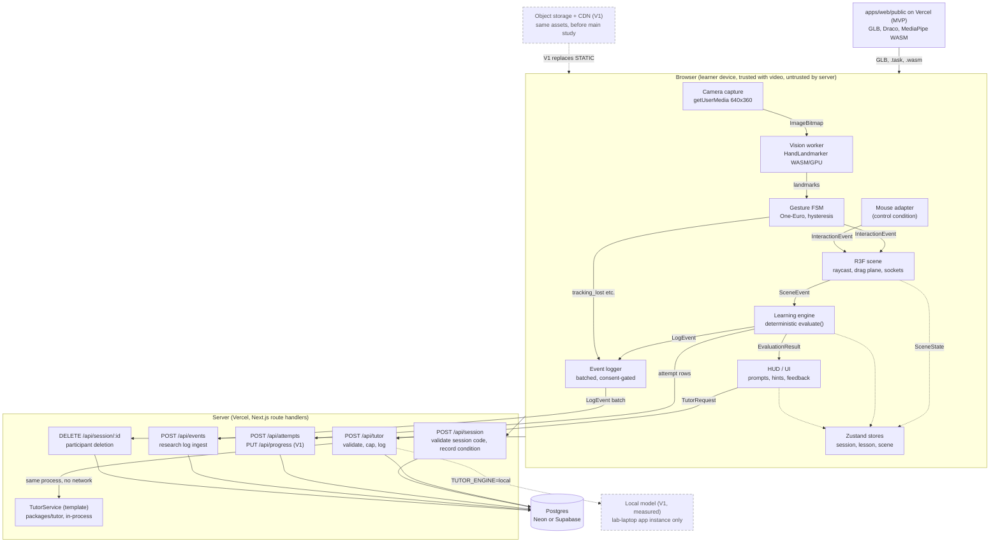

# System Architecture

Grasp is a single Next.js application. Everything that touches the webcam, the 3D scene, and learning evaluation runs in the browser; the server is a handful of route handlers that mint research sessions, answer tutor requests from the template engine in `packages/tutor`, and persist attempts, progress, and event logs to Postgres. No third-party API is called anywhere in the MVP. GLB models and MediaPipe assets are static files served from the app's own `public/` directory in **MVP**, moving to object storage behind a CDN in **V1**. This file mostly concerns **MVP**; where a boundary exists only so that **V1** can attach something later, it says so.

## Component diagram



The trust boundary is the HTTP line between the two subgraphs. Video, `ImageBitmap`s, and landmarks exist only above it. The only objects that cross it are listed in [What crosses the trust boundary](#what-crosses-the-trust-boundary).

## What runs where and why

| Concern | Runs in | Why | Tier |
|---|---|---|---|
| Camera capture, hand landmarking, gesture classification | Browser (Web Worker) | Locked position 2: video never leaves the device. Also removes server GPU cost and round-trip latency, which would make a 30 fps cursor impossible. | **MVP** |
| 3D rendering, raycasting, drag plane, snapping | Browser (main thread) | Only the browser has the GPU and the cursor. | **MVP** |
| Learning evaluation (`evaluate(task, event)`) | Browser, from lesson JSON | Locked position 5: deterministic and declarative. Running it client-side gives instant feedback and works offline. The same `learning` package is isomorphic so the server can recompute mastery from stored attempts in **V1** for integrity. | **MVP** |
| Mastery computation | Browser (MVP), server recompute (**V1**) | Trivial arithmetic over attempts; a study participant is not an adversary. XP is **V1** per [Gamification](08-gamification.md) and is not computed in MVP. | **MVP** |
| Session recording and condition capture | Server | Randomisation is done offline by the researcher (blocked list, per `research-protocol`). The researcher enters a pre-assigned session code that encodes the condition; the server validates the code, records `condition` once, and rejects reuse. Nothing random happens on the server. | **MVP** |
| Tutor hints and mistake explanations | `POST /api/tutor` route handler: validates the `TutorRequest`, enforces the per-session call caps, calls `TemplateTutorService` from `packages/tutor` in-process (templates over the lesson hint ladder and manifest `description`, `relations`, `tags`), writes the `ai_interactions` row, returns the `TutorResponse`. The tutor client emits the `tutor_message` LogEvent on receipt | Locked position 7: deterministic templates, no paid LLM API, no network egress. The engine is pure TypeScript and could run in the browser; it sits behind the route so validation, caps, and `ai_interactions` logging exist in one place. `TUTOR_ENGINE=local` (**V1**, measured) applies only to an app instance running on the lab laptop alongside the model; the hosted deployment always uses `template`. | **MVP** |
| Attempt, progress, and event persistence | Server to Postgres | Research data must survive the tab closing and be exportable per session. | **MVP** |
| Content (lesson JSON, model manifests) | Repo, imported at build time | One author, few lessons, versioned with the code. See [content versioning](10-3d-content-system.md#content-versioning). | **MVP** |
| GLB, Draco decoder, MediaPipe `.task` and WASM | `apps/web/public/` on Vercel, same origin | One heart GLB under 5 MB plus ~10 MB of MediaPipe assets fits Vercel's static hosting and edge cache; same origin keeps CSP simple; versions are pinned in the repo. | **MVP** |
| Same assets on object storage behind a CDN | Cloudflare R2 or similar, CORS-allowed, before the main study | Needed once there are several models or the Vercel bandwidth cap is in sight; self-hosted so no third-party CDN sees learner IPs. See [Scalability](15-risks-security-scalability.md#scalability). | **V1** |
| Accounts, teacher dashboards, content tables | Server | Not needed to validate the core loop or run the study. | **V1** |
| Python inference or gesture-model training | Separate service behind `TutorService`/`VisionService` seam | Locked position 1: only if MediaPipe gestures prove insufficient. | **V1/Future** |

## Data flow

### One task attempt (place `aorta` into `socket_aorta`)

| Step | Component | Input | Output | Crosses trust boundary |
|---|---|---|---|---|
| 1 | Camera capture | video frame | `ImageBitmap` posted to worker | No |
| 2 | Vision worker | bitmap, timestamp | 21 landmarks, handedness, confidence | No |
| 3 | Gesture FSM | smoothed landmarks | `pinch` entered with cursor over `aorta` → `{ type: "grab_start", cursor }` | No |
| 4 | R3F scene | `grab_start` | raycast hits `aorta`; drag plane created; `aorta` detached from any socket | No |
| 5 | Gesture FSM → scene | `pinch_drag` frames | `{ type: "grab_move", cursor, zHintDelta }` × N; position updated via refs, zero React renders | No |
| 6 | Gesture FSM → scene | `release` | `{ type: "grab_end", cursor }`; nearest accepting socket within radius is `socket_aorta`; snap | No |
| 7 | Scene → engine | `{ type: "place", componentId: "aorta", socketId: "socket_aorta" }` | `evaluate(task t_g3, event)` → `{ correct: true, score: 15, feedback }` | No |
| 8 | Engine → HUD, stores | `EvaluationResult` | feedback card; lesson store advances to next task; mastery recomputed for `obj_place_vessels` | No |
| 9 | Engine → logger | `task_attempt` LogEvent `{ taskId, correct, partial, score, attemptNo, hintsUsed }` | queued | No |
| 10 | Logger → server | batch of LogEvents every 10 s or 50 events, `sendBeacon` on unload | `POST /api/events` → `event_logs` rows | Yes, events only |
| 11 | Engine → server | attempt row | `POST /api/attempts` → `lesson_attempts` row; `PUT /api/progress` → `progress` upsert (**V1**; MVP recomputes mastery from `lesson_attempts`) | Yes |

In the mouse condition, steps 1 to 3 are replaced by the mouse adapter emitting identical `InteractionEvent`s from pointer events. Steps 4 to 11 are byte-for-byte the same, which is what makes the research comparison valid.

### One tutor hint request

```mermaid
sequenceDiagram
  participant L as Learner
  participant E as Learning engine
  participant H as HUD
  participant T as tutor client
  participant R as POST /api/tutor
  participant S as TutorService (template, in-process)
  participant P as Postgres

  L->>E: place(right_atrium, socket_left_atrium)
  E->>H: EvaluationResult outcome=incorrect, nextHintLevel=2
  H->>H: hint[2].tutor == true
  H->>T: buildTutorRequest(kind=hint, taskId, sceneState, attemptSummary)
  T->>R: TutorRequest (JSON, ~1 KB)
  R->>R: validate schema, check sessionId, enforce call cap
  R->>S: hint(req)
  S->>S: pick template for kind and level; fill from hint ladder, manifest description and relations
  S-->>R: TutorResponse (text, highlight?)
  R->>P: insert ai_interactions (engine=template, template_version, status, latency_ms, kind)
  R-->>T: TutorResponse text, highlight?, interactionId
  T->>T: emit LogEvent tutor_message { interactionId, taskId, kind, hintLevel, status, latencyMs, source }
  T->>H: render hint card, pulse highlight
  H->>E: hintsUsed += 1
  E->>E: emit LogEvent hint_shown
  Note over T,P: tutor_message and hint_shown reach Postgres through the logger's /api/events batch, not through /api/tutor
  Note over R,S: V1 only, after measurement: TUTOR_ENGINE=local on a lab-laptop app instance routes hint(req) to a local open-weights model at TUTOR_LOCAL_URL; the hosted deployment always uses template
```

The tutor never receives video, landmarks, or a verdict to make. It receives the task prompt, the expected and actual event summary already decided by the engine, and the compact `SceneState`. In **MVP** the whole call is a function invocation inside the `/api/tutor` route handler, which validates the request, enforces the call caps, calls `TemplateTutorService`, and writes the `ai_interactions` row: the request leaves the browser only to reach the app's own origin, and nothing leaves the deployment. The tutor client, not the route, emits the `tutor_message` LogEvent on receipt with the payload `{ interactionId, taskId, kind, hintLevel, status, latencyMs, source }` defined in [AI Tutor](07-ai-tutor.md), so the research log carries metadata only and never the hint text. Template design, the manifest fields it may quote, guardrails, and the **V1** local-model measurement gate are owned by [AI Tutor](07-ai-tutor.md).

### What crosses the trust boundary

| Object | Direction | Contents | Never contains |
|---|---|---|---|
| `SessionRequest` / `SessionResponse` | both | client-generated `sessionId` (v4 UUID), consent version accepted, researcher-entered `assignment_code`; returns the validated `sessionId`, `condition` decoded from the `assignment_code`, `participantCode` | name, email, pre-test scores (MVP has no accounts; randomisation is offline) |
| `TutorRequest` / `TutorResponse` | both | lesson id, task id, hint level, `SceneState`, attempt summary; returns text and optional highlight ids | video, landmarks, free-text identity |
| `AttemptRow`, `ProgressRow` | up | task id, outcome, score, timing, hints used; per-objective mastery | landmarks |
| `LogEvent[]` | up | research-protocol event schema | video, images, raw landmark streams |
| GLB, `.task`, `.wasm`, Draco | down | static assets | anything learner-specific |

## Frontend modules

| Module | Chosen implementation | Role | Tier |
|---|---|---|---|
| Framework | Next.js (App Router) | Pages, static asset serving, route handlers, one deploy | **MVP** |
| UI runtime | React 19 | Component model for HUD and screens | **MVP** |
| 3D | React Three Fiber + Drei + Three.js | Declarative scene; GLTF loading, HTML overlays, orbit rig. Details in [3D Interaction Architecture](05-3d-interaction.md) | **MVP** |
| Computer vision | `@mediapipe/tasks-vision` HandLandmarker, self-hosted WASM, in a Web Worker | Landmarks → gestures → interaction events. Details in [Computer Vision Architecture](04-computer-vision.md) | **MVP** |
| Input adapter (control condition) | Mouse adapter in the `vision` package | Emits the same `InteractionEvent` vocabulary from pointer and keyboard | **MVP** |
| State management | Zustand with transient subscriptions for per-frame data; React state for UI | See [State management](#state-management) | **MVP** |
| UI system | Tailwind CSS + Radix primitives (unstyled, accessible) | HUD, dialogs, consent flow; no design-system lock-in. Visual direction in [UI/UX Architecture](11-ui-ux.md) | **MVP** |
| Learning engine | `packages/learning` (pure TypeScript, no DOM) | `evaluate`, mastery, activity sequencing from lesson JSON | **MVP** |
| Event logger | `packages/learning/logger` | Buffers `LogEvent`, batches to `/api/events`, respects consent flag | **MVP** |
| Schema validation | Zod | Validates lesson JSON at build time and API payloads at runtime; one schema library on both sides | **MVP** |

## Backend modules

| Module (brief's name) | Chosen implementation | Tier | Notes |
|---|---|---|---|
| FastAPI | **Not used in MVP.** Next.js route handlers (Node runtime) | **MVP** | See [Backend runtime decision](#backend-runtime-nextjs-route-handlers-versus-fastapi) |
| Authentication | Anonymous research sessions; `sessionId` UUID in an httpOnly cookie | **MVP** | Accounts via Auth.js or Supabase Auth in **V1**; see [Authentication](#authentication) |
| Learning Engine | Same `packages/learning` imported by route handlers | **MVP** (client) / **V1** (server recompute) | No separate service; it is a library |
| AI Service | `POST /api/tutor` route handler calling `TemplateTutorService` from `packages/tutor` in-process, behind the `TutorService` interface; `LocalTutorService` (Ollama or WebLLM) is **V1** after measurement | **MVP** | Call-capped per session; logs to `ai_interactions`; no third-party call |
| Progress Service | `POST /api/attempts` route handler; Drizzle ORM to Postgres. `PUT /api/progress` and the `progress` cache table are **V1**; MVP recomputes mastery from `lesson_attempts` | **MVP** | Tables in [Database Architecture](09-database.md) |
| Content Service | Static JSON imported at build; GLB in `apps/web/public/` (CDN in **V1**). No route handler | **MVP** | Becomes `GET /api/content/*` over tables in **V1** when an authoring UI exists |
| Research log ingest | `POST /api/events` batch insert; `DELETE /api/session/:id` | **MVP** | Required by `research-protocol` data rules |

Database access uses Drizzle ORM over the Neon serverless driver (or `postgres.js` for Supabase). The ORM choice carries its own checklist in [Recommended Technology Stack](19-tech-stack-and-final-diagram.md).

## Backend runtime: Next.js route handlers versus FastAPI

Decision (locked position 1): the **MVP** backend is Next.js route handlers inside the same deployable. FastAPI is **V1/Future**, attached only if Python-only inference or custom gesture-model training becomes necessary.

The brief assumes FastAPI because CV platforms usually do server-side inference. Here inference is in the browser by design, so the server does no numerical work at all. It validates JSON, calls one HTTP API, and writes rows.

| Option | Pros | Cons | Fit for solo dev | Verdict |
|---|---|---|---|---|
| Next.js route handlers (same app) | One repo, one deploy, one language, shared Zod schemas and `types` package; free on Vercel; serverless scales to zero | Cold starts (~300 ms) on free tier; no Python ecosystem; a **V1** local model is never reached from the hosted deployment, only from an app instance running on the lab laptop with `TUTOR_ENGINE=local` | Excellent | **Recommended, MVP** |
| FastAPI service alongside Next.js | Python ML ecosystem; async; good for future model training | Second deployable, second language, CORS, separate auth, paid hosting (Fly, Railway) or always-on container; duplicated types | Poor for MVP | **V1/Future** behind seam |
| Supabase Edge Functions / Postgres RPC | Close to the DB; no extra deploy | Deno runtime diverges from Next.js code; splits logic across two places | Fair | Reject for MVP |
| tRPC inside Next.js | End-to-end types | Extra abstraction over five endpoints; route handlers plus Zod give the same safety | Fair | Reject |

Eight-point checklist for Next.js route handlers:

| Point | Assessment |
|---|---|
| 1 Appropriate | The server's whole job is five small JSON endpoints; a framework already in the repo covers it |
| 2 Limitations | Cold starts; Node-only (no Python); the hosted deployment runs only the millisecond template tutor, so a **V1** local model requires an app instance on the lab laptop |
| 3 Browser performance | None; server code does not ship to the client |
| 4 Accessibility | None directly |
| 5 Privacy | Same origin as the app, so no CORS surface; the database URL and cookie secret stay server-side; no third-party API receives learner data; logs can be deleted per session in one place |
| 6 Scalability | Serverless; scales to the study's tens of concurrent users without configuration. See [Scalability](15-risks-security-scalability.md#scalability) |
| 7 Complexity | Lowest possible: a file per endpoint, shared types |
| 8 Necessary? | Yes: something must validate payloads, enforce call caps, and write to Postgres. The simpler alternative, no backend at all, is locked position 10 and is exceeded only when persistence is added; the template tutor alone would not justify a server |

### The seam for a Python service

Every server-side capability that a Python service might one day replace is behind a TypeScript interface in `packages/tutor` and `packages/learning`, instantiated once in the route handler. The route handler is the only code that knows which implementation is live.

```ts
// packages/tutor/src/service.ts
export interface TutorService {
  hint(req: TutorRequest): Promise<TutorResponse>;             // MVP
  explainMistake(req: TutorRequest): Promise<TutorResponse>;   // MVP
  summarise?(req: TutorRequest): Promise<TutorResponse>;       // V1, optional
}

// MVP: deterministic templates over the lesson hint ladder and manifest data; no network
export class TemplateTutorService implements TutorService { /* ... */ }

// V1, only after the 3.5 s hint and 30 fps budgets are measured: open-weights model
// running locally (Ollama on the lab laptop behind this route, or WebLLM in the browser)
export class LocalTutorService implements TutorService {
  constructor(private baseUrl: string) {}   // TUTOR_LOCAL_URL, lab network, no key
  /* ... */
}

// V1/Future: forwards the same JSON to a Python service
export class RemoteTutorService implements TutorService {
  constructor(private baseUrl: string) {}
  hint(req) { return postJson(`${this.baseUrl}/tutor/hint`, req); }
  /* ... */
}

// app/api/tutor/route.ts: the only place an engine is chosen. The route validates the request,
// enforces call caps, calls the engine, and writes the ai_interactions row.
const env = getEnv();                       // TUTOR_ENGINE: "template" | "local"; hosted deployment is always "template"
const tutor: TutorService = env.TUTOR_SERVICE_URL
  ? new RemoteTutorService(env.TUTOR_SERVICE_URL)                         // V1/Future
  : env.TUTOR_ENGINE === "local" && env.TUTOR_LOCAL_URL
    ? new LocalTutorService(env.TUTOR_LOCAL_URL)                           // V1, measured
    : new TemplateTutorService();                                          // MVP
```

A hosted metered LLM API is never one of the branches; no model vendor name or price appears in this repository. The same pattern applies to a hypothetical `VisionService` (server-side landmark post-processing or a custom gesture classifier) and to server-side mastery recompute. The contract is the JSON types in `packages/types`; a Python service would implement them with Pydantic models generated from the same Zod schemas via JSON Schema. Swapping is an environment variable, not a refactor. The folder placement is in [Project Folder Structure](16-folder-structure.md).

Limitation stated plainly: `TUTOR_ENGINE=local` applies only to an app instance running on the lab laptop alongside the model; the hosted deployment always uses `template`. A **V1** local model is therefore bounded by the lab laptop's inference speed; if measurement shows it cannot meet the 3.5 s hint budget, the answer is to keep the template engine, not a paid plan or a Python service.

## State management

Decision: Zustand for application state, with transient (non-rendering) subscriptions and refs for per-frame data. Ordinary React state for local UI such as open dialogs. **MVP**.

The hard constraint comes from the performance budget (locked position 6): the cursor and the grabbed object's pose change 30 times per second and must never cause a React re-render. Any store that funnels per-frame data through React state will fail the budget regardless of how elegant it is.

| Option | Pros | Cons | Fit for solo dev | Verdict |
|---|---|---|---|---|
| Zustand | Tiny (~1 KB); `subscribe` without re-render for per-frame data; works outside React (worker message handler can write to it); already idiomatic in the R3F ecosystem | Few conventions; easy to put too much in one store | Excellent | **Recommended, MVP** |
| React Context + `useReducer` | No dependency | Every consumer re-renders on any change; unusable for per-frame data | Fair | Reject |
| Redux Toolkit | Mature devtools, strict patterns | Boilerplate; per-frame dispatch is an anti-pattern; heavier bundle | Poor | Reject |
| Jotai | Atomic, minimal | Less natural for a worker writing from outside React; smaller R3F community | Good | Acceptable, not chosen |
| Valtio (proxy) | Mutation-style API | Proxy overhead per frame; subtle re-render behaviour | Good | Reject |

Three stores, each small:

| Store | Holds | Update frequency | Read by |
|---|---|---|---|
| `sessionStore` | `sessionId`, `condition`, consent flags, camera permission state | Rarely | HUD, logger, API clients |
| `lessonStore` | current activity and task, attempts per task, hints used, per-objective mastery (XP is **V1**) | On discrete events | HUD, engine, progress client |
| `sceneStore` | `SceneState` (hovered, grabbed, component socket occupancy, camera), tracking status | Per event; cursor position via a ref, not the store | Scene, HUD indicators, tutor client |

Eight-point checklist for Zustand:

| Point | Assessment |
|---|---|
| 1 Appropriate | Separates per-frame refs from rendered state cleanly; the R3F community default |
| 2 Limitations | No enforced structure; must document which fields are transient |
| 3 Browser performance | Negligible; the pattern exists precisely to protect the frame budget |
| 4 Accessibility | None directly; HUD state updates on discrete events feed ARIA live regions in [UI/UX Architecture](11-ui-ux.md) |
| 5 Privacy | None; nothing persists beyond the tab unless sent through the logger |
| 6 Scalability | N/A (client-side) |
| 7 Complexity | Three files, no boilerplate |
| 8 Necessary? | A shared store is needed because the worker, scene, engine, and HUD all read the same facts. The simpler alternative (props and refs only) breaks down once the HUD needs scene facts |

## Authentication

Decision: the **MVP** has no user accounts. Each study participant gets an anonymous research session: the client generates a v4 `sessionId` UUID (so the logger can buffer events before the first round trip), the server validates its format and uniqueness and records it in the `research_sessions` table with condition, consent version, and timestamps, and echoes it back in an httpOnly, SameSite=Strict cookie. This follows the recommendation in [Database Architecture](09-database.md#open-questions). The anonymisation key that links `sessionId` to a consent form is kept offline by the researcher, per `research-protocol`. Accounts arrive in **V1**.

The brief assumes authentication is a foundational service. For a study with ~130 participants who each use the product once or twice, accounts add a login screen, password handling, and a link between identity and process data that the ethics design wants to avoid.

| Option | Pros | Cons | Fit for solo dev | Verdict |
|---|---|---|---|---|
| Anonymous research sessions (cookie + `research_sessions` row) | Zero login friction; data minimisation by construction; one route handler | No cross-device continuity; retention test (S2) needs the participant's code re-entered | Excellent | **Recommended, MVP** |
| Auth.js (NextAuth) with email magic link | Free; lives in the same Next.js app; adapters for Drizzle | Email provider needed; session table; moderate setup | Good | **V1** candidate |
| Supabase Auth | Free tier; pairs with Supabase Postgres; row-level security | Couples to Supabase hosting; RLS adds a learning curve | Good | **V1** candidate if Supabase is the chosen Postgres |
| Clerk / Auth0 | Polished UI, orgs, SSO | Paid beyond small free tier; third party holds student identity | Poor | Reject |

Session lifecycle for the study:

| Event | Server action |
|---|---|
| Consent accepted, researcher enters session code | `POST /api/session` validates the client-generated `sessionId` and the pre-assigned session code (from the researcher's offline blocked-randomisation list), inserts the `research_sessions` row with the `condition` the code encodes, marks the code used; sets cookie |
| Lesson in progress | All writes carry `sessionId` from the cookie; route handlers reject payloads whose body `sessionId` differs from the cookie |
| Retention test (+7 days) | Participant enters their printed code; `GET /api/session/:code` resolves `sessionId` for the retention form only |
| Withdrawal | `DELETE /api/session/:id` cascades to `lesson_attempts`, `progress`, `event_logs`, `ai_interactions` |

Eight-point checklist for anonymous sessions:

| Point | Assessment |
|---|---|
| 1 Appropriate | The study design is pseudonymous; the product should match it |
| 2 Limitations | No account recovery; a cleared cookie mid-session loses continuity (mitigated by also storing `sessionId` in `localStorage` as a fallback the server verifies) |
| 3 Browser performance | None |
| 4 Accessibility | Removes a login barrier |
| 5 Privacy | Strongest option: no identity collected by the product at all |
| 6 Scalability | Trivial; one row per participant |
| 7 Complexity | One route handler, one table |
| 8 Necessary? | Yes, because attempts and logs must be grouped per participant and deletable on request. The simpler alternative, client-only `localStorage`, fails the research requirement that data survive the device |

## Module interfaces

The modules communicate through six typed messages, all defined in `packages/types` and specified in the skills and sibling docs listed. This file only fixes which module produces and consumes each.

| Interface | Producer → Consumer | Specification | Tier |
|---|---|---|---|
| `InteractionEvent` (`cursor`, `hover`, `grab_start`, `grab_move`, `grab_end`, `tracking_lost`, `tracking_regained`, `hand_count`; `cursor` is the additive per-frame neutral-pointer position from `open_palm`, consumed via a ref, never logged per frame) | Gesture FSM or mouse adapter → R3F scene | `mediapipe-hands` §8; [Computer Vision Architecture](04-computer-vision.md) | **MVP** |
| `SceneEvent` (`select`, `place`, `drop`, with `componentId`, `socketId?`, `hotspotId?`) | R3F scene → learning engine | `r3f-interaction` §3–5; [3D Interaction Architecture](05-3d-interaction.md) | **MVP** |
| `SceneState` (model id, camera, component occupancy, hovered, grabbed, last event) | R3F scene → `sceneStore` → tutor client | `r3f-interaction` §11 | **MVP** |
| `EvaluationResult` (`correct`, `partial`, `score`, `feedback.outcome`, `feedback.expected`, `feedback.actual`, `feedback.nextHintLevel`) | Learning engine → HUD, logger, progress client | `lesson-schema` §5; [Learning Engine](06-learning-engine.md) | **MVP** |
| `TutorRequest` / `TutorResponse` | HUD → `POST /api/tutor` → `TutorService` | Shape below; templates and guardrails in [AI Tutor](07-ai-tutor.md) | **MVP** |
| `LogEvent` | Engine, FSM, HUD → logger → `POST /api/events` | `research-protocol` §4; [Evaluation Methodology](14-evaluation-methodology.md) | **MVP** |

Minimal tutor contract, so that the seam above is concrete:

```ts
type TutorRequest = {
  sessionId: string;            // verified against cookie server-side
  kind: "hint" | "explain_mistake" | "summary";   // matches ai_interactions.kind in doc 09
  lessonId: string;             // "anatomy.heart.chambers_v1"
  taskId?: string;              // "t_g3"
  hintLevel?: 1 | 2 | 3;
  sceneState: SceneState;
  attempt?: { attemptNo: number; outcome: "incorrect" | "partial"; expected: unknown; actual: unknown };
  locale: string;
};

type TutorResponse = {
  text: string;                 // <= 60 words for hints, per doc 07
  highlight?: string[];         // component ids the HUD may pulse
  cameraTo?: string;            // hotspot or component id
  interactionId: string;        // ai_interactions.id for later rating
};
```

Rules that the interfaces enforce:

- The engine never imports from `vision` or `scene`; it consumes `SceneEvent` and lesson JSON only, so it runs identically for gesture and mouse conditions and in unit tests.
- The scene never grades. `place` into a wrong socket is still reported as `place`; the engine decides `partial`.
- The tutor client is the only module that reads `SceneState` for transmission, and it strips the per-frame `position` arrays to one decimal place to keep payloads near 1 KB.
- The logger is the only module that calls `/api/events`, and it drops everything when `sessionStore.consent.logging` is false.

## Open questions

1. Resolved 2026-10-05 by the no-paid-tools rule: the hosted deployment runs only the millisecond template tutor; a **V1** local model runs behind an app instance on the lab laptop and is measured against the 3.5 s hint budget before adoption; a paid plan is not an option.
2. Neon versus Supabase: both satisfy locked position 9. Supabase bundles Auth for **V1**; Neon has the cleaner serverless driver and branching for schema changes. [Database Architecture](09-database.md) will recommend one; the choice does not affect this file.

## Related

- [Computer Vision Architecture](04-computer-vision.md): produces `InteractionEvent`.
- [3D Interaction Architecture](05-3d-interaction.md): consumes `InteractionEvent`, produces `SceneEvent` and `SceneState`.
- [Learning Engine](06-learning-engine.md): `evaluate`, mastery, hint sequencing.
- [AI Tutor](07-ai-tutor.md): template engine, scene-state payload, guardrails, and the **V1** local-model gate behind `TutorService`.
- [Database Architecture](09-database.md): tables named here (`research_sessions`, `lesson_attempts`, `progress`, `event_logs`, `ai_interactions`).
- [3D Content Architecture](10-3d-content-system.md): manifest and lesson files the engine and scene load.
- [Technical Risks, Security and Privacy, Scalability](15-risks-security-scalability.md): threat model, CSP, what breaks first.
- [Project Folder Structure](16-folder-structure.md): where `vision`, `scene`, `learning`, `tutor`, `content`, `types` live.
- [Recommended Technology Stack and Final Architecture Diagram](19-tech-stack-and-final-diagram.md): per-technology checklists.
