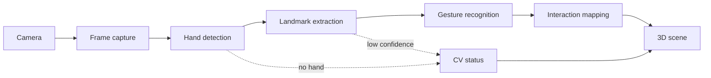
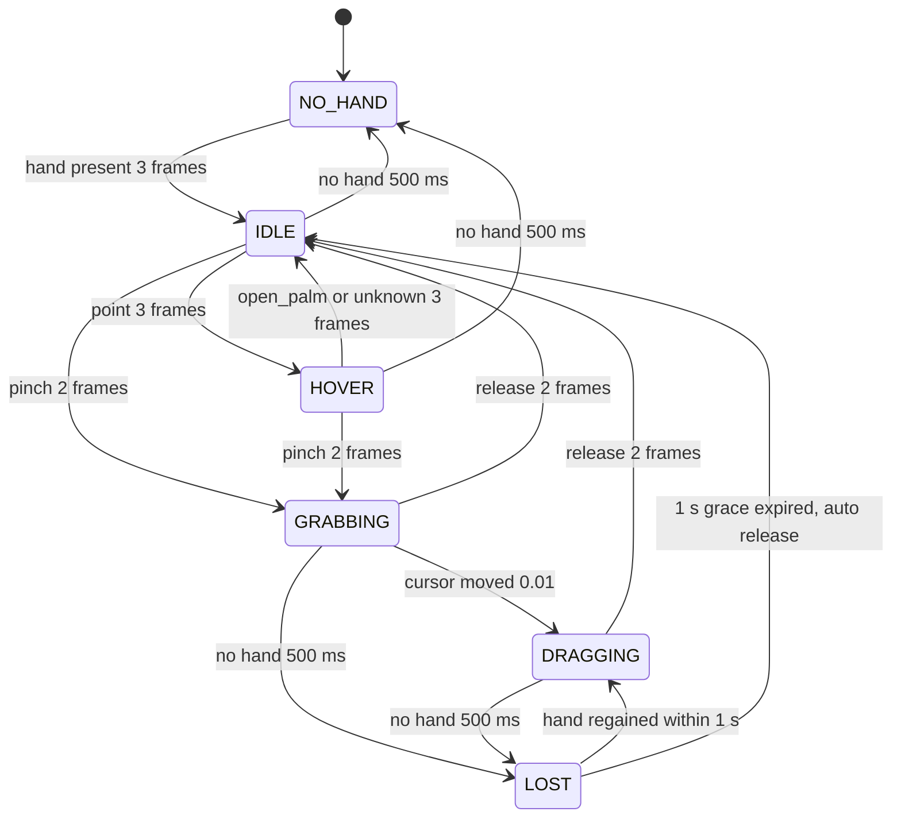

# Computer Vision Architecture

This file specifies how a 720p webcam frame becomes an interaction event that the 3D layer can act on: capture, hand detection, landmark extraction, gesture classification, and mapping to scene intent. It fixes the five **MVP** gestures, defers four to **V1**, and defines the signals the CV layer emits when it fails so the learning and UX layers can respond. Everything here runs in the browser; no video frame leaves the device (locked position 2). The content is mostly **MVP**; every numeric threshold is a starting value to be tuned from logged sessions.

## Pipeline



| Stage | What it does | Runs on | Latency budget | Output | Tier |
|---|---|---|---|---|---|
| Camera | `getUserMedia` at 640×360, 30 fps, `facingMode: "user"` | Main thread (browser media stack) | ~33 ms frame interval plus sensor exposure; not under our control | `MediaStream` into a hidden `<video>` | **MVP** |
| Frame capture | `createImageBitmap(video)` once per animation frame; transfer to worker | Main thread | ≤ 2 ms | `ImageBitmap` (transferred, zero-copy) | **MVP** |
| Hand detection | Palm detector inside `HandLandmarker` finds hand bounding boxes; on tracked frames it is skipped and the previous box is reused | Web Worker, WASM + GPU delegate | 12–20 ms combined with landmarks on a laptop iGPU; 30–45 ms on CPU fallback | Hand boxes, presence and handedness confidence | **MVP** |
| Landmark extraction | 21 landmarks per hand, normalized `x, y` and relative `z` | Web Worker (same call) | Included above | `landmarks[h][21]`, `handedness[h]` | **MVP** |
| Gesture recognition | One-Euro smoothing, scale normalisation, feature extraction, hysteresis and debounce, state machine | Web Worker | ≤ 1 ms | Gesture state per frame | **MVP** |
| Interaction mapping | Converts gesture state transitions and cursor into interaction events; applies grabbable-under-cursor rule | Web Worker (needs `hoveredId` fed back from main thread) | ≤ 1 ms plus one `postMessage` (< 1 ms) | Interaction events, CV status | **MVP** |
| 3D scene | Raycast, drag plane, snapping; owned by [05-3d-interaction.md](05-3d-interaction.md) | Main thread, React Three Fiber | ≤ 33 ms render frame | Scene update, `select`/`place`/`drop` to learning engine | **MVP** |

End-to-end budget from finger movement to on-screen object movement: about 80–110 ms (one camera interval, one inference, one render). This is perceivable but acceptable for coarse grab-and-place; it is not acceptable for fine tracing, which is one reason tracing tasks are not in the MVP. The One-Euro filter adds lag only in proportion to how slowly the hand moves.

CV inference budget: **p95 ≤ 33 ms per frame**, measured in the worker from bitmap receipt to event emission, on a laptop iGPU with the GPU delegate. The expected typical range is 12–20 ms; 33 ms is the ceiling that keeps one inference inside one camera interval so the combined 30 fps target of locked position 6 holds. [05-3d-interaction.md](05-3d-interaction.md) and [15-risks-security-scalability.md](15-risks-security-scalability.md) reference this number; the `perf_sample.inferenceMsP95` field in the logging section is how it is verified.

## Library decision

### Hand tracking library

Decision: `@mediapipe/tasks-vision` `HandLandmarker`, WASM with GPU delegate, `runningMode: "VIDEO"`, self-hosted WASM and `.task` file under `public/mediapipe/` with a pinned version. **MVP**.

| Option | Pros | Cons | Fit for solo dev | Verdict |
|---|---|---|---|---|
| MediaPipe Tasks Vision `HandLandmarker` | Maintained, in-browser, 21 landmarks with handedness, 2-hand support, GPU delegate, ~30 fps on iGPU | Black-box model, no fine-tuning, ~10 MB download, relative not metric depth | High: one npm package, no training | **MVP** |
| TensorFlow.js `hand-pose-detection` | Same model family, TFJS ecosystem | Slower runtime, larger bundle, less active | Medium | Reject |
| Legacy `@mediapipe/hands` | Many tutorials | Deprecated, no Tasks API, no worker-friendly build | Low: dead end | Reject |
| Custom model via ONNX Runtime Web | Could learn lesson-specific gestures | Dataset, training pipeline, Python service (locked position 1 makes this V1/Future) | Low | **Future** |
| Server-side inference | Any model, any hardware | Streams video off device; breaks privacy position and hobby budget | None | Reject |

Eight-point checklist for MediaPipe `HandLandmarker`:

| # | Point | Assessment |
|---|---|---|
| 1 | Appropriate | Free, browser-native, adequate accuracy for coarse gestures; the only maintained option that needs no training |
| 2 | Limitations | `z` is relative and noisy; degrades with backlighting, occlusion, hands near frame edge; thresholds not exposed per gesture, so classification is ours |
| 3 | Performance | 12–20 ms per frame on iGPU with GPU delegate; competes with R3F unless moved to a worker |
| 4 | Accessibility | Gesture input is unusable for some learners; every gesture has a mouse and keyboard equivalent (see [05](05-3d-interaction.md) and [11](11-ui-ux.md)) |
| 5 | Privacy | Frames processed in memory, discarded per frame; only events logged, with consent |
| 6 | Scalability | Zero server cost per user; cost is the learner's CPU/GPU |
| 7 | Complexity | Low: init pattern in `mediapipe-hands` section 2, one `detectForVideo` call per frame |
| 8 | Necessary? | Yes for the gesture condition. Simpler alternative is mouse-only, which is the research control condition and ships regardless |

The official web guide confirms that `detect()` and `detectForVideo()` block the calling thread and recommends a Web Worker: <https://developers.google.com/edge/mediapipe/solutions/vision/hand_landmarker/web_js>. Documented defaults are `numHands: 1` and all three confidence thresholds at `0.5`; this doc raises the thresholds to `0.6` to trade recall for fewer phantom hands, and uses `numHands: 2` so `hand_count` can report a second hand. Cost of `numHands: 2`: the landmark pass runs once per detected palm, so it is negligible when one hand is visible and roughly 1.6–2× inference time when two hands are visible. Rule: measure this at prototype milestone M4 in [17-first-prototype-plan.md](17-first-prototype-plan.md); if the 33 ms p95 budget is missed with two hands visible, fall back to `numHands: 1` and derive `hand_count` from the palm detector's detection count if the API exposes it, otherwise drop the `show_one_hand` hint to **V1**. The `numHands: 2` recommendation is **MVP** under this condition.

### Inference placement: Web Worker

Decision: inference, smoothing, and the gesture state machine run in a Web Worker; the main thread captures frames and applies events. Main-thread fallback at half rate where the worker GPU path is unavailable. **MVP**.

| Option | Pros | Cons | Fit for solo dev | Verdict |
|---|---|---|---|---|
| Web Worker with `ImageBitmap` transfer | Inference never blocks rendering; FSM isolated and testable | GPU delegate in worker needs `OffscreenCanvas` (Chrome, Edge yes; Safari partial); one extra message hop | Medium: ~200 lines of plumbing | **MVP** |
| Main thread, every frame | Simplest | Inference plus render exceeds 33 ms on iGPU; dropped frames | High | Fallback only |
| Main thread, alternate frames | Stays under budget | Effective 15 fps tracking, visible cursor stutter | High | **MVP** fallback |
| WebCodecs `VideoFrame` pipeline | Lowest capture overhead | Browser support uneven; little gain for 640×360 | Low | **V1** if capture cost shows in profiles |

Checklist: (1) appropriate because locked position 6 requires 30 fps combined; (2) limitation is browser feature variance, so feature-detect and fall back; (3) performance gain is the whole render budget back; (4) no accessibility effect; (5) no privacy change, frames still never persisted; (6) scales with client hardware only; (7) moderate complexity, mostly `postMessage` typing; (8) necessary on iGPU laptops, and the simpler alternative is the alternate-frame fallback which ships anyway.

## Gesture specifications

The brief lists nine candidate gestures. Two of them are names for things already covered: **grab** is `pinch` (the grab intent is the pinch gesture resolved against a grabbable component) and **rotate** is `wrist_rotate`. The table uses canonical gesture names from `project-conventions`. `handSize = dist2(l[0], l[9])`; all distances below are divided by it. "Hold" means consecutive frames satisfying the rule before the state is entered. Thresholds are starting values.

| Gesture | Tier | Input | Detection method | Landmark requirements | Confidence threshold | Temporal smoothing | False-positive prevention | Resulting 3D action |
|---|---|---|---|---|---|---|---|---|
| `open_palm` | **MVP** | Single hand, palm toward camera, fingers spread | `extendedCount == 4 && thumbExtended`; `fingerExtended` = tip farther from wrist than PIP by factor 1.1 | 0, 4, 5–8, 9–12, 13–16, 17–20 (all 21) | Presence ≥ 0.6; hold 3 frames | One-Euro on landmarks; cursor = midpoint of 4 and 8 with second One-Euro (`minCutoff` 1.5), same source in every state ([cursor source](#cursor-source)) | Hand box ≥ 8% frame width; not touching three frame edges; `pinch` rule takes precedence | Neutral cursor shown, no hover highlight; cancels any pending dwell |
| `point` | **MVP** | Index extended, other three fingers folded | Index extended and middle, ring, pinky folded; thumb state ignored | 0, 5–8 required; 9–20 for folded check | Presence ≥ 0.6; hold 3 frames | One-Euro; cursor = midpoint of 4 and 8 (sits partway down the index when the thumb is folded; see [cursor source](#cursor-source)) | Not `point` if `pinchDist < 0.25` (pinch wins); hover change debounced 2 frames in 3D layer | `hover(cursor)`; dwell 600 ms over a component = select for `identify` tasks |
| `pinch` (grab) | **MVP** | Thumb tip touches index tip | `pinchDist = dist3(l[4], l[8]) / handSize < 0.25` | 0, 4, 8, 9 | Presence ≥ 0.6; hold 2 frames | One-Euro on landmarks before `pinchDist`; cursor = midpoint of 4 and 8, unchanged from the pre-pinch cursor so `grab_start` lands where the learner aimed | Hysteresis exit 0.40; `grab_start` only emitted if cursor is over a grabbable component or on empty space (orbit); not emitted when hand box > 60% frame | `grab_start(cursor)`: 3D layer raycasts, locks drag plane at component depth, or begins orbit on empty space |
| `pinch_drag` | **MVP** | Held pinch while hand moves | `pinch` active and cursor displacement since `grab_start` > 0.01 normalized | As `pinch` | Inherits pinch; hold 1 frame | Cursor One-Euro on midpoint of 4 and 8; `zHintDelta` from change in `handSize` relative to grab-start size, low-pass heavy | Ignore `zHintDelta` when `|delta| < 0.03` (dead zone); clamp per frame | `grab_move(cursor, zHintDelta)`: move on camera-facing drag plane; orbit if nothing grabbed |
| `release` | **MVP** | Thumb and index separate | `pinch` was active and `pinchDist > 0.40` | 0, 4, 8, 9 | Presence ≥ 0.6; hold 2 frames | Same filtered `pinchDist` | Never emit a socket-eligible `grab_end` from a frame with presence < 0.6 (the same floor the pseudocode applies when filtering hands, so there is no lower band); on tracking loss emit `grab_end` with `reason: "lost"` so the 3D layer settles without snapping | `grab_end(cursor)`: snap to socket if within radius, else settle; reports `place` or `drop` |
| `fist` | **V1** | All fingers curled, thumb across | `extendedCount == 0 && !thumbExtended` | All 21 | Presence ≥ 0.6; hold 4 frames | One-Euro | Easily confused with a hand turned edge-on; require palm facing camera (palm normal z component < −0.5) | Candidate: reset view or cancel current grab |
| `swipe` | **V1** | Fast lateral hand motion with open palm | `palmCenter` x-velocity > 1.5 frame-widths/s for ≥ 4 frames while `open_palm` | 0, 5, 9, 13, 17 | Presence ≥ 0.6 | Velocity from One-Euro-filtered `palmCenter`; 500 ms refractory after a swipe | Must start from `open_palm` held ≥ 3 frames; ignore if any `pinch` in last 300 ms | Next or previous activity, or model preset view |
| `wrist_rotate` (rotate) | **V1** | Twist the hand while pinching | `palmNormal` angle about the view axis changes > 15° from grab start | 0, 5, 17 plus pinch landmarks | Presence ≥ 0.6; hold 3 frames | Angle low-passed; hysteresis 15° enter, 8° exit | Only while `GRABBING` with a component held; ignored during orbit; needs palm roughly facing camera | Rotate held component about view axis |
| `two_hand_scale` | **V1** | Both hands pinching, moving apart or together | Both hands in `pinch`; distance between pinch cursors changes > 5% | Both hands: 0, 4, 8, 9 | Both hands presence ≥ 0.6; hold 3 frames | Inter-cursor distance One-Euro | Both pinches must begin within 500 ms of each other; second hand must be the same person (hand sizes within 25%) | Scale whole model; never individual components |

### MVP and postponed set

Locked position 3 fixes the **MVP** set: `open_palm` (neutral cursor), `point` (hover and select), `pinch` (grab), `pinch_drag` (move, or orbit on empty space), `release` (drop). These five use only the wrist, thumb, and index landmarks for their decisions, which are the most reliably tracked points when sleeves or the model preview occlude the rest of the hand.

| Postponed gesture | Tier | One-line reason |
|---|---|---|
| `fist` | **V1** | Confused with an edge-on hand and with a loose pinch; no MVP task needs it (reset has a button) |
| `swipe` | **V1** | Velocity gestures trigger during ordinary repositioning; navigation has HUD buttons in MVP |
| `wrist_rotate` | **V1** | Depends on `palmNormal`, which depends on noisy `z`; sockets snap rotation so MVP tasks do not need it |
| `two_hand_scale` | **V1** | Doubles inference cost and failure surface; model scale has no learning value in the heart lesson |
| Pose-based gestures | **Future** | Pose tracking is Future per locked position 2 |

Challenge to the brief: listing "grab" and "rotate" alongside "pinch" and "wrist rotation" as separate gestures conflates gesture (hand shape) with interaction event (scene intent). This doc keeps them separate because the same `pinch` yields `grab_start` over a component and orbit over empty space, and the learning engine evaluates intents, not hand shapes.

### Cursor source

Decision (user-approved 2026-10-07, milestone M7): the cursor has exactly one source in every gesture state, the midpoint of THUMB_TIP `l[4]` and INDEX_TIP `l[8]`, One-Euro filtered with the cursor parameters, mirrored, clamped 0..1. **MVP**. This replaces the state-dependent rule `pinchActive ? midpoint(l[4], l[8]) : extended[index] ? l[8] : palmCenter(l)`. Code: `pinchMidpoint` in `packages/vision/src/landmarks.ts` is the only cursor source (`cursorFor` deleted); `FeatureExtractor.extract` in `packages/vision/src/features.ts` no longer takes `pinchActive`. This also matches the `cursor` and `palmCenter` rows in `mediapipe-hands` section 5.

Evidence (developer fixtures, 30 fps, `packages/vision/fixtures/`): the index fails the 1.1 tip/PIP test 2–4 frames before a pinch confirms, so the old rule jumped the cursor from fingertip to palm centre just before `grab_start` and grabs missed the object. In `pinches-20.json` all 22 onsets moved the cursor 0.24–0.29 frame widths (single-frame steps 0.13–0.18); in `pinch-grab-object.json` pinches whose index curled jumped 0.16–0.22 and three were abandoned after 3–5 frames, while pinches with the index still extended moved 0.004–0.019 and became 53–99 frame drags. A single source cannot jump, and it marks where the pinch will close.

Trade-off: a pointing hand with the thumb folded puts the cursor partway down the index finger, not at the fingertip. This does not affect the prototype, which does not wire `point` to `HOVER` ([17](17-first-prototype-plan.md#not-built-in-the-prototype)). **V1** follow-up, with the `point` and dwell-select work: if dwell-select needs fingertip precision, apply a state-aware offset toward `l[8]` blended in with smoothing, never a hard source switch.

## Gesture state machine



Rules that the diagram does not show:

- `IDLE` covers both `open_palm` and an unclassified hand. Both show a neutral cursor; only `open_palm` is logged as a gesture so the "unknown gesture" rate can be measured.
- Every transition requires the hold-frame count for the target state. Hold counts are per-gesture (table above) and are the first thing to tune.
- `LOST` holds the grabbed component at its last valid position. Regaining within 1 s resumes `DRAGGING` with the drag offset recomputed from the new cursor so the component does not jump. Expiry emits `grab_end` with `reason: "lost"`; the 3D layer must settle, never snap, on that reason.
- `pinch` evaluated from `IDLE` or `HOVER` emits `grab_start` only if the main thread has reported a grabbable `hoveredId` under the cursor in the last 2 frames, or the cursor is over empty scene (orbit). Over HUD elements nothing is emitted.

## Interaction-event contract

This is the interface to [05-3d-interaction.md](05-3d-interaction.md). The six shapes from `mediapipe-hands` section 8 are unchanged in name and required fields. Three additive changes are made here and flagged: a `cursor` event for the neutral `open_palm` cursor, a `reason` field on `grab_end`, and a separate `cv_status` channel for failure states. Common fields `t` (worker timestamp) and `confidence` (presence confidence of the primary hand) are added to every interaction event as optional metadata.

```ts
type Cursor = { x: number; y: number };   // normalized viewport coords, mirrored, clamped 0..1

type InteractionEvent =
  | { type: "cursor";     cursor: Cursor }                       // open_palm or unknown hand: show neutral cursor only  (additive)
  | { type: "hover";      cursor: Cursor }                       // point: raycast and highlight
  | { type: "grab_start"; cursor: Cursor }                       // pinch entered over grabbable or empty space
  | { type: "grab_move";  cursor: Cursor; zHintDelta: number }   // pinch_drag; zHintDelta in handSize ratio units, dead-zoned
  | { type: "grab_end";   cursor: Cursor; reason: "release" | "lost" }  // reason is additive; "lost" must never snap
  | { type: "tracking_lost" }
  | { type: "tracking_regained" }
  | { type: "hand_count"; n: number };

type EventMeta = { t: number; confidence: number };             // attached to every event (additive)

type CvStatus = {                                              // separate channel, at most 4 Hz (additive)
  type: "cv_status";
  state: "initialising" | "no_camera" | "no_hand" | "hand_too_far" | "hand_too_close"
       | "low_confidence" | "tracking_lost" | "ok";
  sinceMs: number;                                             // how long this state has persisted
  hint?: "move_closer" | "move_back" | "face_the_light" | "show_one_hand";
};
```

The main thread sends one message type back to the worker: `{ type: "hover_result", hoveredId: string | null, isGrabbable: boolean, t: number }`, so the worker can apply the grabbable-under-cursor rule without owning scene knowledge. The worker never sees the scene graph.

## Smoothing: One-Euro filter and hysteresis

Decision: One-Euro filter per landmark coordinate, a second One-Euro on the cursor, hysteresis on `pinch`/`release`, and hold-frame debounce on every state. **MVP**. Alternatives: exponential moving average (one parameter, but lag grows with every jitter reduction) and Kalman (needs a motion model and tuning the solo developer cannot justify). One-Euro is adaptive in two parameters and is widely used for exactly this input class.

| Parameter | Landmarks | Cursor | Reasoning |
|---|---|---|---|
| `minCutoff` | 1.0 Hz | 1.5 Hz | Jitter at rest is suppressed below ~1 Hz; cursor gets a higher cutoff so selection feels immediate |
| `beta` | 5.0 | 5.0 | **Changed from `mediapipe-hands` section 7 (0.007).** The reference value comes from pixel-unit implementations where speed is hundreds of px/s. Our coordinates are normalized 0..1, so a hand crossing the frame in one second has speed 1.0, and `beta = 0.007` would add only 0.007 Hz of cutoff, making the filter lag during every move. `beta ≈ 5` restores roughly +5 Hz at 1 frame-width/s. Tune in the range 2–10 from recorded sessions |
| `dCutoff` | 1.0 Hz | 1.0 Hz | Standard derivative smoothing |

`zHintDelta` uses a heavier low-pass (`minCutoff` 0.5 Hz, `beta` 1.0) plus a ±0.03 dead zone because `handSize` jitters with finger pose, and locked position 4 limits depth to a low-gain hint.

Hysteresis for pinch: enter at `pinchDist < 0.25`, exit at `pinchDist > 0.40`. When thumb and index tips truly touch, filtered `pinchDist` sits around 0.15–0.22 because the landmarks mark pad centres, not skin surfaces; an open hand sits around 0.8–1.2. The 0.15 gap between enter and exit absorbs landmark noise of about ±0.05 at arm's length. If logs show frequent `release` events shorter than 150 ms followed by a new `grab_start`, widen the gap; if learners report "it will not let go", lower the exit threshold.

## Multi-hand and multi-person handling

| Situation | Rule | Tier |
|---|---|---|
| One hand | It is the primary hand regardless of handedness | **MVP** |
| Two hands, same person | Primary = the hand that was primary last frame; if none, the one with the larger `handSize`. The other hand is ignored for gestures but counted in `hand_count`. Requires `numHands: 2`, which costs roughly 1.6–2× inference time only while both hands are visible; if the 33 ms p95 budget is missed at milestone M4, fall back to `numHands: 1` as stated in the library decision | **MVP** (conditional) |
| Second person enters frame | Primary stays with the tracked hand; switch only after the primary is lost > 500 ms. `cv_status` hint `show_one_hand` if `hand_count > 1` persists 3 s during a task | **MVP** |
| Handedness | Logged with each `grab_start` for analysis; not used in classification, since mirrored cameras make MediaPipe's label unreliable without correction | **MVP** |
| Both hands active | Required for `two_hand_scale`; both must pass presence ≥ 0.6 and have `handSize` within 25% of each other | **V1** |
| Two learners collaborating | Multiplayer seam only | **Future** |

Limitation: one webcam cannot tell whose hand is whose. The largest-hand continuity rule is a heuristic that fails when a bystander's hand is closer to the camera than the learner's. The UX layer should show whose hand is tracked (cursor plus a thumbnail outline) so the learner can notice the switch.

## Failure-state signals

The CV layer detects and reports; it does not render guidance. Pedagogical responses live in [02-learning-experience.md](02-learning-experience.md) and visual responses in [11-ui-ux.md](11-ui-ux.md). States below map to brief failure states 1, 2, and 5; states 3 and 4 (wrong gesture, wrong object) are detected by the learning engine from interaction events, not by the CV layer.

| Condition | Detection rule (starting values) | Signal | What consumers need to know | Tier |
|---|---|---|---|---|
| Camera unavailable or denied | `getUserMedia` rejects, or stream ends | `cv_status: "no_camera"` | Offer mouse mode; research condition cannot proceed | **MVP** |
| Model loading | Before `HandLandmarker` resolves | `cv_status: "initialising"` | Show progress; typical 1–3 s cold, < 300 ms cached | **MVP** |
| No hand in frame | No hand with presence ≥ 0.6 for 500 ms | `cv_status: "no_hand"` after 500 ms; `tracking_lost` if a grab was active | Gentle prompt after 3 s; do not interrupt reading | **MVP** |
| Hand too far | Primary hand box < 8% frame width for 1 s | `cv_status: "hand_too_far"`, hint `move_closer` | Overlay with target silhouette | **MVP** |
| Hand too close | Hand box > 60% frame width for 1 s | `cv_status: "hand_too_close"`, hint `move_back` | Same overlay | **MVP** |
| Poor lighting or backlighting | Hand detected intermittently: presence confidence mean < 0.7 over 2 s, or detection flickering ≥ 4 times in 2 s, with frame luminance from a 32×18 downsample outside 40–200 | `cv_status: "low_confidence"`, hint `face_the_light` | Lighting guidance; the learner cannot fix this by gesturing better | **MVP** |
| Tracking lost mid-grab | `GRABBING`/`DRAGGING` and no hand for 500 ms | `tracking_lost`; after 1 s `grab_end` with `reason: "lost"`; `tracking_regained` on return | Freeze the held component visibly; never grade a drop caused by loss | **MVP** |
| Multiple hands or people | `hand_count > 1` for 3 s during a task | `cv_status: "ok"` with hint `show_one_hand` | Non-blocking notice | **MVP** |

`cv_status` is emitted on change and at most every 250 ms, so the HUD can bind to it directly. Luminance sampling reads a 32×18 downsample of the current bitmap in the worker and discards it; no pixels are retained or sent.

## Gesture detection pseudocode

```text
// Runs in the Web Worker once per received frame. State persists across calls.

onFrame(bitmap, t):
  result = landmarker.detectForVideo(bitmap, t)
  hands  = result.landmarks zipped with result.handedness, filtered by presence >= 0.6
  hands  = reject(hands, box < 0.08 * frameWidth or box > 0.60 * frameWidth or touching 3 edges)
  updateStatus(hands, luminance(bitmap))             // emits cv_status on change, max 4 Hz
  primary = choosePrimary(hands)                     // last frame's primary if present, else largest handSize
  emit hand_count if hands.length changed

  if primary is null:
    fsm.noHandFrames += 1
    if fsm.state in {GRABBING, DRAGGING} and elapsedNoHand > 500 ms: enter LOST, emit tracking_lost
    if fsm.state == LOST and elapsedNoHand > 1500 ms: emit grab_end(lastCursor, reason: "lost"); enter IDLE
    if fsm.state in {IDLE, HOVER} and elapsedNoHand > 500 ms: enter NO_HAND
    return

  // 1. Landmarks -> smoothed landmarks
  l = oneEuroPerCoordinate(primary.landmarks, t)     // 21 x 3 filters, minCutoff 1.0, beta 5.0

  // 2. Feature extraction
  handSize      = dist2(l[0], l[9])
  pinchDist     = dist3(l[4], l[8]) / handSize
  extended[f]   = dist2(l[tip_f], l[0]) > dist2(l[pip_f], l[0]) * 1.1   for f in index..pinky
  extendedCount = count(extended)
  thumbExtended = dist2(l[4], l[17]) / handSize > 1.4
  rawCursor     = midpoint(l[4], l[8])                 // sole source in every state; never switches (see Cursor source)
  cursor        = clamp01(mirrorX(oneEuroCursor(rawCursor, t)))
  zHint         = lowpass(handSize / grabStartHandSize - 1)           // only meaningful while grabbing

  // 3. Classification with hysteresis
  pinchRule  = pinchActive ? pinchDist < 0.40 : pinchDist < 0.25
  candidate  = pinchRule                                  ? "pinch"
             : extended[index] and not extended[middle..pinky] ? "point"
             : extendedCount == 4 and thumbExtended       ? "open_palm"
             : "unknown"

  // 4. Confidence: debounce by hold frames, weight by presence
  holdFrames[candidate] += 1; reset other counters
  confirmed  = holdFrames[candidate] >= HOLD[candidate]  // pinch 2, point 3, open_palm 3
  confidence = primary.presence * min(1, holdFrames[candidate] / HOLD[candidate])

  // 5. State transitions -> interaction events
  if fsm.state == LOST: enter DRAGGING, emit tracking_regained           // grab offset recomputed by 3D layer
  switch (fsm.state, confirmed ? candidate : null):
    (IDLE | HOVER, "pinch")  -> if hoverResult.isGrabbable or hoverResult.hoveredId == null:
                                  enter GRABBING; grabStartCursor = cursor; grabStartHandSize = handSize
                                  emit grab_start(cursor)
    (GRABBING, "pinch")      -> if dist2(cursor, grabStartCursor) > 0.01: enter DRAGGING
    (DRAGGING, "pinch")      -> emit grab_move(cursor, deadZone(zHint, 0.03))
    (GRABBING | DRAGGING, not "pinch") when pinchDist > 0.40 ->
                                enter IDLE; emit grab_end(cursor, reason: "release")
    (IDLE, "point")          -> enter HOVER; emit hover(cursor)
    (HOVER, "point")         -> emit hover(cursor)
    (HOVER, "open_palm" | "unknown") -> enter IDLE; emit cursor(cursor)
    (IDLE, _)                -> emit cursor(cursor)
  attach { t, confidence } to every emitted event
```

Note the ordering: pinch beats point, which beats open palm. The check uses the hysteresis-aware `pinchRule` so a pinch does not flicker to `point` as the fingers begin to separate.

## Threshold calibration proposal

Terminology: this section describes **threshold calibration**, a 5-second capture of per-session `handSize` and `pinchDist` values. It is distinct from the **calibration tutorial**, the 5-minute, 20-prompt gesture-accuracy instrument that follows it and is owned by [14-evaluation-methodology.md](14-evaluation-methodology.md) and referenced in [02-learning-experience.md](02-learning-experience.md) and [12-mvp-definition.md](12-mvp-definition.md).

Decision: a 5-second, two-step threshold calibration at the start of each gesture-condition session, optional and skippable in the MVP but on by default for study participants. **MVP** for the capture; persisting per user is **V1**.

| Step | Learner does | CV records | Used for |
|---|---|---|---|
| 1 (2 s) | Holds `open_palm` at comfortable distance inside a silhouette | Median `handSize` → `calibHandSize`; median `pinchDist` → `openPinch`; mean presence confidence; frame luminance | `zHint` baseline; lighting check before the lesson starts |
| 2 (2 s) | Pinches and holds | Median `pinchDist` → `closedPinch` | Per-session pinch thresholds: `enter = closedPinch + 0.3 * (openPinch − closedPinch)`, `exit = closedPinch + 0.6 * (openPinch − closedPinch)`, both clamped to [0.18, 0.55] |
| Check | None | If step 1 confidence < 0.7 or any step fails twice | Show lighting or distance guidance before the lesson, not during it |

Why: `handSize` normalisation handles most of the child-versus-adult difference, but thumb length relative to palm varies enough that a fixed 0.25 enter threshold is tight for some adults and loose for small hands. Threshold calibration gives a clean per-session baseline for `zHint` and runs immediately before the calibration tutorial, so the tutorial's gesture-accuracy measurements are taken with the per-session thresholds in effect. Limitation: it adds 5–10 seconds and learners sometimes hold their hand at a distance during capture that they do not later keep; the clamp bounds the damage. Default thresholds are used if the learner skips.

## What to log for tuning

Every threshold above is provisional. Logging follows the `LogEvent` schema in the `research-protocol` skill (events and derived metrics only; no video, images, or landmark streams). Two additions are proposed to that schema for the gesture condition and should be confirmed with `research-methodologist` in [14-evaluation-methodology.md](14-evaluation-methodology.md): a `cv_status` event type, and extra `payload` fields on existing events.

| Threshold or parameter | Metric that reveals mis-tuning | Log field needed |
|---|---|---|
| Pinch enter/exit 0.25/0.40 | Rate of `grab_end` → `grab_start` within 300 ms (flicker); mean pinch hold time | `grab_start.pinchDist`, `grab_end.pinchDist`, `grab_end.holdMs` |
| Hold frames 2/3/3 | False-start rate: closed grabs that never moved (`grab_move_summary.firstMoveMs` null, i.e. cursor never travelled 0.01) ÷ `grab_move_summary` count, gesture condition only, decided 2026-10-07 (was: no `grab_move` within 300 ms, which miscounted deliberate pause-then-carry drags); time from pinch to `grab_start` | `grab_start.holdFrames`, `grab_start.confidence`, `grab_move_summary.firstMoveMs` |
| Drag threshold 0.01 | `grab_end` with zero `grab_move` on intended moves | `grab_end.moveCount` |
| One-Euro `beta` | Cursor overshoot: sign reversals per second in `grab_move` cursor velocity | `perf_sample.cursorReversalsPerS` |
| Presence 0.6 and no-hand 500 ms | Tracking-lost count and duration; `tracking_lost` events per minute | `tracking_lost.durationMs` (on regained), `cv_status.state`, `cv_status.sinceMs` |
| Lighting rule | `low_confidence` duration versus task error rate | `cv_status.luminance` (one number, not pixels) |
| Multi-person rule | Primary-hand switches per session | `hand_count.n`, `hand_count.primarySwitched` |
| Inference budget | Inference p50/p95, fps, worker versus fallback path | `perf_sample.inferenceMsP50`, `inferenceMsP95`, `frameMsP95`, `fps`, `perf_sample.path` |

A development-only `gesture_debug` stream (per-frame features, no landmarks) can be enabled behind a flag for the developer's own sessions; it is never enabled for participants. The CV metric definitions (gesture accuracy, precision, recall, false-positive rate, tracking stability, latency) and how they are computed from these fields are owned by [14-evaluation-methodology.md](14-evaluation-methodology.md); the occlusion, lighting, hand-size, multi-person, latency, ambiguity, and depth risks are in [15-risks-security-scalability.md](15-risks-security-scalability.md).

## Open questions

1. Resolved 2026-10-04: threshold calibration is **mandatory** in the gesture condition (about 5 s, before the calibration tutorial) and automatically skipped in the mouse condition; it is skippable only when `NODE_ENV` is development.
2. Does `three-engineer` accept the additive `grab_end.reason` field, or prefer a separate `grab_cancel` event? The field is proposed because it keeps one code path for settling an object.
3. Is a 1 s grace period on tracking loss right for an anatomy placement task, or should it scale with the socket snap radius?

## Related

- [05-3d-interaction.md](05-3d-interaction.md): consumes the interaction-event contract; owns raycasting, drag plane, and snapping.
- [02-learning-experience.md](02-learning-experience.md) and [11-ui-ux.md](11-ui-ux.md): respond to `cv_status` and `tracking_lost`.
- [06-learning-engine.md](06-learning-engine.md): evaluates `select`, `place`, and `drop`; detects wrong-gesture and wrong-object failure states.
- [14-evaluation-methodology.md](14-evaluation-methodology.md): CV metric definitions and the event-log schema.
- [15-risks-security-scalability.md](15-risks-security-scalability.md): CV risk rows.
- [17-first-prototype-plan.md](17-first-prototype-plan.md): the webcam → pinch → move → release → check milestone sequence.
