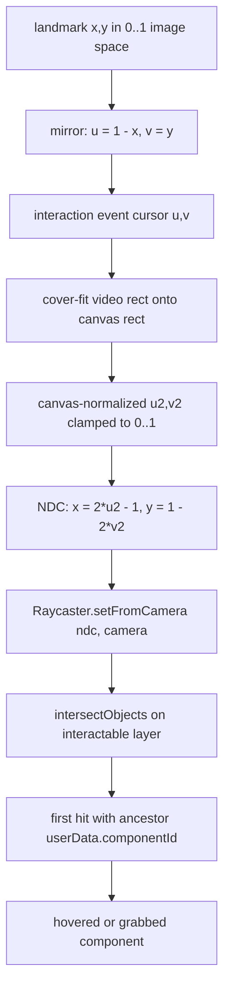
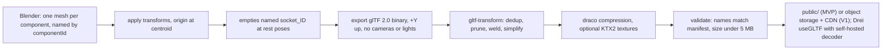

# 3D Interaction Architecture

This file explains how interaction events from the CV layer ([04-computer-vision.md](04-computer-vision.md)) become reliable manipulation of components in a React Three Fiber scene, and how the scene reports what happened to the learning engine ([06-learning-engine.md](06-learning-engine.md)) and the AI tutor ([07-ai-tutor.md](07-ai-tutor.md)). The scene never grades: it emits `select`, `place`, `drop`, and `hover` events plus a compact `SceneState` snapshot, and the engine compares them to lesson JSON. Depth from a single webcam is treated as unreliable throughout (locked position 4). This file mostly concerns **MVP**; **V1** items are the postponed gestures and GPU-dependent polish.

## 1. Library decision

Decision: **React Three Fiber (R3F) + Drei + Three.js**, tagged **MVP**.

| Option | Pros | Cons | Fit for solo dev | Verdict |
|---|---|---|---|---|
| R3F + Drei + Three.js | Declarative scene in the same React tree as the HUD; Drei supplies GLTF loading, `Html` labels, `Environment`, orbit rig; large ecosystem | React reconciliation overhead if per-frame data is put in state; two abstraction layers to debug | High: one language, one build, MediaPipe and UI share state | **MVP** |
| Plain Three.js | No abstraction, fastest possible | Scene/HUD state sync written by hand; more code for the same result | Medium | Reject |
| Babylon.js | Built-in GUI, physics, inspector | Weak React integration; second component model alongside React | Medium | Reject |
| Unity WebGL | Mature editor | 20 MB+ builds, poor interop with React HUD and a MediaPipe worker, no free hosting fit | Low | Reject |

Eight-point checklist for the stack:

| Point | R3F + Drei + Three.js |
|---|---|
| Why appropriate | The HUD, lesson state, and scene live in one React tree; MediaPipe events and lesson JSON are plain JS objects that flow into it directly |
| Limitations | Any `setState` per frame kills frame rate; must use refs and a transient store. Drei pins a Three.js range, so upgrades are coupled |
| Browser performance | Three.js itself; R3F adds a negligible render-loop wrapper when state discipline holds (see [section 10](#10-render-performance-budget)) |
| Accessibility | Nothing built in; Drei `Html` lets labels be real DOM so screen readers and focus work. Keyboard path is ours to build ([section 7](#7-mouse-and-keyboard-equivalents)) |
| Privacy | None; renders locally, no network calls |
| Scalability | Scene code is content-agnostic: new subjects are new GLBs and manifests, not new components |
| Complexity | Low for a developer already using React; the hard parts are interaction logic, not the library |
| Necessary? | Plain Three.js is the simpler alternative but costs more code for HUD sync; R3F is justified |

Supporting libraries, compared and recommended one per role:

| Role | Options | Recommendation | Tier |
|---|---|---|---|
| Helpers | Drei vs hand-rolled | Drei (`useGLTF`, `Html`, `Environment`, `OrbitControls`) | **MVP** |
| State store | Zustand vs Redux vs Context | Zustand with transient `subscribe` for per-frame values; React state only for discrete events | **MVP** |
| Tweening | in-house `useFrame` tween (~60 lines, `maath/easing` already ships with Drei) vs `@react-spring/three` vs GSAP | In-house tween; adopt `@react-spring/three` only if choreography grows. GSAP rejected: licence weight and no R3F benefit | **MVP** |
| Post-processing | `@react-three/postprocessing` `Outline` vs emissive tint | Emissive tint for highlight; outline only when measured frame time leaves 8 ms headroom | tint **MVP**, outline **V1** |
| Raycast acceleration | `three-mesh-bvh` vs none | None until raycast p95 exceeds 1 ms per frame | **V1** |

Limitation of the whole stack: WebGL on an integrated GPU is the ceiling. Post-processing, shadows, and high DPR are the first things cut (section 10).

## 2. Coordinate translation chain

The chain runs once per interaction event. Only the first two stages belong to the CV layer; the rest is this file's responsibility.



| Stage | Owner | Rule |
|---|---|---|
| Landmark | CV | 21 points, normalized to the 640×360 camera frame, origin top-left |
| Mirror | CV | `u = 1 - x` so the cursor moves with the learner's hand as seen in a mirror. The preview video uses `scaleX(-1)` so both agree |
| Cursor in event | CV → 3D | `cursor` field of the `cursor`, `hover`, `grab_start`, `grab_move`, `grab_end` events (vocabulary in `mediapipe-hands` section 8 plus doc 04's additive `cursor` event). Assumed already mirrored and One-Euro smoothed |
| Cover-fit | 3D | The 16:9 video is scaled to cover the canvas rectangle and the excess is cropped, exactly like `object-fit: cover`. Motion stays isotropic (same gain on x and y) and every canvas pixel is reachable. Frame edges, where tracking is worst, become unreachable, which is acceptable |
| Clamp | 3D | Clamp to 0..1 so a hand leaving the crop keeps the cursor at the edge rather than disappearing |
| NDC | 3D | `ndc.x = 2*u2 - 1`, `ndc.y = 1 - 2*v2` (Three.js has +y up) |
| Ray | 3D | One shared `THREE.Raycaster`, `setFromCamera`, `layers` set to the interactable layer only |
| Hit | 3D | First intersection whose ancestor carries `userData.componentId`; meshes without one are scenery |

Cover-fit formulas, with `av` the video aspect (16/9) and `ac` the canvas aspect:

```text
if av > ac:  s = ac / av ; u2 = (u - (1 - s) / 2) / s ; v2 = v
else:        s = av / ac ; v2 = (v - (1 - s) / 2) / s ; u2 = u
```

A `reachScale` factor (default 1.0, **MVP** knob) can magnify a central region of the camera frame onto the full canvas so learners do not have to swing their arm across the whole field of view; it is tuned from pilot sessions, not guessed. The on-screen cursor is drawn on the canvas by this layer, so the learner always sees where the system thinks their finger is.

## 3. The twelve capabilities

Overview; design notes follow. Mouse and keyboard columns are the control-condition and accessibility paths, detailed in [section 7](#7-mouse-and-keyboard-equivalents).

| # | Capability | Gesture path | Mouse / keyboard | Tier |
|---|---|---|---|---|
| 1 | Object selection | `point` dwell 600 ms, or `pinch` on a component | click; Tab + Enter | **MVP** |
| 2 | Raycasting | every `hover`/`grab_*` event | pointer events | **MVP** |
| 3 | Object grabbing | `pinch` on grabbable component | mouse down; Space | **MVP** |
| 4 | Object movement | `pinch_drag` on camera-facing plane | mouse drag; arrows | **MVP** |
| 5 | Object rotation | whole model orbit: `pinch_drag` on empty space. Held component: `wrist_rotate` | drag on empty space; arrows with no grab. Component: Q/E | orbit **MVP**, component **V1** |
| 6 | Object scaling (camera dolly, whole model only) | `two_hand_scale` (**V1**) | mouse wheel; + / − keys | **MVP** capability; disabled in study sessions for parity (flag, not tier); `two_hand_scale` gesture **V1** |
| 7 | Component highlighting | emissive tint on hover; pulse on hint | same | **MVP** |
| 8 | Object snapping | on `release` within socket radius | on mouse up / Enter | **MVP** |
| 9 | Component separation | pose tween assembled ↔ exploded; drag out of socket | slider; X key | **MVP** |
| 10 | Guided animations | camera and pose tweens; GLB clips | same (engine-driven) | tweens **MVP**, clips **V1** |
| 11 | Resetting scenes | engine command | R key, HUD button | **MVP** |
| 12 | Interactive hotspots | `point` dwell on marker | click; Tab | **MVP** |

### 3.1 Selection and raycasting

Raycast at most once per frame against a flattened `interactables` array. `hover` sets `hoveredId` after two consecutive frames agree, which removes flicker at mesh borders. Selection has two paths so that `identify` tasks are completable without a pinch: dwell (`point` held on one component for 600 ms with a visible fill ring) and `grab_start` on a component. Both emit `{ type: "select", componentId }`. When the activity has `allowGrab: false` (introduction, explore), `grab_start` only selects; when `allowGrab: true` it selects and begins a grab, and the engine ignores `select` if the current task is a `place`.

### 3.2 Grab, move, and the drag plane

On `grab_start` with a grabbable hit, the scene builds a plane through the component's position with normal equal to the camera's view direction, stores the offset between the component and the ray-plane intersection, detaches the component from its socket, and marks the socket empty. Each `grab_move` intersects the ray with that plane, adds the offset, applies the low-gain z-hint and constraints, and lerps toward the result (factor 0.5) on top of the CV layer's One-Euro smoothing. Snap happens only on `grab_end`. Full reasoning is in [section 5](#5-depth-estimation-and-its-limitations).

### 3.3 Rotation and scaling

Whole-model orbit is `pinch_drag` that started on empty space: azimuth and elevation change proportionally to cursor delta, around the model centre, clamped to elevation ±80°. A ~40-line orbit rig is preferred over feeding synthetic pointer events to Drei `OrbitControls`, which fights with real pointer input in the mouse condition. Held components keep their orientation in **MVP**; sockets supply rotation on snap, so no task needs component rotation. Per-component scaling has no learning value in anatomy; "scale" means camera dolly (distance) of the whole model. Camera dolly is an **MVP** capability, driven by the mouse wheel and the + / − keys. The `two_hand_scale` gesture is **V1** and drives the same dolly. For research parity the mouse condition must not gain capabilities the gesture condition lacks, so camera dolly is disabled in study sessions by a session flag (`studyParity`); this is a flag, not a tier change, and the capability stays **MVP** outside study sessions. Q/E component rotation is **V1** because component rotation itself is **V1**.

### 3.4 Highlighting

Hover: swap the material emissive to the highlight colour (configurable, high-contrast option). Hint pulses from the engine (`highlight: ["left_ventricle", "right_ventricle"]` in lesson JSON) animate emissive intensity at 1 Hz for 3 s. Highlights are never the only feedback channel; the HUD adds text and an icon ([11-ui-ux.md](11-ui-ux.md)). Outline post-processing is **V1**, gated on measured headroom.

### 3.5 Snapping and sockets

Sockets come from the model manifest (`socket_left_ventricle`, `socket_aorta`, and so on; type in `lesson-schema` section 2). On `grab_end` the scene finds the nearest socket whose `accepts` contains the component and whose distance is under `radius`, snaps position and rotation over 150 ms, and emits `{ type: "place", componentId, socketId }`. Otherwise the component settles where dropped and `{ type: "drop", componentId, position, cause: "release" }` is emitted. If the `grab_end` carries `reason: "lost"` (tracking lost during the grab; doc 04), the scene skips the socket search entirely, settles the component in place, and emits `drop` with `cause: "lost"`; a `place` can never result from a loss. `accepts` is permissive and lists distractors (the heart manifest lets every chamber socket accept all four chambers and both great-vessel sockets accept both vessels), so `place` fires for any accepting socket. A socket accepting a component is not correctness; dropping `aorta` into `socket_aorta` during a task that expects `pulmonary_artery` snaps tidily, stays snapped, and the engine marks it wrong. The scene never receives or acts on a verdict. Socket visuals follow the manifest (`ghost`, `ring`, `none`) and the activity's `socketsVisible`.

### 3.6 Separation, guided animation, and reset

Separation uses the named poses `assembled` and `exploded` from the manifest: `position = lerp(assembled, exploded, t)` for each component, with `t` from a HUD slider or set to 1 by the engine for the challenge activity. A `remove` task is satisfied by grabbing a component out of its socket beyond `radius` and releasing, which yields a `drop` event. Guided animation in **MVP** is a camera tween to a hotspot or component (`cameraTo` in hints) and pose tweens; GLB `AnimationMixer` clips named in `manifest.animations` are **V1**. Reset keeps an immutable snapshot of initial poses and socket occupancy taken when the activity loads, tweens back over 400 ms, and is invoked by the engine; the HUD reset button goes through the engine so that attempt state is cleared consistently. Reduced-motion disables all tween easing.

### 3.7 Hotspots

A hotspot is `{ id, componentId, localPosition, label, kind }` from the manifest (`hs_lv_wall`, `hs_septum`). Marker: a billboard sprite on the interactable layer; label: Drei `Html` with `occlude` so it hides behind geometry. Hotspots are selectable like components and emit `{ type: "select", hotspotId }`, which the engine uses for explore-activity completion and `kind: "task"` prompts.

## 4. Scene events and SceneState contract

The scene has three interfaces. Two are the stable contracts named in the team conventions; the third is new in this document.

| Direction | Interface | Source of truth |
|---|---|---|
| CV → scene | interaction events `cursor`, `hover`, `grab_start`, `grab_move`, `grab_end`, `tracking_lost`, `tracking_regained`, `hand_count` | `mediapipe-hands` section 8, plus doc 04's additive `cursor` event (neutral-cursor position for any detected hand) and `grab_end.reason: "release" \| "lost"` |
| Scene → engine and tutor | scene events and `SceneState` | `r3f-interaction` section 11; two fields added, below |
| Engine → scene | scene commands | this file, new |

Scene events:

| Event | Payload | Emitted when |
|---|---|---|
| `select` | `componentId` or `hotspotId` | dwell completes, click, or `grab_start` on a component |
| `place` | `componentId`, `socketId` | `grab_end` snapped into a socket |
| `drop` | `componentId`, `position`, `cause: "release" \| "lost"` | `grab_end` outside any accepting socket (`cause: "release"`), or any `grab_end` with `reason: "lost"` (`cause: "lost"`, socket search skipped) |
| `hover` | `componentId \| null` | `hoveredId` changes (not per frame) |

`drop.cause` exists because the learning engine never sees interaction events and so cannot read `grab_end.reason`; it needs `cause` to discard loss-caused drops in every task type (a lost hand is not an attempt). The scene attaches the cause and does nothing else with it.

Scene commands from the engine: `setPose(name)`, `highlight(ids, durationMs)`, `cameraTo(target)`, `setSocketVisual(socketId, visual)`, `setVisible(ids)`, `reset()`, `playAnimation(id)` (**V1**). They carry no lesson logic; the engine decides when to call them.

`SceneState` is the only scene information that leaves the browser (to the tutor route), and it is also what the research logger samples:

```ts
type SceneState = {
  modelId: string;                                   // "heart_v1"
  camera: { azimuth: number; elevation: number; distance: number };
  components: Record<string, { socketId: string | null; position: [number, number, number]; visible: boolean }>;
  hovered: string | null;                            // componentId or hotspotId
  grabbed: string | null;
  lastEvent: { type: string; componentId?: string; socketId?: string; hotspotId?: string; cause?: "release" | "lost"; t: number } | null;
};
```

Interface change: `hotspotId?` and `cause?` (present on `drop` only) are added to `lastEvent`, and `hovered` may hold a hotspot id. Nothing else in `r3f-interaction` section 11 changes.

Tracking loss: the vision worker owns the grace period (doc 04). On `tracking_lost` while grabbing, the scene keeps the component where it is and waits; if tracking returns the drag continues, otherwise the worker emits `grab_end` with `reason: "lost"` and the scene settles the component in place and emits `drop` with `cause: "lost"` (never `place`). The scene runs no timer of its own.

## 5. Depth estimation and its limitations

Single-webcam depth is unreliable for three reasons. MediaPipe's landmark `z` is relative to the wrist, scaled in image-width units, and noisy by design; it is not a distance from the camera. Apparent hand size, the other depth cue, is confounded by hand size (child versus adult), wrist orientation, and finger spread, so a 10 cm push can look identical to a slight wrist turn. Finally, a 720p webcam at arm's length has no stereo baseline, so any metric depth would be inferred, not measured. Letting such a signal drive object z makes components appear to grow and shrink randomly, which destroys the sense of grasping.

| Approach | How | Reliability | Learner control | Fit for solo dev | Verdict |
|---|---|---|---|---|---|
| Raw landmark `z` | map `z` to scene depth | Poor; jitter of several cm | Confusing | Trivial | Reject |
| Camera-facing drag plane | move on a plane through the grabbed object, normal to the view | High; hand 2D motion becomes object 2D motion at constant perceived depth | Predictable | Low | **MVP** |
| Low-gain z-hint | `handSize` change relative to calibration pushes along view axis, `Z_GAIN` 0.3, clamped `Z_MAX` 0.15 scene units per frame | Medium; drift is bounded by the clamp | Subtle push/pull | Low | **MVP**, on top of the plane |
| Snap sockets | correct depth supplied by the socket pose on release | High | Learner only needs to be near | Low | **MVP** |
| Constrained motion | workspace bounds box; optional per-task axis locks | High | Reduces degrees of freedom | Low | **MVP** |
| Ground plane | drag on a horizontal table plane; good for assembly scenes | High | Different mental model | Low, but needs a lesson-JSON flag | **V1**, opt-in per activity |
| Depth camera or stereo | hardware depth | High | Natural | Hardware cost, device fragmentation | **Future** |

Recommendation: the plane plus z-hint plus sockets plus constraints, all **MVP**. Limitation stated plainly: a learner cannot place a component behind another by depth alone; every task in the heart lesson is designed so that sockets resolve depth, and the orbit gesture exposes any hidden socket. The ground plane needs a `scene.dragMode` field that `lesson-schema` does not yet have; see open questions.

## 6. Object-interaction pseudocode

```text
on interactionEvent(e):
  cursor = coverFit(e.cursor); ndc = toNDC(cursor); drawCursor(cursor)
  invalidate()                                           // wake the demand frameloop

  switch e.type:

    cursor, hover:                                       // cursor = neutral open_palm position; hover = point
      hit = raycast(ndc)                                 // interactable layer only, once per frame
      candidate = hit ? ancestorComponentId(hit) ?? ancestorHotspotId(hit) : null
      if candidate == pendingHover for 2 frames: setHovered(candidate); emit hover(candidate)
      if e.type == hover and hovered and dwellTime(hovered) >= 600 ms and not alreadySelected: emit select(hovered)

    grab_start:
      hit = raycast(ndc)
      if not hit:                 orbit = { active: true, start: cursor, cam0: camera.pose }; return
      c = ancestorComponentId(hit)
      emit select(c)
      if not activity.allowGrab or not manifest[c].grabbable: return
      grabbed = c
      dragPlane = Plane(normal = camera.worldDirection, through = c.position)
      grabOffset = c.position - intersect(ray(ndc), dragPlane)
      if c.socketId: sockets[c.socketId].occupant = null; c.socketId = null

    grab_move:
      if orbit.active: camera.azimuth, elevation = cam0 + (cursor - start) * ORBIT_GAIN; clampElevation(); return
      if not grabbed: return
      p = intersect(ray(ndc), dragPlane) + grabOffset
      p += camera.forward * clamp(e.zHintDelta * Z_GAIN, -Z_MAX, Z_MAX)
      p = clampToBounds(p, workspace); p = applyAxisLocks(p, task)
      grabbed.position = lerp(grabbed.position, p, 0.5)   // refs only; no React state

    grab_end:
      if orbit.active: orbit.active = false; return
      if not grabbed: return
      if e.reason == "lost":                             // worker-owned grace period expired (doc 04)
        settle grabbed in place                          // no socket search; a loss never produces place
        emit drop(grabbed.id, grabbed.position, cause: "lost")
        grabbed = null; return
      s = nearestSocket(grabbed, where accepts includes grabbed.id)
      if s and dist(grabbed.position, s.position) < s.radius:
        tween(grabbed → s.transform, 150 ms); s.occupant = grabbed.id; grabbed.socketId = s.id
        emit place(grabbed.id, s.id)
      else:
        emit drop(grabbed.id, grabbed.position, cause: "release")
      grabbed = null

    tracking_lost:
      // nothing: the component stays put; the vision worker owns the grace timer and
      // ends the grab with grab_end(reason: "lost") if tracking does not return

  updateSceneState()                                     // cheap diff into the Zustand store
```

Constants start at `Z_GAIN = 0.3`, `Z_MAX = 0.15` scene units per frame (the heart manifest uses centimetres, so at most 4.5 cm/s of depth drift), `ORBIT_GAIN = 180°` per canvas width. All are tuned from pilot recordings.

## 7. Mouse and keyboard equivalents

Both input modes produce the same interaction events through an `InputSource` adapter, so the scene has one code path and the research condition is a single switch. This is what makes the gesture-versus-mouse comparison in [14-evaluation-methodology.md](14-evaluation-methodology.md) fair: identical scene, identical events, identical evaluation.

| Gesture | Interaction event | Mouse | Keyboard | Tier |
|---|---|---|---|---|
| `open_palm` | none (neutral cursor) | pointer move with no button | Tab / Shift+Tab cycles focus through components and hotspots, with the cursor jumping to the focused item | **MVP** |
| `point` | `hover`, dwell → `select` | pointer move; click → `select` | Tab to focus; Enter → `select` | **MVP** |
| `pinch` | `grab_start` | left button down | Space on focused component | **MVP** |
| `pinch_drag` | `grab_move` | drag with button held | arrows move 0.5 scene units per press on the drag plane; PageUp/PageDown apply the z-hint; Shift multiplies by 4 | **MVP** |
| `release` | `grab_end` | button up | Space or Enter again | **MVP** |
| `pinch_drag` on empty space (orbit) | `grab_start` with no hit | drag on empty space | arrows with nothing grabbed | **MVP** |
| `two_hand_scale` (**V1**) | camera dolly | wheel | + / − | dolly **MVP** (disabled in study sessions for parity, by flag); gesture **V1** |
| `wrist_rotate` | component rotation | right-drag | Q / E | **V1** |
| Reset, explode, escape | commands | HUD buttons | R, X, Esc (cancel grab, settle in place → `drop` with `cause: "release"`) | **MVP** |

Keyboard focus order follows the manifest's `components` order, and focus is announced through an ARIA live region owned by the HUD. The dwell ring, highlight colour, and reduced-motion behaviour are shared across all three input modes.

## 8. GLB authoring and compression pipeline

This file owns the pipeline; [10-3d-content-system.md](10-3d-content-system.md) owns the manifest schema and references this section.



| Step | Rule | Why |
|---|---|---|
| Naming | Mesh names equal `components[].id` exactly (`left_ventricle`, `septum`); diff with `gltf-transform inspect` in CI | Every mesh with a known name gets `userData.componentId`; unknown meshes are scenery |
| Origins | Each separable part's origin at its centroid; parent transforms applied | Drag plane and snap use the origin; a far-off pivot makes grabs feel wrong |
| Sockets | Empties `socket_<id>` exported, read once to populate manifest transforms | Artists place sockets where parts belong; no hand-typed coordinates |
| Simplify | Target ≤ 150k triangles per model, ≤ 4 materials; `simplify --ratio 0.5` if over budget | Integrated GPU and 30 fps combined budget |
| Compression | Draco (**MVP**); meshopt is the alternative if decode p95 exceeds 300 ms on the reference laptop | Draco gives the smallest geometry and is the default Drei path; meshopt decodes faster with a smaller decoder |
| Textures | ≤ 2048², baked ambient occlusion instead of shadows; KTX2 is **V1** | Shadows are the most expensive lever at this GPU tier |
| Size | < 5 MB compressed per model (locked position 6) | Load under 5 s on a 10 Mbps connection |
| Delivery | `apps/web/public/models/` on Vercel (**MVP**); object storage behind a CDN (**V1**, see doc 10); decoder files under `public/draco/`, versioned filenames | Offline-safe, cacheable, no third-party runtime dependency |

Limitation: Blender authoring of a 10-component heart with clean separable meshes is the largest single content effort in the MVP; a purchased or CC-licensed base model that is then split and renamed is acceptable if its licence allows redistribution.

## 9. Scene-state snapshot and research logging

`SceneState` (section 4) is diffed into the store on every discrete event and sampled at 1 Hz by the research logger when the learner has consented. Positions are rounded to 0.1 scene units; no pixels, no landmarks beyond what the CV layer logs. The tutor receives the current snapshot plus the current task prompt, never a history of frames.

## 10. Render performance budget

Locked position 6: 30 fps combined MediaPipe plus R3F on a laptop integrated GPU. Reference device for every number below: a laptop with Intel Iris Xe or UHD 620 class graphics, 1080p display, Chrome, 720p webcam, CV inference in a Web Worker at 640×360.

| Metric | Budget | How measured | Tier |
|---|---|---|---|
| Main-thread frame time p95 | ≤ 33 ms with CV running | `useFrame` delta sampled into p50/p95 per minute; `r3f-perf` overlay in development | **MVP** |
| Render time p95 (GPU + draw submission) | ≤ 12 ms | `r3f-perf` GPU timer in dev; `gl.info.render` plus frame delta in production | **MVP** |
| CV inference p95 | ≤ 33 ms in worker (CV-owned budget from [04](04-computer-vision.md), logged alongside) | worker `performance.now()` around `detectForVideo` | **MVP** |
| Draw calls | ≤ 50 | `gl.info.render.calls` | **MVP** |
| Triangles on screen | ≤ 150k | `gl.info.render.triangles` | **MVP** |
| GLB size | < 5 MB compressed | CI check in the content pipeline | **MVP** |
| Time to first interaction | ≤ 5 s on 10 Mbps | `performance.mark` from navigation to first raycast | **MVP** |
| Raycast cost | ≤ 1 ms per frame | `performance.now()` around `intersectObjects` in dev | **MVP** |
| React commits during drag | 0 per frame | React Profiler in dev; assertion in a debug build | **MVP** |
| Dropped frames per minute | ≤ 30 | frames with delta > 50 ms, logged | **MVP** |

Levers, applied in this order when a budget is missed:

| Lever | Setting | Tier |
|---|---|---|
| Renderer | `dpr={[1, 1.5]}`, `antialias` on only while post-processing is off, `powerPreference: "high-performance"` | **MVP** |
| Frame loop | `frameloop="demand"`; `invalidate()` on every interaction event, tween tick, and command; idle after 2 s without events | **MVP** |
| Shadows | Off; baked AO | **MVP** |
| Lighting | One directional plus one hemisphere light, or a small Drei `Environment` | **MVP** |
| Post-processing | None; outline only if frame time p95 < 20 ms without it | **V1** |
| Raycasting | Interactable layer only, once per frame; `three-mesh-bvh` if > 1 ms | **MVP** / **V1** |
| Degrade ladder | dpr → 1.0, then disable outline, then ask the CV layer to skip alternate frames | **MVP** |

Measurement in production is the research logger's job: `render_ms_p50`, `render_ms_p95`, `cv_ms_p95`, `draw_calls`, and `dropped_frames` are written per minute to the session log so that interaction accuracy in the study can be analysed against frame rate. The 3D rows of the risk register (browser performance, GPU limitations, large GLB files, mobile compatibility) live in [15-risks-security-scalability.md](15-risks-security-scalability.md).

## Open questions

1. Ground-plane drag (**V1**) needs `scene.dragMode: "camera_plane" | "ground_plane"` in the activity schema of `lesson-schema`. Add it now as an optional field with the default `camera_plane`, or defer until a lesson needs it?
2. The cursor in interaction events is assumed to be already mirrored and in normalized video-frame coordinates. If the CV layer prefers to emit raw landmark coordinates, the mirror step moves into this file; the contract must say which.
3. `reachScale` default (1.0 versus about 1.25): decide after the first pilot sessions, since it trades arm fatigue against precision.

## Related

- [04-computer-vision.md](04-computer-vision.md): gesture definitions and interaction-event vocabulary consumed here
- [06-learning-engine.md](06-learning-engine.md): consumes `select`, `place`, `drop`; issues scene commands
- [07-ai-tutor.md](07-ai-tutor.md): consumes `SceneState`
- [10-3d-content-system.md](10-3d-content-system.md): manifest schema; references the GLB pipeline above
- [11-ui-ux.md](11-ui-ux.md): HUD, cursor visuals, accessibility settings
- [14-evaluation-methodology.md](14-evaluation-methodology.md): 3D interaction metrics and the gesture-versus-mouse design
- [15-risks-security-scalability.md](15-risks-security-scalability.md): performance and GPU risk rows
- [17-first-prototype-plan.md](17-first-prototype-plan.md): milestone order for the pinch → move → release → check loop
