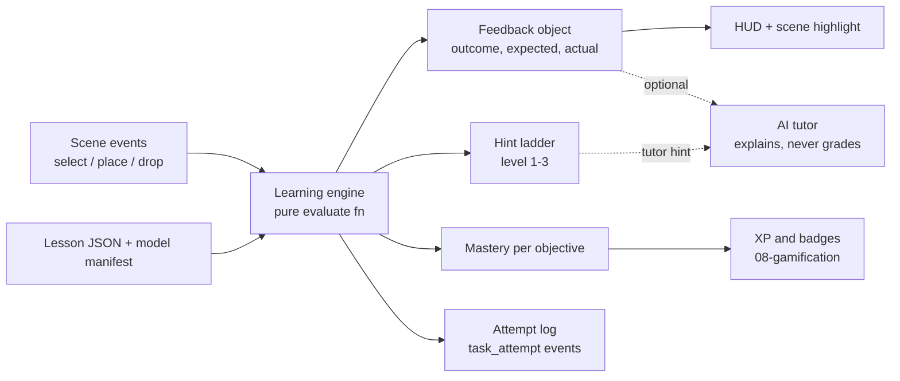
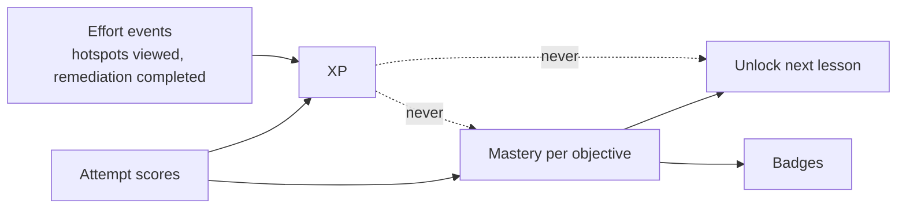
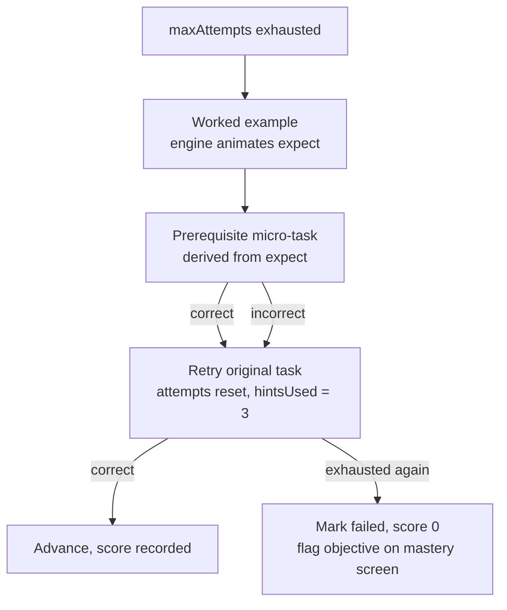

# Learning Engine

The learning engine turns a 3D action into evidence about a learning objective. It reads lesson JSON (the `lesson-schema` skill), receives interaction events from the scene ([3D interaction](05-3d-interaction.md)), compares each event with the active task's `expect` block, and emits a score, a feedback object, and the next hint level. Evaluation is deterministic and runs in the browser; the AI tutor ([07](07-ai-tutor.md)) phrases explanations from the engine's output and never grades. This file mostly concerns **MVP**; mastery persistence across lessons and remediation overrides are **V1**.

## Where the engine sits



The engine is a reducer: `(lessonState, sceneEvent) → (lessonState', effects)`. It has no network dependency. The tutor and the database are consumers of its output, not participants in it (locked position 5).

| Option for evaluation | Pros | Cons | Fit for solo dev | Verdict |
|---|---|---|---|---|
| Declarative `expect` blocks + one pure TypeScript `evaluate` function | Deterministic, testable with fixtures, same code runs client or server, content is JSON | Only five task shapes; anything novel needs a new type | High: ~300 lines, no dependency | **Recommended, MVP** |
| Generic rule engine (json-rules-engine or similar) | Arbitrary conditions in content | Content authors write logic; hard to validate; harder to explain to the tutor | Medium | Rejected |
| xAPI/SCORM runtime | Standards interoperability | Heavy, designed for LMS packaging, no 3D semantics | Low | **Future** export format only |
| LLM grades the action | Handles open-ended tasks | Non-deterministic, invalid for the research study, and a hosted model is excluded by the no-paid-tools rule | Low | Rejected (locked positions 5 and 7) |

Eight-point checklist for the recommended option: appropriate because scene events are already discrete and typed; limited to tasks expressible as select/place sequences; negligible performance cost (one object comparison per event); accessibility-neutral and input-agnostic, which the mouse condition requires; privacy-positive because evaluation needs no video or landmarks; scales to any lesson count since content is data; implementation is a single module with fixture tests; it is necessary because without it the product is a model viewer.

## The eleven elements and where each lives

| Element | Lives in | Schema type | Tier |
|---|---|---|---|
| Lesson | `content/<subject>/<topic>/<lessonId>.json` | `Lesson` | **MVP** |
| Learning objective | `lesson.objectives[]` | `Objective` with `bloom`, `masteryThreshold` | **MVP** |
| Activity | `lesson.activities[]`, ordered | `Activity` with `kind`, `scene`, `completion` | **MVP** |
| Task | `activity.tasks[]` | `Task` (five types, each with `expect`) | **MVP** |
| Hint | `task.hints[]`, ordered by `level` | `Hint` | **MVP** |
| Assessment | an `Activity` with `kind: "assessment"`; not a separate type | `Activity` | **MVP** |
| Difficulty level | `lesson.difficulty` label plus content levers (below) | `1 \| 2 \| 3`, `scene`, `maxAttempts`, `timeLimitSec`, `hints` | **MVP** label, **V1** multiple variants per lesson |
| Feedback | engine output, not content | `{ outcome, expected, actual, nextHintLevel }` | **MVP** |
| Progress | runtime state and `lesson_attempts` rows ([09](09-database.md)); mastery recomputed from attempts, no `progress` table in MVP | attempt records, activity cursor | **MVP** in-session, **V1** across devices with a `progress` cache table |
| Mastery | derived from attempts per `objectiveId` | number 0..1 per objective | **MVP** |
| Rewards | derived from mastery and effort events; not in lesson JSON | see [08](08-gamification.md) | **V1** |

Deliberate omission: there is no `rewards` field in lesson JSON. If authors could attach XP to tasks, XP would become a lever on content rather than a derivative of learning, which breaks the separation in the mastery section.

## Example lesson tree

The heart lesson `anatomy.heart.chambers_v1` (full JSON in `lesson-schema/references/heart-example.json`) instantiates the brief's Topic → Introduction → Explore → Guided Interaction → Challenge → Assessment → Mastery tree.

```text
anatomy.heart.chambers_v1  (model heart_v1, 12 min, difficulty 1)
 ├── act_intro      introduction  assembled pose, orbit only, 3 narration cards, completion time ≥ 20 s
 ├── act_explore    explore       hotspots hs_lv_wall, hs_septum; no tasks; completion time ≥ 60 s
 ├── act_guided     guided        sockets visible (ghost), grab on, 3 attempts, hints 1-3
 │     t_g1 identify left_ventricle        obj_identify_chambers
 │     t_g2 identify right_atrium          obj_identify_chambers   (level-2 hint is tutor: true)
 │     t_g3 place    aorta → socket_aorta  obj_place_vessels
 ├── act_challenge  challenge     exploded pose, sockets visible, 1 hint max
 │     t_c1..t_c4 place four chambers      obj_identify_chambers
 │     t_c5 sequence right_atrium → right_ventricle → left_atrium → left_ventricle, strictOrder   obj_blood_path
 ├── act_assess     assessment    assembled, sockets hidden, 1 attempt, hints []
 │     t_a1 identify right_ventricle, t_a2 identify left_atrium, t_a3 place pulmonary_artery, t_a4 compare wall_thickness
 └── act_mastery    mastery       per-objective mastery; unlock anatomy.heart.valves_v1 if all ≥ threshold
```

Each activity kind has one pedagogical job: introduction activates prior knowledge, explore builds a spatial model without grading, guided is worked practice with faded support, challenge is independent practice in a harder pose, assessment is the evidence that feeds mastery most heavily, and mastery closes the loop with feedback on objectives rather than tasks.

## Objectives and the objective-to-3D-action mapping

An objective is a statement plus a Bloom level and a threshold. Every task carries one `objectiveId`, so every scene event the engine grades is evidence for exactly one objective.

| Bloom level | Task type | Scene event evaluated | Heart example | Tier |
|---|---|---|---|---|
| remember | `identify` | `select` with `componentId` in `expect.componentId` | t_g1 point to `left_ventricle` | **MVP** |
| understand | `compare`; `identify` among look-alikes | `select` of `expect.answer`; `select` with distractors visible | t_a4 which ventricle has the thicker wall | **MVP** |
| apply | `place`, `remove` | `place` with matching `componentId` and `socketId`; `drop` away from `awayFromSocketId` | t_g3 attach `aorta` to `socket_aorta` | **MVP** |
| analyze | `sequence` | ordered `select` or `place` events matching `expect.steps` | t_c5 blood path through four chambers | **MVP** |
| evaluate, create | none | no deterministic scene event evidences these | tutor-led discussion only, ungraded | **Future** |

The brief implies the engine should assess understanding broadly. A gesture-controlled scene can only evidence what a hand can do to a labelled part: select it, move it, order it. That covers remember through analyze for structural knowledge and nothing above it. We state this plainly rather than pretend a `place` event measures evaluation.

## Task types and their `expect` blocks

The five types are the contract shared with `three-engineer` (which events the scene emits), `platform-architect` (what `lesson_attempts` stores), and `ai-tutor-architect` (what `expected` and `actual` mean in the scene-state payload). Changing them is a cross-team change.

| Type | `expect` | Event that counts as an attempt | Pedagogically appropriate when | Avoid when |
|---|---|---|---|---|
| `identify` | `{ componentId: string \| string[] }` | `select` | Learner must recognise a named part; first exposure; quick retrieval practice | Parts are visually indistinguishable in the current pose (it becomes guessing) |
| `place` | `{ componentId, socketId }` | `place` into any socket (release within a socket radius) | Spatial relationship is the knowledge: what attaches where | Depth is the only cue; sockets must be separable in the camera-facing plane (locked position 4) |
| `remove` | `{ componentId, awayFromSocketId }` | `drop` or `place` of that component, unless `drop.cause == "lost"` | Disassembly order or "what is underneath" matters | Model has no meaningful removal (most anatomy); strongest in mechanical subjects |
| `sequence` | `{ steps: { componentId, socketId? }[], strictOrder }` | each `select` (step without `socketId`) or `place` (step with `socketId`); a `drop` with `cause: "lost"` is never a step | Process or path knowledge: blood flow, assembly order | More than 6 steps; working-memory load swamps the objective |
| `compare` | `{ componentIds: [a, b], attribute, answer }` | `select` of one of the two | Discriminating look-alikes on one attribute | The attribute is not visible or inferable in the scene |

Events the engine ignores: a `select` during a `place` task (the learner selects to grab), a `grab_start` for any task, a `drop` outside every socket during a `place` task, and, in every task type, a `drop` whose `cause` is `"lost"`. The last rule is the tracking-loss discard for failure state 5 in [02](02-learning-experience.md): the scene ([05](05-3d-interaction.md)) emits `drop` with `cause: "lost"` when hand tracking is lost mid-grab, and the engine logs that event but never grades it and never consumes an attempt for it, including in `remove` tasks and socket-less `sequence` steps, where an ordinary `drop` would count.

Socket semantics follow [05](05-3d-interaction.md): the scene emits `place(componentId, socketId)` only for a release inside the radius of a socket whose `accepts` contains that component, and the part snaps tidily into that socket whatever the verdict. `accepts` is deliberately permissive and lists distractors: the heart manifest's chamber sockets accept all four chambers and the vessel sockets accept both great vessels. That permissiveness is what makes the `partial` outcome (right part, wrong socket) reachable; correctness comes only from the task's `expect`, decided by the engine. The scene never returns a wrongly placed part and never rejects a drop based on the verdict; the HUD flags the outcome and the learner re-grabs the part to try again.

## Hints

### The ladder

| Level | Name | Content | Reveals | Example (t_g1) |
|---|---|---|---|---|
| 1 | nudge | `text` restating a category or constraint | Nothing about location | "It is one of the two lower chambers." |
| 2 | narrow | `highlight` of a small candidate set, or `tutor: true` | The candidate set | pulse `left_ventricle` and `right_ventricle` |
| 3 | reveal | `highlight` of the answer and `cameraTo` | The answer | pulse `left_ventricle`, frame `hs_lv_wall` |

Hints are revealed after each incorrect attempt (`nextHintLevel`) or on request. A requested hint costs the same `hintPenalty` as an earned one, so there is no advantage to failing deliberately. `hintPenalty` should be small relative to `scoring.correct` (the heart example uses 2 of 10); a large penalty teaches hint avoidance, which the intelligent-tutoring literature associates with worse learning than hint use.

### Static versus tutor hint

| Condition | Use | Reason |
|---|---|---|
| Level 1 | static `text` | Written once, correct forever, needs no tutor call, works offline and in both research conditions identically |
| Level 3 | static `highlight` + `cameraTo` | A reveal needs no language; the scene shows it |
| Level 2 when the useful hint depends on what the learner actually did | `tutor: true` | Only the tutor can say "that was the left atrium; you want a lower chamber" from `actual` and `expected` |
| Level 2 when the candidate set is fixed | static `highlight` | Deterministic and needs no tutor call |
| Any level in `assessment` | none | `hints: []` is enforced by validation |

A `tutor: true` hint is a request, not a grade: the engine sends `task.prompt`, `expect`, `actual`, and the component `description` fields to `TemplateTutorService` behind the `/api/tutor` seam (in-process in MVP, see [07 request flow](07-ai-tutor.md#request-flow)), which phrases the hint from the deterministic [template set](07-ai-tutor.md#the-template-tutor) using the manifest's `description` and `relations`. If the service is unavailable or its response fails validation, the engine shows the hint's own static `text` and `highlight` instead. The `lesson-schema` validation checklist requires every `tutor: true` hint to carry `text` or `highlight` for exactly this reason, so the fallback is always authored content and never an engine-invented string.

## Faded guidance from guided to assessment

Support is withdrawn in steps across activity kinds so that assessment measures what the learner can do unaided.

| Support | explore | guided | challenge | assessment | Schema field |
|---|---|---|---|---|---|
| Pose | assembled | assembled | exploded | assembled, parts to place start detached | `scene.pose` |
| Sockets visible | n/a | yes, `ghost` | yes, `ring` recommended | no | `scene.socketsVisible`, `socket.visual` |
| Hints | n/a | levels 1–3 | level 1 only | none | `task.hints` |
| Attempts per task | n/a | 3 | 3 | 1 | `task.maxAttempts` |
| Tutor hints | yes, on request | yes | level 1 only | unavailable until the mastery activity | `hint.tutor`, activity kind |
| Remediation on exhaustion | n/a | yes | yes | no | engine policy (below) |
| Distractors visible | all | all | all | all, or a `visibleComponents` subset for easier variants | `scene.visibleComponents` |
| Mastery weight | 0 | 1 | 1 | 2 | engine constant |

Note that `socket.visual` is set per socket in the model manifest, not per activity. Challenge activities that want rings instead of ghosts therefore need either a second socket set or an activity-level override. See the schema requests section.

## Difficulty levers that are content-only

Difficulty is never adjusted by code or by the tutor at run time in the MVP. The tutor may *suggest* an easier lesson variant ([07](07-ai-tutor.md)); the engine loads whatever lesson JSON the learner or the progress rule selects. This keeps the research conditions identical and the engine deterministic.

| Lever | Field | Easier | Harder | Tier |
|---|---|---|---|---|
| Distractors | `scene.visibleComponents` | 3 components visible | all 10 visible | **MVP** |
| Socket visibility | `scene.socketsVisible`, `socket.visual` | `ghost` | `ring` then `none` | **MVP** |
| Pose | `scene.pose` | `assembled` | `exploded`; custom pose with rotated parts | **MVP** |
| Attempts | `maxAttempts` | 3 | 1 | **MVP** |
| Hint depth | `hints` length | 3 levels | 1 or 0 | **MVP** |
| Hint cost | `scoring.hintPenalty` | 0 | 2–3 | **MVP** |
| Ordering strictness | `sequence.strictOrder` | false | true | **MVP** |
| Compare subtlety | `compare.attribute`, chosen pair | wall thickness | oxygenation state of adjacent vessels | **MVP** |
| Distractor sockets | `socket.accepts` with several ids | one accepting socket | look-alike sockets that accept the wrong part and produce `partial` | **MVP** (the heart manifest already ships permissive `accepts`) |
| Time limit | `timeLimitSec`, challenge activities only | none | 30 s | **V1** |

Time limit rule, agreed across [02](02-learning-experience.md), this file, [12](12-mvp-definition.md), and [14](14-evaluation-methodology.md): there is no hard cap that ends a lesson. At 15 minutes of lesson time a soft prompt offers the learner the choice to proceed to the assessment; the assessment activity always runs in full regardless of elapsed time; the prompt and the learner's choice are logged as `time_prompt`; the rule is pre-registered. Task-level `timeLimitSec` remains a content lever used only in challenge activities and never in assessment. An unqualified task time limit in assessment would penalise the slower gesture condition and confound the study (locked position 8); the soft prompt, applied identically in both conditions and logged, does not.

## Feedback

Feedback is formative, immediate, and split into a deterministic part and an optional explanatory part.

| Outcome | Scene response (within 200 ms) | HUD text | Tutor involvement | Mastery effect |
|---|---|---|---|---|
| `correct` | snap to socket or confirm highlight | prompt turns green; one-line fact from component `description` | none by default | latest score recorded |
| `partial` | stays snapped in the wrong socket, flagged by HUD; learner re-grabs to retry | "Right part, wrong place" | optional explanation of why the socket is wrong | `scoring.partial` |
| `incorrect` | `place`: stays snapped, flagged by HUD; learner re-grabs to retry. `identify`/`compare`: selected component flashes | "That was the {actual.name}" | level-2 hint if `tutor: true`, else static | 0 until a later attempt |
| exhausted | worked example plays (below) | "Watch, then try again" | optional short explanation | retry score counts, with `hintsUsed = 3` |

The deterministic part never waits on the tutor. In MVP the explanatory part is composed by `TemplateTutorService` from the same feedback object in the same frame; if the service throws or its output fails validation, the HUD keeps the static text and hint ([07 failure handling](07-ai-tutor.md#latency-and-failure-handling)). In **V1** a local-model phrasing may replace the template text on arrival; it never blocks the lesson.

## Progress, mastery, and the separation from XP

**Progress** is the activity cursor plus every attempt record for this lesson. It is resumable: reloading the page restores the current activity and task from the attempt log.

**Mastery** per objective follows the `lesson-schema` rule, with the normalisation made explicit:

```text
mastery(objective):
  tasks = all tasks with task.objectiveId == objective.id in guided, challenge, assessment activities
  for each task: latest = normalise(latestAttempt(task).score, task.scoring.correct)   // clamp(score / correct, 0, 1)
                 weight = activity.kind == "assessment" ? 2 : 1
  if no task has an attempt: return null   // not started
  return sum(latest * weight) / sum(weight)

mastered(objective) = mastery(objective) >= objective.masteryThreshold
unlock(lesson)      = every objective of every lesson in lesson.prerequisites is mastered
```

Tasks without an attempt are excluded rather than scored 0, so abandoning a lesson mid-way shows "not started" for untouched objectives instead of a false low mastery. Hint penalties reduce guided and challenge scores slightly, but the 2× assessment weight ensures the unaided attempt dominates.



The one-way rule: XP and badges are derived from attempt scores, mastery, and effort events. Nothing in the unlock condition reads XP, and nothing in the mastery function reads a reward. **MVP** ships mastery and unlock; XP and badges are **V1** (see [08](08-gamification.md)).

## Learning evaluation pseudocode

```text
countsAsAttempt(task, event):
  if event.type == "drop" and event.cause == "lost": return false   // tracking loss: logged by the scene, never graded, never consumes an attempt, in every task type
  switch task.type:
    identify, compare: return event.type == "select"
    place:             return event.type == "place"                 // drop outside every socket is not an attempt
    remove:            return event.type in ["drop", "place"] and event.componentId == expect.componentId
    sequence:          return event.type == "select" or event.type == "place"

onSceneEvent(event):                                   // student action
  task = state.activeTask()
  if task == null or not countsAsAttempt(task, event): return   // e.g. select during a place task, drop on empty space, drop with cause "lost"

  result = evaluate(task, event, state.attempt[task.id])          // expected action vs actual, compare, score (from lesson-schema §5)
  log("task_attempt", { taskId, correct, partial, score, attemptNo, hintsUsed })
  persistAttempt(result)                                           // local first, batched to the server route

  if result.correct:
    showFeedback(result.feedback)                                  // green prompt; part already snapped by the scene
    state.mastery[task.objectiveId] = mastery(objective)           // recompute from attempts
    advance(task)
  else if attempts(task) < (task.maxAttempts ?? defaultFor(activity.kind)):
    showFeedback(result.feedback)                                  // HUD flag; part stays where the scene snapped it
    hint = task.hints.find(level == result.feedback.nextHintLevel)
    if hint?.tutor: requestTutorHint(task.prompt, task.expect, result.feedback.actual)   // TemplateTutorService via /api/tutor seam; on failure showHint(hint) with its own static text/highlight
    else if hint: showHint(hint)                                   // text, highlight, cameraTo
  else if activity.kind in ["guided", "challenge"] and not state.remediated[task.id]:
    remediate(task)                                                // repeated-failure policy
  else:
    recordFailed(task); advance(task)

  if activity.completion satisfied: advance(activity)
  if activity.kind == "mastery": render mastery per objective; emit unlock decisions
```

`evaluate` itself is exactly the function in the `lesson-schema` skill. `countsAsAttempt` encodes the "event that counts as an attempt" column of the task-types table plus the tracking-loss discard: a `drop` with `cause: "lost"` is dropped before any task-type logic runs. Both functions are pure, synchronous, and covered by fixture tests that replay recorded `LogEvent` streams and assert the resulting mastery.

## Runtime position and persistence

| Concern | MVP | V1 | Reason |
|---|---|---|---|
| Where `evaluate` runs | Browser, in the React state layer, same tick as the scene event | Browser, plus optional server replay of the event stream using the same function for tamper checks | Feedback must be sub-200 ms; a pure TS function runs anywhere |
| Lesson JSON source | Static file bundled with the app | Fetched from the content API, cached | One lesson exists |
| Attempt persistence | In-memory, mirrored to `localStorage` keyed by `sessionId`; batched to a Next.js route every 10 s and on `task_end` as `LogEvent[]` (`research-protocol` schema) | Same, with rows in `lesson_attempts` tied to an authenticated user | Prototype has no database (locked position 10); the research pilot needs an export |
| Mastery persistence | Recomputed from `lesson_attempts` (or the local attempt log) on load; no `progress` table | Cached per user and objective in a `progress` table, still derived from `lesson_attempts` | Recomputation is cheap and avoids a second source of truth |
| What is never persisted | video, landmarks | same | locked position 2 |

Attempt record fields the engine guarantees, for [09](09-database.md): `sessionId`, `lessonId`, `activityId`, `taskId`, `objectiveId`, `attemptNo`, `outcome`, `score`, `hintsUsed`, `remediated`, `durationMs`, `actual` (event summary), `t`. The server stores; it does not grade.

## Repeated-failure policy

Failure state 7 in [02](02-learning-experience.md) is a learner who has used all attempts. Repeating the same prompt a fourth time teaches nothing. The engine follows a fixed sequence, once per task, in guided and challenge activities only.



| Step | What the learner sees | Derived from | Tier |
|---|---|---|---|
| Worked example | `place`: the part tweens from its current position into the socket, then returns. `identify` or `compare`: answer pulses with camera framing. `sequence`: steps highlight in order with 600 ms gaps. | `expect` plus manifest socket transforms; no animation clip required | **MVP** |
| Prerequisite micro-task | `place` or `remove` → an `identify` of the same `componentId` ("First, point to the aorta."). `sequence` → `identify` of the first wrong step. `compare` → `identify` of each candidate. `identify` → same task with level-3 highlight active. | Synthesised by the engine from `expect`; not stored as content; scored 0 points, logged as `task_attempt` with `remediated: true` | **MVP** |
| Retry | Original prompt, attempts reset, score counts with `hintsUsed = 3` | engine | **MVP** |
| Second exhaustion | Task recorded as failed; mastery screen names the objective and offers the explore activity again | engine | **MVP** |
| Authored override | A content-specified micro-task or manifest animation instead of the synthesised one | proposed `task.remediation` field | **V1**, pending schema change |

The micro-task is deliberately a step down the Bloom ladder: if a learner cannot place the aorta, the most likely gap is not knowing which part is the aorta, which `identify` tests directly. Wrong-object errors (failure state 4) in `place` tasks produce `incorrect` with a named `actual`, which is exactly what the level-2 tutor hint needs; confusion (failure state 6) is handled by the learner requesting a hint or asking the tutor, both of which the engine logs as `hint_shown` and `tutor_message` for the process-data analysis.

## Generalisation to other subjects

The schema has no anatomy-specific fields. The `lesson-schema` skill lists chemistry, mechanical, electronics, and geography mappings; all use the same five types because they share a knowledge shape: named parts, spatial relations, and order.

The brief's assumption that twelve subjects fit one task grammar is weak in one direction. The five types evidence *structural and procedural* knowledge (what, where, in what order). They cannot evidence *parametric* knowledge, where learning means predicting what happens when a continuous variable changes (a physics pendulum, a circuit with variable resistance, a titration). That needs at least a sixth type such as `adjust` with an `expect` on a parameter range, plus scene support for sliders or rotation gestures, which are **Future**. We deliver the five types knowing they cover assembly-type subjects well and simulation-type subjects not at all.

## Schema clarifications and requests

These are stated here rather than applied silently; the `lesson-schema` skill remains the source of truth until updated.

| Item | Kind | Detail |
|---|---|---|
| Mastery normalisation | clarification | score is divided by `scoring.correct` and clamped to 0..1 before weighting |
| `sequence` step matching | clarification | a step without `socketId` matches a `select`; with `socketId` matches a `place` |
| Drop outside sockets | clarification | not an attempt for `place`; is an attempt for `remove` |
| Tracking-loss drop | clarification | a `drop` with `cause: "lost"` (field added by [05](05-3d-interaction.md)) is discarded by `countsAsAttempt` in every task type, including `remove` and socket-less `sequence`; logged, never graded, never consumes an attempt |
| `tutor: true` fallback | validation rule, adopted | the `lesson-schema` checklist requires `text` or `highlight` alongside `tutor: true`; the engine shows these when `TemplateTutorService` is unavailable |
| Activity-level socket visual | schema request | `scene.socketVisual?: "ghost" \| "ring" \| "none"` overriding `socket.visual`, so challenge can use rings without a second socket set |
| Authored remediation | schema request, **V1** | `task.remediation?: { microTaskId?: string; animationId?: string }` |

## Open questions

- Should hint penalties apply in challenge activities at all, or only in guided? The heart example applies none in challenge; the engine supports either.
- Is a single remediation cycle per task enough for the pilot, or should the second exhaustion also re-run explore before marking failed?

## Related

- [02 Learning experience](02-learning-experience.md): journey stages and the seven failure states this engine responds to
- [05 3D interaction](05-3d-interaction.md): the `select`, `place`, `drop` events the engine consumes
- [07 AI tutor](07-ai-tutor.md): how `tutor: true` hints and feedback explanations are phrased
- [08 Gamification](08-gamification.md): rewards derived from the mastery and effort events defined here
- [09 Database](09-database.md): `lesson_attempts` (MVP) and the `progress` cache table (V1) that store engine output
- [10 3D content system](10-3d-content-system.md): model manifest fields the engine reads
- [14 Evaluation methodology](14-evaluation-methodology.md): per-objective mastery and attempt logs as study metrics
