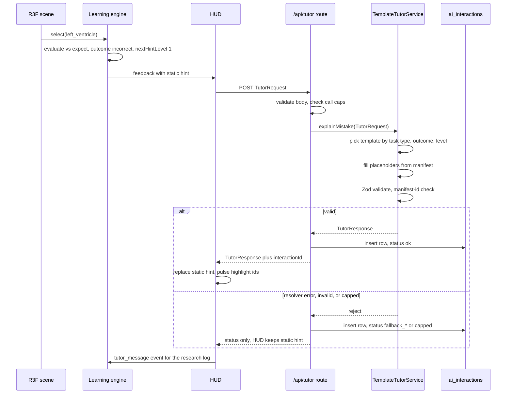

# AI Tutor

The tutor turns structured scene state and a deterministic evaluation result into one or two short sentences: what the learner did, and what to notice next. In **MVP** it is a deterministic template engine in `packages/tutor`: hints come from the lesson's hint ladder, and mistake explanations are assembled from manifest data (component `description`, `relations`, `tags`). It never decides correctness, never sees video or landmarks, and never names anything outside the model manifest. A locally run open-weights model is a **V1** candidate behind the same `TutorService` seam, gated by measurement; a hosted metered API is excluded by project rule.

## Design principle

Locked positions 5 and 7 fix the tutor's shape:

| Rule | Consequence |
|---|---|
| The tutor never grades | The learning engine evaluates every action against the task `expect` block ([06-learning-engine.md](06-learning-engine.md)); the tutor receives the outcome and may only explain it |
| The tutor never sees pixels | Inputs are the `SceneState` snapshot (`r3f-interaction` section 11), the task with its `expect`, the evaluation result, and the hint level |
| The tutor only knows the manifest | Every noun in a tutor sentence is a component `name`, `description`, humanised `tag`, or the task `prompt`. In MVP this holds by construction: templates have no other source of words |
| The tutor is optional | Every lesson is completable with static hints; an unresolvable template degrades to the static hint for the same level |
| Nothing is paid | No usage-billed service at any tier; V1 adds only a model running on hardware the project already owns |

Treating all eight brief capabilities as language-model features would be a mistake even with a free model: adaptive difficulty and learning paths are deterministic functions of mastery and belong to the engine; quiz generation breaks the declarative-evaluation guarantee.

## The eight capabilities

| # | Capability | Tier | What it means here | Reason for the tier |
|---|---|---|---|---|
| 1 | Explaining concepts | **MVP** static, **V1** rephrased | Show the component `description` or hotspot `body` verbatim; a V1 local model may rephrase | Verbatim manifest text already teaches the fact |
| 2 | Answering questions | **V1** | Free-text question about the visible model, answered by a local model from manifest context only | Needs a chat UI, a local model, and injection hardening |
| 3 | Providing hints | **MVP** | Return the authored hint for `nextHintLevel`; resolve `tutor: true` hints to a template quoting the prompt | Core loop; the ladder is already authored per task |
| 4 | Generating quiz items | **Future** | Produce new `identify`, `compare`, or `sequence` tasks | Each item needs a valid `expect` block, a verified fact, and a human check; validation costs more than authoring saves, and hallucinated anatomy in an assessment is a learning harm |
| 5 | Adapting difficulty | **V1** | Explain why the engine moved the learner up or down | The decision is a deterministic mastery rule; the tutor narrates, never chooses |
| 6 | Explaining mistakes | **MVP** | After an incorrect or partial attempt: what was done, how it differs from what was asked, what to notice next | Core loop; the template set below |
| 7 | Personalised learning paths | **Future** | Recommend the next lesson from mastery history | Needs a catalogue; the recommendation should be a deterministic prerequisite graph |
| 8 | Summarising progress | **V1** | Short narrative on the mastery screen from per-objective scores | The mastery screen works with numbers alone |

## Tutor engine

The decision is which engine fills the `TutorService` seam. The interface below is declared identically in `packages/tutor/src/tutor-service.ts` and copied by [03-system-architecture.md](03-system-architecture.md); engines swap without touching the HUD or the learning engine.

```ts
export interface TutorService {
  /** Return the authored hint at req.hintLevel (level 3 may reveal). MVP. */
  hint(req: TutorRequest): Promise<TutorResponse>;
  /** Explain an incorrect or partial attempt without contradicting the engine. MVP. */
  explainMistake(req: TutorRequest): Promise<TutorResponse>;
  /** Narrate per-objective mastery for the mastery screen. Optional; V1. */
  summarise?(req: TutorRequest): Promise<TutorResponse>;
}
```

`question` (capability 2, **V1**) gets a method only when its chat UI is designed; it is not in the seam yet.

In every tier the engine runs inside the `/api/tutor` route handler on our own server, same origin as the page; there is no third-party egress. `TUTOR_ENGINE` selects the engine: `template` by default, `local` when `TUTOR_LOCAL_URL` is set. `TUTOR_ENGINE=local` applies only to an app instance running on the lab laptop that also runs the model; the hosted Vercel deployment always uses `template`.

| Option | Pros | Cons | Fit for solo dev | Verdict |
|---|---|---|---|---|
| Template tutor: typed template map filled from manifest data | Zero cost; sub-millisecond engine time; reproducible; unit-testable; no model process to run | No open questions; wording bounded by the author; each new task type needs a template row | Best: about 200 lines plus tests | **MVP** recommended |
| Local open-weights model via Ollama on the lab laptop, behind `/api/tutor` | Free; data stays on the laptop; can rephrase and answer questions; no browser GPU cost | Lab-laptop instance only (above); laptop latency unknown; needs the full guardrail set | Moderate: one HTTP client plus prompt assembly | **V1** candidate, gated below |
| In-browser WebLLM (WebGPU) | Free; any deployment; nothing leaves the browser | Shares the integrated GPU with MediaPipe's GPU delegate and R3F, competing directly with the 30 fps budget; multi-gigabyte download; WebGPU required | Moderate to hard: memory pressure and scheduling | **V1** candidate, gated below; expected to fail the fps gate |
| Hosted metered API | Best prose | Paid per token; excluded by project rule | Not applicable | Rejected |

Eight-point checklist for the template tutor:

| Point | Template tutor |
|---|---|
| Appropriate | Every MVP tutor message is a function of (task type, outcome, hint level, selected component, expected component): a lookup, not a language problem |
| Limitations | Fixed phrasing; a relation or tag missing from the manifest yields a blander sentence; subject words such as "blood" must stay in manifest text, not templates |
| Browser performance | One same-origin `fetch` per call; engine time is string substitution, well under a millisecond; nothing on the render thread |
| Accessibility | Plain text, second person, no markdown; highlights accompany text, never replace it |
| Privacy | The request goes only to our own `/api/tutor` route handler; no third-party egress; the consent-gated research log and `ai_interactions` row are the only persistence |
| Scalability | Microseconds of route CPU plus one row insert per call; the call caps bound it |
| Complexity | One typed const map, one resolver, one Zod check; testable without mocks |
| Necessary | Yes for capabilities 3 and 6. The simpler alternative, static hints only, cannot say what the learner selected or where they dropped it |

Measurement gate for either V1 candidate, run on the lab laptop with MediaPipe and R3F live:

| Gate | Threshold | Why |
|---|---|---|
| Hint latency | p95 under `HINT_LATENCY_BUDGET_MS` (3,500 ms) over 50 `explain_mistake` calls | Later than this, the static hint has already done the job |
| Frame budget | p5 combined frame rate at or above 30 fps during inference | Locked position 6 |
| Guardrail pass rate | 100 percent of 50 sampled replies pass schema, manifest-id, and reveal checks | A model that leaks the answer at level 1 is worse than no model |
| Reproducibility | Temperature 0 and a fixed seed give identical text for identical requests | Preserves the research advantage below |

No orchestration library at any tier: templates need none, and a local model needs one `fetch` plus the existing Zod check.

## Request and response payloads

`TutorRequest` is unchanged. The HUD builds it from the engine's feedback and the scene snapshot and POSTs it to `/api/tutor`; the route loads manifest and lesson by `lessonId` from `@grasp/content`, so the request never supplies vocabulary.

```ts
type TutorRequest = {
  sessionId: string;                       // random UUID; never an account id
  lessonId: string; activityId: string;
  kind: "hint" | "explain_mistake"         // MVP
      | "question" | "summary";            // V1
  hintLevel: 1 | 2 | 3;                    // from feedback.nextHintLevel; 3 may reveal
  task: { id: string; type: TaskType; prompt: string; objectiveStatement: string; expect: TaskExpect };
  evaluation: { outcome: "correct" | "partial" | "incorrect"; expected: TaskExpect;
                actual: { type: string; componentId?: string; socketId?: string };
                attemptNo: number; hintsUsed: number } | null;
  scene: SceneState;                       // r3f-interaction section 11
  question?: string;                       // V1 only; max 280 chars; untrusted
  locale: "en";
};
```

A concrete instance for worked example 1 (learner selected `left_ventricle`, task expects `right_ventricle`; the task is a guided variant of `t_a1`, shown as `t_g1b`). The `scene` block follows `SceneState` from `r3f-interaction` section 11: ids and numbers only, roughly 1 KB, no pixels. Positions are the assembled pose in manifest units.

```json
{
  "sessionId": "5f1c7a2e-9b0d-4c7e-8a4b-2d6e1f3a9c01",
  "lessonId": "anatomy.heart.chambers_v1",
  "activityId": "act_guided",
  "kind": "explain_mistake",
  "hintLevel": 1,
  "task": {
    "id": "t_g1b",
    "type": "identify",
    "prompt": "Point to the right ventricle.",
    "objectiveStatement": "Identify the four chambers of the heart",
    "expect": { "componentId": "right_ventricle" }
  },
  "evaluation": {
    "outcome": "incorrect",
    "expected": { "componentId": "right_ventricle" },
    "actual": { "type": "select", "componentId": "left_ventricle" },
    "attemptNo": 1,
    "hintsUsed": 0
  },
  "scene": {
    "modelId": "heart_v1",
    "camera": { "azimuth": 20, "elevation": 15, "distance": 40 },
    "components": {
      "left_ventricle":     { "socketId": "socket_left_ventricle",   "position": [2.5, -3.0, 0.5],  "visible": true },
      "right_ventricle":    { "socketId": "socket_right_ventricle",  "position": [-2.0, -3.2, 1.0], "visible": true },
      "left_atrium":        { "socketId": "socket_left_atrium",      "position": [2.0, 2.5, -1.0],  "visible": true },
      "right_atrium":       { "socketId": "socket_right_atrium",     "position": [-2.5, 2.2, 0.0],  "visible": true },
      "aorta":              { "socketId": "socket_aorta",            "position": [0.5, 6.0, 0.0],   "visible": true },
      "pulmonary_artery":   { "socketId": "socket_pulmonary_artery", "position": [-1.0, 5.0, 1.5],  "visible": true },
      "pulmonary_veins":    { "socketId": null, "position": [3.0, 3.5, -2.0],  "visible": true },
      "superior_vena_cava": { "socketId": null, "position": [-2.5, 6.5, 0.0],  "visible": true },
      "inferior_vena_cava": { "socketId": null, "position": [-2.5, -1.0, 0.0], "visible": true },
      "septum":             { "socketId": null, "position": [0.0, -1.0, 0.5],  "visible": true }
    },
    "hovered": "left_ventricle",
    "grabbed": null,
    "lastEvent": { "type": "select", "componentId": "left_ventricle", "t": 184230 }
  },
  "locale": "en"
}
```

```ts
type TutorResponse = {
  kind: "hint" | "explain_mistake" | "answer" | "summary" | "refusal";
  text: string;                            // <= 320 characters, plain sentences
  referencedComponentIds: string[];        // every component the text names; subset of manifest ids
  highlight: string[];                     // ids the HUD may pulse; empty at level 1
  revealsAnswer: boolean;                  // false when hintLevel < 3
};
```

Every engine's output passes the Zod schema in `packages/tutor/src/response-schema.ts` inside the route before the HUD sees `{ source: "tutor" | "static", text, highlight, interactionId? }`.

## The template tutor

### Hint pass-through

`hint(req)` returns the authored `Hint` at `req.hintLevel`: `text` to `text`, `highlight` to `highlight`, `revealsAnswer` true only at level 3. A `tutor: true` hint with no `text` resolves to `HINT_FALLBACK` ("Look again at the task: {prompt}") plus its static `highlight`. Recommendation to `learning-designer`, unchanged: require `text` on every `tutor: true` hint so the flag is a no-op in MVP.

### Mistake explanations

`explainMistake(req)` composes up to three parts. Level 1 is the body; level 2 appends a narrowing clause; level 3 appends the reveal sentence and fills `highlight`.

| Task type | Outcome | Level-1 body | Level-2 narrowing source |
|---|---|---|---|
| `identify` | `incorrect` | "You selected the {selectedName}: {selectedDescription} That is not the part the task asks for." | Relation from selected to expected (`opposite_of`, `connects_to` either way, `contains`), else a tag contrast, else the prompt |
| `place` | `incorrect` (wrong part) | "You moved the {selectedName}, which is not the part the task asks for. {selectedDescription}" | Same relation lookup |
| `place` | `partial` (right part, wrong socket) | "The {selectedName} is the right part, but that socket is in the {socketRegion} and is not where it belongs." | "Look where the {selectedName} connects: {selectedDescription}" |
| `remove` | `incorrect` | "You moved the {selectedName}, but the task asks you to detach a different part. {selectedDescription}" | Same relation lookup |
| `sequence` | `incorrect` or `partial` | "The order broke at step {stepNo}: the {selectedName} does not follow the {priorStepName}." (step 1 has its own variant) | `connects_to` from the prior step's component |
| `compare` | `incorrect` | "You chose the {selectedName}. {selectedDescription} The question is about {attribute}, so compare the two parts on that alone." | The prompt |

The map is total over task type × outcome so the resolver never misses a key; cells the engine cannot produce (`identify.partial`, `remove.partial`, `compare.partial`) hold a generic body quoting the prompt.

Narrowing clauses by relation found:

| Key | Clause |
|---|---|
| `opposite_of` | "The part you need is the counterpart of the {selectedName} on the other side." |
| `connects_to` | "The {selectedName} connects directly to the part you need; follow the flow one step on." |
| `connects_from` | "The part you need connects directly into the {selectedName}; follow the flow one step back." |
| `contains` | "The part you need is inside the {selectedName}." |
| `tag_contrast` | "The part you chose is {selectedTag}; the part you need is {expectedTag}." |
| `none` | "Reread the task: {prompt}" |

Reveal sentences (level 3 only): "The part you need is the {expectedName}; it is highlighted now." for `identify`, `remove`, `compare`; "The {expectedName} belongs in the {restRegion}; its socket is highlighted now." for `place`; "Step {stepNo} is the {expectedName}; it is highlighted now." for `sequence`.

| Placeholder | Source |
|---|---|
| `{selectedName}`, `{selectedDescription}` | Manifest component for `evaluation.actual.componentId` |
| `{expectedName}` | Manifest component for the expected id (level 3 only) |
| `{selectedTag}`, `{expectedTag}` | First tag present on one component and absent on the other, underscores to spaces |
| `{socketRegion}`, `{restRegion}` | Derived from socket `transform.position`: `y` sign gives "upper" or "lower", `x` sign gives "patient's left" or "patient's right". Axis convention: manifests are authored in anterior view with the manifest `defaultCamera` facing the sternum, so positive `x` is the patient's left (the viewer's right) and positive `y` is superior; a manifest authored otherwise must say so, and a flat subject may need an authored region label (open question 2) |
| `{stepNo}`, `{priorStepName}` | First mismatched index in `expect.steps` and the component before it |
| `{attribute}` | `expect.attribute`, underscores to spaces |
| `{prompt}` | `task.prompt` |

```text
explainMistake(req):
  manifest = load(req.lessonId)
  sel = manifest.component(req.evaluation.actual.componentId)
  exp = expectedComponent(req.task)             // expect ids; for sequence, the first mismatched step
  body = MISTAKE_TEMPLATES[req.task.type][req.evaluation.outcome]
  text = fill(body)
  if level == 2: text += " " + fill(NARROW_CLAUSES[relationKind(sel, exp)])
  if level == 3: text += " " + fill(REVEAL_TEMPLATES[req.task.type]); highlight = [exp.id or socket]
  return parseTutorResponse({ kind, text, referencedComponentIds, highlight, revealsAnswer: level == 3 })
```

### Request flow

The HUD POSTs the `TutorRequest` to `/api/tutor` on the same origin. The route handler validates the body, enforces the call caps, calls the selected engine (`TemplateTutorService` in MVP), writes the `ai_interactions` row, and returns the validated response with its `interactionId`; the client emits `tutor_message` to the event log on receipt. The static hint is already on screen before the request leaves, so the round trip is never on the critical path.



## Worked examples

Ids and descriptions are from the heart manifest in the `lesson-schema` skill. Each output is `TutorResponse.text`.

| # | Situation | Level | Output |
|---|---|---|---|
| 1 | `identify`, task asks for `right_ventricle`, learner selects `left_ventricle` (the brief's scenario) | 1 | "You selected the Left Ventricle: Thick-walled chamber that pumps oxygenated blood into the aorta. That is not the part the task asks for." |
| 2 | Same request | 2 | Level-1 text plus "The part you need is the counterpart of the Left Ventricle on the other side." (from `left_ventricle.relations.opposite_of`) |
| 3 | Same request | 3 | Level-1 text plus "The part you need is the Right Ventricle; it is highlighted now." with `highlight: ["right_ventricle"]`, `revealsAnswer: true` |
| 4 | `place` partial, `t_c3` expects `left_atrium` in `socket_left_atrium`; learner drops it in `socket_right_atrium` (x −2.5, y 2.2) | 1 | "The Left Atrium is the right part, but that socket is in the upper patient's-right region and is not where it belongs." |
| 5 | `place` incorrect, `t_g3` expects `aorta`; learner drops `pulmonary_artery` into `socket_aorta` | 2 | "You moved the Pulmonary Artery, which is not the part the task asks for. Carries deoxygenated blood from the right ventricle to the lungs. The part you chose is deoxygenated; the part you need is oxygenated." (no relation between the vessels, so the tag contrast fires) |
| 6 | `sequence` `t_c5`; learner selects `right_atrium` then `left_atrium` | 2 | "The order broke at step 2: the Left Atrium does not follow the Right Atrium. The Right Atrium connects directly to the part you need; follow the flow one step on." |
| 7 | `compare` (guided variant of `t_a4`), learner selects `right_ventricle` | 1 | "You chose the Right Ventricle. Pumps deoxygenated blood into the pulmonary artery. The question is about wall thickness, so compare the two parts on that alone." |

Example 1 against the static level-1 text ("It is one of the two lower chambers.") shows the gain: the tutor names what the learner did and quotes the fact about it while withholding the answer. Example 5 shows the limit: descriptions are quoted verbatim, so a description naming the expected part would leak. The resolver drops `{selectedDescription}` below level 3 when it contains the expected component's name, and the content validator should warn when a description names another component.

## Research angle

Every participant who makes the same mistake at the same hint level sees byte-identical tutor text. That removes tutor wording as a confound between the gesture and mouse arms (locked position 8) and makes every logged `tutor_message` reproducible from its `TutorRequest`. A language model, even local at temperature 0, cannot promise this across model updates. This is an advantage of the template engine, not a compromise; any V1 model must pass the reproducibility gate before study use.

## Guardrails

Most guardrails are now true by construction rather than checked on model output.

| Guardrail | Enforcement | Tier |
|---|---|---|
| Manifest-only vocabulary | Templates contain no nouns; `templates.test.ts` rejects any placeholder outside the allowed set | **MVP** |
| No reveal below level 3 | `{expectedName}` and `{restRegion}` are permitted only in `REVEAL_TEMPLATES`; the test asserts it. The resolver drops a `{selectedDescription}` that names the expected component below level 3 | **MVP** |
| Output schema | Zod `tutorResponseSchema` on every response; failure is a static-hint fallback | **MVP** |
| Length | 320-character cap; overflow is truncated at a sentence boundary | **MVP** |
| Never grade | Templates never contain "correct" or "incorrect" (tested); outcome words belong to the engine | **MVP** |
| No highlight at level 1 | Resolver sets `highlight` only at level 3 | **MVP** |
| Mouse and gesture parity | No `condition` field exists in `TutorRequest`, so both study arms get identical text | **MVP** |
| Local model output | Same Zod schema plus a text scan for the expected `name` below level 3 and for any manifest `name` missing from `referencedComponentIds`; `question` wrapped as quoted data with a length cap | **V1** |

Limitation: templates cannot address a misconception the manifest does not encode. The laterality confusion in example 1 is handled only because `opposite_of` exists; adding a `relations` entry is how the tutor learns a new contrast.

## Latency and failure handling

| Stage | MVP template | V1 local model |
|---|---|---|
| HUD shows static hint on incorrect outcome | 0 ms | 0 ms |
| Tutor text ready | One same-origin round trip, tens of ms on the lab network; replaces the static hint on arrival | Replaces the static hint on arrival; never a blocking spinner |
| Timeout | `HINT_LATENCY_BUDGET_MS` 3,500 ms, no retry; reaching it means a network fault, not engine load | `HINT_LATENCY_BUDGET_MS` 3,500 ms, no retry |
| Failure | Route unreachable or timed out: static hint, status `fallback_error` or `fallback_timeout`; resolver throws or Zod fails: static hint, status `fallback_invalid` | Timeout, connection, or validation failure: static hint, status `fallback_timeout`, `fallback_error`, or `fallback_invalid` |
| Call caps | 1 per attempt, 3 per task, 12 per lesson session, enforced by the route (status `capped`); bounds log volume | Same caps; bound laptop load |

The tutor is called only when the outcome is `incorrect` or `partial` in a guided or challenge activity, or when a hint is requested. Correct attempts and assessment activities never call it.

## Privacy

- MVP: the request travels only to our own `/api/tutor` route handler on the same origin, which resolves templates against the bundled manifest and lesson; no third-party egress.
- V1 local model: the same route, on an app instance on the lab laptop, forwards to a local model process on that laptop; WebLLM would keep it in the browser. No external host at any tier.
- No personal data enters a request: no names, emails, account ids, demographics, or free text in MVP. The random `sessionId` appears only in the research log.
- Video and landmarks are architecturally unreachable: `TutorRequest` has no field for them, and the package never imports `@grasp/vision` or `@grasp/scene`.
- `ai_interactions` stores request and delivered text only with the session's research consent; otherwise status and latency only. Retention follows `research-protocol` section 6.

## Logging for research

The event log (`research-protocol` section 4) gains one `tutor_message` event per call with payload `{ interactionId, taskId, kind, hintLevel, status, latencyMs, source }`, `source` being `tutor` or `static`. Docs [02](02-learning-experience.md), [14](14-evaluation-methodology.md), and [15](15-risks-security-scalability.md) adopt this payload shape, and tutor use (hint versus mistake explanation, tutor text versus static fallback) is computed from `kind` and `source` rather than logged as a separate counter. It serves RQ2 (hint use as process data) and attempt reconstruction. Because MVP tutor text is a pure function of the request, `request_json` alone reconstructs what was shown; `delivered_text` is stored anyway so analysis does not depend on the template version.

## The `ai_interactions` table

Designed here; `platform-architect` mirrors it in [09-database.md](09-database.md). Tier **MVP** for metric columns, **MVP with consent** for payload columns.

| Column | Type | Notes |
|---|---|---|
| `id` | uuid PK | |
| `session_id` | uuid | Pseudonymous research session; FK to the sessions table in doc 09 |
| `user_id` | uuid nullable | **V1** account linkage; null in MVP |
| `lesson_id` | text | `anatomy.heart.chambers_v1` |
| `activity_id` | text | |
| `task_id` | text nullable | Null for `summary` |
| `attempt_no` | smallint nullable | |
| `kind` | text | `hint`, `explain_mistake`, `question`, `summary` |
| `hint_level` | smallint nullable | 1 to 3 |
| `engine` | text | `template` in MVP; `local:<name>` in V1, `<name>` being the local model's own identifier. Replaces the former `model` column |
| `template_version` | text nullable | `@grasp/tutor` package version that produced the text; null for `local:*` |
| `status` | text | `ok`, `fallback_timeout`, `fallback_error`, `fallback_invalid`, `capped` |
| `latency_ms` | integer | Route-measured: engine time plus validation. The client's `tutor_message.latencyMs` adds the round trip |
| `usage_json` | jsonb nullable | **V1** diagnostics a local engine reports (counts, timings); null in MVP; schemaless so a different engine needs no migration |
| `request_json` | jsonb nullable | `TutorRequest` as sent; null without consent |
| `response_json` | jsonb nullable | Validated `TutorResponse`; null without consent |
| `delivered_text` | text nullable | What the learner saw, tutor or static; null without consent |
| `created_at` | timestamptz | |

Indexes: `(session_id, created_at)` for caps and reconstruction; `(lesson_id, status)` for failure dashboards. The row is written by `/api/tutor` in every tier before it responds; the client's `tutor_message` event carries the returned `interactionId`, so log and row join on it.

## Open questions

1. `lesson-schema` validation: require static `text` on every `tutor: true` hint, and warn when a component `description` names another component? This doc recommends yes to both; `learning-designer` owns it.
2. Socket region labels: derive from `transform.position` (MVP) or add an optional authored `region` string in V1? Derivation suits the heart; a flat model such as a breadboard has no meaningful `y` axis.
3. Whether the V1 local-model gate is worth running before the study, given the template tutor already meets both MVP capabilities and the reproducibility requirement.

## Related

- [06-learning-engine.md](06-learning-engine.md): evaluation, hint levels, `feedback.nextHintLevel`
- [05-3d-interaction.md](05-3d-interaction.md): `SceneState` snapshot and event vocabulary
- [10-3d-content-system.md](10-3d-content-system.md): component `description`, `relations`, `tags` the templates consume
- [09-database.md](09-database.md): `ai_interactions` and sessions tables
- [03-system-architecture.md](03-system-architecture.md): where `/api/tutor` sits and the V1 engine selection
- [14-evaluation-methodology.md](14-evaluation-methodology.md): tutor events as process data
- [15-risks-security-scalability.md](15-risks-security-scalability.md): privacy and student data protection
- [02-learning-experience.md](02-learning-experience.md): failure states 6 and 7 (confused, repeated failure)
