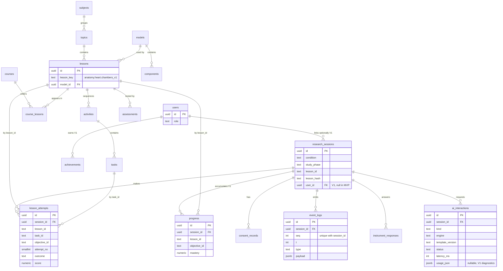

# Database Architecture

The MVP database is small on purpose: six tables that hold who-did-what (pseudonymous research sessions, consent, event logs, instrument responses, attempts, tutor calls) and nothing that describes *what the heart is*. Per-objective mastery is recomputed from `lesson_attempts` in MVP; the `progress` write-through cache is a **V1** table, designed here. Lessons, model manifests, and GLB files are versioned files in the repository, referenced from rows by immutable ids and a content hash. The ten content and account entities the brief asks for (users, courses, subjects, topics, lessons, models, components, activities, assessments, achievements) are designed here as **V1** tables that mirror the JSON types one-to-one, so the engine never changes when content moves. This file mostly concerns **MVP**; the ERD shows both tiers so the V1 shape is visible before it is built.

## Content as files, references in tables

Decision: for **MVP**, content is files; the database stores `lesson_id`, `task_id`, `objective_id`, `model_id` as text plus a `lesson_hash`, never the content itself. The full argument and versioning rules are in [3D Content Architecture](10-3d-content-system.md#content-versioning); the database consequences are summarised here.

| Option | Pros | Cons | Fit for solo dev | Verdict |
|---|---|---|---|---|
| Content in repo files; rows store ids and hash | Zero content tables to migrate; study content frozen by commit; Zod validates at build; the same ids appear in JSON, rows, and event payloads | Text ids cannot be foreign keys until V1; a typo in a lesson id is caught by the validation script, not the database | Excellent | **Recommended, MVP** |
| Content tables from day one | Referential integrity; authoring UI possible | Ten tables and an admin UI before one lesson exists; export needed anyway for reproducibility | Poor | **V1**, when a second author or more than ten lessons appear |
| Hybrid: content in `jsonb` column per lesson | One table, FK-able id | Still a migration and a loader; no query advantage over a file | Fair | Reject; it is a file with extra steps |

What this means for the row design: every MVP table that references content carries denormalised text ids and the small facts the queries need (`task_type`, `activity_kind`, `score_max`) so that mastery and metrics never need to open a JSON file. `lesson_hash` (SHA-256 of the lesson and manifest JSON, written at build) pins each row to the exact content a participant saw. Limitation: if a lesson file is renamed in place, old rows go stale; the versioning rule in doc 10 (ids immutable once used in a study) exists for this reason.

Eight-point checklist, files-plus-references: appropriate because one author and one lesson need no authoring UI; limited by no FK integrity on content ids until V1; no browser cost beyond the bundled JSON already shipped; accessibility-neutral; privacy-positive because content tables would be the only tables with no personal data anyway, so nothing is lost; scales to tens of lessons before the file list becomes unwieldy; lowest possible complexity; necessary because attempts must point at *something*, and a text id plus hash is the simplest something.

## Entity-relationship diagram

Solid relationships are enforced foreign keys. Relationships from the **MVP** tables into the **V1** content tables (`lessons`, `tasks`, `models`) are logical in MVP, carried by text ids, and become foreign keys when the content tables land.



Cardinalities worth stating in words: one `research_sessions` row is one participant-session and owns every other MVP row through `session_id`; a lesson has many attempts but an attempt belongs to exactly one task of one lesson; `progress` has one row per (session, lesson, objective); `ai_interactions` has one row per tutor call, including capped calls and fallbacks where the engine produced nothing and the static hint was shown.

## Tier summary

| Table | Tier | Exists in MVP as | Owner of column design |
|---|---|---|---|
| `research_sessions` | **MVP** | table | this doc, requirements from [14](14-evaluation-methodology.md#63-what-the-database-must-store) |
| `consent_records` | **MVP** | table | this doc, [14 section 7](14-evaluation-methodology.md#7-ethics-consent-and-data-minimisation) |
| `event_logs` | **MVP** | table | [14 section 6](14-evaluation-methodology.md#6-event-log-schema-and-instrumentation-requirements) |
| `instrument_responses` | **MVP** | table | [14](14-evaluation-methodology.md#63-what-the-database-must-store) |
| `lesson_attempts` | **MVP** | table | [06 attempt record fields](06-learning-engine.md#runtime-position-and-persistence) |
| `progress` | **V1** | nothing; MVP recomputes per-objective mastery from `lesson_attempts` with the query below | [06 mastery](06-learning-engine.md#progress-mastery-and-the-separation-from-xp) |
| `ai_interactions` | **MVP** | table | [07](07-ai-tutor.md#the-ai_interactions-table), columns copied verbatim |
| `users` | **V1** | nothing; `user_id` columns are null | this doc |
| `subjects`, `topics`, `courses`, `course_lessons` | **V1** | path segments `content/lessons/<subject>/<topic>/` | this doc |
| `lessons`, `activities`, `tasks` | **V1** | `content/lessons/**/<lessonId>.json`; ids `anatomy.heart.chambers_v1`, `act_guided`, `t_g3` | `lesson-schema` |
| `models`, `components` | **V1** | `content/models/<modelId>.json`; ids `heart_v1`, `left_ventricle` | `lesson-schema` |
| `assessments` | **V1** | `content/instruments/<form>.json` (knowledge forms A/B/C, SUS, TLX) | this doc, [14 section 3.2](14-evaluation-methodology.md#32-protocol) |
| `achievements` | **V1** | nothing; study sessions hide rewards | [08](08-gamification.md) |

In MVP, every reference into a V1 content table is a text column holding the file-based id. The id vocabulary is already fixed by the `lesson-schema` skill, so the V1 migration adds foreign keys without rewriting any row.

One challenge to the brief: it lists "Assessments" beside "Activities" as if both were content tables. In the lesson schema an in-lesson assessment is an `Activity` with `kind: "assessment"` ([06](06-learning-engine.md#the-eleven-elements-and-where-each-lives)), so a separate table would duplicate `activities`. The thing that *is* distinct is the out-of-lesson knowledge test (pre, post, retention) and the questionnaires, which today are JSON forms. `assessments` is therefore defined as the instrument catalogue, and `instrument_responses.instrument` and `form` are its file-based ids in MVP.

## Conventions for every table

| Rule | Value |
|---|---|
| Names | plural `snake_case` tables, `snake_case` columns |
| Primary key | `id uuid default gen_random_uuid()`; the client may supply a v4 UUID for `research_sessions` and `event_logs` so writes are idempotent on retry |
| Time | `created_at timestamptz not null default now()` on every table; `t integer` is milliseconds since session start as emitted by the client, never server time, so metrics are immune to clock skew |
| Identity | No table holds a name, email, IP address, user agent string beyond `device_info` payload fields, or free text typed by a participant, except `instrument_responses.response` for the three open questions, which the consent text names |
| Deletion | Every MVP table has `session_id ... references research_sessions(id) on delete cascade` |
| JSON | `jsonb` columns are validated with Zod in the route handler before insert; the database stores, it does not validate shape |

## MVP tables

### `research_sessions` (MVP)

One row per participant-session. In MVP a session runs exactly one lesson, so the lesson id and hash live here and `event_logs` rows inherit them by join rather than repeating them 1,500 times.

| Column | Type | Null | Key or constraint | Notes |
|---|---|---|---|---|
| `id` | uuid | no | PK | the `sessionId` in every `LogEvent`, `TutorRequest`, and cookie |
| `user_id` | uuid | yes | FK `users.id` on delete set null | **V1** linkage, null in MVP; nullable so a user deletion never destroys research data |
| `participant_code` | text | yes | unique | 6-character random code printed for the participant; resolves the session for the S2 retention page and deletion requests; not identity |
| `assignment_code` | text | no | unique | pre-assigned code from the researcher's offline blocked-randomisation list; entered at session start; encodes `condition`; the app never randomises |
| `condition` | text | no | check in (`gesture`, `mouse`) | derived from `assignment_code` on the server |
| `study_phase` | text | no | check in (`pilot`, `main`, `dev`) | `dev` rows are excluded from every analysis and purged freely |
| `consent_version` | text | no | | the consent text version accepted |
| `lesson_id` | text | no | | `anatomy.heart.chambers_v1` |
| `lesson_hash` | text | no | | SHA-256 from the build, per doc 10 |
| `app_version` | text | no | | git commit short hash of the deployed app |
| `started_at` | timestamptz | no | | |
| `ended_at` | timestamptz | yes | | set on `activity_end` of the mastery activity or on `sendBeacon` at unload |
| `calibration_accuracy` | numeric(4,3) | yes | | from the calibration tutorial; null for mouse |
| `s2_completed` | boolean | no | default false | retention test submitted |
| `created_at` | timestamptz | no | | |

Index: `(study_phase, condition, started_at)` for the export of one study arm.

### `consent_records` (MVP)

Proof of consent without identity. Kept separate from `research_sessions` so a withdrawal is an insert-free update that leaves the session row intact until the deletion job runs.

| Column | Type | Null | Key or constraint | Notes |
|---|---|---|---|---|
| `id` | uuid | no | PK | |
| `session_id` | uuid | no | FK cascade | |
| `consent_version` | text | no | | |
| `consent_logging` | boolean | no | | gates `event_logs` writes; the client logger drops events when false |
| `consent_tutor_payloads` | boolean | no | | gates `ai_interactions.request_json`, `response_json`, `delivered_text` per doc 07 |
| `agreed_at` | timestamptz | no | | |
| `withdrawn_at` | timestamptz | yes | | set by the withdrawal route; deletion follows within the stated window |
| `created_at` | timestamptz | no | | |

Constraint: unique `(session_id, consent_version)`.

### `event_logs` (MVP)

Append-only. The system of record for the study ([14 section 6.3](14-evaluation-methodology.md#63-what-the-database-must-store)). Every metric formula in doc 14 is a query over this table joined to `research_sessions` for `condition`.

| Column | Type | Null | Key or constraint | Notes |
|---|---|---|---|---|
| `id` | uuid | no | PK | client-generated so a retried batch is idempotent via `on conflict do nothing` |
| `session_id` | uuid | no | FK cascade | |
| `seq` | integer | no | **unique `(session_id, seq)`** | monotonic per session; gaps reveal loss, duplicates are rejected |
| `t` | integer | no | | ms since session start |
| `type` | text | no | check against the `LogEvent.type` union | enforced by Zod at the route and by a check constraint regenerated from the same list |
| `payload` | jsonb | no | | the per-type payload contract from doc 14; never landmarks, never text |
| `received_at` | timestamptz | no | default now() | server receipt, for batching diagnostics only |

Rules, enforced where stated: no identity columns (schema); no `condition` column, it is read from the session (schema, avoids inconsistent rows); `payload` keys are restricted to the contract for `type` (route handler Zod, `strict()`); `grab_move` per-frame events are rejected, only `grab_move_summary` is accepted (route handler). Indexes: `(session_id, t)` for ordered replay; `(session_id, type)` for the counting metrics such as `n(task_attempt)`; a partial index on `(type) where type in ('task_attempt','mastery_computed')` for cross-session dashboards once the main study runs. Limitation: `jsonb` payload means a metric that filters on `payload->>'taskType'` does a scan within the session; with 1–3 k rows per session that is milliseconds, and the index on `(session_id, type)` already narrows it.

### `instrument_responses` (MVP)

| Column | Type | Null | Key or constraint | Notes |
|---|---|---|---|---|
| `id` | uuid | no | PK | |
| `session_id` | uuid | no | FK cascade | |
| `instrument` | text | no | check in (`pre`, `post`, `retention`, `sus`, `tlx`, `satisfaction`, `open`, `demographics`) | |
| `form` | text | yes | check in (`A`, `B`, `C`) | knowledge tests only; the Latin-square assignment |
| `item_no` | smallint | no | | |
| `response` | text | no | | the chosen option, scale value as text, or open-question text |
| `correct` | boolean | yes | | knowledge items only; scored at insert from the form file's key so the analysis never re-scores |
| `answered_at` | timestamptz | no | | |
| `created_at` | timestamptz | no | | |

Constraint: unique `(session_id, instrument, item_no)`, so a resubmitted page replaces rather than duplicates (`on conflict do update`). `demographics` is limited to the categorical items in the consent text (age band, prior anatomy study); no free text there. Pre-test, post-test, normalised gain, SUS, and raw TLX in [14 section 2.3–2.4](14-evaluation-methodology.md#23-learning-metrics) are `sum` and `avg` over this table grouped by `instrument`.

### `lesson_attempts` (MVP)

One row per `task_attempt`. The columns are the attempt record the engine guarantees in [06](06-learning-engine.md#runtime-position-and-persistence), plus the three denormalised facts (`activity_kind`, `task_type`, `score_max`) that the mastery function needs without opening the lesson file. The same client event also produces an `event_logs` row; the study uses the log, the product uses this table.

| Option | Pros | Cons | Fit for solo dev | Verdict |
|---|---|---|---|---|
| Separate `lesson_attempts` table written alongside the event | Typed columns; mastery is a plain `GROUP BY`; resume-on-reload reads one indexed table | Two writes per attempt; theoretical divergence if one write fails | Good; one route handler | **Recommended, MVP** |
| Derive attempts from `event_logs` only | One source of truth | Every product query parses `jsonb`; resume needs a replay; V1 accounts would still want a typed table | Fair | Reject for product reads; keep as the audit path |

| Column | Type | Null | Key or constraint | Notes |
|---|---|---|---|---|
| `id` | uuid | no | PK | |
| `session_id` | uuid | no | FK cascade | |
| `user_id` | uuid | yes | FK `users.id` set null | **V1** |
| `lesson_id` | text | no | | |
| `lesson_hash` | text | no | | |
| `activity_id` | text | no | | `act_guided` |
| `activity_kind` | text | no | check in (`guided`, `challenge`, `assessment`) | introduction and explore have no tasks; mastery weight is derived from this |
| `task_id` | text | no | | `t_g3` |
| `task_type` | text | no | check in (`identify`, `place`, `remove`, `sequence`, `compare`) | |
| `objective_id` | text | no | | `obj_place_vessels` |
| `attempt_no` | smallint | no | | resets after remediation per doc 06 |
| `micro_task` | boolean | no | default false | true for the synthesised prerequisite micro-task; excluded from mastery |
| `remediated` | boolean | no | default false | true for the retry after remediation |
| `outcome` | text | no | check in (`correct`, `partial`, `incorrect`) | |
| `score` | numeric(6,2) | no | | after hint penalty |
| `score_max` | numeric(6,2) | no | | the task's `scoring.correct`, for normalisation |
| `hints_used` | smallint | no | | |
| `duration_ms` | integer | no | | `task_start` to this attempt |
| `actual` | jsonb | no | | event summary `{ type, componentId, socketId? }` |
| `t` | integer | no | | ms since session start |
| `created_at` | timestamptz | no | | |

Indexes: `(session_id, lesson_id, task_id, t desc)` makes "latest attempt per task" an index-only `DISTINCT ON`; `(session_id, lesson_id, objective_id)` for the mastery screen. No uniqueness on `attempt_no`, because the remediation reset in doc 06 makes `(task_id, attempt_no)` legitimately repeat; `t` disambiguates.

The schema is adequate for the mastery rule in doc 06 if and only if this query reproduces the engine's number. In **MVP** it is how the mastery screen and resume-on-reload read per-objective mastery (there is no `progress` table yet), and a fixture test asserts it matches the client engine; in **V1** it is the integrity check behind the `progress` cache:

```sql
with latest as (
  select distinct on (task_id)
         task_id, objective_id, activity_kind, score, score_max
  from   lesson_attempts
  where  session_id = $1 and lesson_id = $2 and micro_task = false
  order  by task_id, t desc
)
select objective_id,
       sum(least(greatest(score / score_max, 0), 1)
           * case activity_kind when 'assessment' then 2 else 1 end)
       / sum(case activity_kind when 'assessment' then 2 else 1 end) as mastery
from   latest
group  by objective_id;
```

Objectives with no row return no group, which is doc 06's "not started" rather than a false zero.

### `progress` (V1)

Per-objective mastery, one row per (session, lesson, objective). **MVP** does not create this table: mastery is recomputed from `lesson_attempts` by the query above, which is milliseconds for one session's rows. The write-through cache arrives in **V1**, when per-user mastery across many lessons and sessions makes the recompute wider: the client computes mastery after every attempt and `PUT /api/progress` upserts the row; the query above can regenerate every row, so it is never the only copy. Doc 06's activity cursor for resume is not stored here; it is the `activity_id` and `task_id` of the newest `lesson_attempts` row, which is what the engine replays from.

| Column | Type | Null | Key or constraint | Notes |
|---|---|---|---|---|
| `id` | uuid | no | PK | |
| `session_id` | uuid | no | FK cascade | |
| `user_id` | uuid | yes | FK `users.id` set null | **V1**; in V1 mastery persists across sessions per user and this becomes the row key |
| `lesson_id` | text | no | | |
| `lesson_hash` | text | no | | |
| `objective_id` | text | no | | |
| `mastery` | numeric(4,3) | yes | check 0..1 | null means not started |
| `mastery_threshold` | numeric(4,3) | no | | copied from the objective so the band is readable without the file |
| `mastered` | boolean | no | | `mastery >= mastery_threshold`; stored, not generated, so a threshold change in a new lesson version does not rewrite history |
| `attempts_count` | integer | no | | |
| `last_attempt_at` | timestamptz | yes | | |
| `updated_at` | timestamptz | no | | |
| `created_at` | timestamptz | no | | |

Constraint: unique `(session_id, lesson_id, objective_id)`. XP is not a column here or anywhere in MVP; doc 08's one-way rule holds because nothing in this table can be read by the unlock logic except `mastered`.

### `ai_interactions` (MVP; payload columns MVP with consent)

Columns are taken verbatim from [AI Tutor](07-ai-tutor.md#the-ai_interactions-table); only the FK target is filled in.

| Column | Type | Null | Key or constraint | Notes |
|---|---|---|---|---|
| `id` | uuid | no | PK | returned to the client as `interactionId` |
| `session_id` | uuid | no | FK `research_sessions.id` cascade | pseudonymous |
| `user_id` | uuid | yes | FK `users.id` set null | **V1** |
| `lesson_id` | text | no | | |
| `activity_id` | text | no | | |
| `task_id` | text | yes | | null for `summary` |
| `attempt_no` | smallint | yes | | |
| `kind` | text | no | check in (`hint`, `explain_mistake`, `question`, `summary`) | |
| `hint_level` | smallint | yes | check 1..3 | |
| `engine` | text | no | | `template` in **MVP**; `local:<name>` for a **V1** local open-weights engine (`<name>` is the local runtime's own identifier, never a hosted vendor or model id) |
| `template_version` | text | yes | | `@grasp/tutor` package version that produced the text; null for V1 local-model rows |
| `status` | text | no | check in (`ok`, `fallback_timeout`, `fallback_error`, `fallback_invalid`, `capped`) | |
| `latency_ms` | integer | no | | milliseconds inside the route; single digits for `template` |
| `usage_json` | jsonb | yes | | null in **MVP**; a **V1** local engine may store engine-specific diagnostics (context size, generation time) as one object, never cost |
| `request_json` | jsonb | yes | | null unless `consent_tutor_payloads` |
| `response_json` | jsonb | yes | | null unless consent |
| `delivered_text` | text | yes | | null unless consent |
| `created_at` | timestamptz | no | | |

Indexes, per doc 07: `(session_id, created_at)` for call caps and reconstruction; `(lesson_id, status)` for the failure dashboard. No cost is ever computed from this table: the template engine has no per-call cost and a **V1** local engine runs on the lab laptop. `usage_json` stays nullable and unindexed so the row shape is identical across engines and the pilot's `template` rows remain comparable with any later `local:*` rows.

## V1 tables

Designed now so the ERD is complete and the MVP text ids are known to be sufficient; not migrated until the V1 trigger in doc 10 (second author, ten lessons, or class assignment). Column lists are deliberately shorter than the MVP tables; the authoritative shapes are the `lesson-schema` types, and these tables mirror them.

| Table | Tier | Key columns | Notes |
|---|---|---|---|
| `users` | **V1** | `id` PK; `auth_provider_id text unique`; `role` check in (`learner`, `teacher`, `admin`); `display_name text null`; `created_at`; `deleted_at null` | Identity lives in Auth.js or Supabase Auth ([03](03-system-architecture.md#authentication)); this table holds only the join key and role. Email stays in the auth provider's table. Soft delete, with research rows set to `user_id = null` |
| `subjects` | **V1** | `id` PK; `key text unique` (`anatomy`); `name`; `type_vocabulary jsonb` | `type_vocabulary` is the per-subject convention for `component.type` and `tags` from doc 10 |
| `topics` | **V1** | `id` PK; `subject_id` FK; `key text` (`heart`); `name`; unique `(subject_id, key)` | |
| `courses` | **V1** | `id` PK; `owner_user_id` FK `users`; `title`; `visibility` check in (`private`, `link`, `public`) | A curated ordered set of lessons for a class; nothing in MVP needs it |
| `course_lessons` | **V1** | `course_id` FK; `lesson_id` FK; `position smallint`; PK `(course_id, lesson_id)`; unique `(course_id, position)` | Join table; the only place lesson order outside `prerequisites` is stored |
| `models` | **V1** | `id` PK; `key text unique` (`heart_v1`); `subject_id` FK; `file_url`; `units`; `default_camera jsonb`; `sockets jsonb`; `hotspots jsonb`; `poses jsonb`; `animations jsonb`; `manifest_hash`; `published_at null` | Sockets, hotspots, and poses stay `jsonb` because nothing joins on them; components get a table because tasks and the tutor reference them by id |
| `components` | **V1** | `id` PK; `model_id` FK; `key text` (`left_ventricle`); `name`; `type`; `interactable`, `grabbable`, `highlightable` boolean; `description`; `tags jsonb`; `relations jsonb`; `rest_socket_id text null`; unique `(model_id, key)` | `key` equals the GLB mesh name, as the validation script requires |
| `lessons` | **V1** | `id` PK; `key text unique` (`anatomy.heart.chambers_v1`); `topic_id` FK; `model_id` FK; `title`; `estimated_minutes`; `difficulty smallint`; `objectives jsonb`; `prerequisites jsonb`; `lesson_hash`; `published_at null`; `author_user_id` FK | `objectives` stays `jsonb` (three to six per lesson, referenced by `objective_id` text in `progress`); promoting it to a table is a later, additive change |
| `activities` | **V1** | `id` PK; `lesson_id` FK; `key text` (`act_guided`); `kind` check in the six kinds; `position smallint`; `narration jsonb`; `scene jsonb`; `completion jsonb`; unique `(lesson_id, key)` | |
| `tasks` | **V1** | `id` PK; `activity_id` FK; `key text` (`t_g3`); `objective_id text`; `type` check in the five types; `prompt`; `expect jsonb`; `hints jsonb`; `max_attempts`; `time_limit_sec null`; `scoring jsonb`; `position smallint`; unique `(activity_id, key)` | Not one of the brief's thirteen but required by doc 10; `lesson_attempts.task_id` gains an FK to `tasks.key` scoped by lesson |
| `assessments` | **V1** | `id` PK; `lesson_id` FK null; `instrument` check as in `instrument_responses`; `form` null; `items jsonb` (prompt, options, key); `version`; unique `(instrument, form, version)` | The instrument catalogue (knowledge forms A/B/C, SUS, TLX). `lesson_id` is null for SUS and TLX, which are lesson-independent |
| `achievements` | **V1** | `id` PK; `user_id` FK cascade; `key text` (`mastered:obj_identify_chambers`, `lesson:anatomy.heart.chambers_v1`); `lesson_id text`; `awarded_at`; unique `(user_id, key)` | Award rows only; the catalogue of keys and titles is a config file per doc 08. Hidden during study sessions by the session flag |

When these land, the migration adds `lessons.key`, `tasks.key`, and `models.key` as the targets of foreign keys from the MVP tables' text columns, which already hold exactly those values. `GET /api/content/lessons/:key` then serialises `lessons` plus `activities` plus `tasks` back into the `Lesson` JSON the engine already consumes.

## Indexes

| Table | Index | Serves |
|---|---|---|
| `event_logs` | unique `(session_id, seq)` | idempotent batches, loss detection |
| `event_logs` | `(session_id, t)` | ordered replay for the metrics script and the attempt-reconstruction pilot check |
| `event_logs` | `(session_id, type)` | `n(type)` counts in every doc 14 formula |
| `lesson_attempts` | `(session_id, lesson_id, task_id, t desc)` | latest attempt per task; resume |
| `lesson_attempts` | `(session_id, lesson_id, objective_id)` | mastery screen |
| `progress` (**V1**) | unique `(session_id, lesson_id, objective_id)` | upsert target |
| `instrument_responses` | unique `(session_id, instrument, item_no)` | upsert target; per-instrument sums |
| `ai_interactions` | `(session_id, created_at)`, `(lesson_id, status)` | call caps, failure dashboard |
| `research_sessions` | unique `participant_code`; `(study_phase, condition, started_at)` | S2 lookup; arm export |

Every foreign key column is indexed because cascade deletes scan them. Nothing else is indexed in MVP; the whole study is under 500 k rows.

## Retention, deletion, and export

| Behaviour | Mechanism | Tier |
|---|---|---|
| Participant deletion | `DELETE /api/session/:id` (route in [03](03-system-architecture.md#authentication)) runs `delete from research_sessions where id = $1`; `on delete cascade` removes `event_logs`, `instrument_responses`, `lesson_attempts`, `ai_interactions` (and `progress` once it exists in V1) in one transaction; the `consent_records` row is retained with `withdrawn_at` set as proof the request was honoured (matches doc 15). The route accepts `id` or `participant_code`, is callable with the `sessionId` alone (the UUID is the secret; no admin token in MVP), and writes one line to a server log (`session deleted`, timestamp, no payload) | **MVP** |
| Participant export | `GET /api/session/:id/export` returns the six MVP tables for one session as a single JSON document; the same endpoint feeds the end-of-session download fallback in doc 14 | **MVP** |
| Study retention | Five years after publication, then `delete ... where study_phase = 'main' and started_at < $cutoff`; the date is written in the consent text and in `docs/` when the study is pre-registered | **MVP** policy, run by hand |
| Dev and pilot purge | `study_phase = 'dev'` rows deleted on every deploy to the pilot environment; `pilot` rows kept until the pilot report is written, then deleted | **MVP** |
| Withdrawal | `consent_records.withdrawn_at` set immediately; cascade delete within the stated window (seven days, per doc 14) | **MVP** |
| Account deletion | `users.deleted_at` set; research rows have `user_id` set null by the FK, so a withdrawn account does not silently delete study data that the participant consented to keep. Participant-initiated research deletion remains the cascade above | **V1** |
| Backups | Neon's point-in-time restore window on the free tier (check the current value; it has been seven days) is the only backup during the pilot. Before the main study, a nightly `pg_dump` to encrypted object storage, scripted in `scripts/` | **MVP** pilot / **V1** main |

Limitation stated plainly: a cascade delete also removes the rows from the point-in-time restore window only after that window elapses. The consent text should say deletion is complete within the window plus seven days.

## Postgres hosting: Neon, Supabase, or local

Decision: **Neon** for the deployed database, **local Postgres in Docker Compose** for development and tests. Locked position 9 permits either Neon or Supabase; this resolves doc 03's open question.

| Option | Pros | Cons | Fit for solo dev | Verdict |
|---|---|---|---|---|
| Neon (serverless Postgres) | Scales to zero, so a hobby project costs nothing between sessions; HTTP and WebSocket driver suited to Vercel functions; database branching gives a free throwaway copy per migration or per pilot; plain Postgres, nothing proprietary in the schema | Free tier storage cap (hundreds of MB; check current limits) and compute-hours cap; cold start of a few hundred ms after idle; no bundled auth or storage | Excellent | **Recommended, MVP** |
| Supabase | Free Postgres plus Auth, Storage, and a dashboard in one account; row-level security; Storage could host GLBs | Free projects pause after a week of inactivity and need a manual resume, which is a real risk the morning of a study session; RLS and the PostgREST layer are unused by route handlers and add concepts; the bundle's value arrives with accounts, which are V1 | Good | **V1** re-evaluation when accounts and GLB hosting are chosen together |
| Local Postgres only (Docker Compose) | Zero cost; full control; identical engine version | Not reachable from Vercel; the researcher's laptop becomes the server | Fine for dev | **MVP** for development and CI, never for the pilot |
| Vercel Postgres (Neon-backed) | One dashboard | Same engine, less control, marketplace pricing | Fair | Reject; use Neon directly |
| SQLite (Turso, LiteFS) | Simplest file database | `jsonb` indexing and `DISTINCT ON` differ; the study analysis tooling expects Postgres | Poor | Reject |

Eight-point checklist for Neon: appropriate because a serverless app with bursty study-day traffic and silence otherwise matches scale-to-zero billing; limited by storage and compute caps that a 130-participant study will not approach (roughly 300 k `event_logs` rows, under 200 MB) and by cold starts that only the first request of a session sees; no browser impact; no accessibility impact; privacy is the researcher's own database in a chosen region with TLS enforced, and the region is a setting to record in the ethics application; scales through V1 on the free tier by archiving exported sessions to object storage and deleting their rows (a paid tier is excluded by the no-paid-tools rule, so archiving is the scaling path); complexity is a connection string in an environment variable; necessary because research data must outlive the device, and the simpler alternative (local JSON download only) is kept as the fallback path, not the system of record.

Limitation: branching and scale-to-zero are Neon features; if the project later moves to Supabase or a plain VPS, the schema and Drizzle code move unchanged but the branching workflow below is replaced by a second database.

## ORM and migrations: Drizzle, Prisma, or raw SQL

Decision: **Drizzle ORM** with `drizzle-kit` migrations, over the Neon serverless driver in production and `node-postgres` locally. Doc 03 already names Drizzle; the comparison here is the justification.

| Option | Pros | Cons | Fit for solo dev | Verdict |
|---|---|---|---|---|
| Drizzle ORM + drizzle-kit | Schema is TypeScript, so `packages/types` and the table definitions share one source; generated SQL migrations are plain files reviewed in Git; thin query builder that stays close to SQL (`DISTINCT ON`, `jsonb` operators, `on conflict` all expressible); works on the Neon HTTP driver in Vercel functions; small bundle; `drizzle-zod` derives Zod schemas from tables, closing the loop with the route-handler validation | Younger than Prisma; fewer tutorials; relational query API is still maturing, though this schema needs almost no relations | Excellent | **Recommended, MVP** |
| Prisma | Mature, excellent docs and tooling, generated client | Separate schema language; query engine binary adds cold-start time on serverless and historically needed Accelerate or a driver adapter for edge or HTTP; `DISTINCT ON` and partial indexes need raw SQL escape hatches; heavier | Good | Reject for this workload |
| Raw SQL with `node-postgres` or `postgres.js` | No abstraction; every query is exactly what runs | Hand-written types for every row; hand-rolled migration runner or a second tool (`node-pg-migrate`, `dbmate`); the twelve V1 tables would be a lot of boilerplate | Fair | Acceptable; Drizzle is this plus types and migrations |
| Kysely | Type-safe SQL builder, very close to raw | No migration generator from schema; types maintained by hand or via codegen | Good | Acceptable alternative if Drizzle disappoints |

Eight-point checklist for Drizzle:

| Point | Assessment |
|---|---|
| 1 Appropriate | Six tables, a dozen queries, one developer who already writes TypeScript; the schema file doubles as documentation |
| 2 Limitations | Younger ecosystem; relational query helper less complete; a few advanced constructs fall back to `sql` template literals, which is acceptable |
| 3 Browser performance | None; server-only import, never bundled client-side |
| 4 Accessibility | None |
| 5 Privacy | Parameterised queries by construction; the schema file makes "no identity columns" reviewable in one place |
| 6 Scalability | Stateless over the Neon HTTP driver; no connection pool to exhaust from serverless functions; V1 can switch to pooled WebSocket or `postgres.js` with one config change |
| 7 Complexity | One `schema.ts`, one `drizzle.config.ts`, `drizzle-kit generate` and `migrate` scripts; under an hour to set up |
| 8 Necessary? | Yes, because migrations and row types are required either way; the simpler alternative is raw SQL with hand-written types, which costs more over twelve V1 tables than Drizzle costs now |

## Seed and migration strategy for MVP

| Step | What | When |
|---|---|---|
| Schema source | `packages/db/src/schema.ts` defines the six MVP tables; V1 tables (including `progress`) live in the same file behind a comment block and are not exported until the V1 migration | Phase C scaffold |
| Migration files | `drizzle-kit generate` writes numbered SQL files to `packages/db/migrations/`; they are committed and reviewed like code; `drizzle-kit migrate` applies them | every schema change |
| Check constraints from one list | The `type` check on `event_logs` and the `kind`, `status`, `outcome` checks are generated from the same TypeScript unions that Zod validates, by a small script, so the database and the route handler can never disagree | Phase C |
| Local | Docker Compose runs Postgres 16 on `localhost:5432`; `pnpm db:reset` drops, migrates, and seeds; tests run against it | daily |
| Dev database | **MVP**: one long-lived Neon `dev` branch, created by hand, that preview deploys and the researcher's laptop share; local Docker Postgres for tests. No CI integration | Phase C, once |
| Preview branching | **V1**: each Vercel preview deploy points at a Neon branch created from `main` by a CI step, so a migration is exercised on a copy of real data before it reaches production. Not worth the CI wiring for one developer and one lesson | per pull request, V1 |
| Production | `drizzle-kit migrate` runs as a manual step before the deploy that needs it, never automatically on cold start, because a half-applied migration during a study session is the worst case | per release |
| Seed data | Content needs no seeding (it is files). The seed inserts two `research_sessions` rows with `study_phase = 'dev'`, one per condition, with matching `consent_records`, and replays the recorded `LogEvent` fixture from the learning-engine tests into `event_logs` and `lesson_attempts`. This gives the metrics script and the mastery query something real to run against | Phase C, refreshed when the fixture changes |
| Randomisation list | The pre-generated blocked assignment sequence from doc 14 is **not** seeded into the database; it stays offline with the researcher; the server receives only the `assignment_code` per session and derives `condition` from it | never |
| V1 content migration | A one-off script reads every manifest and lesson file, inserts `subjects`, `topics`, `models`, `components`, `lessons`, `activities`, `tasks`, then adds the foreign keys from the MVP text columns. Idempotent, keyed on the file ids | V1 |

Limitation: `drizzle-kit` cannot express every constraint (partial indexes, generated check lists) in the schema DSL; those lines are appended to the generated migration by hand and noted in a comment, which is a small ongoing cost.

## Open questions

1. Resolved: `sessionId` is a client-generated v4 UUID that the server validates for format and uniqueness and records in `research_sessions` ([03 Authentication](03-system-architecture.md#authentication) now says the same). The `id uuid default gen_random_uuid()` default remains only as a safety net for the seed script.
2. Resolved: the deletion route is `DELETE /api/session/:id` in docs 03, 14 and 15.
3. Should `demographics` be an `instrument_responses.instrument` value (as here) or excluded from the database entirely and kept on paper with the consent form? Keeping it in the database is convenient for analysis; keeping it offline is stronger minimisation. The approving institution may decide.

## Related

- [System Architecture](03-system-architecture.md): route handlers that write these tables, using the same names (`lesson_attempts`, `event_logs`).
- [Learning Engine](06-learning-engine.md): attempt record fields and the mastery rule the `lesson_attempts` query reproduces.
- [AI Tutor](07-ai-tutor.md): source of the `ai_interactions` columns.
- [Gamification](08-gamification.md): `achievements` keys and the rule that XP never appears in `progress`.
- [3D Content Architecture](10-3d-content-system.md): versioning rules, `lesson_hash`, and the trigger for moving content into tables.
- [Evaluation Methodology](14-evaluation-methodology.md): event-log schema, the four research tables, delete and export requirements, retention period.
- [Technical Risks, Security and Privacy, Scalability](15-risks-security-scalability.md): threat model and what breaks first in the database tier.
- [Project Folder Structure](16-folder-structure.md): where `packages/db`, migrations, and seed scripts live.
- [Recommended Technology Stack](19-tech-stack-and-final-diagram.md): stack table rows for Neon and Drizzle.
