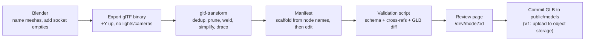

# 3D Content Architecture

Educational content in Grasp is two JSON documents per topic, a model manifest and a lesson, plus one compressed GLB per model. The manifest describes what the 3D asset contains (components, sockets, hotspots, poses); the lesson describes what the learner must do with it (objectives, activities, tasks, hints). Neither document has anatomy-specific fields, so a new subject is new files, not new code. This file mostly concerns **MVP**; the move from files to database tables is **V1**.

The authoritative schema is the `lesson-schema` skill. This file summarises it, fixes the authoring workflow and asset limits, and explains versioning. Evaluation semantics belong to [Learning Engine](06-learning-engine.md); rendering of sockets, hotspots, and poses belongs to [3D Interaction Architecture](05-3d-interaction.md).

## Two documents per topic

| Document | Path (MVP) | Owns | Changes when | Tier |
|---|---|---|---|---|
| Model manifest | `content/models/<modelId>.json` | GLB path, units, default camera, components, sockets, hotspots, poses, animations | the 3D asset changes | **MVP** |
| Lesson | `content/lessons/<subject>/<topic>/<lessonId>.json` | objectives, activities, tasks, hints, scoring, difficulty, prerequisites | pedagogy changes | **MVP** |
| GLB | `apps/web/public/models/<modelId>/` for **MVP**; object storage behind a CDN for **V1** (see [GLB hosting](#glb-hosting)); referenced by `manifest.file` | geometry, materials, optional animation clips | the artist re-exports | **MVP** |

A lesson references a manifest by `modelId`; several lessons share one model (`anatomy.heart.chambers_v1` and a later `anatomy.heart.valves_v1` both use `heart_v1`). This split is the first thing to defend: the brief's example puts `"learning_objective": "identify"` on a component. That couples the asset to one pedagogy and means a model can serve one lesson. Objectives and tasks live in the lesson; the manifest only says what exists and what it can do.

## Model manifest

Full type definitions: `lesson-schema` §2. Full heart example: `.claude/skills/lesson-schema/references/heart-example.json`.

| Type | Key fields | Purpose |
|---|---|---|
| `ModelManifest` | `id`, `subject`, `file`, `units`, `defaultCamera`, `components[]`, `sockets[]`, `hotspots[]`, `poses`, `animations?` | Root; one per GLB |
| `Component` | `id` (snake_case, equals GLB mesh name), `name`, `type` (subject vocabulary), `interactable`, `grabbable`, `highlightable`, `description`, `tags[]`, `relations?[]`, `restSocketId?` | A selectable mesh or group; the unit of selection and grading |
| `Socket` | `id`, `transform`, `radius`, `accepts[]`, `visual` (`ghost`, `ring`, `none`) | Where a component snaps on `grab_end` |
| `Hotspot` | `id`, `componentId`, `localPosition`, `label`, `kind` (`info`, `task`), `body?` | Labelled anchor for reading or for task framing |
| `Transform` | `position`, `rotation`, `scale?` | Scene units from `units` |
| `poses` | `Record<poseName, Record<componentId, Transform>>` | Named layouts (`assembled`, `exploded`) that activities select |

Excerpt from `heart_v1` (two of ten components, two of six sockets):

```json
{
  "id": "heart_v1",
  "subject": "anatomy",
  "file": "heart.glb",
  "units": "cm",
  "components": [
    { "id": "left_ventricle", "name": "Left Ventricle", "type": "chamber",
      "interactable": true, "grabbable": true, "highlightable": true,
      "description": "Thick-walled chamber that pumps oxygenated blood into the aorta.",
      "tags": ["oxygenated", "systemic_circuit"],
      "relations": [{ "type": "connects_to", "target": "aorta" }],
      "restSocketId": "socket_left_ventricle" },
    { "id": "septum", "name": "Septum", "type": "wall",
      "interactable": true, "grabbable": false, "highlightable": true,
      "description": "Muscular wall separating left and right sides of the heart.", "tags": [] }
  ],
  "sockets": [
    { "id": "socket_left_ventricle", "transform": { "position": [2.5, -3.0, 0.5], "rotation": [0, 0, 0] },
      "radius": 1.5, "accepts": ["left_ventricle", "right_ventricle", "left_atrium", "right_atrium"], "visual": "ghost" },
    { "id": "socket_aorta", "transform": { "position": [0.5, 6.0, 0.0], "rotation": [0, 0, 0.2] },
      "radius": 1.2, "accepts": ["aorta", "pulmonary_artery"], "visual": "ghost" }
  ]
}
```

`accepts` is deliberately permissive: it lists everything that may physically snap into the socket, including distractors (every chamber socket accepts all four chambers; both great-vessel sockets accept both vessels), and correctness comes only from the task's `expect`. This is what makes the `partial` outcome ("right part, wrong place") reachable.

`grabbable: false` on `septum` and the veins is deliberate: the MVP has six movable parts and four fixed landmarks, which keeps the challenge activity to the 5–10 components the brief asks for while giving `identify` tasks distractors.

## Lesson

Full type definitions: `lesson-schema` §3–4. The lesson is the pedagogical document and the only place that says what is correct.

| Type | Key fields | Purpose |
|---|---|---|
| `Lesson` | `id`, `modelId`, `title`, `estimatedMinutes`, `difficulty`, `objectives[]`, `activities[]`, `prerequisites?` | Root |
| `Objective` | `id`, `statement`, `bloom`, `masteryThreshold` | The unit of mastery; attempts roll up to it |
| `Activity` | `id`, `kind` (introduction, explore, guided, challenge, assessment, mastery), `narration?`, `scene` (pose, visible components, sockets visible, orbit, grab), `tasks[]`, `completion` | One stage; selects a pose and permissions |
| `Task` | `id`, `objectiveId`, `type` (`identify`, `place`, `remove`, `sequence`, `compare`), `prompt`, `expect`, `hints[]`, `maxAttempts?`, `timeLimitSec?`, `scoring` | The unit of evaluation |
| `Hint` | `level` 1–3, `text?`, `highlight?`, `cameraTo?`, `tutor?` | Static, scene-driven, or delegated to the template tutor, which phrases it from manifest data |

Excerpt, one `place` task from the guided activity:

```json
{ "id": "t_g3", "type": "place", "objectiveId": "obj_place_vessels",
  "prompt": "Pinch the aorta and attach it to the heart.",
  "expect": { "componentId": "aorta", "socketId": "socket_aorta" },
  "maxAttempts": 3, "scoring": { "correct": 15, "partial": 5, "hintPenalty": 3 },
  "hints": [
    { "level": 1, "text": "The aorta leaves from the left ventricle at the top." },
    { "level": 2, "highlight": ["socket_aorta"] },
    { "level": 3, "tutor": true } ] }
```

The engine compares `expect` against `SceneEvent`s as specified in `lesson-schema` §5. Nothing in the content format is executable, which is what makes the tutor safe to add: it reads these documents, it cannot alter their meaning. In **MVP** the tutor is a template engine, so the quality of its explanations is set here, by `description`, `relations`, and `tags`, not by a model.

## Generalised metadata system

The schema separates three layers so the platform does not need to know what a heart is.

| Layer | Subject-neutral (platform code reads it) | Subject-specific (content authors choose it) | Tier |
|---|---|---|---|
| Geometry | `id`, `file`, `units`, `transform`, `poses`, mesh names | None | **MVP** |
| Affordances | `interactable`, `grabbable`, `highlightable`, `sockets`, `accepts`, `restSocketId` | None | **MVP** |
| Meaning | field names: `type`, `tags`, `relations[].type`, `description`, `hotspots[].body` | field values: `"chamber"`, `"oxygenated"`, `"connects_to"`, the text | **MVP** |
| Pedagogy | task types, `expect` shapes, `bloom`, `completion` | objective statements, which component goes where, hint text | **MVP** |

Platform code branches only on neutral fields. `type` and `tags` are free strings whose vocabulary is a per-subject convention documented beside the content (`content/models/README.md`), used by the HUD for grouping and by the template tutor in `packages/tutor` for phrasing. `relations` give the tutor a small graph to explain from ("the aorta `connects_to` the left ventricle"; `opposite_of` for the classic left-right confusion) without a knowledge base or a model. The `contentHash` written at build covers these fields too, so a wording change in a description that the tutor quotes is visible in `lesson_hash` on every row.

Cross-subject fit of the five task types, from `lesson-schema` §7 with the content pattern each needs:

| Subject | Model | Components (`type`) | Sockets | Poses | Typical tasks | Content-only? |
|---|---|---|---|---|---|---|
| Anatomy (MVP) | `heart_v1` | `chamber`, `vessel`, `wall` | one per movable part | `assembled`, `exploded` | `identify`, `place`, `sequence` (blood path), `compare` (wall thickness) | Yes |
| Chemistry | water molecule kit | `atom` | bond positions on `oxygen` | `assembled`, `separated` | `place` hydrogens, `sequence` bonding, `compare` electronegativity | Yes |
| Mechanical | 4-stroke engine | `piston`, `shaft`, `valve` | assembly poses | `assembled`, `exploded`, per-stroke poses | `remove` for disassembly, `sequence` reassembly, `identify` | Yes; stroke animation uses `animations[]` |
| Electronics | breadboard circuit | `passive`, `active`, `source` | breadboard holes (`accepts` several) | `kit`, `wired` | `place` into holes, `sequence` current path | Yes; distractor sockets with multi-`accepts` |
| Geography | tectonic plates | `plate` | none | `present`, `cretaceous` | `identify`, `compare` (which subducts) | Yes; no grabbing, `allowGrab: false` |

Two limits of the generalisation, stated plainly. First, `compare` evaluates a selection, not a measurement: the answer is declared in the lesson, and the manifest need not encode the attribute. If a subject needs quantitative attributes (mass, voltage), add `attributes: Record<string, number | string>` to `Component` in **V1**; it is additive. Second, tasks that require continuous manipulation (rotate a gear to an angle, pour a liquid) have no task type and are **Future**; they also need gestures the MVP postponed.

## Authoring workflow

One person authors the MVP content, so the workflow is a checklist and three scripts, not a tool.



| Step | Who / tool | Rules | Output |
|---|---|---|---|
| 1 Blender naming | author | Each separable part is one mesh (or one parent empty) named exactly its `component.id` in snake_case: `left_ventricle`, `aorta`. Fixed scenery uses any other name. Add an empty named `socket_<componentId>` at each rest pose. Apply all transforms; set each part's origin to its centroid; ≤ 4 materials; bake ambient occlusion into textures rather than relying on real-time shadows. | `.blend` in `content/source/` (Git LFS or outside the repo) |
| 2 Export | Blender glTF 2.0 exporter | Format: glTF Binary (`.glb`); +Y up; include custom properties off; exclude cameras and lights; apply modifiers; export animations only if the manifest will reference them. Scale so 1 unit = 1 cm if `units: "cm"`. | `heart.raw.glb` |
| 3 Compress | `gltf-transform` CLI | `dedup → prune → weld → simplify --ratio 0.5` (only if > 150k triangles) `→ draco` (or `meshopt`). Textures: resize to ≤ 2048 px; KTX2 is optional for **MVP**. | `heart.glb` under 5 MB |
| 4 Manifest | `pnpm content:scaffold heart.glb` then edit | Script lists node names, emits a manifest skeleton with every `socket_*` empty converted to a `Socket` (position and rotation read from the node) and every other named node to a `Component` with defaults. Author fills `name`, `type`, `description`, `tags`, `relations`, `poses.exploded`. | `content/models/heart_v1.json` |
| 5 Validate | `pnpm content:validate` | Runs the [validation checklist](#validation-checklist) against every manifest and lesson; fails the build on any error. Also runs as a CI check. | pass or error list |
| 6 Review | `/dev/model/[id]` page (dev build only) | Loads the GLB and manifest, lists components with click-to-highlight, draws socket radii, toggles poses, shows triangle count and file size. Author checks snap radii feel right with a mouse before testing with gestures. | sign-off |
| 7 Publish | author | Commit manifest and lesson; copy `heart.glb` to `apps/web/public/models/heart_v1/heart.glb` (**MVP**) or run `pnpm models:upload` to object storage under the same key `models/heart_v1/heart.glb` (**V1**). The path includes the manifest id so a changed GLB is a new id. | deployed content |

Why gltf-transform and not Blender's own Draco export: the CLI pipeline is reproducible from a script, applies dedup and prune that Blender does not, and the same command works for a GLB from any source. Why no custom editor: the MVP has one manifest and one lesson; a form UI would cost more than hand-editing JSON with schema autocomplete (the Zod schema also emits a JSON Schema for the editor).

Mouse-condition parity is a content concern too: every task must be completable with click, drag, and keyboard, which the review page exercises first.

## Content versioning

Decision: for **MVP**, content is files in the repository, versioned by Git and by an explicit version suffix in the id. Database tables for content are **V1**.

| Option | Pros | Cons | Fit for solo dev | Verdict |
|---|---|---|---|---|
| JSON and GLB in repo, imported at build time | Diffable; reviewed with code; zero runtime; Zod validation at build; study content frozen by commit hash | No non-developer authoring; a content fix is a deploy | Excellent | **Recommended, MVP** |
| Content tables in Postgres from day one | Authoring UI possible; per-user drafts | Schema plus migrations plus admin UI before a single lesson exists; study reproducibility needs an export anyway | Poor for MVP | **V1** |
| Headless CMS (Sanity, Contentful) | Editing UI for free | Third party holds content; a 3D-aware schema does not fit CMS models; another account and API | Poor | Reject |

Versioning rules that make research data reproducible:

| Rule | Example | Why |
|---|---|---|
| Ids carry a version suffix and are immutable once a study has used them | `heart_v1`, `anatomy.heart.chambers_v1` | A `lesson_attempts` row referencing `t_g3` in `anatomy.heart.chambers_v1` must mean the same task forever |
| Editing a task's `expect`, `scoring`, or activity order creates a new lesson id | `..._v2` | Keeps mastery comparable within a study |
| Typos in `prompt`, `narration`, or `description` may be fixed in place | same id | Does not change what is graded; Git records the change |
| Changing the GLB creates a new manifest id and storage path | `heart_v2`, `models/heart_v2/heart.glb` | CDN caches are immutable; sockets may move |
| The build writes `contentHash` (SHA-256 of the lesson and manifest JSON) into the bundle; `lesson_attempts` and `event_logs` rows store it | `lesson_hash` column in [Database Architecture](09-database.md) | Exact reconstruction of what a participant saw |

When content moves to tables (**V1**) and why: the trigger is a second author who is not the developer, or more than roughly ten lessons, or the need to list, search, and assign lessons to classes. At that point `models`, `components`, `lessons`, `activities`, and `tasks` tables mirror the JSON types one-to-one (they are already drawn in [Database Architecture](09-database.md) as **V1**), the authoring UI writes to them, and `GET /api/content/lessons/:id` returns the same `Lesson` JSON the engine already consumes. The JSON remains the interchange format and the export for research archives. GLB files never move into the database; they stay in object storage with the manifest holding the path.

Limitation: until **V1**, a lesson change requires a redeploy (about two minutes on Vercel). For a study with frozen content this is a feature.

## GLB hosting

Decision: GLB files are served from `apps/web/public/models/<modelId>/` on Vercel for **MVP** (the pilot). Object storage behind a CDN, Cloudflare R2 recommended, is **V1**, to be in place before the main study. Locked position 9 names object storage behind a CDN as the target; this section only sequences it.

| Option | Pros | Cons | Fit for solo dev | Verdict |
|---|---|---|---|---|
| `apps/web/public/` on Vercel | Zero configuration; same origin, so CSP `connect-src` stays `'self'`; Vercel's edge cache serves static files with immutable headers on versioned paths; one 5 MB model to a few hundred sessions is well inside Hobby bandwidth | Counts against the Hobby bandwidth cap; a GLB change is a redeploy; binaries in Git grow the repo by ~5 MB per model version | Excellent | **Recommended, MVP** (pilot) |
| Cloudflare R2 with custom domain | 10 GB storage free; zero egress fees, so bandwidth is not the first thing to break; S3-compatible API; immutable keys `models/<modelId>/<file>` decoupled from deploys | Second account and credential; CORS and a CSP `connect-src` entry; custom domain needs a Cloudflare-managed zone; one upload script | Good | **Recommended, V1**, before the main study |
| Vercel Blob | Same account and dashboard; SDK upload from a script | Egress is metered beyond a small free allowance, and egress is precisely what grows; URLs are not deterministic paths unless configured | Fair | Reject: solves the deploy coupling but not the bandwidth problem |
| Supabase Storage | Bundled CDN; same account if Supabase is the Postgres provider; free tier | Ties asset hosting to the unresolved Neon-or-Supabase choice; free-tier egress is capped; public-bucket policies to configure | Good only if Supabase is chosen | Acceptable alternative to R2 if Supabase becomes the Postgres provider |

The switch is one environment variable: `NEXT_PUBLIC_ASSET_BASE_URL` defaults to `/models` and becomes `https://cdn.<your-domain>/models` at **V1**; `manifest.file` stays a relative filename and the loader joins the two. The CSP in [Security and Privacy](15-risks-security-scalability.md#content-security-policy-and-headers) already reserves the CDN host in `connect-src`.

Eight-point checklist for R2 (**V1**): (1) appropriate because GLB bandwidth is the first cost that grows ([Scalability](15-risks-security-scalability.md#scalability)) and R2 charges no egress; (2) limitations are a second account, CORS configuration, and a Cloudflare-managed zone for the custom domain; (3) browser impact is one extra DNS and TLS handshake on first load, mitigated by a `preconnect` hint, then immutable caching; (4) no accessibility impact; (5) privacy: learner IPs reach Cloudflare for asset fetches only, no learner data, and Cloudflare is named as a processor in the consent text; (6) scales to thousands of first loads per month at zero marginal cost; (7) complexity is one upload script in `scripts/models/`, one environment variable, and one CSP entry; (8) not necessary for the pilot: `public/` is the simpler alternative and is the MVP.

Limitation: the pilot's bandwidth depends on participant count times model size; if the pilot adds a second model or exceeds a few hundred sessions, pull the R2 step forward rather than risk a Hobby bandwidth warning mid-study.

## Asset limits

Limits follow the 30 fps budget in locked position 6 and the loader rules in `r3f-interaction` §9. The validation script enforces the hard limits; the review page displays the soft ones.

| Asset | Limit | Hard or soft | Reason | Tier |
|---|---|---|---|---|
| GLB file size | ≤ 5 MB compressed (Draco or meshopt) | Hard | First-load on a home connection under 5 s; CDN bandwidth cost | **MVP** |
| Triangles per model | ≤ 150k | Hard | Integrated GPU at 30 fps with CV running | **MVP** |
| Materials per model | ≤ 4 | Soft | Draw calls; one material per `type` is enough | **MVP** |
| Textures | ≤ 2048 px each, ≤ 4 textures, baked AO | Soft | GPU memory on 4 GB laptops | **MVP** |
| Components per model | 5–12 interactable | Soft | Brief's 5–10; more than 12 makes `identify` distractors unfair at 720p pointing accuracy | **MVP** |
| Grabbable components | ≤ 8 | Soft | Challenge activity length; snap-target ambiguity | **MVP** |
| Socket radius | 0.5–3 scene units (cm) | Soft | Smaller is unforgiving for gesture jitter; larger overlaps neighbours | **MVP** |
| Manifest JSON | ≤ 100 KB | Hard | Bundled into the client | **MVP** |
| Lesson JSON | ≤ 200 KB; `narration` cards ≤ 220 characters; `estimatedMinutes` 5–20 | Hard | HUD layout; session fits 45 minutes with tests | **MVP** |
| Animation clips | ≤ 3 per model, ≤ 10 s each | Soft | Bundle size; guided animation only | **MVP** |
| Lights and cameras in GLB | 0 | Hard | Scene owns lighting and camera | **MVP** |
| MediaPipe `.task` and WASM | pinned version, self-hosted | Hard | Offline operation; privacy; reproducible study | **MVP** |

If a model exceeds the triangle budget, prefer `simplify` on non-interactable scenery before touching components, since silhouettes drive `identify` tasks.

## Validation checklist

`pnpm content:validate` runs every item below on every manifest and lesson. Items marked (schema) are expressed in Zod; the rest are cross-reference and asset checks in the same script. The list extends `lesson-schema` §8.

Structural (schema):

- [ ] Manifest and lesson parse against the Zod schemas; unknown fields are errors, not warnings.
- [ ] All ids are `snake_case` (components, sockets, hotspots) or dotted lowercase with version suffix (lesson, model).
- [ ] `units` is `"m"` or `"cm"`; every `Transform.position` is finite.

Cross-references:

- [ ] Every `componentId` referenced by a socket `accepts`, hotspot, task `expect`, pose, `relations[].target`, `restSocketId` chain, or hint `highlight` exists in `components`.
- [ ] Every `socketId` referenced by a task exists in `sockets`, and the task's `componentId` is in that socket's `accepts`.
- [ ] Every `restSocketId` names a socket whose `accepts` includes that component.
- [ ] Every task's `objectiveId` exists in `objectives`; every objective has at least one task in a non-introduction activity; every objective has at least one task in an assessment activity (otherwise mastery weighting is undefined).
- [ ] Every activity `scene.pose` exists in `poses`; every `visibleComponents` entry exists.
- [ ] Every `hint.cameraTo` names an existing hotspot or component.
- [ ] `lesson.modelId` names an existing manifest; `prerequisites` name existing lessons.

Pedagogical invariants:

- [ ] Assessment activities have `hints: []` and `maxAttempts: 1` on every task.
- [ ] `sequence.steps` length ≥ 2; `compare.componentIds` has exactly 2 and `answer` is one of them.
- [ ] A `place` or `remove` task sits in an activity with `scene.allowGrab: true`; its component is `grabbable`.
- [ ] An `identify` task's target is `interactable`; if the activity hides sockets, no hint highlights a socket.
- [ ] Narration cards ≤ 220 characters; `estimatedMinutes` within 5–20.
- [ ] Any hint with `tutor: true` sits at level 2 or 3, never level 1 (first hints are free and static, per [AI Tutor](07-ai-tutor.md)).

Asset checks (need the GLB):

- [ ] Mesh names in the GLB match `components[].id` exactly: `gltf-transform inspect` node list diffed against the manifest; extra unnamed nodes are allowed, missing ones fail.
- [ ] Every `socket_*` empty in the GLB has a matching `Socket`, and vice versa, with transforms within 0.01 units.
- [ ] File size ≤ 5 MB; triangles ≤ 150k; materials ≤ 4; no lights or cameras.
- [ ] Draco or meshopt extension is present and the decoder path in `public/draco/` exists.
- [ ] Exploded-pose positions keep every component inside the workspace bounds the scene uses for drag constraints.

The script exits non-zero on any failure and prints the offending id and file. It runs in CI and as a pre-commit hook, so a broken manifest cannot reach a study participant.

## Open questions

1. Git LFS for `.blend` source files, or keep sources outside the repo entirely? LFS on a free GitHub plan has a 1 GB cap; one heart source will fit, ten models may not. Recommendation pending the roadmap in [Development Roadmap](13-roadmap.md).
2. Resolved 2026-10-04: adapt a CC-licensed model (CC0 or CC-BY) in Blender; commissioning and building from scratch are rejected for MVP cost. Shortlist and licence notes live in `content/models/README.md`.

## Related

- `lesson-schema` skill: authoritative types, evaluation pseudocode, validation list, heart example.
- [System Architecture](03-system-architecture.md): where manifests and lessons are loaded and which module consumes each.
- [3D Interaction Architecture](05-3d-interaction.md): how sockets, hotspots, poses, and the GLB pipeline are rendered.
- [Learning Engine](06-learning-engine.md): how tasks are evaluated and mastery computed from these documents.
- [AI Tutor](07-ai-tutor.md): how `description`, `relations`, and `prompt` reach the tutor.
- [Database Architecture](09-database.md): `lesson_hash` on `lesson_attempts`; **V1** content tables.
- [Project Folder Structure](16-folder-structure.md): `content/`, `public/draco/`, `public/mediapipe/`, and the scripts directory.
