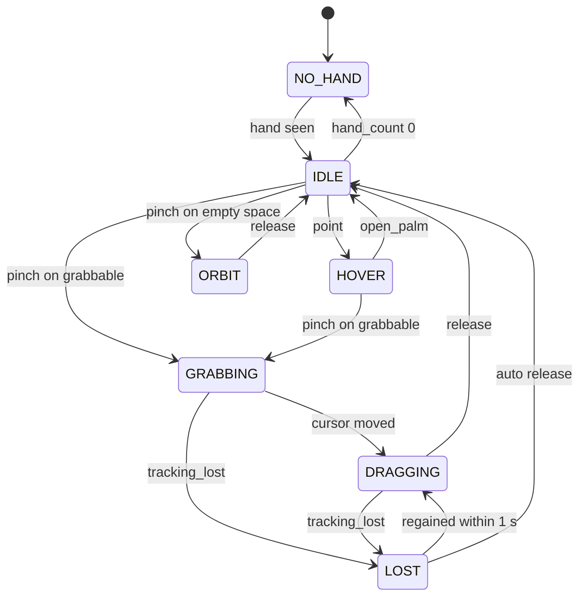
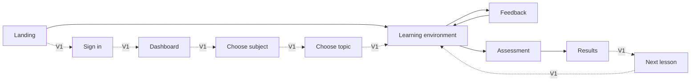

# UI/UX Architecture

This file defines how Grasp looks and, more importantly, how it makes gesture interaction legible: the learner must always know whether they are seen, what the system thinks their hand is doing, and what will happen on release. It covers design principles and tokens, the nine considerations from the brief, the hand-state HUD, the major screens, feedback vocabulary, on-screen handling of the seven failure states, mouse and keyboard parity, and the accessibility baseline. Mostly **MVP**; dashboard and lesson map are **V1**.

One assumption in the brief is weak: "futuristic + premium" chrome competes with legibility when the learner is reading an instruction at arm's length while holding a pinch. The decision here is that the 3D scene supplies the futurism and the HUD stays quiet. Where the two conflict, legibility wins.

## Design principles

| Adjective from brief | Principle | What it rules out |
|---|---|---|
| Interactive | The model is the interface. Nothing important lives in a sidebar that could live on or near the model. | Form-heavy pages wrapped around a small viewport |
| Futuristic | Depth, glow, and motion come from the scene (emissive highlights, ghost sockets, cursor ring). The 2D chrome is flat and dark. | Glassmorphism panels stacked over the scene; sci-fi fonts |
| Educational | Every visual change answers a learner question: am I seen, what did I do, was it right, what next. | Decorative particles, animated mascots |
| Playful | Feedback has personality in motion and copy, not in clutter: a correct snap "lands", a wrong one "shrugs". | Confetti on every success; cartoon tone in assessment |
| Premium | Few elements, generous spacing, one accent colour, tabular numerals, no default browser widgets. | Badges and progress bars on every screen |
| Not a school LMS | No course-catalogue grids as the home experience; the dashboard (**V1**) is a lesson map, not a table of modules. | Breadcrumb trails, sidebar navigation trees |

## Design tokens

Tokens are CSS custom properties consumed by Tailwind's theme layer, so the same names drive DOM overlays and are read by the R3F scene (highlight colours, ring colours) through a tiny `tokens.ts` export. **MVP**.

| Option | Pros | Cons | Fit for solo dev | Verdict |
|---|---|---|---|---|
| CSS custom properties + Tailwind theme | One source of truth, theme switch is one attribute, trivial to read into Three.js | Tailwind class soup in HUD components if undisciplined | High | **MVP** |
| Component library theme (MUI, Chakra) | Many ready widgets | Heavy bundle competing with the 30 fps budget; looks like every admin tool | Medium | Reject |
| Styled-components / Emotion theme | Fine-grained | Runtime CSS-in-JS cost on every render; redundant with Tailwind | Medium | Reject |

Checklist: fits a small bespoke HUD; limitation is no widget library, so dialogs use headless Radix primitives; no performance or privacy cost; accessibility rests on the contrast values below; scales to any theme count; low complexity; plain CSS is simpler but loses shared naming with the 3D layer.

### Type scale

Font: one free variable sans (Inter or Geist). Tabular numerals for timers and scores. The instruction line is deliberately large because the learner sits at arm's length from a laptop.

| Token | Size / line height | Use |
|---|---|---|
| `text-display` | 40 / 48 | Landing headline, results score |
| `text-h1` | 28 / 36 | Screen titles |
| `text-instruction` | 22 / 30 | The one instruction line in the HUD |
| `text-body` | 16 / 24 | Narration cards, tutor messages, dashboard |
| `text-hud` | 14 / 20, medium weight, +2% tracking | Chips, labels, shortcuts |
| `text-caption` | 13 / 18 | Timestamps, legal, consent footnotes |

### Colour roles

Semantic roles, not palette names. Starting values; tune on real monitors. Contrast targets are against the role's background.

| Role | Dark (3D environment, default) | Light (dashboard, text screens) | Meaning |
|---|---|---|---|
| `bg` | `#0B1020` | `#F6F7FB` | Page / scene background |
| `surface` | `#141A2E` at 92% | `#FFFFFF` | Cards, chips, panels |
| `text` | `#E8ECF8` | `#141A2E` | Primary text, 4.5:1 minimum |
| `text-muted` | `#9AA3BF` | `#5B637A` | Secondary text |
| `accent` | `#4FD1FF` | `#0E7CFF` | Interactive, cursor, tracking-active, hovered component |
| `success` | `#2ED47A` | `#118A4A` | Correct |
| `partial` | `#FFB547` | `#B36B00` | Partially correct, attention |
| `error` | `#FF5C7A` | `#C62846` | Incorrect |
| `warn-tracking` | `#FFB547` | same | Tracking lost, poor lighting |
| `ghost` | `#4FD1FF` at 25% | n/a | Ghost socket fill |

High-contrast variant (user setting or `prefers-contrast: more`): `bg` becomes `#000000` / `#FFFFFF`, all text 7:1 or better, `accent` becomes `#FFE400` on dark, every state has a 3 px outline, emissive highlights replaced by a solid outline pass. Colour is never the sole carrier of meaning (see feedback vocabulary).

### Motion rules

| Token | Duration / easing | Use |
|---|---|---|
| `motion-micro` | 120 ms ease-out | Chip state change, cursor glyph swap |
| `motion-standard` | 200 ms ease-out-cubic | Panels, cards, labels |
| `motion-snap` | 150 ms ease-out | Component snapping into a socket, matches [3D interaction](05-3d-interaction.md) |
| `motion-reset` | 400 ms ease-in-out | Scene reset tween |
| `motion-dwell` | 600 ms linear | Dwell ring fill; functional, not decorative |
| `motion-pulse` | 1.2 s loop, 0.6 to 1.0 opacity | Hint highlight, "looking for hand" chip |

Reduced motion (`prefers-reduced-motion` or setting): loops stop, snaps and resets become instant with a 100 ms fade, panels fade instead of sliding, pose changes cross-fade, and the dwell ring still fills because it communicates progress toward a commit. Limitation: instant snapping loses the "landing" cue, so success icon and text are mandatory.

## The nine considerations

| # | Consideration | Decision | Tier |
|---|---|---|---|
| 1 | 3D-first interface | Full-bleed canvas; during a task the only 2D elements are the HUD, hand-state chip, and camera preview. Selection screens show the model, not text thumbnails. | **MVP** |
| 2 | Dark/light themes | Dark in the learning environment because emissive highlights and ghost sockets read best on dark; light on landing, dashboard, consent. `data-theme` attribute; both honour OS preference. | **MVP** dark, **V1** full light set |
| 3 | Spatial UI | Component names, hotspot labels, and the "release to place here" cue are billboarded Drei `<Html>` anchored in 3D. Rule: spatial if it refers to a point in the scene, overlay if it refers to the session. | **MVP** |
| 4 | Progress visualisation | In-task: one chip, "Task 3 of 5". Post-lesson: per-objective mastery bars with the objective statement; XP and badges below, smaller, per [gamification](08-gamification.md). | **MVP** chip and bars, **V1** history |
| 5 | Interactive lesson maps | Node graph of lessons per subject with the topic's model as node art; locked nodes dimmed with the prerequisite named. Replaces the LMS course list. | **V1** |
| 6 | Floating contextual controls | Appear beside the hovered component on `point` hover or via a "..." button: Inspect, Reset this part, Ask tutor about this (**V1**, free text). Inspect frames the selected component (`cameraTo`), shows its hotspots and manifest description, and is available in `explore` and `guided` activities; it serves the `identify` objective by letting the learner compare look-alike parts before answering. Nothing floats during `pinch_drag`. | **MVP** inspect and reset, **V1** ask tutor |
| 7 | Minimal HUD | Hard cap during tasks: instruction line, hint button, progress chip, hand-state chip, camera preview, hidden-until-hovered controls strip. Narration cards only in introduction. | **MVP** |
| 8 | Clear feedback | Every outcome pairs colour + icon + motion + one line of text, and the scene reacts (snap, shrug, outline). See feedback vocabulary. | **MVP** |
| 9 | Large visual interaction cues | Cursor ring 28 px, dwell ring 36 px, socket rings at least 48 px on screen, hover labels in `text-instruction`, DOM hit targets 44 px minimum. | **MVP** |

## Hand-state HUD

The HUD mirrors the [gesture state machine](04-computer-vision.md#gesture-state-machine) in computer vision one-to-one, so the learner never guesses what the system believes. It is a DOM overlay because text, focus, and screen-reader announcement are free in the DOM and expensive in WebGL.

| Option | Pros | Cons | Fit for solo dev | Verdict |
|---|---|---|---|---|
| DOM overlay (absolute-positioned React) | Crisp text, CSS tokens, `aria-live`, focusable, zero GPU cost | Must sync cursor position per frame via a ref, not React state | High | **MVP** |
| Drei `<Html>` for everything | One mental model | Each `<Html>` re-projects every frame; dozens of them hurt the 30 fps budget | Medium | Spatial labels only |
| In-canvas sprites / troika text | Consistent depth, no DOM | Poor accessibility, hard text, more code | Low | Reject |

### States and what the learner sees

The diagram shows HUD display states. All but one map to the gesture FSM in doc 04; `ORBIT` is HUD-derived, not a gesture-FSM state: it is `DRAGGING` combined with `orbit.active` reported by the scene when the `pinch` landed on empty space.



| FSM state | Detection chip (top right) | Gesture glyph | Cursor | Scene |
|---|---|---|---|---|
| `NO_HAND` | Grey, dashed pulsing ring, "Looking for your hand" | None | Hidden | Unchanged; after 3 s see failure state 1 |
| `IDLE` (`open_palm`) | Accent dot, "Hand seen" | Open palm | 28 px hollow ring at smoothed cursor | No highlight; palm never selects |
| `HOVER` (`point`) | Accent, "Hand seen" | Index finger | Ring shrinks to 20 px with centre dot; over a component a 36 px dwell ring fills over 600 ms | Hovered component emissive tint in `accent`, name label billboarded above it |
| `GRABBING` (`pinch`) | Accent | Pinch | Filled 20 px disc | Component lifts 2% scale, short tether line from cursor to component |
| `DRAGGING` (`pinch_drag`) | Accent | Pinch with motion arrows | Filled disc | Component follows on drag plane; nearest socket within 1.5× radius brightens and shows "Release to place here"; otherwise cursor label "Release to drop" |
| `ORBIT` (HUD-derived: `DRAGGING` + scene `orbit.active`) | Accent | Pinch with orbit arrows | Disc with orbit arcs | Faint horizon ring under the model so rotation is readable |
| `LOST` | `warn-tracking`, 1 s countdown arc, "Lost your hand" | Last glyph, dimmed | Amber dashed ring frozen at last position | Held component freezes with dashed outline |

While `cv_status` is `low_confidence` the glyph dims to 50% without changing state, which warns the learner before a drop happens. Doc 04 owns the single presence floor of 0.6; the HUD does not apply its own threshold.

### Pre-commit states

Every action that the learning engine will evaluate has a visible pre-commit state, so a wrong gesture or wrong target is caught before it counts as an attempt.

| Learner intent | Pre-commit (reversible) | Commit | Cancel |
|---|---|---|---|
| Select for `identify`, `compare`, `sequence` | `point` over component: highlight, name label, dwell ring filling | Ring full at 600 ms, or `pinch` on the component, emits `select` | Move off before fill; ring empties over 120 ms |
| Grab for `place`, `remove` | `pinch` held 2 frames over grabbable: lift and tether | `grab_start` (not evaluated; nothing scored until drop) | Release before moving: component settles back, no attempt logged |
| Drop into socket | While dragging within 1.5× socket radius: socket ring brightens, label "Release to place here", ghost preview of final pose in guided activities | `release` emits `place`; snap 150 ms; engine evaluates | Drag away: ring dims, label reverts to "Release to drop" |
| Orbit | `pinch` on empty space: orbit glyph, horizon ring | Immediate; orbit is never evaluated | Release |

In challenge and assessment activities the socket cue shows for any socket in range, correct or not: the learner sees where the part will go, never whether it is right.

### Camera preview and tracking-active indicator

Required by [research-protocol](../.claude/skills/research-protocol/SKILL.md) ethics rules: participants can see the camera preview at all times and a visible indicator when tracking is active.

| Element | Spec | Tier |
|---|---|---|
| Preview | 160×90, mirrored, bottom-left, 70% opacity until hovered | **MVP** |
| Hand overlay | 21 landmark dots drawn on the preview, so the learner sees what the system sees | **MVP** |
| Tracking-active dot | `accent` dot with "Tracking" whenever frames are processed; grey "Paused" otherwise | **MVP** |
| Toggle | Collapses to a 32 px chip that keeps the tracking dot; minimisable, never removable, while tracking | **MVP** |
| Camera off | Preview button or `Esc, Esc`; stops the stream at once, chip turns `error` with slash icon, mouse mode offered | **MVP** |
| Expanded preview | 320×180 with silhouette guide; opened by failure states 1 and 2 | **MVP** |

### Learning environment wireframe

```text
+----------------------------------------------------------------------+
| [Lesson title]           Task 3 of 5                [ palm | Hand seen ] |
|                                                                      |
|                                                                      |
|                   ( 3D heart, full bleed )                           |
|                        o  <- cursor ring, dwell ring                  |
|                        |  <- tether while grabbing                   |
|                   [ Left Ventricle ]  <- spatial label                |
|                                                                      |
|                                                                      |
|  +---------+                                                         |
|  | preview |  "Pinch the aorta and attach it to the heart."  [Hint]  |
|  | * Track |                                                         |
|  +---------+   [ Point: select  Pinch: grab  Drag on space: orbit ]  |
+----------------------------------------------------------------------+
```

The bottom controls strip is the parity surface described later; it shows gesture glyphs in gesture mode and mouse/keyboard equivalents in mouse mode, and fades to 30% after 5 s of successful interaction.

## Major screens

Brief stages "3D Exploration", "Interactive Tasks", and "Computer Vision Interaction" are modes of the learning environment, not screens; they map to activity kinds `explore`, `guided`/`challenge`, and the hand-state HUD respectively.



| Screen | Purpose | Key elements | States | Tier |
|---|---|---|---|---|
| Landing | Start the heart lesson in one click; set webcam expectations | Headline, idle-rotating heart (same GLB, demand frameloop), "Start the heart lesson", camera explainer using the consent skeleton's privacy sentences, "Use mouse instead" | Default; camera denied (routes to mouse mode); unsupported browser | **MVP** |
| Sign in | Optional account for cross-session progress | Email magic link, "Continue as guest", consent checkbox for study participants | Guest; signed in; study participant with condition locked | **V1** |
| Dashboard | Show where the learner is across lessons | Lesson map, mastery per objective, resume button, settings entry | Empty; in progress; all complete | **V1** |
| Choose subject | Pick a domain | Large cards with the subject's hero model rotating, lesson count, estimated time | One subject (anatomy) in V1 | **V1** |
| Choose topic | Pick a lesson inside a subject | Lesson map filtered to the subject; prerequisites drawn as edges; locked nodes name the missing prerequisite | Locked; available; mastered | **V1** |
| Learning environment | Run the lesson | Full-bleed canvas, HUD, hand-state chip, camera preview, controls strip, collapsed tutor panel | Per activity kind: `introduction` (orbit, cards), `explore` (hotspots), `guided` (ghost sockets, hints), `challenge` (ring sockets), `assessment` (no sockets, no hints); paused; tracking lost | **MVP** |
| Feedback | Tell the learner the outcome of one attempt without leaving the scene | Feedback banner under the instruction line, scene reaction, next-hint affordance, tutor explanation on request | correct, partial, incorrect, hint shown, tracking lost (vocabulary below) | **MVP** |
| Assessment | Same environment with stricter rules | Attempt counter "1 attempt", no hint button, no ghost or ring sockets, neutral feedback ("Recorded") until the activity ends | In progress; complete | **MVP** |
| Score / Progress (Results) | Show mastery per objective and what to do next | Mastery bars with objective statements, per-task outcome list, XP line, badges, "Review the parts you missed" (reopens the scene with those components highlighted) | All mastered; some below threshold; study mode (hides XP, routes to questionnaire) | **MVP** |
| Next lesson | Route onward | Next unlocked lesson card, or the prerequisite to repeat | Unlocked; locked | **V1** |

## Components inside the learning environment

| Component | Role | Shows | Tier |
|---|---|---|---|
| Scene canvas | R3F scene with model, sockets, hotspots | Per [3D interaction](05-3d-interaction.md) | **MVP** |
| Instruction line | The task `prompt` from lesson JSON, verbatim | One line, `text-instruction`; truncates with "more" at 90 characters | **MVP** |
| Progress chip | Position in activity | "Task n of m"; activity name on hover | **MVP** |
| Hint button | Reveal next hint level | Hint count remaining as dots; pulses after an incorrect attempt or 15 s idle; disabled in assessment | **MVP** |
| Feedback banner | One attempt outcome | Icon, text, colour bar; auto-dismiss 4 s or on next action | **MVP** |
| Hand-state chip | Detection and gesture | See HUD table | **MVP** |
| Cursor and dwell ring | Where the hand is and what is about to commit | Per HUD table | **MVP** |
| Camera preview | What the system sees | Mirrored video with landmark dots and tracking dot | **MVP** |
| Controls strip | Input parity | Glyph + shortcut per available action | **MVP** |
| Spatial labels | Component names and hotspot titles | Billboarded `<Html>`, one at a time on hover | **MVP** |
| Floating contextual controls | Per-component actions | Inspect (frames the component via `cameraTo`, shows hotspots and description; `explore` and `guided` only), Reset this part; Ask tutor about this (free text, never in MVP) | **MVP** inspect and reset, **V1** ask tutor |
| Narration cards | Introduction text | One card at a time, max 220 characters, next on `point` dwell or click | **MVP** |
| Tutor panel | Messages from the template tutor ([07](07-ai-tutor.md)), phrased from the hint ladder and manifest data | Collapsed "Explain" pill that replays `hint` or `explain_mistake` for the last attempt; it never accepts input. Press makes one same-origin request to `/api/tutor`; the 320 px panel shows a skeleton state for up to 300 ms (no spinner; replies arrive in tens of milliseconds) and falls back to the static hint text if the request fails. Labelled as explaining, not grading. Free-text "Ask tutor" is **V1** | **MVP** Explain pill, **V1** free text |
| Pause overlay | Stop tracking and time | Resume, restart task, switch to mouse, leave | **MVP** |
| Settings sheet | Accessibility and privacy | Theme, motion, contrast, dwell 400 to 1200 ms, preview size, camera off, export or delete log | **MVP** motion, contrast, dwell, camera; **V1** rest |

## Feedback vocabulary

Every row is colour + icon + motion + text. Sound is optional, off by default, and never the only channel.

| Outcome | Colour | Icon | Motion | Scene reaction | Text template | Reduced motion |
|---|---|---|---|---|---|---|
| correct | `success` | Check in circle | Banner slides up 200 ms; component flashes `success` tint once | Snap 150 ms into socket, or selected component holds highlight 600 ms | "Correct. The aorta leaves the left ventricle." (prompt-specific line from lesson text or the template tutor) | Banner fades; no flash; tint held |
| partial | `partial` | Half-filled circle | Banner slides; component wobbles 2 degrees twice | Component snaps to the wrong socket then shows a dashed `partial` outline | "Right part, wrong place. Try another spot." | Fade; static dashed outline |
| incorrect | `error` | Cross in circle, never a large red X | Banner slides; component "shrugs" 1 degree once | Selected component shows its real name for 2 s: "That is the right ventricle" | "Not this one. Look for the left ventricle." | Fade; name label still shown |
| hint shown | `accent` | Lightbulb | Hinted components pulse 1.2 s loop for 6 s; camera eases to `cameraTo` over 400 ms | Highlight per hint `highlight` array | Hint `text`, prefixed "Hint 2 of 3" | Static highlight for 6 s; camera cut |
| tracking lost | `warn-tracking` | Hand with dashed outline | Chip arc counts down 1 s | Held component frozen with dashed outline | "Lost your hand. Hold still." then "The part was put down where it was." | Same, arc replaced by "1 s" text |

Assessment overrides: correct, partial, and incorrect all render as a neutral `text-muted` "Recorded" with a clipboard icon, so the activity does not teach to the test; full outcomes appear on the results screen.

## Failure states on screen

Pedagogical response is owned by [learning experience](02-learning-experience.md); signals are owned by [computer vision](04-computer-vision.md). This table is the on-screen behaviour.

| # | Failure | Trigger signal | What the learner sees | Recovery | Tier |
|---|---|---|---|---|---|
| 1 | Camera cannot detect learner | `hand_count 0` for 3 s with an active stream (10 s during introduction) | Scene dims to 60%; preview expands with a hand silhouette; card "Show me your hand. Palm toward the camera, about 40 cm away." | Hand seen 1 s: card and preview return. After 20 s: "Trouble? Use the mouse instead" button | **MVP** |
| 2 | Poor lighting | `cv_status: "low_confidence"`: mean presence confidence below 0.7 over 2 s while a hand is intermittently seen, or preview luminance out of band (thresholds owned by doc 04) | Preview expands with a light meter; "Hard to see your hand. Face a light or move away from the window." Chip in `warn-tracking` | `cv_status` returns to `ok` for 1 s dismisses; 30 s persistent offers mouse mode; logged for the pilot | **MVP** |
| 3 | Incorrect gesture | Gesture does not match the task affordance: `point` dwell completing on a grabbable during a `place` task; `pinch` on a non-grabbable during `identify`; a grab released before the cursor moved (a false start, known only at `grab_end`; detected from `firstMoveMs` null, see [14 §2.1](14-evaluation-methodology.md#21-computer-vision-metrics)), the second on the same task | Cursor ring turns dashed; a glyph label beside the cursor shows the expected gesture: "Pinch to grab" or "Point to select"; for a false start, "Pinch, then move", shown after release. Never an `error` colour; nothing is scored | Correct gesture clears it; a false-start label is cleared by the next grab that moves. Third occurrence on one task adds the glyph to the instruction line | **MVP** |
| 4 | Wrong object | Engine returns incorrect on `identify`, `compare`, `sequence`, or partial on `place` | Incorrect or partial vocabulary; chosen component's real name shown 2 s; instruction line stays; hint button pulses | Retry; hint level advances per [learning engine](06-learning-engine.md); a wrongly placed part stays snapped and flagged | **MVP** |
| 5 | Tracking lost mid-interaction | `tracking_lost` while `GRABBING` or `DRAGGING` | Chip amber with 1 s arc; cursor frozen amber dashed; held component frozen with dashed outline; "Lost your hand. Hold still." | `tracking_regained` within 1 s: chip returns, drag continues, label "Welcome back". Otherwise auto-release to last valid position, never into a socket; text "The part was put down where it was."; no attempt logged | **MVP** |
| 6 | Learner confused | No interaction event for 15 s during a task; three or more hovers without a commit in 20 s; hint button or Explain pill pressed | Hint button pulses, instruction line gains "Need a hint?"; Explain pill shows one-sentence offer "Want me to explain what to look for?" | Hint shown vocabulary; template `hint` or `explain_mistake` replayed if requested. Pedagogical escalation per 02 | **MVP** |
| 7 | Repeated failure | Attempts reach `maxAttempts`, or three incorrect on one task | Card "Let's look at this together" with level-3 hint applied; buttons "Show me" (guided animation), "Try once more", "Skip for now"; text "No points this time, and that is fine." | Show me replays the task unscored; Skip marks it incomplete and lists it under "Review" on results | **MVP** |

Failure states 1, 2, and 5 do not appear in mouse mode. Failure state 3 maps to "wrong input" in mouse mode (for example, clicking a non-grabbable during `place`) with the same cursor label pattern.

## Mouse and keyboard parity

The mouse condition in the study must feel first-class, and keyboard operation is the accessibility floor. Every gesture action has a mouse and keyboard equivalent exposed in the controls strip; in mouse mode the strip shows these instead of gesture glyphs. An input-mode switch ("Hands / Mouse") sits in the top bar; in study sessions it is locked to the assigned condition and shown as a label.

| Action | Gesture | Mouse | Keyboard | Exposed where |
|---|---|---|---|---|
| Move cursor | `open_palm` | Pointer | Tab / Shift+Tab cycles interactable components in manifest order | Strip |
| Hover and select | `point` + dwell or `pinch` | Hover highlights; click selects | Enter on focused component | Strip, spatial label shows "Enter" hint when focused |
| Grab | `pinch` on grabbable | Mouse down on component | Space on focused grabbable (picks up) | Strip |
| Move | `pinch_drag` | Drag | Arrow keys move 0.5 units on the drag plane; Shift for 2 units; PageUp/PageDown for z-hint | Strip |
| Drop | `release` | Mouse up | Space or Enter again; Esc cancels the grab and settles the part in place, emitting `drop` (it does not return the part) | Strip |
| Orbit | `pinch_drag` on empty space | Drag on empty space; wheel dolly disabled in study sessions (parity) | Arrow keys orbit only when nothing is grabbed; +/- dolly disabled in study sessions (parity) | Strip |
| Hint | Hint button via `point` dwell | Click | H | Button label shows "H" |
| Explain (replay last hint or mistake explanation) | Explain pill | Click | T | Pill label |
| Reset task | Floating control | Click | R | Pause overlay |
| Toggle preview | Preview chip | Click | C | Preview chip |
| Camera off | Preview button | Click | Esc, Esc | Preview |
| Pause | n/a | Click | Esc | Top bar |

Both modes emit the same interaction events (`select`, `grab_start`, `grab_move`, `grab_end`, `place`, `drop`) into the same engine, so the pilot check "mouse condition completes the identical lesson JSON" holds by design. Limitation: dwell select has no mouse analogue; `select` events carry a `method` payload so the difference is analysable.

## Accessibility baseline

Target: WCAG 2.2 AA for every DOM element; the WebGL canvas itself cannot be made screen-reader accessible, and the stated accommodation is the keyboard path above plus an `aria-live` region.

| Requirement | Implementation | Tier |
|---|---|---|
| Keyboard operable | Every action in the parity table; visible 3 px focus ring in `accent`; focus never trapped in the canvas | **MVP** |
| Screen reader | `aria-live="polite"` announces instruction, feedback, hint, and tracking changes; `assertive` for tracking lost and camera off; focused component announces manifest name and description | **MVP** |
| Contrast | 4.5:1 text, 3:1 UI boundaries; high-contrast variant 7:1 | **MVP** |
| Motion | `prefers-reduced-motion` honoured and overridable; nothing flashes above 3 Hz | **MVP** |
| Timing | Dwell adjustable 400 to 1200 ms; `timeLimitSec` shows a visible timer, disableable outside study mode | **MVP** |
| Text size | Survives 200% zoom; HUD in rem units | **MVP** |
| One-handed, seated | Single-hand gestures; nothing above shoulder height; hand accepted anywhere in frame | **MVP** |
| Hand size and skin tone | Thresholds normalised by `handSize`; varied pilot participants; detection failures surface as failure state 1 or 2, never silence | **MVP** |
| Language | Copy under 220 characters per card; plain language; lesson text externalised for translation | **V1** |
| Colour vision | Success, partial, error differ in icon shape and text, and the three hues are distinguishable under deuteranopia simulation (green, amber, pink-red chosen for that reason) | **MVP** |

Known limitation: a learner who cannot use a webcam or a mouse and keyboard has no path in MVP. Switch access and voice are **Future**, per [future expansion](18-future-expansion.md).

## Open questions

1. Study ethics: is a collapsed 32 px preview chip with a tracking dot acceptable as "can see the camera preview at all times", or must the full preview stay expanded during study sessions? Affects the toggle's behaviour in study mode.
2. Default dwell time: 600 ms matches the 3D interaction reference, but pilot participants may find it slow or accidental. Decide after the pilot whether the default moves.
3. Whether assessment should hide the hand-state glyph's low-confidence dimming, since it may act as an unintended cue to re-do a gesture.

## Related

- [02 Learning experience](02-learning-experience.md): journey stages and pedagogical failure responses
- [04 Computer vision](04-computer-vision.md): gesture state machine and the interaction events the HUD mirrors
- [05 3D interaction](05-3d-interaction.md): highlight, snap, dwell select, reset
- [06 Learning engine](06-learning-engine.md): outcomes, hint levels, attempts
- [07 AI tutor](07-ai-tutor.md): tutor panel content and guardrails
- [08 Gamification](08-gamification.md): what the results screen shows below mastery
- [12 MVP definition](12-mvp-definition.md): which screens ship first
- [14 Evaluation methodology](14-evaluation-methodology.md): mouse condition and logged `method` payloads
- [15 Risks, security, scalability](15-risks-security-scalability.md): accessibility and privacy challenges
