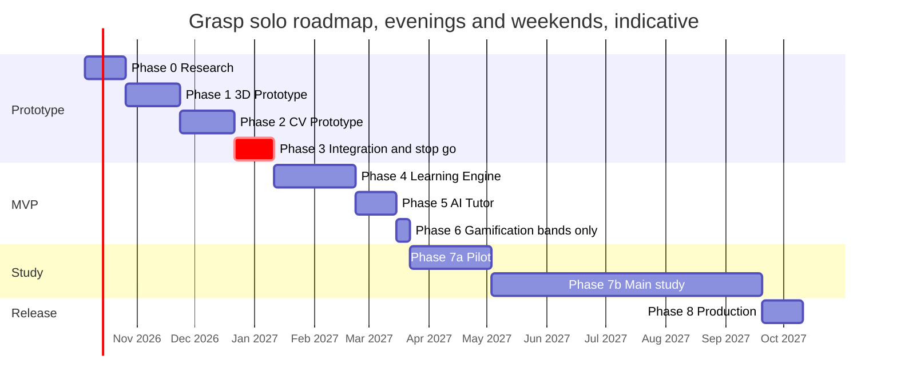
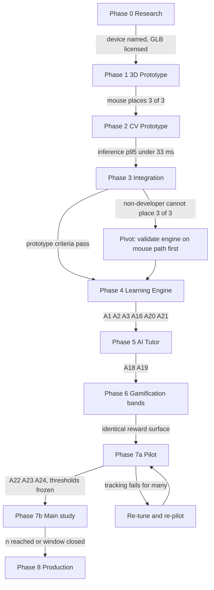

# Development Roadmap

Nine phases take Grasp from a reference-device decision to a frozen study build and a public demo, in the order the brief fixes: research, 3D prototype, computer-vision prototype, integration, learning engine, AI tutor, gamification, user testing, production. Phases 1–3 together build the smallest viable prototype of [00](00-executive-summary.md#smallest-viable-prototype) and end at its stop/go gate; Phases 4–6 complete the **MVP** scope of [12](12-mvp-definition.md); Phase 7 runs the pilot and then the main study of [14](14-evaluation-methodology.md); Phase 8 defines "production" as the frozen study build plus a public demo on hobby-budget infrastructure. Durations are for one developer working evenings and weekends; everything through Phase 7's pilot is **MVP**, the main study and anything after it is **V1**.

## How to read the estimates

| Unit | Assumption |
|---|---|
| Evening | 2–3 focused hours on a weekday |
| Weekend day | 6–8 hours |
| Typical week | 3 evenings + 1 weekend day ≈ 15 hours |
| Estimate style | Range in weeks of that cadence, with the hour total in brackets; the upper bound assumes one serious unknown per phase (a library behaving differently from its docs, a GLB that does not split cleanly) |

One position on the brief's ordering: placing Gamification (Phase 6) before User Testing (Phase 7) is right only if Phase 6 is kept to the **MVP** reward layer, which is mastery bands and a progress list and is already produced by Phase 4. XP, badges and quests are **V1** and must not ship into the study build, because a reward stream that correlates with speed favours the mouse condition ([08](08-gamification.md#research-consideration)). Phase 6 is therefore the shortest phase, and the roadmap keeps the brief's heading.

## Phase overview

| Phase | Outcome | Tier | Weeks | Gate to next phase |
|---|---|---|---|---|
| 0 Research | Reference device named, GLB source chosen, MediaPipe and R3F spikes pass, ethics route identified | **MVP** | 2–3 | Reference device and GLB licence confirmed |
| 1 3D Prototype | Heart loads; mouse drag plane and three sockets emit `place`/`drop` | **MVP** | 3–4 | Mouse path places 3 of 3 |
| 2 Computer Vision Prototype | Worker emits `grab_start`/`grab_move`/`grab_end` from `pinch`, `pinch_drag`, `release` | **MVP** | 3–4 | Inference p95 ≤ 33 ms on the reference device |
| 3 CV + 3D Integration | Smallest viable prototype complete; stop/go on the gesture modality | **MVP** | 2–3 | All five prototype criteria pass |
| 4 Learning Engine | Full lesson, five task types, hints, mastery, persistence, consent, logger | **MVP** | 5–7 | A1–A3, A16, A20–A21 of [12](12-mvp-definition.md#mvp-acceptance-criteria) |
| 5 AI Tutor | Template tutor (hint and mistake explanation) behind a flag, guarded, with fallback; then an optional local-model spike behind the measurement gate | **MVP** template, **V1** spike | 2–3 | A18–A19 |
| 6 Gamification | Mastery bands and results screen confirmed; V1 rewards designed, not built | **MVP** bands | 1 | Study flag hides anything beyond bands |
| 7 User Testing | Pilot (8–12 per group), then main study (64 per group) | **MVP** pilot, **V1** main | 6 + 16–26 | Pilot: A22–A24; main: target n or window closed |
| 8 Production | Frozen study build, public demo, archive of content and data exports | **MVP** build, **V1** demo polish | 2–3 | Demo live on free tier; study build tagged |

Indicative calendar, starting the week after this document. Phases 1 and 2 are independent and may interleave if one is blocked; the chart shows them sequentially because one developer rarely gains from switching.

The whole programme is roughly a year of evenings and weekends; the main study's recruitment window dominates and is the least controllable item.

## Phase 0 — Research

| Field | Content |
|---|---|
| Goal | Remove the unknowns that would otherwise be discovered mid-build: which laptop the 30 fps budget is measured on, where the heart GLB comes from, whether MediaPipe runs in a worker with the GPU delegate on that laptop, and who will review the study |
| Features | None shipped. Two throwaway spikes: (a) `HandLandmarker` in a Web Worker at 640×360 logging inference ms; (b) a Draco GLB of any ten-part object in R3F with `r3f-perf`, no interaction |
| Technologies | `@mediapipe/tasks-vision`, React Three Fiber, `gltf-transform`, Blender (to inspect candidate GLBs) |
| Deliverables | Reference device named and written into [00](00-executive-summary.md#open-questions) and [05 §10](05-3d-interaction.md#10-render-performance-budget); GLB source chosen with licence text saved ([12](12-mvp-definition.md#model-heart_v1-components-and-sockets)); spike numbers (inference p95, worker vs main-thread path, Safari behaviour); ethics contact and timeline; the first prototype plan written as [17](17-first-prototype-plan.md) |
| Risks | Spike shows inference p95 > 33 ms on the reference device (fallback: alternate-frame main-thread path, or a better reference device, decided here, not later); no suitable CC heart model exists (fallback: commission in V1, or build only the six grabbable parts and treat the rest as a single scenery mesh); ethics review takes months (start the application now, run the pilot as a hobby pilot with full consent in the meantime) |
| Success criteria | Both spikes run on the reference laptop with numbers logged; GLB licence permits modified redistribution; doc 17 exists and names the milestones Phases 1–3 map onto |
| Duration | 2–3 weeks (30–45 h) |
| Governing docs | [00](00-executive-summary.md), [01](01-product-definition.md), [04](04-computer-vision.md#library-decision), [10](10-3d-content-system.md), [14 §7](14-evaluation-methodology.md#7-ethics-consent-and-data-minimisation) |

## Phase 1 — 3D Prototype

| Field | Content |
|---|---|
| Goal | Prove the scene half of the loop with a mouse: load `heart_v1`, grab a part, move it on a camera-facing drag plane, release into a socket, emit `place` or `drop` |
| Features | Doc 17 M0, M5, M6: repo and toolchain; R3F scene with three primitive parts standing in for `aorta`, `pulmonary_artery`, `left_ventricle`; `userData.componentId` from mesh names; raycast on the interactable layer; drag plane and offset; three sockets (`socket_aorta`, `socket_pulmonary_artery`, `socket_left_ventricle`) with radius snap; `select`, `place`, `drop` scene events; the `InputSource` mouse adapter emitting `grab_start`, `grab_move`, `grab_end`; cursor-to-raycast hover tint (`hover_result`); `r3f-perf` and console `perf_sample`. The GLB pipeline script is prepared here; the real `heart_v1` GLB lands at M9 in Phase 3. No orbit: doc 17 excludes it from the prototype |
| Technologies | Next.js App Router, React Three Fiber, Drei (`useGLTF`, `Html`), Three.js raycaster, Zustand with transient subscriptions, `gltf-transform` CLI |
| Deliverables | One route with three primitive parts and three sockets; manifest `heart_v1.json` scaffolded; the GLB pipeline script; a three-task `place` lesson JSON with hints empty; a replay fixture of mouse events producing `place` events |
| Risks | Adapted GLB does not split at chamber boundaries (retopology time; mitigate by splitting only the six grabbable parts first); per-frame React state slips in and breaks the budget (assert zero commits during drag from day one); drag-plane offset feels wrong when the component origin is off-centre (apply origins at centroid in Blender before anything else) |
| Success criteria | Mouse user places 3 of 3 parts on the first try; frame p95 ≤ 33 ms with the scene idle at demand frameloop and ≤ 33 ms during drag; 0 React commits per frame during drag; GLB < 5 MB |
| Duration | 3–4 weeks (45–60 h), of which the Blender split is 1–2 weekends |
| Governing docs | [05](05-3d-interaction.md), [10](10-3d-content-system.md), [17](17-first-prototype-plan.md) |

## Phase 2 — Computer Vision Prototype

| Field | Content |
|---|---|
| Goal | Prove the vision half of the loop in isolation: a webcam frame becomes a smoothed cursor and `grab_start`/`grab_move`/`grab_end` events from `pinch`, `pinch_drag` and `release`, inside the latency budget |
| Features | Doc 17 M1–M4: `getUserMedia` at 640×360; `ImageBitmap` transfer to a Web Worker; `HandLandmarker` with GPU delegate and main-thread half-rate fallback; One-Euro on landmarks and cursor; `handSize` normalisation; pinch hysteresis 0.25/0.40 with hold frames; the `GRABBING`/`DRAGGING`/`LOST` subset of the state machine with the 1 s grace period; `tracking_lost`/`tracking_regained`; `cv_status` channel; developer-only `gesture_debug` overlay drawing landmarks on a mirrored preview |
| Technologies | `@mediapipe/tasks-vision` self-hosted WASM and `.task`, Web Worker with `OffscreenCanvas`, TypeScript event contract from `packages/types` |
| Deliverables | `packages/vision` with the worker, FSM and a replayable test harness fed by recorded feature streams (not landmarks); a debug page showing cursor, pinch distance and state; `perf_sample` with `inferenceMsP50/P95`, `fps`, `path` |
| Risks | GPU delegate unavailable in the worker on the reference device (fallback path must be built in this phase, not promised); pinch thresholds wrong for the developer's own hand size (test with at least two other people before Phase 3); Safari `OffscreenCanvas` gaps (document as fallback, do not chase) |
| Success criteria | Inference p95 ≤ 33 ms in the worker path on the reference device; pinch false-start rate ≤ 10% on a scripted 20-pinch sequence by two non-developers; no `grab_end` with `reason: "release"` emitted during a simulated 1 s tracking gap |
| Duration | 3–4 weeks (45–60 h) |
| Governing docs | [04](04-computer-vision.md), [17](17-first-prototype-plan.md) |

## Phase 3 — CV + 3D Integration

| Field | Content |
|---|---|
| Goal | Join the two halves into the smallest viable prototype and make the stop/go decision on the gesture modality |
| Features | Doc 17 M7–M11: worker events into the scene's `InputSource`; cover-fit and mirror in the coordinate chain; `hover_result` fed back to the worker for the grabbable-under-cursor rule; the `LOST` grace period settling without snapping; cursor drawn on the canvas; deterministic place check with text-and-colour verdict at the object (M8); the real `heart_v1` GLB replacing the primitives (M9); event log in the `LogEvent` shape to console (M10); hallway test and tuning pass (M11). After the gate passes: `open_palm` and `point` with dwell select, completing the five-gesture state machine |
| Technologies | Same as Phases 1–2; no additions |
| Deliverables | The prototype of locked position 10, on one page, no auth, no database, no AI; a recorded session showing three placements; `perf_sample` log for the session; written stop/go decision |
| Risks | Combined frame time exceeds 33 ms even though each half passed alone (apply the degrade ladder: dpr 1.0, skip alternate inference frames); cover-fit makes frame edges unreachable in a way that hides a socket (tune `reachScale`); pinch flicker drops parts mid-drag (widen hysteresis gap from logs) |
| Success criteria | All five prototype criteria in [00](00-executive-summary.md#smallest-viable-prototype): 3 of 3 placements first try by a non-developer within 2 minutes with a window behind them; frame p95 ≤ 33 ms; inference p95 ≤ 33 ms; false starts ≤ 10%; no `place` during or after `tracking_lost` |
| Duration | 2–3 weeks (30–45 h), including one weekend for `open_palm` and `point` after the gate |
| Governing docs | [00](00-executive-summary.md), [04](04-computer-vision.md#interaction-event-contract), [05 §2](05-3d-interaction.md#2-coordinate-translation-chain), [17](17-first-prototype-plan.md) |

### Mapping Phases 1–3 onto the first prototype plan

The [milestone table in 17](17-first-prototype-plan.md#milestone-sequence) is authoritative for milestone names, order and hours; this roadmap maps them onto its phases.

| Doc 17 milestone | Roadmap phase | Exit evidence |
|---|---|---|
| M0 repo and toolchain | Phase 1 | Monorepo builds; packages scaffolded |
| M5 R3F scene, three primitive parts, three sockets, mouse drag | Phase 1 | Mouse places a part |
| M6 cursor-to-raycast hover and highlight | Phase 1 | Hit component tints under the cursor |
| M1 camera feed and landmarks on a 2D overlay | Phase 2 | Landmarks drawn at camera frame rate |
| M2 One-Euro smoothing and the cursor | Phase 2 | Jitter within budget at rest |
| M3 pinch and release state machine with HUD glyph | Phase 2 | False-start rate on a scripted sequence; no `grab_end` with `reason: "release"` during a 1 s gap |
| M4 Web Worker inference with fallback and perf readout | Phase 2 | Inference p95 logged on the reference device |
| M7 pinch grab, drag plane, release, snap | Phase 3 | Gesture places a part |
| M8 deterministic place check with correct or incorrect feedback | Phase 3 | Correct and incorrect verdicts from three-task JSON |
| M9 real heart GLB | Phase 3 | `heart_v1` under 5 MB loads and places |
| M10 event log in the `LogEvent` shape | Phase 3 | `perf_sample` and interaction events in the console log |
| M11 hallway test and tuning pass | Phase 3 | Three placements by a non-developer; written stop/go decision |

Phases 1 and 2 correspond to doc 17's two independent tracks (3D and CV) and may interleave; Phase 3 begins at M7 where the tracks join. The gate criteria do not move.

## Phase 4 — Learning Engine

| Field | Content |
|---|---|
| Goal | Turn the prototype into the full **MVP** lesson with deterministic evaluation, persistence and the privacy and consent machinery, so that a pilot session can be run with static hints only |
| Features | Whole-model orbit via `pinch_drag` on empty space (deferred from the prototype, see doc 17); `packages/learning` with `evaluate`, `countsAsAttempt`, the hint ladder, remediation sequence, mastery function and unlock rule; all six activities and twelve tasks of `anatomy.heart.chambers_v1`; the remaining three sockets and the `exploded` pose; `identify` dwell select, `sequence`, `compare`; `pnpm content:validate` and the `/dev/model/[id]` review page; HUD (instruction line, progress chip, hint button, feedback banner, hand-state chip, camera preview, controls strip); all seven failure states on screen; anonymous sessions (`POST /api/session`, cookie); attempts and progress routes; event logger with `seq`, batching, `sendBeacon`, JSON download; consent screen before camera; 15-minute soft prompt logged as `time_prompt` (no hard cap); delete and export endpoints; `contentHash` stamping; Postgres via Drizzle on Neon or Supabase; Docker Compose locally |
| Technologies | Zod (shared schemas), Drizzle ORM, Neon serverless driver or `postgres.js`, Tailwind + Radix, Vercel free tier |
| Deliverables | Full lesson playable in both input modes; fixture tests replaying recorded `LogEvent` streams to assert mastery; the research tables of [09](09-database.md); a metrics script computing every [14 §2](14-evaluation-methodology.md#2-metric-groups) metric from one session; the automated test that intercepts `fetch`, `sendBeacon` and IndexedDB to prove no image or landmark data leaves the page |
| Risks | Scope is the largest of any phase; mitigate by building in the order engine → lesson content → HUD → persistence → consent, each demoable alone. Per-frame data leaking into React state as the HUD grows (keep the zero-commit assertion). Free-tier Postgres connection caps under batch inserts (batching already specified; test with 10 simulated sessions). Schema requests in [06](06-learning-engine.md#schema-clarifications-and-requests) (activity-level socket visual, `tutor: true` fallback text) must be settled with the `lesson-schema` skill before content is frozen |
| Success criteria | [12](12-mvp-definition.md#mvp-acceptance-criteria) A1, A2, A3, A9, A16, A20, A21; mouse and keyboard complete every task; a cold reload resumes the current task from the attempt log |
| Duration | 5–7 weeks (75–105 h) |
| Governing docs | [03](03-system-architecture.md), [06](06-learning-engine.md), [09](09-database.md), [10](10-3d-content-system.md), [11](11-ui-ux.md), [14 §6](14-evaluation-methodology.md#6-event-log-schema-and-instrumentation-requirements) |

## Phase 5 — AI Tutor

| Field | Content |
|---|---|
| Goal | Add the template tutor (hint and mistake explanation) behind a per-session flag, with guardrails and a fallback that makes the lesson indifferent to tutor failure; then, optionally and separately, measure whether a locally run open-weights model earns its place at **V1**. No paid LLM API at any point |
| Features | `POST /api/tutor` behind the `TutorService` interface; `TemplateTutorService` in `packages/tutor` filling fixed templates from the hint ladder and manifest `description`, `relations`, `tags`; Zod output validation with manifest-id and reveal checks; static fallback; call caps per attempt, task and session; `ai_interactions` table (`engine`, `status`, consent-gated payload columns); `tutor_message` events; tutor panel and "Explain" pill in the HUD (the free-text "Ask tutor" pill is **V1**); `tutorEnabled` session flag. Optional spike after the MVP criteria pass: `LocalTutorService` against Ollama on the lab laptop or WebLLM in the browser, selected by `TUTOR_ENGINE=local` |
| Technologies | `packages/tutor` (pure TypeScript, no new dependency). Spike only: Ollama or WebLLM with an open-weights model; no model names or prices in docs or code |
| Deliverables | Working template tutor on `t_g2` level 2 and `t_g3` level 3 and on every `explain_mistake` path in guided and challenge; a template test suite covering every task and hint level with adversarial scene states; the fallback demonstrated by forcing the cap mid-lesson. Spike (if run): a measurement log of p50/p95 hint latency and frame time over at least 50 calls on the reference laptop, and a written keep-or-discard decision |
| Risks | Template text reads as repetitive or reveals too much at level 2 (fix the templates and the manifest descriptions, which is content work, not engine work); the spike tempting a change of engine before measurement (the gate is numeric: 3.5 s p95 hint latency and no loss of the 30 fps budget, else discard); WebLLM download size and GPU contention with MediaPipe and R3F (measure in the spike, never in the pilot build) |
| Success criteria | A18 and A19 of [12](12-mvp-definition.md#mvp-acceptance-criteria); a lesson with the flag off is byte-identical in events to one where every tutor call is capped; the pilot build ships `TUTOR_ENGINE=template` regardless of the spike outcome |
| Duration | 2–3 weeks (30–45 h) |
| Governing docs | [07](07-ai-tutor.md), [03](03-system-architecture.md#one-tutor-hint-request), [09](09-database.md) |

## Phase 6 — Gamification

| Field | Content |
|---|---|
| Goal | Confirm the **MVP** reward layer is exactly mastery bands and the progress list, hide everything else behind the study flag, and design (not build) the V1 reward table |
| Features | Mastery bands (not started, developing, approaching, mastered) on the mastery activity and results screen; "Review the parts you missed"; study-mode flag that hides any XP line; the unlock rule surfaced as "next lesson" text. **V1**, designed only: XP from `task_attempt` scores, badges on objective mastery and recovery, review quests from mastery age |
| Technologies | None new; a config file for V1 thresholds |
| Deliverables | Results screen reviewed against [08](08-gamification.md#event-to-reward-table) and [11](11-ui-ux.md#major-screens); a written V1 reward spec; an explicit check that no event in the study build correlates a reward with speed or task count |
| Risks | Temptation to ship XP because it is cheap; the risk is to the study, not the code. Mitigation: the study flag is set server-side with the condition and cannot be toggled from the client |
| Success criteria | Both conditions see an identical reward surface; nothing in the unlock or mastery code path reads a reward value (unit test) |
| Duration | 1 week (10–15 h) |
| Governing docs | [08](08-gamification.md), [06](06-learning-engine.md#progress-mastery-and-the-separation-from-xp) |

## Phase 7 — User Testing

Two sub-phases. The pilot is **MVP** and exists to fix the instrument; the main study is **V1** and exists to answer RQ1–RQ3. Pilot data are never pooled into the main analysis.

### 7a Pilot study

| Field | Content |
|---|---|
| Goal | Rehearse the full protocol with 8–12 participants per condition, fix tracking thresholds and instruments, and freeze them |
| Features | Calibration tutorial with 20 scripted prompts and the mouse equivalent; condition entry by pre-assigned code; in-app pre/post test, SUS, raw TLX, satisfaction, open questions writing to `instrument_responses`; online retention page; three 15-item knowledge forms; the metrics script run on every session; the Phase E study materials (consent form, session script, researcher checklist) |
| Technologies | Same stack; a standardised room, laptop, webcam and lighting |
| Deliverables | Pilot report (descriptive only): calibration accuracy, lost fractions, false-start rates, item difficulty, form means, session timing; frozen thresholds and forms; change log in the `research-protocol` skill; pre-registration draft |
| Risks | Tracking fails for some participants' hand size or lighting (the pilot's purpose; fix thresholds and the lighting overlay, re-pilot those cases); post-test ceiling (pilot means above 12 of 15 force harder items); mouse condition reveals a missing affordance (fix before freezing); the researcher unconsciously helps the gesture group (scripted session, researcher out of view) |
| Success criteria | A22–A24 of [12](12-mvp-definition.md#mvp-acceptance-criteria) plus every item on the pilot checklist in [14 §5](14-evaluation-methodology.md#5-pilot-versus-main-study): tracking works for all participants, mouse condition complete, forms within 1 point, event log reconstructs each attempt, session ≤ 45 minutes |
| Duration | 6 weeks (recruiting dominates; 40–60 h of developer time including fixes) |
| Governing docs | [14](14-evaluation-methodology.md), `research-protocol` skill, [11](11-ui-ux.md) |

### 7b Main study

| Field | Content |
|---|---|
| Goal | Collect the pre-registered sample on the frozen build and run the pre-registered analysis |
| Features | No product changes. The build is tagged; content ids and `contentHash` are immutable; only hardware-failure interventions are allowed and logged |
| Technologies | Same build; analysis in R or Python from the exported tables |
| Deliverables | 64 per group (recruit 75 for attrition), or a pre-registered effect-size estimation if recruitment caps near 30 per group; ANCOVA on post and retention with pre-test covariate; mixed-effects model on task correctness; SUS and TLX comparison; exploratory tracking-quality regression; a paper draft with limitations (single lesson, single domain, novelty) stated |
| Risks | Recruitment shortfall (declare the estimation design early rather than report an underpowered null); differential S2 attrition (reminder at day 6, ITT analysis); a build bug found mid-study (fix only if it affects data integrity, document as an amendment, otherwise defer to Phase 8) |
| Success criteria | Target n reached or the recruitment window closed; every session's event log passes the metrics script; analysis matches the pre-registration |
| Duration | 16–26 weeks of calendar time; 20–40 h of developer time for sessions, exports and analysis |
| Governing docs | [14 §3](14-evaluation-methodology.md#3-academic-study-design), [14 §4](14-evaluation-methodology.md#4-threats-to-validity) |

## Phase 8 — Production

"Production" here means two artefacts, both on hobby-budget infrastructure (locked position 9): the frozen study build, archived so the study is reproducible, and a public demo of the same lesson for anyone with a webcam or a mouse.

| Field | Content |
|---|---|
| Goal | Make the study reproducible and the lesson publicly usable without adding cost, accounts or scope |
| Features | Study build tagged with content hashes and a data-export archive of the four research tables (pseudonymous); public demo build on Vercel free tier with the template tutor and its call caps, mouse mode offered when no camera, consent replaced by a plain privacy notice (no logging without opt-in), demo-mode flag hiding study instruments; error tracking: none in **MVP**, Sentry free tier at **V1** with `sessionId` scrubbed from every event ([19](19-tech-stack-and-final-diagram.md)); a short README for the repo; attribution for the adapted GLB |
| Technologies | Vercel free tier, Neon or Supabase free Postgres, object storage with CDN, GitHub release tag; no paid service |
| Deliverables | Tagged release; archived exports; live demo URL; the limitations page stating what the demo does not do (depth, mobile, accounts) |
| Risks | Free Postgres sleeping on first request (acceptable; the demo logs nothing by default); a popular demo exceeding Vercel free bandwidth for the GLB (immutable caching; then Cloudflare R2's zero-egress free tier, per [10](10-3d-content-system.md#glb-hosting), never a paid plan). The tutor has no per-call cost, so public traffic cannot run up a bill |
| Success criteria | Demo completes the lesson in both modes from a fresh browser; study build reproduces a pilot session's metrics from its archived events; monthly cost remains zero |
| Duration | 2–3 weeks (30–45 h) |
| Governing docs | [03](03-system-architecture.md), [15](15-risks-security-scalability.md), [16](16-folder-structure.md), [19](19-tech-stack-and-final-diagram.md) |

Anything beyond this (accounts, second lesson, teacher view, the postponed gestures) is the **V1** backlog and begins only after the study's data are in.

## Gates and what passes through them

## What could cause us to stop or pivot

Drawn from the stop/go thinking in [00](00-executive-summary.md#smallest-viable-prototype) and the gate criteria above. Each has a named signal and a named response so the decision is not made under sunk-cost pressure.

| Signal | When observed | Response |
|---|---|---|
| A non-developer with a window behind them cannot place 3 of 3 parts on the first try | Phase 3 gate | Pivot: build Phases 4–6 on the mouse path, treat gesture as an experimental input, and revisit CV only after the lesson is validated. The study becomes mouse-only pre/post until gesture passes |
| Inference p95 > 33 ms on the reference device even on the fallback path | Phase 0 spike or Phase 2 | Raise the reference device specification once and record it; if still failing, the gesture condition is restricted to machines that pass a start-up benchmark, which the study reports as an inclusion criterion |
| Combined frame time fails after the degrade ladder | Phase 3 | Cut GLB triangles on scenery first, then inference to alternate frames; if the loop still exceeds 33 ms, accept 24 fps and state it, since the budget is a means, not the research question |
| Pinch false-start rate stays above 10% across two non-developers after calibration | Phase 2–3 | Widen hysteresis and hold frames; if unfixable, replace `pinch` with `point` dwell for grab (slower but stable) and record the change as a deviation from locked position 3 for the user to approve |
| No CC-licensed heart model separates cleanly and commissioning is unaffordable | Phase 0–1 | Reduce to six grabbable parts plus one scenery mesh; `identify` distractors become hotspots on the scenery mesh. Weaker, but the loop is intact |
| A **V1** local-model spike misses the 3.5 s p95 hint budget or costs frame time | Phase 5 spike (optional) | Discard the spike and keep `TUTOR_ENGINE=template`; the budget is not loosened and a hosted API is never the fallback |
| Pilot shows tracking failures for a substantial fraction of participants after re-tuning | Phase 7a | Pre-register per-protocol exclusion and report it; if the excluded fraction exceeds roughly one in five, the study question changes to "for whom does gesture tracking work", which is still publishable |
| Recruitment projects fewer than 30 per group | Early Phase 7b | Re-register as effect-size estimation with confidence intervals; do not report an underpowered null as a finding |
| Ethics approval refused or delayed past the recruitment window | Phase 0–7a | Run the hobby pilot with full consent and data rules for instrument development only; publish nothing from it; resubmit |
| Monthly cost exceeds zero | Any phase | Stop and find the leak; the no-paid-tools rule (2026-10-05) and locked position 9 are constraints, not preferences |
| Any proposal to reverse a locked position | Any phase | Stop and ask the user; do not implement first |

## Open questions

1. Should Phases 1 and 2 be run in parallel across alternate weeks to surface the integration risk earlier, at the cost of context switching for one developer? This roadmap assumes sequential.
2. Is a 16–26 week main-study window realistic for the researcher's recruitment pool? If not, the Phase 7b row should be re-planned as effect-size estimation from the start rather than as a fallback.

## Related

- [00 Executive summary](00-executive-summary.md): the three hardest problems and the prototype whose gate ends Phase 3
- [12 MVP definition](12-mvp-definition.md): the scope Phases 4–6 complete and the acceptance criteria used as gates
- [14 Evaluation methodology](14-evaluation-methodology.md): pilot and main study that are Phase 7
- [17 First prototype plan](17-first-prototype-plan.md): milestone sequence Phases 1–3 map onto
- [03 System architecture](03-system-architecture.md), [04 Computer vision](04-computer-vision.md), [05 3D interaction](05-3d-interaction.md), [06 Learning engine](06-learning-engine.md), [07 AI tutor](07-ai-tutor.md), [08 Gamification](08-gamification.md), [09 Database](09-database.md), [10 3D content system](10-3d-content-system.md), [11 UI/UX](11-ui-ux.md): the governing docs per phase
- [15 Risks, security, scalability](15-risks-security-scalability.md), [16 Folder structure](16-folder-structure.md), [19 Tech stack and final diagram](19-tech-stack-and-final-diagram.md): Phase 8 references
