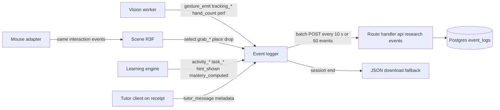

# Evaluation Methodology

This file turns Grasp into a measurement instrument. It defines every metric as a formula over the event-log schema so an engineer can implement it without interpretation, fixes the academic study design (between-subjects, gesture versus mouse, identical heart lesson), names the threats to validity and their mitigations, and states the instrumentation and ethics requirements that the other docs must honour. Tier: mostly **MVP** (pilot-ready logging and instruments) with the main study at **V1**.

## 1. What the evaluation must answer

| ID | Research question | Primary measure | Tier |
|---|---|---|---|
| RQ1 (learning) | Does gesture-based 3D interaction produce higher post-test and one-week retention scores than mouse-based interaction on the identical lesson? | Post-test and retention score, pre-test as covariate | **MVP** pilot, **V1** main |
| RQ2 (process) | Do interaction patterns (time per task, error types, hint use) differ between conditions, and do they mediate learning gain? | Task-level event-log metrics | **MVP** pilot, **V1** main |
| RQ3 (usability and load) | How do SUS and NASA-TLX compare, and does tracking quality predict either? | SUS, raw TLX, tracking-lost seconds, false-start rate (`grab_move_summary.firstMoveMs` null or > 300 ms; section 2.1) | **MVP** pilot, **V1** main |

The mouse condition (locked position 8) is non-negotiable. The intervention bundles two things: an interactive 3D model with declarative evaluation, and embodied gesture input. Without a control that keeps the first and removes the second, any gain is attributable to "interactive 3D" in general, which is already well studied, and the study says nothing about gesture control. Both conditions run the same lesson JSON, GLB, engine, tutor and feedback. Only the input layer differs.

One weak assumption in the brief: it implies gesture control should improve learning. The honest hypothesis is two-sided. Gesture input may add extraneous cognitive load (RQ3) that cancels any embodiment benefit. The design below can detect either outcome.

## 2. Metric groups

Notation: `E` is the ordered set of `LogEvent` records for one session (schema in section 6). `n(type)` is the count of events of that type; `t(e)` is the event's `t` field in ms; `Σ` sums over matching events. Lesson duration `T = t(last activity_end) − t(first activity_start)`. Learner-facing instruments (tests, SUS, TLX) are stored as `instrument_responses`, not as events.

### 2.1 Computer Vision metrics

These apply to the gesture condition only. The mouse condition emits no `tracking_*`, `gesture_*` or `perf_sample.inference*` fields.

**Ground truth for gesture accuracy.** There is no way to score a classifier without knowing what the hand actually did, and video is never stored. The ground truth therefore comes from the **calibration tutorial** every gesture-condition participant completes before the lesson: a scripted sequence of 20 prompts (`open_palm` ×4, `point` ×4, `pinch` ×4, `pinch_drag` ×4, `release` ×4, shuffled, each with a 3 s response window). The tutorial emits `calibration_prompt { promptNo, expectedGesture, windowMs }` and the vision layer emits `gesture_emit { gesture, confidence }` on every state-machine transition. Within a window, the first `gesture_emit` is the classifier's answer; no emission is a miss. This measures accuracy under cooperative, scripted conditions, which is an upper bound; in-lesson quality is estimated from the proxy metrics below. A participant-pressed "that was not me" key (`misfire_report`) gives in-lesson false-positive ground truth at **V1**.

| Metric | Formula over `E` | Target | Tier |
|---|---|---|---|
| Gesture accuracy | `TP / n(calibration_prompt)` where TP = windows whose first `gesture_emit.gesture == expectedGesture` | ≥ 0.90 in pilot | **MVP** |
| Precision (per gesture g) | `TP_g / (TP_g + FP_g)`; `FP_g` = windows where first emit is `g` but `expectedGesture != g`, plus `gesture_emit` of `g` outside any window during calibration | ≥ 0.90 for `pinch`, `release` | **MVP** |
| Recall (per gesture g) | `TP_g / n(calibration_prompt where expectedGesture == g)` | ≥ 0.90 | **MVP** |
| False-positive rate (in lesson, proxy) | `falseStarts / n(grab_move_summary)`, over closed grabs only (numerator and denominator both from `grab_move_summary`, so a grab still open at session end counts in neither), gesture condition only (the replay script prints n/a for mouse logs); falseStart = a `grab_move_summary` with `firstMoveMs == null` (never moved) or `firstMoveMs > 300` (no `grab_move` within 300 ms, the rule in [15](15-risks-security-scalability.md) challenge 10). `durationMs` and `pathLengthNorm` cannot express this: a drag that first moves at 400 ms has a non-zero path yet is a false start. Implemented as `FALSE_START_MS` and `falseStartRate()` in `packages/learning/src/logger.ts`; `scripts/research/replay-log.ts` reports it per session | ≤ 0.10 | **MVP** |
| False-positive rate (reported) | `n(misfire_report) / (n(grab_start) + n(select))` | report only | **V1** |
| Tracking stability: lost rate | `n(tracking_lost) / (T / 60000)` per minute | ≤ 2 per min | **MVP** |
| Tracking stability: lost fraction | `Σ tracking_regained.payload.durationMs / T` | ≤ 0.05 | **MVP** |
| Tracking stability: cursor jitter | mean of `perf_sample.jitterNorm` (RMS cursor displacement in normalised units over the sample window while state is IDLE or HOVER and velocity < 0.02 width/s); computed in the worker from the cursor, never from stored landmarks | ≤ 0.005 | **MVP** |
| Inference latency | median and 95th percentile of `perf_sample.inferenceMsP50` and `inferenceMsP95` across the session | p95 ≤ 33 ms | **MVP** |
| End-to-end latency | median of `perf_sample.e2eMsP50`: bitmap capture timestamp to scene apply timestamp, measured in the main thread | p50 ≤ 100 ms | **MVP** |
| Effective frame rate | mean `perf_sample.fps`; `n(hand_count where n > 1)` reported alongside | ≥ 30 | **MVP** |

Limitation: calibration accuracy is measured once on a cooperative hand and overstates in-lesson accuracy. The false-start proxy undercounts false positives followed by a drag. It also overcounts deliberate pinch-to-select: a `select` with `method: "grab"` in an `identify` task never moves, so it counts as a false start. Once identify tasks exist (Phase 4), the analysis restricts the rate to grabs with `componentId != null` during `place` tasks; the prototype has only place tasks, so the bias is absent there. Both limitations are reported as such.

### 2.2 3D Interaction metrics

Apply to both conditions. The mouse condition maps pointer events to the same interaction-event vocabulary (`hover`, `grab_start`, `grab_move`, `grab_end`), so these formulas are condition-neutral. That mapping is a requirement on [05-3d-interaction.md](05-3d-interaction.md).

| Metric | Formula over `E` | Tier |
|---|---|---|
| Interaction success rate | `n(place) / n(grab_start where payload.componentId != null)`; a grab ending in `drop` or in `grab_end.reason == "lost"` counts as unsuccessful. Drops with `drop.cause == "lost"` (the scene field in [05](05-3d-interaction.md)) are reported separately as loss-caused; the engine does not evaluate them as task attempts, so they never appear as `task_attempt.correct == false` | **MVP** |
| Selection accuracy | `n(task_attempt where taskType == "identify" and correct) / n(task_attempt where taskType == "identify")` | **MVP** |
| Placement accuracy | `n(task_attempt where taskType == "place" and correct) / n(task_attempt where taskType == "place")`; `partial` reported separately as right component, wrong socket | **MVP** |
| Task completion time | per task: `t(task_end) − t(task_start)`; session: median over tasks, reported by task type | **MVP** |
| Time to first attempt | `t(first task_attempt for taskId) − t(task_start)`; separates "thinking" from "doing" | **MVP** |
| Attempts per task | `n(task_attempt for taskId)`; mean over tasks completed | **MVP** |
| Orbit use | `n(grab_move_summary where componentId == null and firstMoveMs != null)` (the hand moved, so it orbited) and the summed `durationMs` of those summaries. Misses are reported separately: `n(grab_move_summary where componentId == null and firstMoveMs == null)`. Once orbit ships, every no-hit pinch is an orbit ([05](05-3d-interaction.md)), so the split comes from movement, with no extra field. The M10 prototype has no orbit, so there every null `componentId` is a miss | **MVP** |

Limitation: gesture-condition task time includes time lost to tracking failures. Report raw time and active time (`raw − Σ tracking_regained.durationMs` within the task); active time is the pre-registered primary.

### 2.3 Learning metrics

Scores come from `instrument_responses`; mastery and task completion come from the engine's events.

| Metric | Formula | Tier |
|---|---|---|
| Pre-test score | sum of correct items on form assigned at S1 start, 0–15 | **MVP** |
| Post-test score | sum of correct items on form assigned at S1 end, 0–15 | **MVP** |
| Normalised gain | `(post − pre) / (15 − pre)`; undefined if `pre == 15` (exclude, pre-registered) | **MVP** |
| Knowledge retention | retention-test score at S2 (+7 days), 0–15; relative retention `retention / post` reported secondarily | **MVP** |
| Task completion | `n(distinct taskId with task_attempt.correct) / n(distinct taskId with task_start)` over non-introduction activities | **MVP** |
| Mastery rate | from `mastery_computed { objectiveId, mastery, threshold }` emitted at the mastery activity: `n(objectives where mastery ≥ threshold) / n(objectives)`; mastery itself is computed by the engine per the [lesson-schema](06-learning-engine.md) rule, weighted mean of latest attempt scores with assessment tasks at 2× | **MVP** |
| Per-objective mastery | `mastery_computed.payload.mastery` per objective, used in RQ2 mediation | **MVP** |
| Hint dependence | `n(hint_shown) / n(task_start)`; by hint level | **MVP** |

Limitation: a 15-item test has a ceiling. Pilot means above 12 on the post-test mean the test must be lengthened or hardened before the main study.

### 2.4 UX metrics

| Metric | Instrument and formula | Tier |
|---|---|---|
| SUS | 10 items, 1–5. `score = 2.5 × Σ_i ((odd i: r_i − 1), (even i: 5 − r_i))`, 0–100 | **MVP** |
| Task difficulty (NASA-TLX, raw) | six subscales (mental, physical, temporal, performance, effort, frustration) on 21-point scales ×5 → 0–100; `rawTLX = mean of six`; no pairwise weighting | **MVP** |
| Engagement: active ratio | `(T − idle) / T` where idle = Σ gaps > 10 s with no `hover`, `grab_*`, `select` or `tutor_message` | **MVP** |
| Engagement: voluntary exploration | time in `explore` activity beyond its minimum completion, and `n(select where hotspotId != null)` | **MVP** |
| Engagement: tutor use | `n(tutor_message where payload.kind in ("hint", "explain_mistake") and payload.source == "tutor")`; by `kind` and `hintLevel`. `source == "static"` messages (authored hint shown because the tutor fell back) are reported separately via `status` | **MVP** |
| User satisfaction | single item "I would use this again" 1–7, plus three open questions (hardest part, when tracking failed, suggestions), coded thematically | **MVP** |
| Perceived tracking quality | single item 1–7, gesture condition only; correlated with lost fraction as a manipulation check | **MVP** |

Limitation: SUS and TLX are self-report and novelty-sensitive; they are interpreted alongside log metrics, never alone.

## 3. Academic study design

### 3.1 Design choice

| Option | Pros | Cons | Fit for solo dev | Verdict |
|---|---|---|---|---|
| Between-subjects, gesture vs mouse, one lesson | No carry-over of heart knowledge; one lesson and one model suffice; clean attribution to input modality | Needs ~2× participants; individual differences add noise (handled by pre-test covariate) | Good: one lesson to build and maintain | **Recommended, MVP** (locked position 8) |
| Within-subjects, two lessons (heart, lungs) | Half the participants; each learner is own control | Needs a second model and a matched-difficulty lesson; order and lesson-difficulty confounds | Poor: doubles content work | Rejected for MVP; **Future** |
| Crossover on the same lesson | Fewest participants | Second exposure to identical content makes the second post-test meaningless | Poor | Rejected |
| Gesture only, pre/post | Cheapest | Cannot separate gesture from 3D interactivity; the central question is unanswerable | Trivial | Rejected; violates locked position 8 |

### 3.2 Protocol

| Element | Specification | Tier |
|---|---|---|
| Conditions | A: gesture (webcam, five MVP gestures). B: mouse and keyboard (click, drag, arrow keys, Enter). Identical lesson `anatomy.heart.chambers_v1`, model `heart_v1`, tutor, hints, feedback | **MVP** |
| Participants | Age 16+, no formal cardiac anatomy beyond school level, normal or corrected vision, able to use one hand freely. Minors with parental consent at **V1** | **MVP** / **V1** |
| Randomisation | Pre-test is scored first; participants are assigned within pre-test tertile (0–5, 6–10, 11–15) using a blocked sequence (block size 4) generated before recruitment. The blocked randomisation list is kept offline by the researcher and never enters the app or database. The app receives only a pre-assigned session code that encodes the condition; it derives `condition` from the code, generates the `sessionId` UUID, and records both on `research_sessions` | **MVP** |
| Session 1 (≤ 45 min, in person) | consent (5) → demographics (2) → pre-test form X (6) → calibration tutorial, gesture or mouse (5) → lesson (12–15) → post-test form Y (6) → SUS, TLX, satisfaction, open questions (6) | **MVP** |
| Session 2 (+7 days ±1, online) | retention test form Z (6), one question on any heart study since S1 | **MVP** |
| Instruments | Three parallel 15-item knowledge forms (labelled-diagram identification, blood-path ordering, short multiple choice), SUS, raw NASA-TLX, satisfaction, open questions | **MVP** |
| Form counterbalancing | Forms A/B/C assigned to pre/post/retention in a Latin square across participants, balanced within condition | **MVP** |
| Setting | Same room, laptop, webcam and lighting for all gesture participants; mouse participants use the same laptop with the webcam covered | **MVP** |

### 3.3 Sample size

Assumption: a medium effect, Cohen's `d = 0.5`, on post-test between conditions; `α = 0.05` two-sided; power `0.80`. An independent-samples t-test needs 64 per group (128 total). With ANCOVA and a pre–post correlation of `r ≈ 0.5`, the required n falls to roughly `64 × (1 − r²) ≈ 48` per group. The pre-registered target is **64 per group** so the design is powered even if pre-test correlates weakly. Plan for 15% attrition at S2 and recruit 75 per group.

This is a large commitment for a solo researcher. If recruitment caps at 30 per group, the study is pre-registered as an effect-size estimation study with confidence intervals, not a hypothesis test. Saying so up front is better than an underpowered null.

### 3.4 Analysis plan (pre-registered)

| Level | Analysis | Tier |
|---|---|---|
| Primary (RQ1) | ANCOVA: post-test ~ condition + pre-test. Repeated for retention. Report adjusted means, Cohen's d, 95% CI | **MVP** pilot (descriptive only), **V1** |
| Secondary (RQ3) | SUS and raw TLX: Welch t-test or Mann-Whitney if non-normal. TLX subscales reported with Holm correction | **V1** |
| Secondary (RQ2) | Mixed-effects logistic model: `task_attempt.correct ~ condition × taskType + (1 | participant) + (1 | taskId)` | **V1** |
| Exploratory | Within gesture group: normalised gain ~ tracking lost fraction + false-start rate. Mediation of condition → active time → gain | **V1** |
| Sensitivity | Intention-to-treat (all assigned) and per-protocol (exclude gesture participants with lost fraction > 0.20, threshold pre-registered) | **V1** |
| Pre-registration | Hypotheses, exclusions, primary outcome, analysis code template and the knowledge forms are registered (OSF or AsPredicted) after the pilot and before the first main-study participant | **V1** |

Pilot data are reported separately and never pooled into the main analysis.

## 4. Threats to validity

| Threat | Why it matters here | Mitigation | Tier |
|---|---|---|---|
| Novelty effect | Gesture control is unusual; engagement and SUS may reflect novelty, not learning | Retention test at +7 days; report engagement alongside gain; note in limitations. **Future**: multi-session classroom study | **MVP** |
| Tracking failures confound the gesture condition | Poor lighting or a small hand degrades the treatment; a null may mean "tracking broke", not "gesture does not help" | Calibration tutorial with accuracy gate (≥ 0.80 or re-run once); standardised room and lighting; log lost fraction per participant; pre-registered per-protocol exclusion; exploratory regression on lost fraction | **MVP** |
| Test-form non-equivalence | Pre/post/retention differences could be form difficulty | Three forms counterbalanced in a Latin square; pilot check that form means differ by ≤ 1 point; swap items if not | **MVP** |
| Teaching to the test | Items that echo lesson wording inflate post-test | Items written from a textbook, not from lesson narration; diagram orientations differ from the model's default camera | **MVP** |
| Experimenter effects | The researcher built the gesture system and may unconsciously help that group | Scripted session; on-screen instructions deliver all content; researcher sits out of view after calibration and intervenes only for hardware failure, which is logged | **MVP** |
| Time-on-task imbalance | Gesture is slower, so gesture learners get more exposure, or a hard cap would truncate them before the assessment | No hard cap. At 15 min of lesson time a soft prompt offers the learner the choice to proceed to the assessment; the assessment always runs in full. The prompt and the choice are logged as a `time_prompt` event; the rule is pre-registered. This keeps the 45-min session feasible (most learners accept the prompt) while slower gesture learners are never cut off before the assessment that produces the primary outcome. Active time logged and used as covariate in a secondary model; `time_prompt.choice` and completion rate reported per condition | **MVP** |
| Mouse familiarity | Mouse participants start fluent; gesture participants learn a new input during the lesson | 5 min calibration tutorial for both conditions; time-to-first-attempt reported as a fluency measure | **MVP** |
| Small sample, pilot over-interpretation | 8–12 per group cannot support inference | Pilot reported descriptively; no p-values; its only purpose is to fix instruments and tracking | **MVP** |
| Differential attrition at S2 | Frustrated gesture participants may skip retention | Online S2 takes 6 min; reminder at day 6; attrition by condition reported; ITT analysis | **V1** |
| Ceiling and floor effects | 15 items; school-level learners may know chambers already | Pre-test stratification; pilot item analysis (drop items with p > 0.9 or < 0.2) | **MVP** |
| Self-selection and Hawthorne | Technology enthusiasts volunteer; observation changes behaviour | Recruitment text says "a 3D anatomy lesson" without naming gestures; assignment hidden until after pre-test; identical setting for both conditions so observation effects do not differ | **MVP** |

Tutor wording is not a threat in MVP: the template engine ([07-ai-tutor.md](07-ai-tutor.md)) returns byte-identical text for the same mistake at the same hint level in both arms, so every logged `tutor_message` is reproducible from its request and tutor variability cannot differ between conditions; any **V1** local model must pass the same reproducibility gate before study use.

## 5. Pilot versus main study

| Aspect | Pilot | Main study |
|---|---|---|
| Tier | **MVP** | **V1** |
| Sample | 8–12 per group, convenience | 64 per group, stratified random assignment |
| Purpose | Fix tracking thresholds, verify event log reconstructs each attempt, check form equivalence, time the session, confirm the mouse condition has no missing affordances | Test RQ1–RQ3 |
| Analysis | Descriptive only: means, lost fractions, calibration accuracy, item difficulty | Pre-registered plan in 3.4 |
| Ethics | Informed consent and the same data rules; institutional approval if results may be published | Institutional approval required; minors only under separate approval |
| Exit criteria | All items on the pilot checklist in the `research-protocol` skill pass; thresholds frozen; forms frozen; pre-registration filed | Target n reached or recruitment window closed |
| Changes allowed after | Anything, documented in the research-protocol change log | None to instruments, lesson or thresholds without an amendment |

## 6. Event-log schema and instrumentation requirements

### 6.1 Schema

This extends the `research-protocol` schema with the events needed for the metrics above. It is the contract between the vision, scene, engine and tutor layers and the database.

```ts
type LogEvent = {
  sessionId: string;              // random UUID; identity link only via offline consent key
  condition: "gesture" | "mouse";
  seq: number;                    // monotonic per session; detects loss and reordering
  t: number;                      // ms since session start (performance.now based)
  type:
    // engine
    | "activity_start" | "activity_end" | "task_start" | "task_attempt" | "task_end"
    | "hint_shown" | "mastery_computed" | "time_prompt"
    // scene (both conditions)
    | "select" | "grab_start" | "grab_move_summary" | "grab_end" | "place" | "drop" | "scene_reset"
    // vision (gesture condition only)
    | "gesture_emit" | "calibration_prompt" | "tracking_lost" | "tracking_regained"
    | "hand_count" | "misfire_report"
    // tutor
    | "tutor_message"
    // performance (both conditions; inference fields null for mouse)
    | "perf_sample" | "device_info";
  payload: Record<string, string | number | boolean | null>;
};

// payload contracts
// task_start        { taskId, taskType, objectiveId, activityId, activityKind }
// task_attempt      { taskId, taskType, attemptNo, correct, partial, score, hintsUsed, componentId, socketId }
// task_end          { taskId, outcome: "correct" | "incorrect" | "skipped" }
// hint_shown        { taskId, level, source: "static" | "tutor" }
// mastery_computed  { objectiveId, mastery, threshold }
// time_prompt       { lessonMs, activityId, taskId, choice: "continue" | "assess" }   // once, at 15 min of lesson time
// select            { componentId, hotspotId, method: "grab" | "dwell" | "click" }   // absent id logged as null (M10)
// grab_start        { componentId }            // null = no component hit; orbit if its grab_move_summary.firstMoveMs != null, miss if null (see Orbit use, 2.2); prototype has no orbit
// grab_move_summary { componentId, durationMs, pathLengthNorm, zHintAbsSum, firstMoveMs }   // one per drag, on grab_end; firstMoveMs = int ms from grab_start to first grab_move, null if never moved (added 2026-10-07, M10, false-start rate)
// grab_end          { componentId, reason: "release" | "lost" }   // union owned by doc 04
// place             { componentId, socketId }
// drop              { componentId, cause: "release" | "lost" }   // cause owned by doc 05; position omitted: not needed for any metric
// scene_reset       { taskId }                 // model returned to its initial pose; ends any active grab
// gesture_emit      { gesture, confidence }    // state-machine transitions only, never per frame
// calibration_prompt{ promptNo, expectedGesture, windowMs }
// tracking_regained { durationMs }
// hand_count        { n }
// tutor_message     { interactionId, taskId, kind, hintLevel, status, latencyMs, source }   // never the text; enums owned by doc 07 (kind: hint | explain_mistake in MVP; source: tutor | static)
// perf_sample (5 s) { fps, frameMsP95, inferenceMsP50, inferenceMsP95, e2eMsP50, jitterNorm, delegate, path: "worker" | "main_thread_fallback" | null }
// device_info (once){ ua, gpuTier, cameraWidth, cameraHeight, workerPath: boolean }   // gpuTier null in the prototype: no GPU fingerprinting yet; decide before the pilot. Mouse arm: cameraWidth/cameraHeight null, workerPath false and meaningless
```

Rules the schema enforces: no landmark coordinates anywhere; `grab_move` is summarised per drag, not per frame (a cursor trail would reconstruct hand motion and is a privacy and volume problem); neither tutor text nor the `SceneState` request enters the research log; the consent-gated `request_json` and `delivered_text` live only in the `ai_interactions` table in [09-database.md](09-database.md), written server-side by the route handler, and are joined to the event log through `tutor_message.interactionId`; `drop` carries no position. The tutor runs inside the `/api/tutor` route handler with no third-party egress ([07-ai-tutor.md](07-ai-tutor.md)), so no tutor data leaves the researcher's own deployment.

### 6.2 What each layer must emit



| Layer and owner | Must emit | Must not emit | Tier |
|---|---|---|---|
| Vision ([04](04-computer-vision.md), cv-engineer) | `gesture_emit` on every state-machine transition with confidence; `tracking_lost` / `tracking_regained` with duration; `hand_count` on change; `perf_sample` fields `inferenceMsP50/P95`, `jitterNorm`, `delegate`; `calibration_prompt` from the tutorial; `grab_end.reason == "lost"` on grace-period auto-release | landmarks, per-frame gestures, bitmaps | **MVP** |
| Scene ([05](05-3d-interaction.md), three-engineer) | `select` with `method`; `grab_start` with `componentId` or null; `grab_move_summary` once per drag; `grab_end`; `place`; `drop` with `cause` so the engine can skip loss-caused drops; `scene_reset`; `perf_sample.fps`, `frameMsP95`, `e2eMsP50`. A mouse adapter that produces the identical interaction-event stream from pointer and keyboard input, so the scene code has no condition branch | cursor positions per frame | **MVP** |
| Engine ([06](06-learning-engine.md), learning-designer) | `activity_start/end`, `task_start`, `task_attempt` with the full evaluation result, `task_end` with outcome, `hint_shown` with level and source, `mastery_computed` per objective, `time_prompt` with the learner's choice | free-text | **MVP** |
| Tutor ([07](07-ai-tutor.md), ai-tutor-architect) | `tutor_message` with `{ interactionId, taskId, kind, hintLevel, status, latencyMs, source }`, emitted by the client tutor adapter on receipt of the `/api/tutor` response (including fallback responses), matching [03](03-system-architecture.md) and [07](07-ai-tutor.md) | message text, `SceneState` payload, `request_json` (those stay in `ai_interactions`, written by the route handler) | **MVP** |
| App shell ([03](03-system-architecture.md), platform-architect) | `device_info` once; `condition` derived from the pre-assigned session code; `sessionId` as a client-generated UUID that the server validates and records in `research_sessions` before accepting events; batching, retry and the end-of-session download | identity fields | **MVP** |

### 6.3 What the database must store

Requirements on [09-database.md](09-database.md). Table names follow the glossary convention.

| Table | Purpose | Key columns | Tier |
|---|---|---|---|
| `research_sessions` | one row per study session | `id` (= client-generated `sessionId`, validated by the server), `assignment_code`, `condition`, `study_phase` (`pilot` / `main`), `consent_version`, `started_at`, `ended_at`, `calibration_accuracy`, `s2_completed` | **MVP** |
| `event_logs` | append-only event stream | `id`, `session_id`, `seq`, `t`, `type`, `payload` JSONB; unique on `(session_id, seq)` | **MVP** |
| `instrument_responses` | tests and questionnaires | `id`, `session_id`, `instrument` (`pre` / `post` / `retention` / `sus` / `tlx` / `satisfaction` / `open`), `form` (A/B/C), `item_no`, `response`, `correct` | **MVP** |
| `consent_records` | proof of consent without identity | `id`, `session_id`, `consent_version`, `agreed_at`, `withdrawn_at` | **MVP** |
| `users` linkage | optional join from an account to sessions | `research_sessions.user_id` nullable, separable, never required | **V1** |

Constraints: no table holds a name, email or free-text identity; `event_logs.payload` is validated against the contracts above at the route handler; `DELETE /api/session/:id` cascades across all research tables, as listed in [09-database.md](09-database.md), and is callable with the `sessionId` alone; the matching export endpoint returns all research tables for one session as JSON. The MVP `lesson_attempts` table (and the V1 `progress` table) may be populated from the same events, but the research log is the system of record for the study.

### 6.4 Logger transport

| Option | Pros | Cons | Fit for solo dev | Verdict |
|---|---|---|---|---|
| Own route handler + Postgres (Next.js, Neon/Supabase free tier) | Full schema control, deletion by key, no third party sees data, fits locked positions 1 and 9 | Must write batching and retry | Good; ~200 lines | **Recommended, MVP** |
| Third-party analytics (PostHog, Mixpanel) | Dashboards for free | Data leaves to a processor; consent text and ethics approval become harder; custom schema fights the tool | Easy but wrong for research data | Rejected |
| Local JSON download only | Zero backend | Researcher collects files by hand; loss if browser closes; no S2 linkage | Fine as fallback | **MVP fallback** at session end |

Eight-point check: appropriate because events are small (1–3 k per session) and the backend exists anyway; limited by free-tier connection caps, hence batching; negligible browser cost (one `fetch` per 10 s, `sendBeacon` on unload); no accessibility impact; privacy-positive since data stays in the researcher's own Postgres; scales to thousands of sessions untouched; low complexity; necessary because a study without reliable logs is not a study, with download-only kept as the simpler fallback.

## 7. Ethics, consent and data minimisation

These are design requirements that [15-risks-security-scalability.md](15-risks-security-scalability.md) references for its privacy and student-data sections.

| Requirement | Specification | Tier |
|---|---|---|
| No video storage | Frames go `getUserMedia → ImageBitmap → worker → discard`. Nothing is written to disk, IndexedDB, canvas capture or network. Verified by a test that intercepts `fetch`, `sendBeacon` and IndexedDB during a lesson | **MVP** |
| Landmarks never persisted | Landmarks exist only in worker memory for the current frame. The logger type system has no landmark field. The calibration tutorial and jitter metric compute derived scalars in the worker | **MVP** |
| Pseudonymous session key | `sessionId` is a client-generated UUID, validated (format, uniqueness) and recorded by the server on first contact. The link to a person (consent form, S2 contact) is a paper or offline encrypted key held by the researcher, never stored in the app or database | **MVP** |
| Consent before camera | The consent screen precedes the `getUserMedia` prompt. Consent version is recorded. Declining routes to a plain exit screen; the lesson never starts without consent | **MVP** |
| Visible camera status | Camera preview thumbnail and a tracking-active indicator are always on screen; a one-key camera-off control stops the stream and ends tracking immediately (UX in [11-ui-ux.md](11-ui-ux.md)) | **MVP** |
| Deletion on request | Participant quotes their `sessionId` (shown at session end and on the consent copy); the researcher calls the delete endpoint; confirmation returned within 7 days | **MVP** |
| Export on request | Same endpoint family returns the participant's data as JSON | **MVP** |
| Retention period | Logs and instrument responses retained 5 years after publication, then deleted; stated in the consent form | **MVP** |
| Institutional approval | Required before any data intended for publication is collected; a hobby pilot with friends still uses the full consent form and data rules | **MVP** |
| Minors | Parental consent plus child assent, separate approval, age-appropriate consent text; not before **V1** | **V1** |
| Tutor payload minimisation | Tutor requests carry `SceneState` and task context only (see [07-ai-tutor.md](07-ai-tutor.md)); no identity, no learner free text in MVP. The request is served by the `/api/tutor` route handler in the researcher's own deployment with no third-party egress; `request_json` is stored in `ai_interactions` only under the session's research consent | **MVP** |
| Data residency | Postgres region chosen in the participant's jurisdiction where the provider allows; stated in the ethics application | **V1** |

The consent text skeleton in the `research-protocol` skill is the baseline; the final wording is set by the approving institution.

## 8. What the MVP must contain for the pilot to be runnable

| Item | Owner doc | Tier |
|---|---|---|
| Consent screen with version stamp, shown before camera permission | 11, 03 | **MVP** |
| Condition selection by pre-assigned session code (researcher types the code from the offline randomisation list; app derives `condition`, generates the `sessionId`, records both) | 03 | **MVP** |
| Calibration tutorial with 20 scripted prompts emitting `calibration_prompt` and `gesture_emit`; mouse equivalent with 20 click-and-drag prompts for timing parity | 04, 11 | **MVP** |
| Mouse adapter producing the identical interaction-event stream | 05 | **MVP** |
| Event logger with batching, `seq`, `sendBeacon` on unload, and end-of-session JSON download | 03 | **MVP** |
| Route handler validating payload contracts and writing to `event_logs` | 03, 09 | **MVP** |
| In-app pre/post test, SUS, TLX, satisfaction screens writing to `instrument_responses`, with form A/B/C selectable | 11 | **MVP** |
| Online retention test page keyed by `sessionId` | 11 | **MVP** |
| Three 15-item knowledge forms, piloted for equivalence | research materials, Phase E | **MVP** |
| Delete and export endpoints keyed by `sessionId` | 03, 09 | **MVP** |
| Soft time prompt at 15 min of lesson time offering the choice to proceed to the assessment, emitting `time_prompt`; no hard cap; assessment always runs in full | 06 | **MVP** |
| A metrics script that reads `event_logs` and `instrument_responses` for one session and prints every metric in section 2; this is the test that the log "reconstructs each attempt without ambiguity" | Phase E | **MVP** |

Not needed for the pilot: accounts, dashboards, `misfire_report`, data-residency controls, parental consent flow.

## Open questions

1. Resolved 2026-10-04 (user decision): an institutional review is available to the researcher; consent wording follows that institution's template once obtained.
2. Resolved 2026-10-04 (user decision): 64 per group is feasible for the researcher's recruitment pool; the pre-registration keeps the planned sample.
3. Resolved 2026-10-04: the mouse calibration tutorial matches the gesture tutorial in prompt count and duration (same 20 prompts, mouse actions) so session length is a constant across arms.

## Related

- [04-computer-vision.md](04-computer-vision.md): gesture state machine, tracking-lost grace period, CV events this doc consumes.
- [05-3d-interaction.md](05-3d-interaction.md): interaction-event vocabulary, SceneState snapshot, mouse adapter requirement.
- [06-learning-engine.md](06-learning-engine.md): task evaluation and mastery rule that produce `task_attempt` and `mastery_computed`.
- [07-ai-tutor.md](07-ai-tutor.md): tutor payload minimisation and `tutor_message` metadata.
- [09-database.md](09-database.md): the research tables and the `DELETE /api/session/:id` and export endpoints.
- [11-ui-ux.md](11-ui-ux.md): consent, camera-status and instrument screens.
- [12-mvp-definition.md](12-mvp-definition.md): pilot-readiness items in section 8 are MVP scope.
- [15-risks-security-scalability.md](15-risks-security-scalability.md): privacy and student-data challenges reference section 7.
