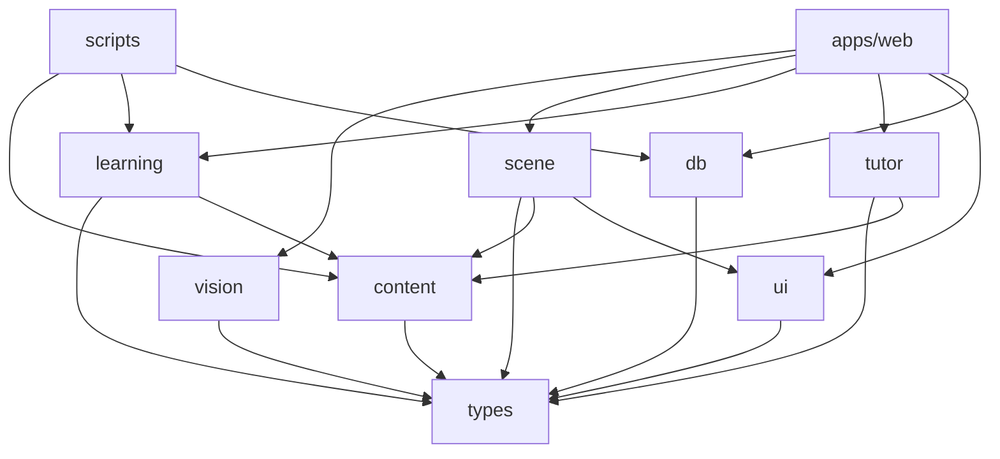

# Project Folder Structure

One pnpm workspace, one deployable Next.js app, and seven internal packages whose names match the module boundaries in [System Architecture](03-system-architecture.md): `types`, `content`, `vision`, `scene`, `learning`, `tutor`, `ui`, plus a small `db` package for the Drizzle schema. Lessons, manifests, and GLB files are versioned files in the repo; `scripts/` holds the authoring pipeline; `infrastructure/` is a Docker Compose file and a Vercel config; `services/` is an empty, documented seam. This file mostly concerns **MVP**; the places where **V1** attaches are marked.

## What changed from the brief's draft

The brief's draft (`apps/web`, `apps/admin`, `services/api`, `services/ai`, `services/vision`, five packages, `content/`, `models/`, `infrastructure/`, `docs/`) is shaped like a three-team organisation: a web team, a backend team, and an ML team, each with its own deployable. For one developer every entry under `services/` is a second deploy, a second CI pipeline, a second set of environment variables, and a second place for types to drift. The brief invites modification where a better architecture exists; it is taken.

| Brief directory | Verdict | Reason | Tier |
|---|---|---|---|
| `apps/web` | Kept; the only app | Locked position 1: route handlers are the backend | **MVP** |
| `apps/admin` | Removed | Authoring UI is **V1** ([content versioning](10-3d-content-system.md#content-versioning)); when it arrives it is a route group `app/(admin)/` inside the same app, not a second deploy | **V1** |
| `services/api` | Removed | `apps/web/app/api/*/route.ts` | **MVP** |
| `services/ai` | Removed | `packages/tutor` is a library; `/api/tutor` is the only server code (locked position 7) | **MVP** |
| `services/vision` | Removed | CV runs in the browser (locked position 2); `packages/vision` ships to the client | **MVP** |
| `services/` | Kept empty, with a README | The seam for a Python service, described [below](#the-services-seam) | **V1/Future** |
| `packages/three-engine` | Renamed `scene` | It is a set of R3F components, not an engine; name matches doc 03 and 05 | **MVP** |
| `packages/vision-engine` | Renamed `vision` | Matches doc 03 and 04 | **MVP** |
| `packages/learning-engine` | Renamed `learning` | Matches doc 03 and 06 | **MVP** |
| `packages/ui`, `packages/types` | Kept | `ui` is tokens plus Radix wrappers, deliberately small | **MVP** |
| (new) `packages/content`, `packages/tutor`, `packages/db` | Added | Zod schemas and loaders; `TutorService`; Drizzle schema shared by route handlers and scripts | **MVP** |
| `content/anatomy`, `content/physics` | Restructured | `content/models/` and `content/lessons/<subject>/<topic>/` per [3D Content Architecture](10-3d-content-system.md), plus `content/instruments/` for the knowledge forms and `content/source/` for Blender files | **MVP** |
| `models/` | Kept | Compressed GLB outputs, copied to `apps/web/public/models/` for **MVP** and mirrored to object storage by a script at **V1** ([10 GLB hosting](10-3d-content-system.md#glb-hosting)) | **MVP** |
| `infrastructure/` | Reduced | `docker-compose.yml` for local Postgres and `vercel.json`; no Terraform, no Kubernetes | **MVP** |
| `docs/` | Kept | This document set | **MVP** |
| (new) `.claude/`, `scripts/`, `.github/` | Added | Project agents and skills are part of the repo; pipeline scripts; CI | **MVP** |

## Workspace tooling

Decision: **pnpm workspaces** with no build orchestrator. **MVP**.

| Option | Pros | Cons | Fit for solo dev | Verdict |
|---|---|---|---|---|
| pnpm workspaces | `workspace:*` protocol, strict `node_modules` (no phantom imports, which is how package boundaries get enforced), fast installs, native on Vercel | One more global tool; some tutorials assume npm | Excellent | **Recommended, MVP** |
| npm workspaces | Nothing to install | Hoisting lets any package import any other, so boundaries are advisory; slower; no `workspace:` protocol | Good | Acceptable fallback |
| Turborepo on top of pnpm | Cached, parallel `build`, `test`, `lint` across packages; remote cache | Config and a second CLI for eight packages whose combined test suite runs in seconds | Fair for MVP | **V1** when CI exceeds about five minutes |
| Flat single package (no `packages/`) | Simplest possible; one `package.json` | The rule that `learning` never imports `vision` or `scene` becomes a lint convention nobody enforces; the pure-TypeScript engine cannot be imported by route handlers and scripts without dragging R3F into the server bundle | Tempting, wrong | Reject |

Eight-point checklist for pnpm workspaces: (1) appropriate because the packages exist to enforce the import rules in doc 03, and pnpm's strict linking is the enforcement; (2) limitation is one more tool and occasional peer-dependency noise from Three.js and Drei; (3) no browser impact, Next.js tree-shakes the same way; (4) no accessibility impact; (5) no privacy impact; (6) scales to the ten or so packages this project will ever have; (7) complexity is a `pnpm-workspace.yaml` of three lines and `"@grasp/learning": "workspace:*"` in dependents; (8) necessary only because a flat package cannot protect the engine's purity; npm workspaces is the simpler alternative if pnpm causes trouble.

Limitation: Next.js transpiles workspace packages only when they are listed in `transpilePackages` or ship compiled output; the MVP lists them, and no package has its own build step.

## Full tree

```text
grasp/
├── .claude/
│   ├── agents/                         # project agents (platform-architect.md, cv-engineer.md, ...)
│   └── skills/                         # project-conventions, lesson-schema, research-protocol, ...
├── .github/
│   └── workflows/
│       └── ci.yml                      # typecheck, unit tests, content:validate on every push
├── apps/
│   └── web/                            # the single deployable Next.js app
│       ├── app/
│       │   ├── (study)/                # the participant flow, in order
│       │   │   ├── consent/page.tsx
│       │   │   ├── calibrate/page.tsx
│       │   │   ├── lesson/[lessonId]/page.tsx
│       │   │   ├── test/[instrument]/page.tsx     # pre, post, sus, tlx, satisfaction
│       │   │   └── retention/page.tsx             # S2, keyed by session code
│       │   ├── dev/
│       │   │   └── model/[id]/page.tsx            # content review page; excluded from production builds
│       │   ├── api/
│       │   │   ├── session/route.ts               # POST mint session
│       │   │   ├── session/[id]/route.ts          # GET resolve code, DELETE withdraw
│       │   │   ├── tutor/route.ts                 # TutorService: template engine (MVP), local model (V1)
│       │   │   ├── attempts/route.ts
│       │   │   ├── progress/route.ts
│       │   │   └── events/route.ts                # research log ingest
│       │   ├── layout.tsx
│       │   └── page.tsx
│       ├── components/
│       │   ├── hud/                    # prompts, hints, feedback, cv-status, cursor overlay
│       │   ├── screens/                # consent, calibration, test forms, mastery summary
│       │   └── providers/              # input-source switch (gesture or mouse), store providers
│       ├── stores/                     # session-store.ts, lesson-store.ts, scene-store.ts (Zustand)
│       ├── lib/                        # api-client.ts, logger-transport.ts, env.ts, csp.ts
│       ├── public/
│       │   ├── mediapipe/              # hand_landmarker.task + wasm, pinned version, self-hosted
│       │   ├── draco/                  # decoder files for Drei useGLTF
│       │   └── models/                 # GLBs served from here in MVP; object storage + CDN at V1
│       ├── e2e/                        # Playwright smoke tests (V1)
│       ├── middleware.ts               # CSP and security headers
│       ├── next.config.ts
│       └── package.json
├── packages/
│   ├── types/                          # @grasp/types   : InteractionEvent, SceneEvent, SceneState, LogEvent, Tutor*, lesson types
│   ├── content/                        # @grasp/content : Zod schemas, manifest and lesson loaders, contentHash
│   ├── vision/                         # @grasp/vision  : worker entry, HandLandmarker init, One-Euro, gesture FSM, mouse adapter
│   ├── scene/                          # @grasp/scene   : R3F components, raycast, drag plane, sockets, hotspots, poses, scene commands
│   ├── learning/                       # @grasp/learning: evaluate, mastery, activity sequencing, hint ladder, event logger
│   ├── tutor/                          # @grasp/tutor   : TutorService interface, TemplateTutorService, templates, output validation
│   ├── ui/                             # @grasp/ui      : tokens.ts, Radix wrappers, focus ring, live region
│   └── db/                             # @grasp/db      : Drizzle schema, migrations/, client factory
├── content/
│   ├── models/
│   │   ├── heart_v1.json               # model manifest
│   │   └── README.md                   # per-subject vocabulary for type and tags
│   ├── lessons/
│   │   └── anatomy/heart/chambers_v1.json
│   ├── instruments/
│   │   └── heart-knowledge/form-a.json, form-b.json, form-c.json, sus.json, tlx.json
│   └── source/                         # .blend files (Git LFS or git-ignored; see open questions)
├── models/
│   └── heart_v1/heart.glb              # compressed output; copied to public/models (MVP), mirrored to object storage at the same key (V1)
├── scripts/
│   ├── content/                        # scaffold-manifest.ts, validate.ts, hash.ts
│   ├── models/                         # optimize.sh (gltf-transform pipeline), upload.ts
│   ├── research/                       # metrics.ts (per-session metrics), export-session.ts
│   └── db/                             # migrate.ts, seed-dev.ts
├── services/
│   └── README.md                       # empty seam for a V1/Future Python service
├── infrastructure/
│   ├── docker-compose.yml              # local Postgres only
│   └── vercel.json                     # headers, function region, cron for retention reminders (V1)
├── docs/                               # this architecture document set
├── .env.example
├── .npmrc
├── package.json                        # root scripts: dev, build, test, content:validate, models:optimize
├── pnpm-workspace.yaml
├── tsconfig.base.json
└── README.md
```

## Directory guide

| Directory | Purpose | Tier | What lives there | What must not live there |
|---|---|---|---|---|
| `.claude/` | The agents and skills that write and review these docs | **MVP** | Agent definitions, skills, skill references such as `heart-example.json` | Secrets, generated output, anything the app imports at build |
| `.github/workflows/` | CI | **MVP** | Typecheck, Vitest, `content:validate`, GLB size check | Deploy steps (Vercel deploys from Git on its own) |
| `apps/web/app/` | Routes and route handlers | **MVP** | Pages for the study flow, `api/*` handlers, layout, CSP middleware | Business logic: handlers validate with Zod, call a package, write a row, and nothing else |
| `apps/web/app/(study)/` | The participant flow | **MVP** | Consent before camera, calibration, lesson, instruments, retention | Any page reachable without a session cookie except consent and retention |
| `apps/web/app/dev/` | Developer-only pages | **MVP** | `/dev/model/[id]` review page from doc 10 | Anything served in production; the route is stripped by `next.config.ts` when `NODE_ENV=production` |
| `apps/web/components/` | App-specific React | **MVP** | HUD, screens, providers; composes packages | Reusable primitives (those go to `packages/ui`); scene logic (`packages/scene`) |
| `apps/web/stores/` | Zustand stores | **MVP** | The three stores from doc 03 | Per-frame data in React state; landmarks |
| `apps/web/lib/` | Glue | **MVP** | Typed API clients, logger transport with batching and `sendBeacon`, env parsing, CSP string | Domain rules |
| `apps/web/public/mediapipe/`, `public/draco/` | Self-hosted runtime assets | **MVP** | Pinned `.task`, `.wasm`, Draco decoder; filenames carry the version | Unpinned copies; CDN-hotlinked scripts |
| `apps/web/public/models/` | GLB delivery for the pilot | **MVP** | Copy of `models/` served by Vercel's edge cache with immutable headers; the `NEXT_PUBLIC_ASSET_BASE_URL` default `/models` points here | GLBs over 5 MB; at **V1** the same keys move to object storage behind a CDN and this directory returns to development use |
| `packages/types/` | Shared contracts | **MVP** | Pure TypeScript types from doc 03's six interfaces and `lesson-schema`; no runtime code | Any dependency; any function |
| `packages/content/` | Content schema and loading | **MVP** | Zod schemas for manifest, lesson, instruments; build-time import of `content/`; `contentHash`; JSON Schema export for editors and for Pydantic | Lesson files themselves; evaluation logic |
| `packages/vision/` | Camera to interaction events | **MVP** | Worker entry (`src/worker/hand-landmarker.worker.ts`), HandLandmarker init, One-Euro filter, gesture FSM, `cv_status`, calibration tutorial logic, mouse adapter (`src/mouse-adapter.ts`) | Three.js imports; scene knowledge beyond the `hover_result` message; any persistence of landmarks |
| `packages/scene/` | R3F scene | **MVP** | `<LessonScene>`, raycaster, drag plane, socket snapping, hotspots, pose tweens, orbit rig, scene-command handlers, `SceneState` diffing | Grading of any kind; lesson JSON reads beyond the manifest; network calls |
| `packages/learning/` | Deterministic engine | **MVP** | `evaluate()`, mastery, activity sequencing, hint ladder, time cap, `LogEvent` buffer; isomorphic so route handlers and `scripts/research` can import it | DOM, React, Three.js, MediaPipe imports; `fetch` (transport is in `apps/web/lib`) |
| `packages/tutor/` | Tutor seam | **MVP** | `TutorService` interface, `TemplateTutorService` (deterministic templates over the hint ladder and manifest `description`, `relations`, `tags`), `TutorResponse` Zod validation, static fallback, `LocalTutorService` stub (**V1**, Ollama or WebLLM after measurement), `RemoteTutorService` stub (Python seam) | Any hosted LLM client or vendor SDK (excluded by rule); network calls in MVP; model names or prices |
| `packages/ui/` | Design primitives | **MVP** | `tokens.ts` consumed by Tailwind and the scene, Radix wrappers, focus ring, ARIA live region | Screens or HUD layouts; anything lesson-specific |
| `packages/db/` | Persistence schema | **MVP** | Drizzle tables for `research_sessions`, `lesson_attempts`, `progress`, `event_logs`, `instrument_responses`, `consent_records`, `ai_interactions`; migrations; client factory for Neon or `postgres.js` | Queries embedded in React components; the **V1** content tables until doc 10's trigger fires |
| `content/models/`, `content/lessons/` | Pedagogical content | **MVP** | Manifests and lessons with immutable versioned ids | Executable code; anatomy-specific fields (the schema is subject-neutral) |
| `content/instruments/` | Study instruments | **MVP** | Knowledge forms A/B/C, SUS, TLX item text as JSON | Participant responses (those are rows in `instrument_responses`) |
| `content/source/` | Blender sources | **MVP** | `.blend` files | Anything the build reads |
| `models/` | Compressed GLB outputs | **MVP** | `models/<modelId>/<file>.glb`, path identical to the object-storage key | Raw exports; files over 5 MB (the validator rejects them) |
| `scripts/` | Authoring and research pipeline | **MVP** | gltf-transform wrapper, manifest scaffold, validator, content hash, GLB upload, per-session metrics, session export, migrations | Anything the app imports at runtime |
| `services/` | Attachment point for a Python service | **V1/Future** | A README only | Any code in MVP |
| `infrastructure/` | Local and hosting config | **MVP** | `docker-compose.yml` (Postgres 16, one volume), `vercel.json` | Production containers, orchestration, secrets |
| `docs/` | This document set | **MVP** | Twenty files per the index | Generated API docs |

## Package boundaries

The import graph is the architecture. pnpm's strict linking means a package can only import what its `package.json` declares, so the rules below are enforced by dependency declarations, with an ESLint `no-restricted-imports` rule as a second guard.



| Rule | Why | Tier |
|---|---|---|
| `learning` imports only `types` and `content` | The engine runs identically for gesture and mouse conditions, in unit tests, and in route handlers for **V1** server recompute | **MVP** |
| `vision` imports only `types` | The worker never sees the scene graph; it receives `hover_result` messages and nothing else ([doc 04](04-computer-vision.md#interaction-event-contract)) | **MVP** |
| `scene` never imports `learning` or `tutor` | The scene emits `select`, `place`, `drop`; it does not know what is correct | **MVP** |
| `tutor` never imports `vision` or `scene` | The tutor sees `SceneState` as data, never the scene object | **MVP** |
| No package imports `apps/web` | Packages are libraries; the app composes them | **MVP** |
| Only `apps/web/lib` and `scripts/` call the network or the database | One place to audit for what leaves the device | **MVP** |

The Web Worker is created in `apps/web` with `new Worker(new URL("@grasp/vision/worker", import.meta.url), { type: "module" })`, which Next.js bundles as a separate chunk. MediaPipe loads its WASM and `.task` from `/mediapipe/` on the same origin, so the CSP in `middleware.ts` needs `worker-src 'self'` and `script-src 'self' 'wasm-unsafe-eval'` and nothing from third-party hosts (details in [Security and Privacy](15-risks-security-scalability.md#security-and-privacy)).

## The `services/` seam

`services/README.md` says what belongs there and how it attaches, so the **V1** developer (the same person, later) does not have to rediscover it.

| Step | Action | Tier |
|---|---|---|
| 1 | Create `services/<name>/` with a `Dockerfile`, `pyproject.toml`, and a FastAPI app | **V1/Future** |
| 2 | Generate Pydantic models from the JSON Schema that `pnpm types:jsonschema` already emits from the Zod schemas in `packages/content` and `packages/types` | **V1/Future** |
| 3 | Add the service to `infrastructure/docker-compose.yml` under a `profiles: [services]` key so `pnpm dev` is unchanged | **V1/Future** |
| 4 | Implement `RemoteTutorService` or `RemoteVisionService` in the existing package; the route handler already switches on `TUTOR_SERVICE_URL`, alongside `TUTOR_ENGINE` (`template` or `local`) and `TUTOR_LOCAL_URL` for the local-model option ([doc 03](03-system-architecture.md#the-seam-for-a-python-service)) | **V1/Future** |
| 5 | Deploy to a container host; Vercel never hosts it | **V1/Future** |

The trigger is stated in locked position 1: custom gesture-model training or Python-only inference. Nothing else justifies the second deployable.

## Naming conventions

From `project-conventions`, applied to paths and identifiers in this tree.

| Thing | Convention | Example |
|---|---|---|
| Workspace packages | `@grasp/<kebab>` matching the directory | `@grasp/learning` |
| TypeScript files | `kebab-case.ts`, `.tsx` for components | `drag-plane.ts`, `hint-card.tsx` |
| TypeScript types and React components | `PascalCase` | `SceneState`, `LessonScene` |
| Route segments | `kebab-case`; dynamic segments in brackets | `app/api/session/[id]/route.ts` |
| Component, socket, hotspot ids | `snake_case`, anatomical | `left_ventricle`, `socket_aorta`, `hs_septum` |
| Gesture names and task types | `snake_case` | `pinch_drag`, `identify` |
| Lesson and model ids | dotted lowercase with version suffix | `anatomy.heart.chambers_v1`, `heart_v1` |
| Content file paths | mirror the id | `content/lessons/anatomy/heart/chambers_v1.json` |
| GLB storage key | `models/<modelId>/<file>` | `models/heart_v1/heart.glb` |
| Database tables and columns | plural `snake_case`, `id` UUID PK | `event_logs`, `session_id` |
| Zustand stores | `<name>-store.ts` exporting `use<Name>Store` | `scene-store.ts`, `useSceneStore` |
| Root scripts | `<domain>:<verb>` | `content:validate`, `models:optimize`, `research:metrics` |
| Environment variables | `SCREAMING_SNAKE`; browser-visible ones prefixed `NEXT_PUBLIC_` | `TUTOR_ENGINE`, `NEXT_PUBLIC_ASSET_BASE_URL` |
| Tests | colocated `*.test.ts` (Vitest); e2e under `apps/web/e2e/` | `evaluate.test.ts` |

Limitation stated plainly: nothing enforces the id conventions except the content validator and code review; a `camelCase` component id would pass TypeScript and fail at runtime against the GLB mesh name. The validator's `snake_case` check is the only guard.

## Open questions

1. `models/` and `content/source/` in Git LFS, or GLBs committed directly and `.blend` files kept outside the repo? One heart fits either way; the answer matters at ten models. This echoes the open question in [3D Content Architecture](10-3d-content-system.md#open-questions).
2. Should `packages/db` be folded into `apps/web` for MVP? It exists as a package so `scripts/research/metrics.ts` can read the schema without importing the app; if that script instead queries over HTTP, the package can wait until **V1**.

## Related

- [System Architecture](03-system-architecture.md): the module boundaries this tree materialises.
- [Computer Vision Architecture](04-computer-vision.md): contents of `packages/vision` and `public/mediapipe/`.
- [3D Interaction Architecture](05-3d-interaction.md): contents of `packages/scene` and `public/draco/`.
- [3D Content Architecture](10-3d-content-system.md): `content/`, `models/`, and the scripts in `scripts/content` and `scripts/models`.
- [Evaluation Methodology](14-evaluation-methodology.md): `content/instruments/`, `scripts/research/`, and the tables in `packages/db`.
- [Technical Risks, Security and Privacy, Scalability](15-risks-security-scalability.md): CSP for workers and WASM.
- [First Prototype Implementation Plan](17-first-prototype-plan.md): which of these directories the smallest prototype needs (locked position 10: `apps/web`, `packages/scene`, `packages/vision`, one manifest).
- [Recommended Technology Stack and Final Architecture Diagram](19-tech-stack-and-final-diagram.md): checklist for pnpm and the other tooling named here.
