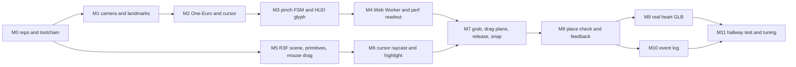

# First Prototype Implementation Plan

This file sequences the smallest viable prototype from [00-executive-summary.md](00-executive-summary.md#smallest-viable-prototype) (locked position 10) into twelve evening-sized milestones for one developer. Each milestone has a demoable deliverable, an acceptance check, an hour estimate, and the risk it retires, so that the project learns the most expensive lesson first: whether a pinch seen by a webcam can reliably put a heart part where it belongs. Everything here is **MVP**; the prototype is a strict subset of the MVP defined in [12-mvp-definition.md](12-mvp-definition.md), and nothing built here is thrown away.

## Goal to validate

Open browser → webcam activates → hand is detected → `pinch` selects a 3D component → hand movement moves it on the drag plane → `release` drops it → the system reports whether the correct component was placed in the correct socket.

The prototype passes if a person other than the developer, with a window behind them, places three components in three sockets on the first try within two minutes, while the frame-time and inference budgets in [05 section 10](05-3d-interaction.md#10-render-performance-budget) hold. The identical loop must also work with a mouse, because the research control condition and the fallback for learners who cannot use gestures both depend on it ([03 data flow](03-system-architecture.md#data-flow)).

## Scope

| In the prototype | Detail | Tier |
|---|---|---|
| One Next.js page | `/prototype`, no navigation, no auth | **MVP** |
| Three components, three sockets | `aorta`, `pulmonary_artery`, `left_ventricle` into `socket_aorta`, `socket_pulmonary_artery`, `socket_left_ventricle`; remaining heart meshes are static scenery | **MVP** |
| Three gestures | `pinch` → `grab_start`, `pinch_drag` → `grab_move`, `release` → `grab_end`; any detected hand shows the neutral cursor via the `cursor` event | **MVP** |
| One task type | `place`, three tasks, `hints: []`, in a hand-written lesson fragment | **MVP** |
| Deterministic verdict | `evaluate()` from `lesson-schema` section 5 returns `correct`, `partial`, or `incorrect`; HUD shows text plus colour at the component | **MVP** |
| Mouse path | Click-drag emits the identical `InteractionEvent` stream through an `InputSource` adapter; `?input=mouse` selects it | **MVP** |
| Perf readout | `r3f-perf` overlay in dev; `perf_sample` every 5 s to the console | **MVP** |
| Event log | `LogEvent` array in the `research-protocol` shape, downloadable as JSON | **MVP** |

### Not built in the prototype

| Excluded | Why | Arrives |
|---|---|---|
| Accounts, database, persistence, server routes | Nothing to persist until the loop works; the page is fully static | Phase 4 of [13](13-roadmap.md) |
| AI tutor | Hints are irrelevant before placement works | Phase 5 |
| Gamification, XP, mastery display | No learning to reward yet | Phase 6 (mastery bands only); XP and badges **V1** |
| `open_palm` classification, `point` hover, dwell select | Not needed to grab and drop; the cursor is shown for any detected hand | Phase 3, after stop/go |
| `identify`, `remove`, `sequence`, `compare` tasks; narration, explore, assessment activities | `place` exercises the entire gesture chain; the rest is content | Phase 4 |
| Whole-model orbit, explode pose, hotspots, reset command | The three prototype sockets are all visible from the default camera; orbit adds an empty-space branch to the FSM that is not under test | Orbit: Phase 4 (added with the full learning environment, see doc 13); explode pose, hotspots, reset: Phase 4 |
| Calibration step, `cv_status` overlay beyond one status line | Tuning aids that presuppose a working loop | `cv_status` channel: Phase 2; on-screen failure states and calibration: Phase 4 |
| Consent screen, event upload, Safari fallback testing | Required before any participant, not before the developer; Chrome and Edge only | Phase 4 (Safari gaps documented as a fallback note in Phase 2) |

Phase numbers in this file are doc 13's roadmap phases (0 Research through 8 Production). The prototype milestones below map onto Phases 1–3: M0, M5, M6 are Phase 1 (3D Prototype), M1–M4 are Phase 2 (Computer Vision Prototype), and M7–M11 are Phase 3 (CV + 3D Integration and stop/go).

Deviation from doc 00, flagged: doc 00 says the prototype has "no hover state", but the FSM in [04](04-computer-vision.md#gesture-state-machine) only emits `grab_start` after the main thread reports a `hover_result` for the cursor. M6 therefore raycasts under the neutral cursor and tints the hit component. This is not the `point` gesture or dwell select; it is the minimum feedback loop the FSM requires, and the tint doubles as a visual check of the coordinate chain.

## Where the prototype is built

Decision: inside the real monorepo, as the first page of the Next.js app, split from day one into the packages named in [03 frontend modules](03-system-architecture.md#frontend-modules). **MVP**.

| Option | Pros | Cons | Fit for solo dev | Verdict |
|---|---|---|---|---|
| Next.js app in the monorepo | Nothing rewritten; `vision`, `scene`, `learning` testable in isolation; asset paths match production | Slower first evening | High | **Recommended, MVP** |
| Standalone Vite sandbox | Fastest first render | Second build and asset path; worker bundling differs, so M4 is redone later | Medium | Reject |
| CodeSandbox or StackBlitz | Zero setup | Webcam and worker GPU delegate behave differently in iframes; cannot self-host WASM reliably | Low | Reject |

Checklist, compactly: (1) appropriate because the prototype is the first slice of the product, not a spike; (2) limitation: Next.js worker bundling needs `new Worker(new URL(...))` and a config check; (3) performance identical to production, which is the point; (4) accessibility: mouse and keyboard adapter from M5; (5) privacy: no network calls at all; (6) scalability: not relevant; (7) complexity: one extra evening at M0; (8) necessary, because a sandbox defers exactly the integration risks the prototype exists to retire.

Package names below follow doc 03's module list; exact paths are fixed by [16-folder-structure.md](16-folder-structure.md).

## Milestone sequence

Two tracks leave M0. The CV track (M1–M4) and the 3D track (M5–M6) are independent until M7 joins them. On a frustrating CV evening, work the 3D track instead; nothing is blocked. The 3D track also means the mouse path is demoable at M5, three milestones before the first gesture-driven grab.

| Milestone | Hours | Cumulative | Track | Doc 13 phase |
|---|---|---|---|---|
| M0 | 6 | 6 | both | 1 |
| M1 | 5 | 11 | CV | 2 |
| M2 | 5 | 16 | CV | 2 |
| M3 | 8 | 24 | CV | 2 |
| M4 | 10 | 34 | CV | 2 |
| M5 | 8 | 42 | 3D | 1 |
| M6 | 5 | 47 | 3D | 1 |
| M7 | 10 | 57 | joined | 3 |
| M8 | 6 | 63 | joined | 3 |
| M9 | 12 | 75 | content | 3 |
| M10 | 4 | 79 | research | 3 |
| M11 | 5 | 84 | validation | 3 |

About 84 hours. At eight evening hours per week that is ten to eleven weeks; at twelve it is seven. M9 is the widest estimate because it depends on finding a licensable heart mesh with separable chambers; if none exists, authoring from scratch in Blender can double it.

## Milestones

### M0 Repo and toolchain

| Field | Content |
|---|---|
| Objective | A Next.js app that renders an empty R3F canvas and serves MediaPipe assets from the same origin |
| Deliverable | `/prototype` shows a lit cube under `frameloop="demand"` that redraws only on pointer move; `public/mediapipe/` serves the pinned `hand_landmarker.task` and WASM directory; `public/draco/` serves the decoder; `pnpm dev` and `pnpm build` succeed |
| Modules | Next.js app (`/prototype` route, worker config), `packages/types` (`InteractionEvent`, `SceneEvent`, `SceneState` copied from the contracts), `public/mediapipe/`, `public/draco/` |
| Acceptance | No third-party requests in the network panel; the `.task` file returns 200; canvas idles at 0 fps when nothing moves |
| Effort | 6 h |
| Risk retired | Toolchain: R3F in the App Router, worker bundling, and self-hosted WASM paths are confirmed before any CV or interaction code exists |

### M1 Camera feed and landmarks on a 2D overlay

| Field | Content |
|---|---|
| Objective | Prove the camera and `HandLandmarker` work in this browser on this laptop |
| Deliverable | Mirrored 640×360 preview with 21 landmarks and bones on a 2D `<canvas>` overlay, main thread, `runningMode: "VIDEO"`, GPU delegate; a text line shows inference ms per frame |
| Modules | `packages/vision` (`landmarker.ts` per `mediapipe-hands` section 2, `capture.ts`), `/prototype` overlay |
| Acceptance | Landmarks track the hand at arm's length; inference under 25 ms per frame with the GPU delegate; status line shows `initialising`, then `ok` or `no_hand` |
| Effort | 5 h |
| Risk retired | MediaPipe fails to initialise, the GPU delegate is unavailable, or inference is already over budget. Any of these changes the whole plan, so they are tested first |

### M2 One-Euro smoothing and the cursor

| Field | Content |
|---|---|
| Objective | A cursor that sits still when the hand is still and follows without lag when it moves |
| Deliverable | One-Euro per landmark coordinate (`minCutoff` 1.0, `beta` 5.0) and a second filter on the cursor (`minCutoff` 1.5); cursor dot at `midpoint(l[4], l[8])`; debug sliders for `minCutoff` and `beta` with a live RMS jitter number |
| Modules | `packages/vision` (`one-euro.ts` pure class with unit tests, `features.ts` with `handSize`, `pinchDist`, `palmCenter`) |
| Acceptance | Jitter RMS at rest under 0.005 normalised units (`jitterNorm` target in [14](14-evaluation-methodology.md)); a one-second sweep shows no visible overshoot or trailing |
| Effort | 5 h |
| Risk retired | The `beta` scaling question in [04 smoothing](04-computer-vision.md#smoothing-one-euro-filter-and-hysteresis) is settled empirically; cursor quality is fixed before anything depends on it |

### M3 Pinch and release state machine with HUD glyph

| Field | Content |
|---|---|
| Objective | Emit `grab_start`, `grab_move`, `grab_end` from the smoothed landmarks, with hysteresis and hold-frame debounce, as a pure function |
| Deliverable | `gestureFsm(features, state) → { state, events[] }` with the `NO_HAND`, `IDLE`, `GRABBING`, `DRAGGING`, `LOST` states of [04](04-computer-vision.md#gesture-state-machine) (`HOVER` omitted); a HUD glyph for open hand, pinch, and lost; events in a scrolling console panel; `hover_result` stubbed to `isGrabbable: true` until M6 |
| Modules | `packages/vision` (`fsm.ts`, `events.ts` typed to `mediapipe-hands` section 8 plus doc 04's additive `cursor` event and `grab_end.reason`), HUD glyph |
| Acceptance | Unit tests replay recorded feature fixtures (developer's own, no landmarks) and assert event order; 20 deliberate pinches yield 20 `grab_start` and `grab_end` pairs with at most 2 extra (flicker under 10 percent); covering the camera mid-pinch yields `tracking_lost`, then `grab_end` with `reason: "lost"` after 1 s |
| Effort | 8 h |
| Risk retired | Pinch ambiguity (challenge 10 in [15](15-risks-security-scalability.md)): enter 0.25 and exit 0.40 are validated on a real hand before they drive any object |

### M4 Web Worker inference with main-thread fallback and perf readout

| Field | Content |
|---|---|
| Objective | Move M1–M3 into a Web Worker so inference never blocks the render loop, and measure |
| Deliverable | Worker receives transferred `ImageBitmap`s, runs landmarker, filters, and FSM, posts `InteractionEvent`s; main thread feature-detects `OffscreenCanvas` and otherwise falls back to alternate-frame main-thread inference; `perf_sample` every 5 s with `inferenceMsP50`, `inferenceMsP95`, `frameMsP95`, `fps`, `e2eMsP50`, `delegate`, `path` |
| Modules | `packages/vision` (`worker.ts`, `worker-client.ts`, `fallback.ts`), `packages/types` (`PerfSample`) |
| Acceptance | Main thread holds 60 fps on the empty scene while inference runs; `inferenceMsP95` under 33 ms in the worker path; forcing the fallback with a query flag reproduces the M3 fixture event sequences; bitmaps are transferred, not copied |
| Effort | 10 h |
| Risk retired | Problem 3 in [00](00-executive-summary.md#problem-3-running-mediapipe-react-three-fiber-and-react-at-30-fps-on-an-integrated-gpu): whether the worker GPU path works in Chrome and Edge on the reference laptop, and what the fallback costs |

### M5 R3F scene with three primitive parts, three sockets, mouse drag

| Field | Content |
|---|---|
| Objective | A working grab-drag-snap scene driven by the mouse, with no CV involved |
| Deliverable | Three primitives (cylinder, bent tube, flattened sphere) with `userData.componentId` = `aorta`, `pulmonary_artery`, `left_ventricle`; three ring sockets from a hand-written `content/models/proto_primitives.json`; a `MouseInputSource` emitting `grab_start`, `grab_move`, `grab_end` from pointer events; camera-facing drag plane; snap on `grab_end` within `radius`; `place` or `drop` to the console. Keyboard: Tab cycles components, Space grabs and releases, arrows move |
| Modules | `packages/scene` (`interactables.ts`, `drag-plane.ts`, `sockets.ts`, `input-source.ts`, `scene-events.ts`), `content/models/proto_primitives.json` |
| Acceptance | Each primitive drags into each socket by mouse; `place` fires for accepting sockets, `drop` with `cause: "release"` elsewhere; React Profiler shows zero commits during a drag; an injected `grab_end` with `reason: "lost"` settles without snapping and emits `drop` with `cause: "lost"` |
| Effort | 8 h |
| Risk retired | Drag-plane and socket logic are correct independent of CV, and the mouse control condition exists before the gesture path does |

### M6 Cursor-to-raycast hover and highlight

| Field | Content |
|---|---|
| Objective | Wire the coordinate chain of [05 section 2](05-3d-interaction.md#2-coordinate-translation-chain) so a normalised camera cursor hits the right object |
| Deliverable | A `cursor` or `grab_move` event passes through mirror, cover-fit, clamp, NDC, and one shared `Raycaster` on the interactable layer; the hit component gets an emissive tint; the cursor is drawn on the R3F canvas; `hover_result` is posted back to the worker or fallback in the same frame |
| Modules | `packages/scene` (`coordinate-chain.ts` with cover-fit unit tests, `raycast.ts`, `highlight.ts`, `cursor-overlay.tsx`), `packages/vision` (`worker-client.ts` accepts `hover_result`) |
| Acceptance | Synthetic cursors at the canvas corners and centre hit the expected object at 16:9 and 4:3 aspects in a unit test; with a real hand, the tint appears when the drawn cursor overlaps a primitive; raycast under 1 ms per frame |
| Effort | 5 h |
| Risk retired | Aspect-ratio and mirroring mistakes, which otherwise appear as "it grabs when my hand is somewhere else" and are hard to debug once CV noise is in the loop |

### M7 Pinch grab, drag plane, release, snap

| Field | Content |
|---|---|
| Objective | Join the tracks: the gesture `InputSource` drives the M5 scene through the same event stream as the mouse |
| Deliverable | `GestureInputSource` wraps the worker client; `?input=gesture|mouse` selects the adapter; `grab_start` grabs only when `hover_result.isGrabbable` held in the last two frames; `grab_move` applies the low-gain z-hint (`Z_GAIN` 0.3, `Z_MAX` 0.15) and workspace bounds; `grab_end` with `reason: "release"` snaps or settles (`drop.cause == "release"`); on `tracking_lost` the component stays put while the worker runs its 1 s grace period, and a `grab_end` with `reason: "lost"` settles it without a socket search and emits `drop` with `cause: "lost"` |
| Modules | `packages/scene` (`GestureInputSource` in `input-source.ts`), `packages/vision` (`zHintDelta` dead zone), page wiring |
| Acceptance | Developer places all three primitives by pinch in at least nine of ten runs with no false drop; the mouse path still passes M5 with no scene code branching on condition; snap fires only on `grab_end` with `reason: "release"`; covering the camera mid-drag yields exactly one `drop` with `cause: "lost"` and no `place`; the scene owns no grace timer |
| Effort | 10 h |
| Risk retired | Problem 1 in doc 00: whether drag plane plus sockets make placement completable without depth, and whether the CV-to-scene contract suffices in practice |

### M8 Deterministic place check with correct or incorrect feedback

| Field | Content |
|---|---|
| Objective | The system knows whether the right component went to the right socket, with no code specific to the heart |
| Deliverable | `content/lessons/anatomy/heart/prototype_v0.json`: one `guided` activity, three `place` tasks (`t_p1` `aorta` → `socket_aorta`, `t_p2` `pulmonary_artery` → `socket_pulmonary_artery`, `t_p3` `left_ventricle` → `socket_left_ventricle`), `hints: []`, `maxAttempts: 3`; `evaluate(task, event, attemptState)` from `lesson-schema` section 5 as a pure function with unit tests; a HUD card with the prompt and, after each `place` or `drop`, `correct`, `partial`, or `incorrect` as text, icon, and colour at the component; next task on `correct` or after three attempts |
| Modules | `packages/learning` (`evaluate.ts`, `task-runner.ts`, Zod schema), `content/lessons/anatomy/heart/prototype_v0.json`, HUD feedback card |
| Acceptance | Unit tests: right part, right socket → `correct`; right part, wrong socket → `partial`; wrong part → `incorrect`; `drop` with `cause: "release"` on a `place` task → `incorrect`; `drop.cause == "lost"` is discarded (no attempt counted, no verdict, task stays open) and never yields `correct`; the engine reads only scene events, never `grab_end.reason`. `scene` and `learning` do not import each other |
| Effort | 6 h |
| Risk retired | Problem 2 in doc 00: deterministic evaluation from a declarative task suffices, and the scene-reports, engine-grades boundary holds under real events |

### M9 Swap primitives for the real heart GLB

| Field | Content |
|---|---|
| Objective | The loop works on real anatomy with real mesh shapes, occlusion, and triangle counts |
| Deliverable | `heart.glb` through the pipeline in [05 section 8](05-3d-interaction.md#8-glb-authoring-and-compression-pipeline): three separable meshes named `aorta`, `pulmonary_artery`, `left_ventricle`, the rest merged as scenery, Draco compressed, under 5 MB and 150k triangles; `content/models/heart_v1.json` scaffolded from the `socket_*` empties; the lesson fragment's `modelId` changed from `proto_primitives` to `heart_v1` and nothing else |
| Modules | `content/source/heart.blend` (Git LFS or outside the repo), `content/models/heart_v1.json`, `packages/scene` (`model-loader.ts`, Drei `useGLTF`, self-hosted decoder), scaffold script per [10](10-3d-content-system.md) |
| Acceptance | `lesson-schema` section 8 validation passes; `gltf-transform inspect` node names match component ids; time to first interaction under 5 s at throttled 10 Mbps; draw calls under 50; all M7 and M8 checks pass on the real model with no code change |
| Effort | 12 h |
| Risk retired | Content: a licensable, separable heart mesh exists or can be made, and the GLB budget (challenge 9 in [15](15-risks-security-scalability.md)) is achievable |

### M10 Event log in the LogEvent shape

| Field | Content |
|---|---|
| Objective | Every attempt is reconstructible from events alone, in the shape the study will use |
| Deliverable | In-memory `LogEvent[]` with `sessionId` (random UUID per page load), `condition` from `?input`, `t`, `type`, `payload`, emitted for `task_start`, `task_attempt`, `task_end`, `grab_start`, `grab_end`, `place`, `drop`, `tracking_lost`, `tracking_regained`, `hand_count`, `perf_sample`, `device_info`; a HUD button downloads the array as JSON; no landmarks or frames in any payload |
| Modules | `packages/learning/logger` (`logger.ts`, `download.ts`), `packages/types` (`LogEvent` per `research-protocol` section 4 plus the additions in [14](14-evaluation-methodology.md)) |
| Acceptance | A script replays a downloaded log and recomputes every `task_attempt` outcome from the preceding `place` or `drop`; no payload contains an array longer than 3 numbers; false-start rate (`grab_start` without `grab_move` within 300 ms) is computable |
| Effort | 4 h |
| Risk retired | Instrumentation: the event schema captures what the analysis plan needs, discovered before the research-instrumentation work (project Phase E, not a doc 13 phase) rather than during it |

### M11 Hallway test and tuning pass

| Field | Content |
|---|---|
| Objective | Measure the doc 00 success criteria on people who are not the developer |
| Deliverable | Two ten-minute sessions, one in good light and one with a window behind the participant, each doing the three placements by gesture and then by mouse; logs downloaded; one tuning evening adjusting pinch thresholds, hold frames, `beta`, `reachScale`, socket `radius`, and `Z_GAIN` from the logs; a one-page note against the stop/go table |
| Modules | No new code; constants in `packages/vision` and `packages/scene` |
| Acceptance | The stop/go table is filled with measured numbers, not impressions |
| Effort | 5 h |
| Risk retired | Developer bias: the developer's hand, lighting, and learned compensations have tuned everything so far |

Limitation stated plainly: two people is a smoke test, not a pilot. It catches gross failures and nothing subtler; the 8–12 per group pilot in [14](14-evaluation-methodology.md) is still required before any study claim.

## Stop/go criteria

Measured at M11 from the downloaded logs and the two sessions.

| Criterion | Go | Tune and retest | Stop or pivot |
|---|---|---|---|
| Three placements, first try, by a non-developer, gesture path | 3 of 3 within 2 min for both people | 2 of 3, or over 2 min | 1 or 0 of 3 for either person in good light |
| Same, with a window behind the participant | 3 of 3 within 3 min | 2 of 3 | 0 or 1 of 3 after one tuning pass |
| Three placements, mouse path | 3 of 3 for both people | any failure | not applicable; a mouse failure is a scene bug, fix it |
| `frameMsP95` during a drag, integrated GPU | ≤ 33 ms | 33–50 ms | over 50 ms after the degrade ladder |
| `inferenceMsP95`, worker path | ≤ 33 ms | 33–45 ms | over 45 ms, or worker path unavailable in Chrome and Edge |
| Pinch false-start rate | < 10 percent of `grab_start` | 10–20 percent | over 20 percent after tuning |
| `place` emitted during or after `tracking_lost` | zero | not applicable | any occurrence is a bug, fix before proceeding |
| GLB size, time to first interaction | < 5 MB, ≤ 5 s | 5–8 MB or 5–8 s | over 8 MB with simplification already applied |

Decision rule: all rows Go, or at most two rows in Tune after one tuning pass, means the Phase 3 gate in [13](13-roadmap.md) passes: finish `open_palm` and `point` (Phase 3, after stop/go), then proceed to the full MVP per [12](12-mvp-definition.md) and Phase 4 of [13](13-roadmap.md). Any row in Stop means the gesture modality is at risk; per doc 00, the project then validates the learning engine and full lesson on the mouse path first and returns to CV with the logs as evidence of what failed.

## Open questions

1. Reference laptop: the budgets above need a named machine (doc 00 open question 1). Recommendation: the developer's own laptop if it has Intel Iris Xe or UHD 620 class graphics; otherwise borrow one for M4 and M11.
2. Heart mesh source for M9: purchase or CC-licensed base model split in Blender, versus authoring from scratch. Decide by M5 so the licence check does not block M9.
3. Should `prototype_v0.json` be kept as a permanent smoke-test lesson after the MVP lesson exists, or deleted? Recommendation: keep it; it is the fastest regression check for the entire loop.

## Related

- [00-executive-summary.md](00-executive-summary.md): prototype scope and success criteria implemented here
- [03-system-architecture.md](03-system-architecture.md): module names and `InputSource` parity
- [04-computer-vision.md](04-computer-vision.md): FSM and event contract built in M1–M4
- [05-3d-interaction.md](05-3d-interaction.md): coordinate chain, drag plane, sockets, GLB pipeline built in M5–M9
- [06-learning-engine.md](06-learning-engine.md): `evaluate()` built in M8
- [10-3d-content-system.md](10-3d-content-system.md): manifest scaffold used in M9
- [12-mvp-definition.md](12-mvp-definition.md) and [13-roadmap.md](13-roadmap.md): what follows a Go
- [14-evaluation-methodology.md](14-evaluation-methodology.md): `LogEvent` fields and metrics used in M10 and M11
- [15-risks-security-scalability.md](15-risks-security-scalability.md): challenges 6–11 retired by M3, M4, M7, M9
- [16-folder-structure.md](16-folder-structure.md): exact paths for the modules named here
