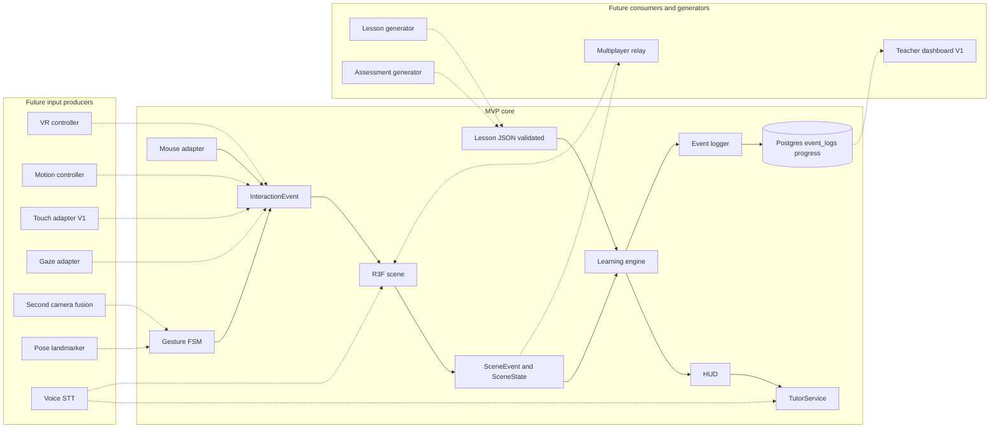

# Future Expansion

Twelve directions the brief asks about, each examined for what it adds to learning, which existing seam it attaches to, what new work it needs, and what it risks. The conclusion is uniform: every direction is a new **producer** of the interaction events the scene already consumes, a new **consumer** of the scene events, scene state, or event log the MVP already emits, or new **content** in the lesson JSON the engine already evaluates. None requires redesign, provided the MVP keeps six seams intact and resists building for them early. This file concerns **Future** almost entirely; two directions are argued down to **V1**.

## Overview

| # | Direction | Attaches as | Seam | Tier |
|---|---|---|---|---|
| 1 | VR | Input producer | `InputSource` → `InteractionEvent` | **Future** |
| 2 | AR | Renderer host | Scene commands, manifest `units` | **Future** |
| 3 | Mobile | Input producer (touch) | `InputSource` | touch **V1**, hand tracking **Future** |
| 4 | Multiple cameras | Landmark producer | Vision worker → gesture FSM | **Future** |
| 5 | Motion controllers | Input producer | `InputSource` | **Future** |
| 6 | Eye tracking | `hover` producer, log producer | `InputSource`, `LogEvent` | **Future** |
| 7 | Voice interaction | Tutor and command producer | `TutorService`, scene commands | **Future** |
| 8 | Full-body tracking | Landmark producer | Vision worker | **Future** |
| 9 | Multiplayer classrooms | Scene-event relay | `SceneEvent`, `SceneState` | **Future** |
| 10 | Teacher dashboards | Read model | Event log, `progress` | **V1** |
| 11 | AI-generated 3D lessons | Content generator | Lesson JSON, validation script | **Future** |
| 12 | Automatically generated assessments | Content generator | `Task` schema, `expect` | **Future** |

Two of the brief's items are split because they bundle unlike things. "Mobile" conflates touch input (cheap, the mouse adapter with different DOM events) with hand tracking on a phone (hard, and the phone camera points the wrong way). "AI-generated 3D lessons" conflates generating lesson JSON (content the validator can check) with generating GLB geometry (an open research problem).

## The twelve directions

### 1. VR

| Aspect | Detail |
|---|---|
| Learning | Real depth makes `place` and `sequence` (apply, analyze) genuinely three-dimensional instead of drag-plane-plus-socket, and makes component rotation worth evaluating |
| Seam | A WebXR controller or hand pose is one more `InputSource`: trigger emits `grab_start`, motion emits `grab_move`, release emits `grab_end`. Scene, engine, and lesson JSON are unchanged. `Cursor` gains an optional `ray` field (additive) so the scene can raycast from a controller pose |
| New work | `@react-three/xr` session wrapper; stereo rendering halves the triangle budget per eye; the DOM HUD does not exist in a headset, so prompts and feedback need in-world equivalents |
| Risk | Headset cost; a third study condition the between-subjects design was not powered for; the HUD rewrite is the largest item |
| Tier | **Future** |

### 2. AR

| Aspect | Detail |
|---|---|
| Learning | `identify` and `compare` (remember, understand) gain physical scale: a life-size heart on the desk. The manifest `units` field already carries true scale |
| Seam | The scene is hosted in an AR session instead of a flat canvas; scene commands and `SceneEvent`s are unchanged. Input is direction 1 on a headset, direction 3 on a phone |
| New work | WebXR AR module; plane detection and anchoring; lighting estimation; an AR-safe HUD |
| Risk | On a phone the rear camera does AR tracking and the front camera cannot track hands at the same time, so AR and gesture control are mutually exclusive on handsets |
| Tier | **Future** |

### 3. Mobile

| Aspect | Detail |
|---|---|
| Learning | Access, not a new objective type. Every MVP task is completable by touch exactly as by mouse |
| Seam | A touch adapter beside the mouse adapter in the `vision` package: `pointerdown` → `grab_start`, `pointermove` → `grab_move`, `pointerup` → `grab_end`, tap → `select`. Hand tracking would reuse the vision worker, but holding a phone in one hand while gesturing into its front camera with the other defeats the point |
| New work | Touch adapter (~100 lines), responsive HUD, a smaller GLB budget. For hand tracking: lower inference resolution, CPU fallback, a stand-mounted phone |
| Risk | Thermal throttling makes 30 fps with inference unreachable on mid-range phones; iOS Safari WASM memory limits; hand-size calibration assumptions in [Computer Vision Architecture](04-computer-vision.md) break at arm's length |
| Tier | Touch adapter **V1** (argued: it widens the audience of a real product at the cost of one adapter). Mobile hand tracking **Future** |

### 4. Multiple cameras

| Aspect | Detail |
|---|---|
| Learning | Triangulated depth turns the low-gain z-hint into a real third axis, so `place` (apply) could work without snap sockets and `wrist_rotate` could become reliable |
| Seam | A second vision worker produces a second landmark set; a fusion step before the gesture FSM triangulates and emits one landmark set. The FSM and everything after it are unchanged; `zHintDelta` simply becomes accurate |
| New work | Learner-side stereo calibration; frame synchronisation across two `getUserMedia` streams; a fusion worker |
| Risk | Calibration is a chore nobody repeats; two webcams is past "ordinary laptop"; two streams double the surface the no-video rule must cover |
| Tier | **Future**. Locked position 4 stands: MVP tasks do not need depth |

### 5. Motion controllers

| Aspect | Detail |
|---|---|
| Learning | Low latency and no tracking loss make long `sequence` tasks (analyze) less frustrating; failure state 5 largely disappears |
| Seam | A Leap Motion, Ultraleap, or gamepad adapter is another `InputSource` producing `grab_start`, `grab_move`, `grab_end`, `hover`. The `method` payload on `select` already distinguishes input routes |
| New work | Device bridging (WebHID or vendor WebSocket); button-to-gesture mapping; a controls-strip variant |
| Risk | Hardware cost; a controller is precisely what the product's thesis says is unnecessary |
| Tier | **Future** |

### 6. Eye tracking

| Aspect | Detail |
|---|---|
| Learning | Gaze is process data for `identify` with distractors (understand): did the learner look at the look-alike chamber before choosing? Also an accessibility input: gaze dwell as `hover` and `select` |
| Seam | As input, a gaze adapter emits `hover` and dwell `select` through `InputSource`. As evidence, a `gaze_summary` `LogEvent` (fixation counts per `componentId` per task, never raw coordinates) is additive to the [schema](14-evaluation-methodology.md#61-schema) |
| New work | Webcam gaze (WebGazer-style) or hardware; calibration; worker-side aggregation so only summaries reach the logger |
| Risk | Webcam gaze accuracy of 2 to 4 degrees cannot separate adjacent chambers; gaze needs its own consent line; it competes with hand tracking for the same webcam frames |
| Tier | **Future** |

### 7. Voice interaction

| Aspect | Detail |
|---|---|
| Learning | Production rather than recognition: "name the part you are holding" tests remember at a higher bar than pointing. Spoken questions lower the cost of asking for help (failure state 6) |
| Seam | Spoken questions arrive as text through the existing `TutorRequest` with a new `kind` (additive to the union in [System Architecture](03-system-architecture.md#module-interfaces)); `TutorService` is unchanged. Spoken commands ("reset", "explode") map to scene commands the engine already issues. A spoken-answer task would be a sixth type, `name`, with `expect: { componentId, accepted: string[] }` |
| New work | Web Speech API or on-device STT; an anatomical term list; free-text [guardrails](07-ai-tutor.md#guardrails), which the MVP avoids by never sending learner free text |
| Risk | Audio is a second media stream, so the no-video rule must extend to no-audio-storage first; free text re-opens prompt injection and cannot be answered by the template engine, so it depends on the measured **V1** local model; STT on "pulmonary" versus "coronary" |
| Tier | **Future** |

### 8. Full-body tracking

| Aspect | Detail |
|---|---|
| Learning | Embodied `sequence` (analyze): step the blood path with your body. Plausible for young learners, unproven for retention |
| Seam | The vision worker loads a Pose Landmarker `.task` alongside the Hand Landmarker; the FSM gains pose states. Output is still `InteractionEvent`, which is why locked position 2 names pose as **Future** rather than impossible |
| New work | Pose model self-hosting; new FSM states with seven-field gesture specs; room-scale calibration; a lesson JSON `scene.inputProfile` field |
| Risk | Full-body framing captures face and room, a sharper privacy threat than a hand; needs floor space; doubles inference cost |
| Tier | **Future** |

### 9. Multiplayer classrooms

| Aspect | Detail |
|---|---|
| Learning | Collaborative `sequence` and `compare` (analyze, understand) with peer explanation; a teacher's `place` mirrored on every learner's scene |
| Seam | `SceneEvent` and `SceneState` are already serialisable JSON of a few hundred bytes. A relay broadcasts one learner's scene events; other scenes apply them as commands. The engine stays single-learner |
| New work | The largest change on this list: a real-time transport Vercel serverless cannot host (an always-on server or hosted room service, paid); authoritative ownership of a grabbed component; presence rendering; rooms and roles, which need accounts |
| Risk | Introduces shared mutable state into a system designed to have none; mirrored drags judder; a classroom of webcams raises consent to institutional level |
| Tier | **Future** |

### 10. Teacher dashboards

| Aspect | Detail |
|---|---|
| Learning | A teacher who sees per-objective mastery across a class intervenes on the specific objective, whatever the task type. It is the learner's Results screen, aggregated |
| Seam | A read model. `progress` rows and `event_logs` already hold everything; the MVP export endpoint returns them per session. The dashboard is `SELECT` plus charts, no new write path |
| New work | Accounts and class grouping (both **V1** in [UI/UX Architecture](11-ui-ux.md#major-screens)); aggregate queries; chart components; a classroom consent model distinct from research consent |
| Risk | Linking identity to event logs is what the pseudonymous research design avoids. The join lives in a separate, nullable, deletable column per [Evaluation Methodology](14-evaluation-methodology.md#63-what-the-database-must-store); research sessions never carry it |
| Tier | **V1** (argued: a product used by other people will be used in classrooms, and the read model is cheap once accounts exist) |

### 11. AI-generated 3D lessons

| Aspect | Detail |
|---|---|
| Learning | Breadth: a kidney or four-stroke engine lesson in an afternoon, with objectives drawn from the manifest's `relations` and `tags`. No new objective type |
| Seam | Lesson JSON is content, not code. A generator (a locally run open-weights model through the same `TutorService` route pattern, never a paid API) reads a validated manifest and emits a `Lesson`. It passes through `pnpm content:validate` from [3D Content Architecture](10-3d-content-system.md#validation-checklist) like any hand-written lesson; the engine cannot tell the difference. Generated GLB geometry is separate and far harder: text-to-3D output does not arrive with named, separable meshes |
| New work | A manifest-grounded generation prompt; the **V1** authoring and review UI; for geometry, a segmentation and naming step |
| Risk | Validation catches a missing `socketId`, not a wrong claim about which chamber has the thickest wall. Every generated lesson needs subject-matter review before a learner sees it |
| Tier | **Future**. Lesson JSON generation behind human review could ride the **V1** authoring UI; geometry generation stays **Future** |

### 12. Automatically generated assessments

| Aspect | Detail |
|---|---|
| Learning | Parallel assessment forms and fresh `identify` and `compare` items (remember, understand) so retests do not reuse the exact prompt |
| Seam | The `Task` schema and `expect` block. The engine already synthesises micro-tasks from `expect` for the [repeated-failure policy](06-learning-engine.md#repeated-failure-policy), proving the pattern: a generator emits `Task[]` and the engine evaluates them unchanged. Distractors come from the manifest: components sharing `type` are the look-alikes |
| New work | A deterministic template generator (identify-with-distractors, compare-on-tag, place-from-exploded) is a few hundred lines, and reuses the template machinery of `packages/tutor`; a local-model variant for wording only if the **V1** local tutor is measured in; difficulty calibration from logged attempts |
| Risk | Templates do not guarantee psychometric equivalence between forms; the research protocol requires fixed instruments, so generation applies to practice, not to the study |
| Tier | **Future**. The deterministic generator is cheap enough to be **V1** if parallel practice forms prove necessary |

## Seams the MVP must keep

Every direction attaches to one of six interfaces that already exist for MVP reasons. Keeping them costs nothing. Each has a specific shortcut that breaks it.

| Seam | Defined in | Enables | What would break it |
|---|---|---|---|
| Input-producer abstraction: `InputSource` adapters emit `InteractionEvent` (`cursor`, `hover`, `grab_start`, `grab_move`, `grab_end`, `tracking_lost`, `tracking_regained`, `hand_count`; `cursor` is doc 04's additive per-frame neutral-pointer position, consumed via a ref and never logged per frame) and nothing else reaches the scene | [04](04-computer-vision.md#interaction-event-contract), [05](05-3d-interaction.md#7-mouse-and-keyboard-equivalents) | 1, 3, 5, 6, 8 | The scene importing MediaPipe landmarks, or branching on `condition === "gesture"` outside the adapter |
| Scene command interface: the engine drives the scene only through `setPose`, `highlight`, `cameraTo`, `setSocketVisual`, `setVisible`, `reset`, and reads it only through `SceneEvent` and serialisable `SceneState` | [05](05-3d-interaction.md#4-scene-events-and-scenestate-contract) | 2, 7, 9 | Engine or HUD reaching into Three.js objects; `SceneState` acquiring mesh references |
| Declarative lesson JSON: five task types, `expect` blocks, no subject-specific fields | `lesson-schema`, [06](06-learning-engine.md), [10](10-3d-content-system.md) | 11, 12, new subjects | Code or expressions in lesson files; evaluation consulting anything other than `task.expect` and the `SceneEvent` |
| Pseudonymous event log: `LogEvent` with `sessionId` only, validated payloads, per-session delete and export | [14](14-evaluation-methodology.md#6-event-log-schema-and-instrumentation-requirements) | 6, 10 | A required `user_id` on `event_logs`, free-text payloads, or a third-party analytics processor |
| `TutorService` interface: one `TutorRequest` and `TutorResponse` shape, one implementation (`template` in **MVP**, `local` in **V1**) chosen by `TUTOR_ENGINE` in one route handler | [03](03-system-architecture.md#the-seam-for-a-python-service), [07](07-ai-tutor.md) | 7, 11, Python backend | Instantiating a tutor engine anywhere but the route handler; React components building templates or prompts; adding a hosted LLM client (excluded by rule) |
| Content-as-files with build-time validation: manifests and lessons in the repo, `pnpm content:validate` gating the build, GLB mesh names diffed against the manifest | [10](10-3d-content-system.md#authoring-workflow) | 11, 12 | Loading unvalidated content; moving content into tables before an authoring UI justifies it |

## What the MVP must not do for the sake of the future

The seams are kept by not doing things. These are tempting precisely because this file exists.

| Anti-pattern | Why not | Do instead |
|---|---|---|
| A WebXR dependency or `@react-three/xr` wrapper in MVP | Adds session management and bundle weight to a product that must hit 30 fps on an integrated GPU; the HUD would still need a rewrite | Keep the camera rig a ~40-line orbit component a VR rig can replace |
| Multi-user state: rooms, presence, a `userId` in `sceneStore`, CRDT or socket libraries | Shared mutable state changes every invariant the single-learner engine relies on, and Vercel cannot host the transport | Keep `SceneState` serialisable and `SceneEvent` replayable; that is the whole preparation |
| An abstract input layer beyond the existing event contract: device registries, capability negotiation, a generic `InputDevice` interface | The contract is already the abstraction; a registry is a second abstraction over the first | Two adapters sharing one type. Add a third when a third device exists |
| A plugin system: dynamic task types, loadable gesture packs, scene extensions | Locked position 5 depends on a closed, validated union of five task types; a sixth type is a schema change plus a validator update | The Zod schema is the extension point |
| A shared media-stream abstraction for audio or gaze in the vision worker | Each stream has its own consent text; a shared pipeline blurs the "video never leaves the device" guarantee, which must stay simple enough to audit | One worker, one stream, one rule |
| Content tables in Postgres before an authoring UI | A generated lesson is a file until a human has reviewed it; files are reviewable in a pull request, rows are not | Content in the repo until **V1** authoring |
| A generalised depth model to prepare for stereo cameras | Abstracting over a measurement the MVP cannot make produces code paths nothing exercises | `zHintDelta` is one number; a fusion worker can make it accurate later |

## Diagram

The central subgraph and solid edges are **MVP**. Dashed edges are **Future** or **V1** attachments at the seam they use.

## Open questions

1. Build the touch adapter in **MVP** beside the mouse adapter since it is nearly free, or hold it to **V1** so the study build has exactly two input routes? This file assumes **V1**.
2. If parallel assessment forms A, B, and C prove hard to hand-author equivalently, the deterministic assessment generator moves to **V1**. The research-methodologist should decide before the pilot.

## Related

- [System Architecture](03-system-architecture.md): module interfaces and the `TutorService` seam.
- [Computer Vision Architecture](04-computer-vision.md): the `InteractionEvent` contract every input producer must honour.
- [3D Interaction Architecture](05-3d-interaction.md): scene events, scene commands, `InputSource` adapters.
- [Learning Engine](06-learning-engine.md): the five task types and engine-side task synthesis.
- [3D Content Architecture](10-3d-content-system.md): validation pipeline generated content must pass.
- [Evaluation Methodology](14-evaluation-methodology.md): event-log schema and pseudonymity rules.
- [MVP Definition](12-mvp-definition.md) and [Development Roadmap](13-roadmap.md): where each tier lands in time.
